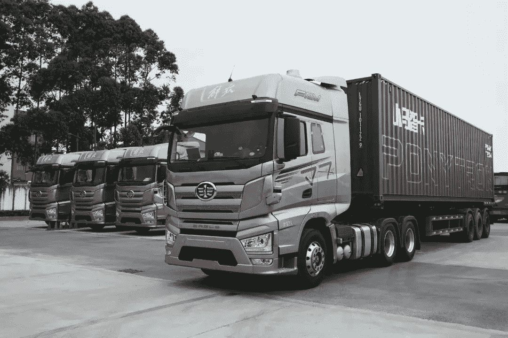

# 自动驾驶卡车，是下一个战场吗？

> 原文：<https://medium.com/nerd-for-tech/what-do-cars-look-like-in-the-future-760124e5e7f4?source=collection_archive---------10----------------------->

小马。创

**未来的智能汽车是什么样子？**

中国市场可能已经有了答案。

从极狐 Alpha S 华为 HI 版亮相上海车展开始，各大厂商都将高水平的自动驾驶技术作为竞争的核心。**这场无人驾驶汽车大战让几乎所有厂商都举步维艰**。

# 自动驾驶卡车

随着智能汽车热潮愈演愈烈，**重型卡车势必成为自动驾驶技术**的下一个战场。上个月底，小马。一直深耕自动驾驶乘用车领域的 Ai 正式宣布旗下自动驾驶卡车品牌“小马。创”。

**目前，自动驾驶技术的发展已经到了一个临界点**。上海浦东工商联副主席洪榕告诉《华夏时报》记者，现在是汽车产业弯道超车的好机会。“政策的友好和支持态度促进了自动驾驶汽车的快速发展。很多车企可以利用新能源汽车的发展，为智能汽车铺路。但现在这条赛道太拥挤了，确实存在泡沫。”

毫无疑问，随着竞争的加剧，整个汽车行业也进入了洗牌期，**越来越多的初创企业在自动驾驶赛道上被淘汰**。WeRide 研究员王超告诉记者，自动驾驶无疑是正确的选择，但很多初创企业还没有看到曙光的破晓，就已经倒在了路上。

小马也是。被称为“国内估值可行最高的自动驾驶创业公司”的 Ai？

## 小马。人工智能及其机器人

说到小马。AI，很多人都不是很熟悉。
事实上，这个自动驾驶的“新生儿”已经获得了许多领先的国际机构投资者和汽车制造商的投资。

小马。艾已与丰田、现代、广汽、一汽等国内外知名汽车厂商建立合作，在短短四年内完成 7 轮融资，融资总额超过 11 亿美元，最新一轮融资后估值达到 53 亿美元。

自从成立以来，小马。Ai 发展迅速。2018 年，小马。Ai 在美国加州落地 L4 Robotaxi 运营船队，随后在广州南沙区有限区域落地 Robotaxi 试运行项目。

用户可以使用迷你应用程序乘坐自动驾驶出租车。2020 年获得北京自动驾驶载人测试牌照，成为首家获得该牌照的初创公司。下一个，小马。Ai 还将在上海启动自动驾驶出租车的常态化运营。

## 威尔"小马。创”成为商业落地第一？

商用车方面，小马。Ai 于 2018 年开始在自动驾驶卡车领域的布局。2020 年，在得到丰田的支持后，小马。Ai 还增加了对自动驾驶卡车技术研发的投资。同年 12 月，广州市授小马。Tron 获得了自动驾驶卡车的测试许可证，并批准其进行公共道路测试。三个月后，小马。艾宣布了其卡车业务的品牌名称——小马。创。有人说这是“小马”。创速”。

## 可扩展的标签数据在推动自动驾驶卡车方面不可或缺

自动驾驶的主流算法模型主要基于有监督的深度学习。它是一种算法模型，推导出已知变量和因变量之间的函数关系。需要大量的结构化标记数据来训练和调整模型。

在此基础上，要想让自动驾驶汽车变得更加“智能”，形成可在不同垂直落地场景下复制的自动驾驶应用商业模式闭环，模型需要有海量、高质量的真实道路数据支撑。

# 结束

将你的数据标注任务外包给 [ByteBridge](https://tinyurl.com/yvxd52xc) ，你可以更便宜更快的获得高质量的 ML 训练数据集！

*   无需信用卡的免费试用:您可以快速获得样品结果，检查输出，并直接向我们的项目经理反馈。
*   100%人工验证
*   透明标准定价:[有明确的定价](https://www.bytebridge.io/#/?module=price)(含人工成本)

**为什么不试一试？**

来源:https://baijiahao.baidu.com/s？id=1698297129585265215&wfr