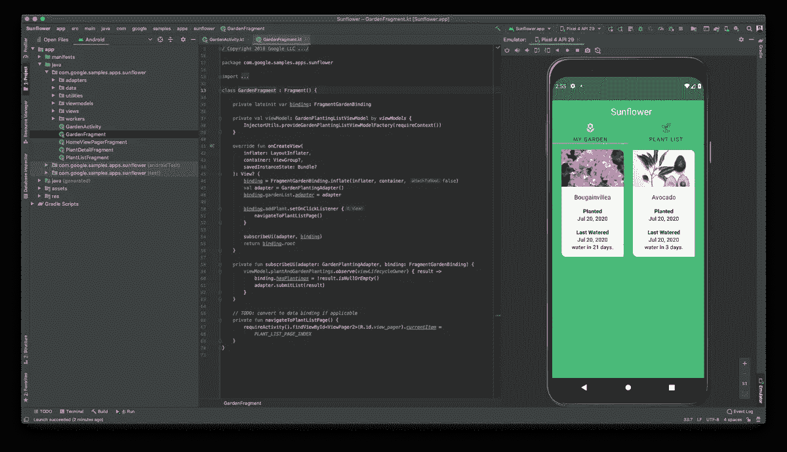
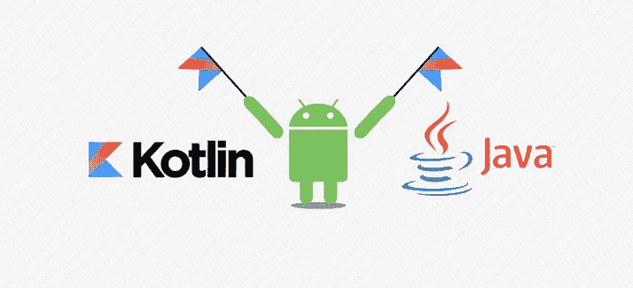
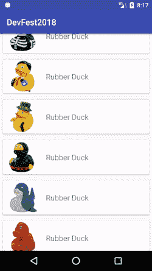
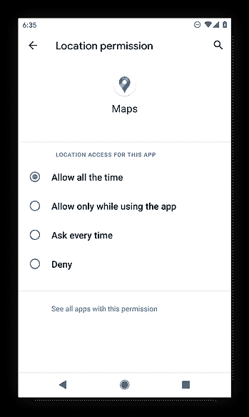
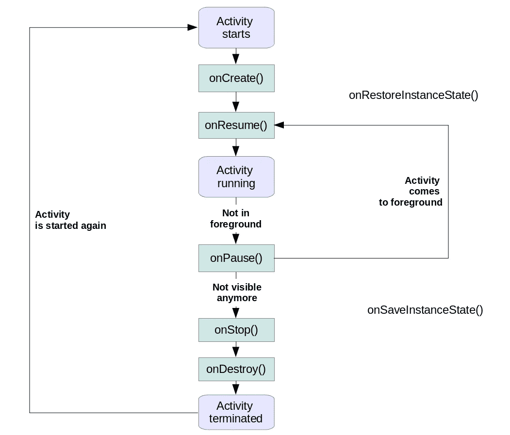
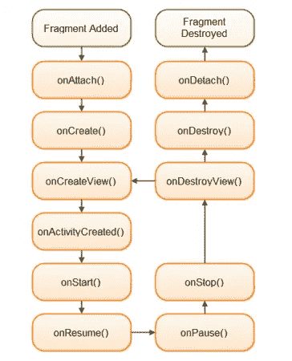
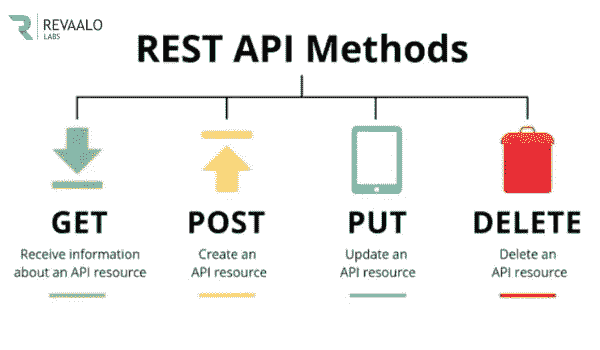

# 开始 Android 开发者生涯需要学习什么？

> 原文：<https://medium.com/nerd-for-tech/what-do-you-need-to-learn-to-start-your-career-as-an-android-developer-376b8a6ed9fc?source=collection_archive---------0----------------------->

对于很多人来说，开发一个移动应用程序并看到成千上万的用户使用它的结果是一个梦想。而实现这一点的方法之一就是成为一名 Android 开发者。但是你需要学习什么才能到达那里呢？

在我看来，这是开始你 Android 开发者生涯的基础知识:

# 安卓工作室:

过去，我们被迫使用 Eclipse 和其他 ide 来开发 Android 应用程序。但自 2014 年以来，谷歌向我们介绍了 Android Studio，这是谷歌 Android 操作系统的官方集成开发环境，基于 JetBrains 的 IntelliJ IDEA 软件，专为 Android 开发而设计。这确实使开发变得更加容易。

一般来说，它很容易使用，我认为这是开始开发之前首先要知道的事情。

你可以从[这里](https://developer.android.com/studio/intro)了解更多关于 Android Studio 的信息。

安卓工作室截图

# 编程语言:

> 编程语言是将字符串(或可视化编程语言中的图形程序元素)转换为各种机器代码输出的任何规则集。编程语言是计算机语言的一种，在计算机编程中用于实现算法。

即使你可以用 C 和 C++这样的语言进行 Android 开发。但是你需要学习 Java 和/或 Kotlin，才能开始你的 Android 开发者生涯。

几年来，Java 一直是在 Android 上开发的官方语言，但自 2019 年以来，谷歌宣布 Kotlin 编程语言现在是其 Android 应用程序开发者的首选语言。

Java 和 Kotlin 都是“面向对象编程(OOP)”语言，所以最好在学习 Java 和/或 Kotlin 之前开始学习 OOP 的基础知识。

您可以了解:

*   OOP 来自[这里](https://www.geeksforgeeks.org/a-step-by-step-approach-to-learn-object-oriented-programming/)。
*   爪哇来自[这里](https://www.w3schools.com/java/default.asp)。
*   科特林从[这里](https://www.w3schools.com/KOTLIN/index.php)。

科特林语和爪哇语

在我们继续之前，让我们喝杯咖啡..

# 应用组件:

在发现了 IDE 并学习了最好的开发语言之后，我们可以从 Android 组件开始。

正如 [google](https://developer.android.com/guide/components/fundamentals) 所说，*应用程序组件是 Android 应用程序的基本构件。每个组件都是一个入口点，系统或用户可以通过它进入您的应用程序。一些组件依赖于其他组件。*

有四种不同类型的应用程序组件:

*   **Activities** :它们指定 UI 并处理用户与智能手机屏幕的交互。
*   **服务:**它们处理与应用程序相关的后台处理。
*   **广播接收器:**它们处理 Android 操作系统和应用程序之间的通信。
*   内容提供者:他们处理数据和数据库管理问题。

除了上述列表之外，还有其他组件将用于构建上述实体、它们的逻辑以及它们之间的连线。这些组件是:

*   **片段:**表示活动中用户界面的一部分。
*   **视图:**在屏幕上绘制的 UI 元素，包括按钮、列表表单等。
*   **布局:**视图层次结构，控制视图的屏幕格式和外观。
*   **意图:**消息将组件连接在一起。
*   **资源:**外部元素，如字符串、常量、可绘制图片等。
*   **清单:**应用程序的配置文件。

在发现这些成分后。你必须知道如何使用其中的一些:

*   如何创建一个活动？
*   如何创建一个片段？
*   我们什么时候用片段代替活动。
*   基本视图，如按钮、编辑文本、文本视图..
*   RelativeLayout、LinearLayout 和 ConstraintLayout 之间的区别。
*   如何使用意图打开一个活动并发送数据。
*   如何导入和添加资源并在 app 中使用。

实践是最好的学习方式，所以让我们试着创建一个简单的 app，由一个活动、2 个片段和 2 个按钮组成。
该活动包含片段 A 和片段 B，片段 A 在顶部中央包含一个打开片段 B 的“下一步”按钮，片段 B 在左下角包含一个返回片段 A 的“后退”按钮。

# ListView/recycle view:

RecyclerView 示例

谷歌称 [*RecyclerView 可以轻松高效地显示大量数据。您提供数据并定义每个项目的外观，RecyclerView 库在需要时动态创建元素。*](https://developer.android.com/develop/ui/views/layout/recyclerview)

以前，我们使用列表视图来显示项目、图像、字符串或任何其他类型的模型的列表。但自从谷歌宣布 RecyclerViews 之后，几乎所有人都在使用 RecyclerView 而不是 ListView。

由于几乎所有的应用程序都显示列表(用户列表、装备列表、城市列表、玩家列表……)，你应该学习如何创建和使用 RecyclerView。学习 RecyclerViews 还包括发现:

*   **适配器:**提供数据并负责为单个条目创建视图
*   **ViewHolder:** 包含由条目数据填充的所有视图的引用
*   **LayoutManager:** 包含由条目数据填充的所有视图的引用

你可以从[这里](https://developer.android.com/develop/ui/views/layout/recyclerview)了解更多关于 recyclerView 的信息。

# 应用权限:

Android 应用权限

Android 应用程序权限可以让应用程序控制你的手机，访问你的相机、麦克风、私人信息、对话、照片、互联网等。第一次应用程序需要访问您的手机或平板电脑上的敏感硬件或数据时，会弹出应用程序权限请求，通常与隐私相关。

权限可以分为三种类型:普通权限、签名权限和危险权限。

了解如何请求权限，尤其是何时请求权限是非常重要的。

# 存储:

Android 为应用程序存储数据提供了多种存储方式。这些存储可以是**共享首选项**、**内部**和**外部存储**、**本地数据库存储**和**通过网络连接的存储:**

*   [**内部文件存储**](https://developer.android.com/guide/topics/data/data-storage#filesInternal) **:** 在设备文件系统上存储 app-private 文件。
*   [**外部文件存储**](https://developer.android.com/guide/topics/data/data-storage#filesExternal) **:** 在共享的外部文件系统上存储文件。这通常用于共享用户文件，如照片。
*   [**共享首选项**](https://developer.android.com/guide/topics/data/data-storage#pref) **:** 以键值对的形式存储私有的原始数据。
*   [**数据库**](https://developer.android.com/guide/topics/data/data-storage#db) **:** 在私有数据库**中存储结构化数据。**
*   **文件提供**:如果你想和其他应用分享文件

# 生命周期:

## 活动生命周期:

当用户在您的应用中导航时，应用中的`[Activity](https://developer.android.com/reference/android/app/Activity)`实例在其生命周期中会经历不同的状态。`[Activity](https://developer.android.com/reference/android/app/Activity)`类提供了许多回调函数，允许活动知道状态已经改变:系统正在创建、停止或恢复一个活动，或者销毁活动所在的进程。

为了导航活动生命周期阶段之间的转换，activity 类提供了一组核心的六个回调:`[onCreate()](https://developer.android.com/reference/android/app/Activity#onCreate(android.os.Bundle))`、`[onStart()](https://developer.android.com/reference/android/app/Activity#onStart())`、`[onResume()](https://developer.android.com/reference/android/app/Activity#onResume())`、`[onPause()](https://developer.android.com/reference/android/app/Activity#onPause())`、`[onStop()](https://developer.android.com/reference/android/app/Activity#onStop())`和`[onDestroy()](https://developer.android.com/reference/android/app/Activity#onDestroy())`。当一个活动进入一个新的状态时，系统调用每个回调函数。

下图描述了这些方法的流程。

Android 活动生命周期

更多详情可以随时查看[官方活动生命周期文档](http://developer.android.com/guide/components/activities.html)。

## 片段生命周期:

每个`[Fragment](https://developer.android.com/reference/androidx/fragment/app/Fragment)`实例都有自己的生命周期。当用户导航您的应用程序并与之交互时，您的片段在添加、移除、进入或退出屏幕时，会在其生命周期中经历各种状态。

Android 碎片的生命周期如下图所示:

Android 碎片生命周期

下面是片段生命周期的方法。

1.  这个方法将首先被调用，甚至在 onCreate()之前，让我们知道你的片段已经被附加到一个活动。您被传递了将承载您的片段的活动
2.  `onCreateView()`:当片段第一次绘制 UI 时，系统调用这个回调函数。要为片段绘制 UI，必须从该方法返回一个视图组件，它是片段布局的根。如果片段不提供 UI，我们可以返回 null
3.  `onViewCreated()`:这将在 onCreateView()之后被调用。这在继承 onCreateView()实现时特别有用，但是我们需要配置结果视图，比如使用 ListFragment 以及何时设置适配器
4.  `onActivityCreated()`:在 onCreate()和 onCreateView()之后调用，表示活动的 onCreate()已经完成。如果需要在依赖于活动的 onCreate()完成其工作的片段中初始化一些东西，那么 onActivityCreated()可以用于该初始化工作
5.  `onStart()`:一旦片段可见，就调用 onStart()方法
6.  `onPause()`:系统调用这个方法作为用户离开片段的第一个指示。这通常是您应该提交应该在当前用户会话之后保持的任何更改的地方
7.  `onStop()`:调用 onStop()将停止的片段
8.  `onDestroyView()`:在 onDestroy()之前调用。这是 onCreateView()的对应物，我们在其中设置 UI。如果需要清理特定于 UI 的内容，那么可以将该逻辑放在 onDestroyView()中
9.  `onDestroy()` : onDestroy()被调用来完成片段状态的最终清理，但不保证被 Android 平台调用。
10.  `onDetach()`:它在 onDestroy()之后被调用，通知片段已经从它的宿主活动中分离出来

更多详情可以查看[这里](https://developer.android.com/guide/fragments/lifecycle)。

# Rest APIs:

即使您的应用程序可能是一个 100%离线的应用程序，您也绝对会使用 rest APIs 处理与远程后端交互的应用程序。

> REST API(也称为 RESTful API)是一个应用程序编程接口(API 或 web API)，它符合 REST 架构风格的约束，并允许与 RESTful web 服务进行交互。REST 代表具象状态转移，是由计算机科学家罗伊·菲尔丁创造的。

在您与后端的交互中，您将**创建**(例如创建一个用户)**读取**(例如获取用户资料)**更新**(例如更新您的用户名)**删除**(例如从您的帐户中删除一个偏好)数据。为此，REST API 使用 HTTP 方法，其中最重要的方法如下图所示:

Rest API 方法

有许多 REST 客户端可用于 Android 开发，但我认为最好使用的客户端是[翻新](https://square.github.io/retrofit/)。这是一个客户端，允许通过 REST 来检索和上传 JSON(或其他结构化数据),您可以配置哪些转换器用于数据序列化，例如 JSON 的 GSON。

改造可以配置为使用特定的转换器。该转换器处理数据(反)序列化。一些转换器已经可以用于各种序列化格式。

翻新还可以通过适配器进行扩展，以便与 RxJava 等其他库一起使用。

翻新还支持需要认证的 API 调用。认证可以通过使用用户名和密码( *Http 基本认证*)或 API 令牌来完成。因此，它允许使用注释来添加一个标题，也允许使用拦截器。
拦截器用于在执行之前修改每个请求，并改变请求头。

最后，我认为这些是你开始 Android 开发者生涯需要学习的东西。你还需要定期查看[Android 官方文档](https://developer.android.com/docs)和新的更新。

祝你事业有成我的朋友:)

我写了一些其他与 Android 相关的内容，如果你喜欢这里的内容，你可能也会喜欢:

 [## Android 应用程序开发的未来，未来几年有什么可期待的？

### 作为世界上最受欢迎的移动操作系统，Android 从其卑微的开端已经走过了漫长的道路。越过…

medium.com](/@tarek.bendriss/the-future-of-android-app-development-what-to-expect-in-the-coming-years-b654263bd926)  [## 丢了安卓签名密钥怎么办？

### 有时您可能会丢失 Google Play 中发布的应用程序的 Android 签名密钥。在本文中，您将了解如何…

proandroiddev.com](https://proandroiddev.com/what-to-do-if-you-lose-the-android-signing-key-62f49aaf084e)  [## 使用 GitHub 动作的 Android“持续集成/交付”——第 2 部分

### 在这里，我们将学习如何将你的应用程序自动分发给你的测试人员

proandroiddev.com](https://proandroiddev.com/continuous-integration-delivery-for-android-with-github-actions-part-2-ec69b6980389)  [## 使用 GitHub 动作的 Android“持续集成/交付”——第 1 部分

### 亲爱的开发者，在这篇文章中，我将向你展示如何自动化测试执行和构建你的 Android 应用程序…

proandroiddev.com](https://proandroiddev.com/continuous-integration-delivery-for-android-with-github-actions-part-1-b232ed2b1740)  [## 具有未定义数据结构的动态回收视图(来自未知的 CSV 数据结构)

### RecyclerView 可以轻松高效地显示大量数据。您提供数据并定义每个项目如何…

medium.com](/swlh/dynamic-recyclerview-with-non-defined-data-structure-from-unknow-csv-data-stucture-5b50e394563c)  [## 实现快捷方式，相当于 Android 的“iPhone 3D Touch”

### 在这篇文章中，我们将开发一个简单的呼叫和开放摄像头的 Android 应用程序，并集成静态“应用程序…

proandroiddev.com](https://proandroiddev.com/implement-shortcuts-the-androids-iphone-3d-touch-equivalent-a9509593c4bf)  [## Android 库:在你的应用程序中显示定制的友好日历

### 概述:

medium.com](/@tarek.bendriss/android-library-show-a-customized-friendly-calendar-in-your-app-4e6183333d24) 

分享(知识)是关怀😊感谢阅读这篇文章。如果你觉得这篇文章有帮助，一定要鼓掌或推荐。这对我意义重大。

如果你需要任何帮助，请加入我的 LinkedIn 和 T2 GitHub。