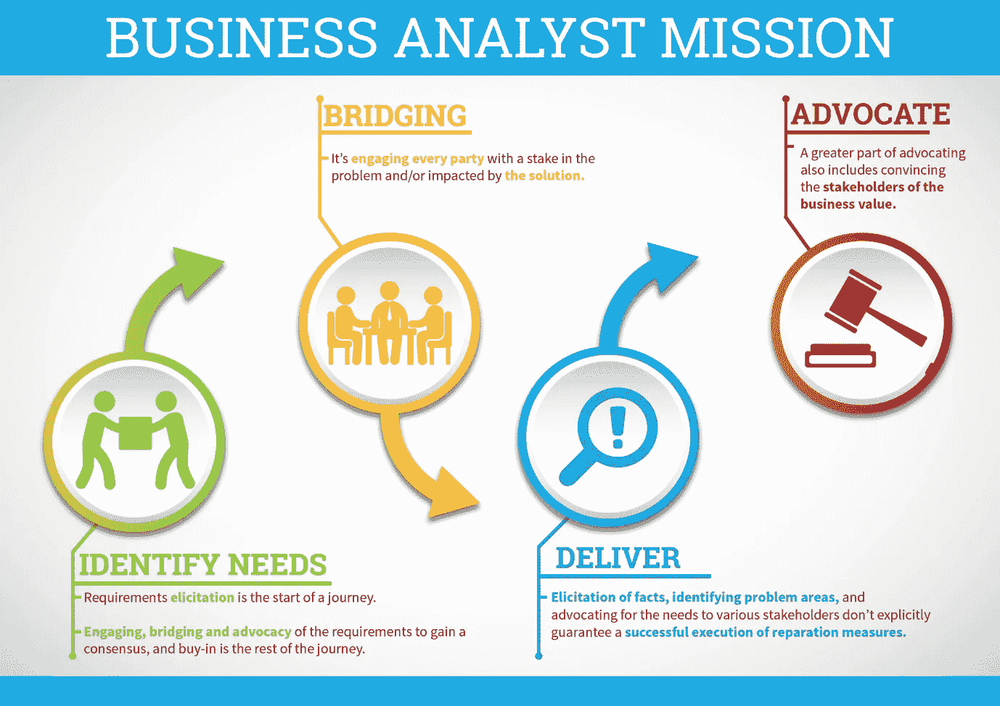
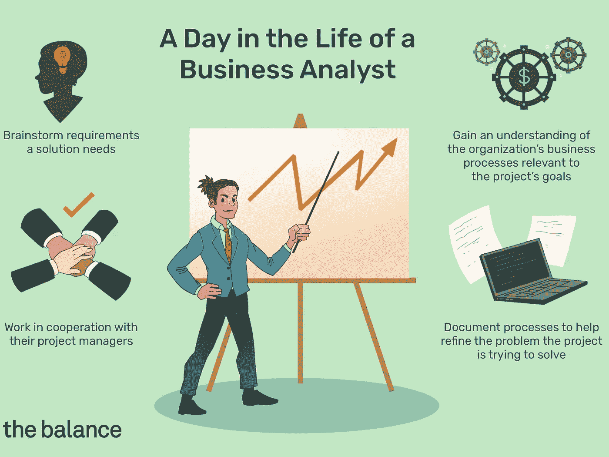

# 商业分析师做什么，我如何成为一名商业分析师？

> 原文：<https://medium.com/nerd-for-tech/what-does-a-business-analyst-do-and-how-do-i-become-one-926ee5e88173?source=collection_archive---------8----------------------->

为什么每个人都对数据、大数据、结构化数据和分析着迷？每个职业真的都要依赖数据吗？还是仅仅是我们这十年的一种趋势/时尚，将在未来消失？

相反，如果你问我，我认为数据和分析在商业世界才刚刚起步。一切都趋向于联系在一起。每个公司都在努力成为数据驱动的公司，成为利用数据优化决策并提高竞争优势的公司。

专业业务分析师在公司的生产力、效率和盈利能力方面发挥着至关重要的作用。商业分析师的工作报酬丰厚，前景看好——这些工作预计将以 14%的速度增长。

# BA 是做什么的？

在最高层次上，业务分析师促进对问题、可能的解决方案的共同理解，并确定项目的范围。您还会发现 BAs 在帮助团队解决技术挑战，尤其是当他们涉及多个业务或技术利益相关者之间的谈判时。我们通常从分析业务流程开始。

作为一名业务分析师，你必须知道如何快速适应，并理解给你的指示。如果你不真正理解你被要求做什么和为什么被要求做什么，你就不能完成要求你做的事情。

业务分析师帮助识别紧迫的业务问题，并提出可能的解决方案。他们帮助团队解决他们面前的挑战，并且他们能够在利益相关者之间仔细协商以得出正确的结论。

作为一名业务分析师，您可能需要促成某种形式的演示或研讨会。你需要自信地站起来，向一群人讲述你的项目。你应该能够剖析你的内容，并在你的听众面前清楚地表明你知道你在说什么。你将负责展示的信息将被详细讨论，所以你需要准备好回答问题。

作为一名商业分析师，真正重要的是能够以一种全面的方式向他人展示你的发现。因为即使你是最好的分析师，如果你不能向别人解释你的发现，那也没有任何意义。找到一种方式向世界展示和解释你的见解是非常重要的。这意味着你必须既能向*展示*又能向讲述数据、数字和公式背后的故事。

*我分析的目标是什么，我要向谁展示？这些是至关重要的问题。在*你开始创建你的演示/可视化之前，你需要了解你的观众*。*

大多数迷人的故事讲述者都明白理解观众的重要性。例如，在与高管交谈时，统计数据可能对讨论很重要。但是商业智能经理可能会发现分析方法和数据质量与结果本身一样重要。

下一步是尝试找到一种有吸引力的方式来展示你的发现。你需要找到一种方式来解释你的发现，并给出你的见解。

为了做到这一点，您需要了解业务战略，并将其与数据洞察相结合。这就是为什么数据科学家(&分析师)与业务分析师并肩工作非常重要。交流机器学习模型的输出并理解变量对于呈现正确的见解至关重要。不要低估这一点商业分析，有时故事比处理数字更难想出来。

只有到那时，你才有资格向商界领袖展示你的发现。

>>>想了解更多关于 BA 软技能的信息，请看我之前的帖子。(点击[此处](https://sarah-kr-robinson.medium.com/important-soft-skills-every-business-analyst-needs-9ae62d7e7338)

专业业务分析师在推动组织提高生产力、效率和盈利能力方面发挥着至关重要的作用。从分析思维到谈判和解决问题，所需的商业分析师技能可以通过传统和非传统的教育项目来培养。高质量的培训和商业分析师认证也可以帮助你建立成功的商业分析师职业生涯。