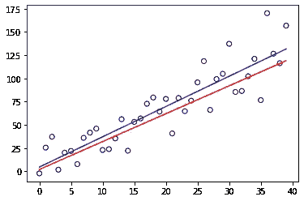

# 线性回归方程中的这个附加项是什么意思？

> 原文：<https://medium.com/nerd-for-tech/what-does-this-additional-term-in-the-linear-regression-equation-mean-8ccfab84435e?source=collection_archive---------3----------------------->

[科伯罗](https://unsplash.com/@cobro?utm_source=medium&utm_medium=referral)在 [Unsplash](https://unsplash.com?utm_source=medium&utm_medium=referral) 上的照片

是的，误差项，但它没有看起来那么简单。让我们深潜一下。不，说真的。

# 一些基础知识

如果你曾经冒险踏上研究机器学习或数据科学的旅程，你一定遇到过这个等式。

我们知道这里的 f(x)项是 m*x + c 形式的线性方程，那么，除了它之外的这个额外的ε是什么呢？这一项被称为零均值随机误差项。

代表 ***最小二乘法直线*** 的方程式如下:

注意符号上的帽子或便帽(不管你想叫它什么)?这表明上述等式中的值不是这些项的实际值。

代表 ***人口回归线*** 的方程看起来更像这样:

你们可能已经注意到了第一个方程中缺失的ε项，我们稍后会回到这个问题。

你读下一行时，请耐心听我说一会儿。上面的等式表示对整个模型的回归线拟合，而带有上限符号的等式表示对该模型的一组数据的回归线拟合。

现在！我这么说是什么意思？设想我们有一些随机形式的线性方程:

此外，让我们假设上式中的ε项是由随机高斯正态分布生成的。

上图中的红线代表不含ε项的数据。这是基于我们模型的*真实*关系。另一方面，蓝线是基于观测数据的估计。

蓝线表示在现实世界中，如果我们有一个基于上述等式的模型，那么我们就能够计算出最小二乘线。然而，红线仍然没有被观察到。

**为什么是**？

# 让我们举个例子…

想象一下，如果你想找到一个随机变量 y 的总体均值，但是总体均值是未知的，但是我们有一组来自变量 y 的观测值。

我们可以用这些观察值来计算样本平均值。现在，它与总体均值不同，但样本均值将提供总体均值的一个非常好的近似值。

# 结论

同理，红线和蓝线都不一样。也就是说，我们写下项ε来填充我们不知道的(但可以非常接近地找到的)。