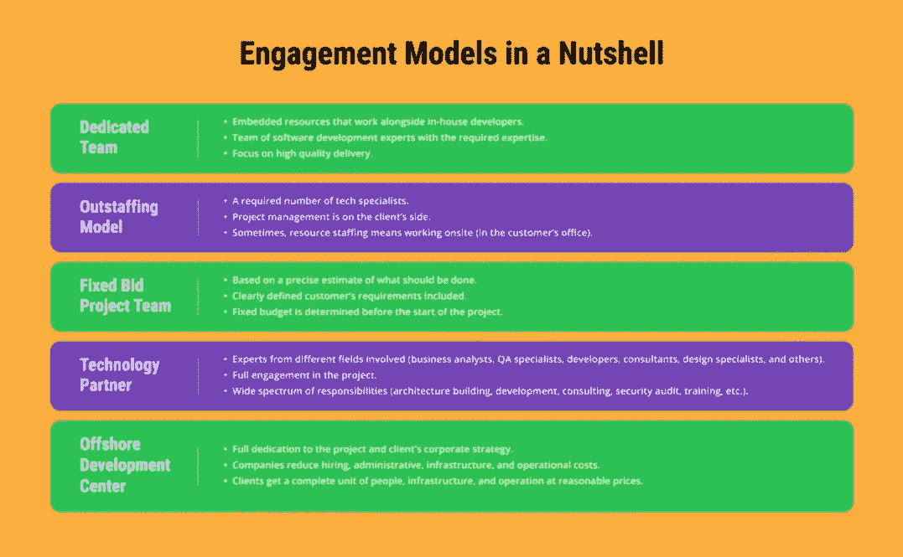
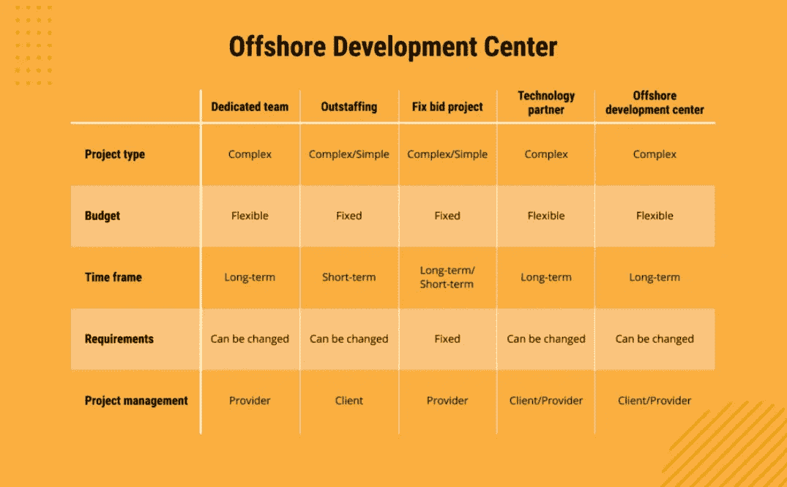

# 什么样的参与模式适合你？

> 原文：<https://medium.com/nerd-for-tech/what-engagement-model-is-right-for-you-af3bd6eabf97?source=collection_archive---------3----------------------->

**如何选择最有效的项目模式，为项目的成功交付打下坚实的基础？Emerline 将告诉您可用的选项，强调哪一个最适合每个特定案例，并分享团队对技术合作伙伴关系和其他参与场景的方法。**

# 什么是参与模式？

客户的成功之旅始于他们为与软件开发合作伙伴的业务关系选择的正确参与模式。根据项目规模、持续时间、概念和战略，客户与其服务提供商就最佳 IT 合作模式达成一致。

项目参与模型是描述项目开发期间客户和供应商之间协作细节的计划。

参与模式规定了专家参与项目的方式、职责范围、支付条款、时间表、管理问题等。

对于软件开发来说，没有适合任何项目并满足所有客户需求的多用途项目模式，其选择取决于项目细节和客户的软件开发合作伙伴偏好。

# 客户成功的 5 种参与模式

有许多 IT 参与模式示例，每一个都有特定的工作模式、定价条款和条件以及供应商团队的项目参与。让我们探索最受欢迎的参与模型场景，并标记它们的显著特征。

## 专门小组

这种 IT 参与模式意味着服务提供商根据所需的技能、能力和技术组合向客户提供他们的专家。

客户分享他们期望从软件产品或服务中得到什么的精确信息；该项目需要多少专业人员；以及他们的技术偏好。

这些入口点越全面，软件开发提供商建议的嵌入式资源就越高效、越匹配。

由客户来选择此项目模型项目管理的特殊方面，并定义他们是自己管理专门团队还是让供应商方的项目经理参与进来。通常，嵌入式资源与内部专家一起工作，与内部团队进行交互，并对其进行补充，同时位于服务提供商的办公室内。

重点是高质量的交付。

定价模式很简单，直接与专门团队的规模和每个相关专家的时薪挂钩。换句话说，考虑每月工资和额外成本(服务提供商的费用、管理需求等等)，因为这将构成账单。

**优势**

*   从外包软件开发公司雇佣一个专门的团队比招聘内部专家要便宜得多。
*   参与项目的团队将只关注你的项目。
*   专用团队模型可以显著加快软件开发项目的交付。
*   团队和客户在项目上紧密合作。

**缺点**

*   这种模式对于短期项目来说效率不高。
*   与不同时区相关的问题可能会有关联，但是如果像敏捷这样灵活的方法得到应用，这些问题很容易解决。

## 杰出模特

您的项目缺少合格的 Java 开发人员或质量保证专家吗？需要寻找 Node.js 专业人士，因为你的产品理念决定了这项技术的使用？

所有这些和其他要求都在人力资源的帮助下得到满足。

杰出的供应商仔细阐明客户的需求，并向他们提供在所要求的领域、行业或技术方面具有专业知识的资源。

在其他 IT 参与模式中，外派因客户提供的人事管理而引人注目，而从事 IT 外派服务的公司负责员工雇佣、保险、税收等。

在某些情况下，资源配置意味着重新定位和现场工作，以便客户可以更仔细地查看每个项目迭代，并监控开发过程的所有阶段。

**优势**

*   这种模式对于那些拥有技术技能来控制开发人员将做什么以及他们将如何做的公司来说是有利的。
*   外派人员比雇佣内部开发人员更实惠，因为公司可以节省员工雇佣、税收、福利等管理费用。
*   outstaffing 模型允许组织在产品开发需要额外资源时快速灵活地扩展他们的内部团队。

**缺点**

*   突出意味着客户端的更多责任，这就是为什么他们需要一个技术专家来控制远程开发者。

## 固定投标项目团队

固定投标合同都有严格的条款和条件。它们基于对应该做什么的精确估计、准确的项目时间框架和预先确定的预算。因此，约定模型的名称不言自明——假设客户宣布一个具体的价格(或至少一个价格范围),软件开发外包商将致力于在商定的投标账单内提供一组服务。

在固定投标定价模式中，明确定义了客户要求和价格的项目范围在开始时是固定的，在整个项目生命周期中保持不变。

在额外工作的情况下(新产品特性、附加功能或以前没有指定的服务)，客户和软件开发提供商倾向于签订额外的合同协议。

**优点**

*   根据固定投标项目模型，如果有详细的规范，开发人员的工作价格是稳定的。
*   一旦合同被分配，就有一个严格的项目交付期限。
*   公司不需要支付额外的费用，只需要支付协议中概述的费用。

**缺点**

*   该模型不适合需要需求灵活性的项目，因为一旦双方批准了协议，什么都不能改变。

## 技术合作伙伴

用货币关系或从事软件解决方案开发的专家数量来衡量技术伙伴关系是不够的。

技术合作伙伴是一家拥有丰富经验的公司，拥有来自不同领域的专家团队，包括解决方案架构师、顾问、业务分析师、开发和质量保证专家、设计师、安全专家、项目经理和其他角色，负责交付交钥匙解决方案。

技术合作伙伴的职责范围包括构建/审查解决方案架构、软件开发、就最佳技术堆栈和集成提供建议、IT 基础架构分析以及安全/隐私审计。如果需要，技术合作伙伴将提供高质量的知识共享，教育和培训也是他们的标准。

技术合作伙伴处理各种项目场景。即使客户只是“纸上谈兵”，没有明确定义的需求或业务目标，正确的技术合作伙伴也将有助于在成功实施之前证明其可行性。

**优势**

*   可靠的技术合作伙伴致力于提供经济高效的解决方案来降低您的运营支出。
*   公司可以接触到具有不同专业知识的各种经验丰富的专家，包括开发人员、设计人员、测试人员、业务分析师等。
*   这种合作模式意味着技术合作伙伴的责任范围很广，从软件开发到最佳技术组合的建议。

**缺点**

*   它不适用于短期项目和拥有坚实的内部技术专长的公司。

## 离岸开发中心(ODC)

您是否需要降低成本，同时建立一个拥有高技能专家的 IT 部门？最好的决定是将它转移到离岸位置。[离岸开发中心](https://emerline.com/blog/offshore-development-center-guide)通常开设在经济条件良好的离岸地区，劳动力市场上有大量价格合理的合格技术人才。

与服务提供商合作，您无需担心诸如雇佣专家、建立基础设施、在开设新法人实体时处理法律法规等业务设置挑战。通常，客户会得到一个独立的 IT 部门，该部门拥有运营所需的所有人力资源、基础设施和办公设备。

**优势**

*   通过采用 ODC 模式，客户降低了购买和维护硬件和办公设备的成本。
*   服务提供商负责招聘和管理成本，包括工资、奖金、假期、税收等。
*   ODC 将根据您的公司战略运作，团队将只致力于您的项目。
*   公司可以在任何阶段快速扩展业务，无需在基础设施和运营方面进行额外投资。

**劣势**

*   尽管 ODC 模式降低了成本，但它不适用于具有明确和固定需求的短期项目。

# 如何为商业软件开发选择正确的参与模式？

为了确保您选择正确的参与模式，您应该回答几个问题以了解您的需求。找到与您的项目相关的问题列表，仔细思考答案:

*   **项目类型。**你的项目简单还是复杂？
*   **预算。**您是否需要适应严格的预算，或者如果需要的话，是否有能力增加预算？
*   **灵活性。**您希望在产品开发过程中能够灵活决策或改变需求吗？
*   **时间框架。项目应该尽快交付还是在确切的期限内交付？你心里有具体的截止日期吗？**
*   **项目管理。**您是否有自己控制产品开发的专业知识，还是更愿意委托给第三方？
*   **专长。**您需要用额外的专业知识来扩充您的团队，还是需要一个具有特定专业知识的专门团队？

由于每种参与模式都有其独特的功能，可以完美地适用于一个项目，但对于另一个项目来说就变得无关紧要了，下面是一些参与模式和项目类型之间的相互关系。

## 专门小组

当项目范围很大或者没有明确定义时，它最有效。当需求发生变化，并且很有可能在开发过程中发生变化时，专门的团队将适应这种变化，并继续实现新的项目特性。

## 杰出的

考虑这种业务参与模式的一个关键因素是降低成本。例如，如果客户拥有很强的项目管理能力，并准备在监督过程中投入更多的精力，那么为开发人员或 QA 专家联系外包供应商是非常明智的。

当客户有一个清晰的产品愿景，并打算继续成为主要的业务战略决策者，同时要求纯粹的技术开发或实施协助时，外派是理想的选择。

如果需要用具有特定技术专业知识的成员来扩展您的团队，这种参与模式可能也是一个不错的选择。

## 固定投标

对你的项目有一个将来不会改变的详细说明？需要准备好符合约定条款的软件解决方案？启动一个功能有限、需求明确的小项目？

对于这种情况，我们建议考虑固定投标项目团队——在项目开发期间没有额外费用，并且有可预测的截止日期。

## 技术合作伙伴

这种方法是关于客户参与的其他方面和供应商的贡献程度。

技术合作伙伴负责管理从创意到实施的项目，可以涵盖任何业务或技术需求，从定义正确的产品开发战略到在解决方案上线后进行培训。

## 近海开发中心

这种合作模式的核心是长期合作、降低成本和灵活性。如果你需要高质量的产品，但又不想花太多钱建立内部 IT 部门，那么 [ODC 公司](https://emerline.com/services/offshore-development-center)将最适合你。

当谈到灵活性时，该模型允许您在任何阶段使用新的人才来扩展项目，并轻松适应不断发展的项目变化。

# 我们参与过程的方式

无论我们的客户偏好何种项目模式，Emerline 都会交付成功的项目，同时遵循其中任何一种模式。无论您的请求是只需要 Java 开发专家，还是需要我们整个专家团队的贡献，我们都很乐意提供帮助。下面，我们将分享与项目交付相关的关键能力和原则。

## 我们的团队拥有所有的核心能力和足够的专业知识来领导一个从零开始的项目

嗯，更多的是关于[技术合作](https://emerline.com/blog/how-to-choose-a-tech-partner) —在遵循这种合作模式的同时，Emerline 探索了一个模糊的想法，分享了他们的产品愿景，并构建了一个交钥匙解决方案，因为我们在使您的产品取得成功方面起着关键作用。当他们所有人，从业务分析师到设计思维专家，都在一个地方，尽一切努力超越项目预期，实现项目目标，这将是最好的结果。

## 我们擅长的多用途技术组合使我们能够为项目实施选择正确的技术

如果 Java 或者。NET 会妨碍您的解决方案尽可能的方便和多功能，我们建议您使用另一种技术。这个想法是，我们在广泛的技术领域的专业知识允许我们为产品开发选择正确的工具、框架或软件开发工具包，而不局限于一两个选项。

## 让我们参与任何项目阶段和任何项目规模

一个从头开始的项目还是一个需要添加一些额外功能的功能性解决方案？都是！Emerline 在任何需要的阶段加入项目，并协助任何范围的工作，无论是全部还是部分。我们的灵活性也与项目规模有关——我们在与初创公司和大型企业合作方面经验丰富。

*最初发表于 https://emerline.com*[*。*](https://emerline.com/)