# ETL 过程到底是什么？

> 原文：<https://medium.com/nerd-for-tech/what-exactly-is-an-etl-process-5b6fb8841865?source=collection_archive---------16----------------------->

Python 中的简单例子

石油管道:已经完成还是未来？—消费者能源联盟

在数据科学和分析的背景下，我们经常看到缩写词 ETL。这个流行词被大量地喷洒在分析角色的描述中，也用于 Coursera、Databricks、Datacamp 等平台上的在线课程。

这是有充分理由的。几乎每个处理过收集、争论和存储数据的人都或多或少地参与过这个过程。

那么什么是 ETL 过程呢？

[ETL](https://www.sas.com/en_us/insights/data-management/what-is-etl.html) 代表 ***提取、转换和加载*** ，这是大型基础设施的数据管理部分涉及的三个关键步骤。它是从各种类型的来源中提取数据、整理/清理数据，然后以格式化的方式将其存储在数据仓库或数据库或数据框架中以便于查询和分析的过程。此外，该过程理想地应该是**自动化的**，并且本质上可以是**迭代的****。**

数据仓库和数据库之间有一些细微的区别，主要是仓库中的数据是现成的用于分析，而数据库中的数据主要用于读/写目的。在这方面，仓库更类似于数据框架。因此，在本文中，我们将使用 dataframe 作为一种方式，用 Python 中的例子来描述 ETL 过程。

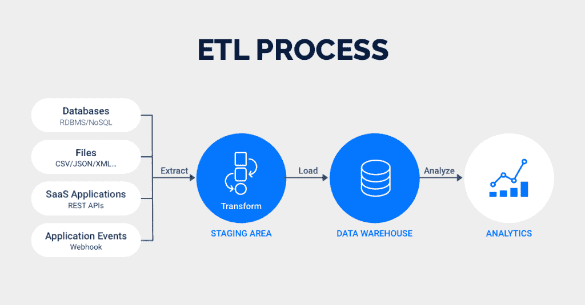

[ETL 与 ELT:有什么区别？| Rivery](https://rivery.io/blog/etl-vs-elt-whats-the-difference/)

在小范围内，ETL 过程可能类似于这样:

*   *使用 Python 的熊猫库导入 CSV 数据集*
*   *清理/处理数据，以处理缺失值或格式错误的实例*
*   *将清理后的数据加载回数据帧，以便高效查询和分析*

在大规模上，该过程可能是驻留在云基础设施中的广泛数据管道的一部分，如[亚马逊网络服务(AWS)](https://aws.amazon.com/) 、[微软 Azure](https://azure.microsoft.com/en-us/) 或[谷歌云平台(GCP)](https://cloud.google.com/) 。在这种情况下，流程可能如下所示:

*   *从各种 API 或软件产品中提取数据(也称* [*数据摄取*](https://www.alooma.com/blog/what-is-data-ingestion#:~:text=Data%20ingestion%20is%20a%20process,%2C%20CSVs%2C%20or%20from%20streams.) *)并放入* [*数据湖*](https://en.wikipedia.org/wiki/Data_lake)
*   *从数据湖中提取原始数据，并通过各种清理步骤将其转换为更可用的格式*
*   *将格式化干净的数据存储到数据仓库中，如* [*红移*](https://aws.amazon.com/redshift/) *(AWS)或*[*big query*](https://cloud.google.com/bigquery)*【GCP】*

不管过程的规模如何，上述两个例子都有可能实现自动化。

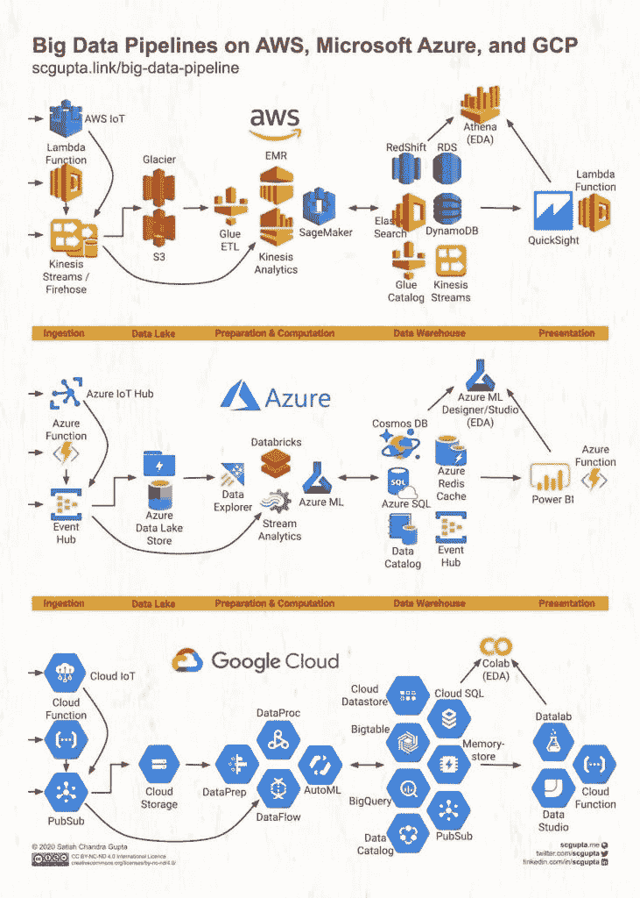

[AWS、微软 Azure 和谷歌云上的大数据管道:Azure(reddit.com)](https://www.reddit.com/r/AZURE/comments/mkfzww/big_data_pipeline_on_aws_microsoft_azure_and/)

将格式化的数据存储在数据仓库或数据帧中是数据管道中的关键步骤，因为它使后续的分析或机器学习工作更加方便和高效。因此，ETL 是一个可能被大多数处理任何级别数据的人有意或无意使用的过程。

# 为什么理解这个概念很重要？

为了更好地理解使用 ETL 的环境，首先确定它在整个**数据科学工作流程**中的位置是很重要的。它通常位于业务问题公式化和建模/分析步骤之间。因此，它构成了数据科学问题的关键，也是我个人最喜欢的项目方面，因为我真正接触到了数据。

区分*数据管道*和*数据科学工作流程*非常重要。前者代表实际的数据流，而后者是一个概念或方法，其范围要大得多，包括直接处理实际数据的前者。

总体数据科学方法可以总结为以下关键步骤:

1.  制定业务问题— *业务问题*
2.  将业务问题转化为数据问题— *数据问题*
3.  决定回答问题需要什么样的数据
4.  ***计算出我们所需的各种数据来源和提取数据所需的工具***
5.  ***确保收集的数据代表正在解决的问题***
6.  ***清理/处理数据，将其转换成可用的格式***
7.  分析和可视化数据

*   探索性数据分析
*   分析或仪表板

8.特征工程、预处理和建模

9.将模型自动化和生产化，以便在实际中使用

10.从模型或分析中获得有意义的见解，以回答最初的问题

上述过程的 **ETL 部分在第 4–6 点**中被捕获。因此，你可以看到，它构成了整个序列的中心部分，可能需要迭代才能从数据中获得最大的意义。

# 使用 Python 的三个简单 ETL 示例

现在我们已经在高层次上建立了流程的样子，让我们深入研究它实际涉及的几个例子。这些例子来自我做过的项目，都是用 Python 写的。

## 使用网络抓取可视化美国失业数据

第一个例子有效地描述了一个快速而简单的 ETL 过程，用于收集、清理和呈现美国失业数据。整个项目是创建一个带有几个经济和财务指标的[仪表板](http://thecraftofdata.com/2021/03/creating-a-dashboard-using-python-to-track-critical-financial-and-economic-indicators)，以及包含其他指标的其他类似 ETL 过程的 [Jupyter 笔记本](https://github.com/saychelsea11/Finance_And_Covid_Tracking_Dashboard/blob/main/Finance_tracking.ipynb)。

现在，我们将关注从劳工统计局网站上搜集的失业数据。该流程的代码片段如下所示。

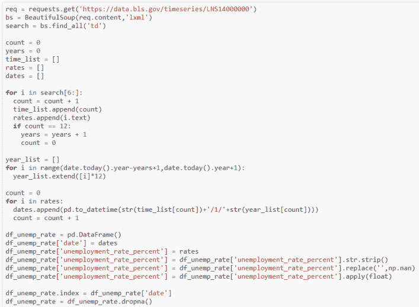

使用 Python 的 *Beautiful Soup* 和 *Requests* 库提取 XML 格式的数据，随后解析并存储在 dataframe 中。原始 XML 数据的快照如下所示。

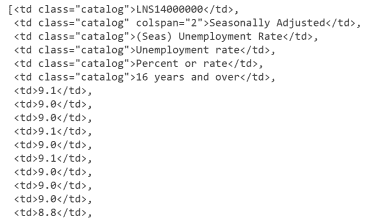

因为日期没有作为原始数据的一部分显式返回，所以需要进行一些日期操作来将失业率映射到年份和月份。最终清除的数据存储在如下所示的数据帧中。

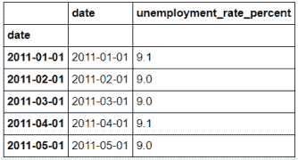

将格式化后的数据存储在数据帧(类似于数据库)中，便于进行分析和绘图，以直观显示一段时间内的趋势。

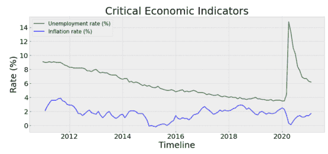

## 存储来自 CSV 文件和 API 的邻域坐标和场地信息

是的，没错。这个项目的数据提取、清理和存储过程尤其混乱，甚至涉及一些手动步骤。然而，这是人们在现实生活场景中可能会遇到的情况，在现实生活场景中，需要收集来自各种来源的原始数据，并以两者相辅相成的方式进行组合。坦率地说，我非常喜欢这个过程，因为我可以更多地接触数据。

为了提供这个项目的简要概述，我试图[确定在亚特兰大市最好的街区开一家零售店](http://thecraftofdata.com/2019/02/determining-an-ideal-location-for-opening-a-retail-store-in-atlanta)。所有的项目信息都可以在 [Github](https://github.com/saychelsea11/Clustering-Neighborhoods-In-Atlanta-To-Determine-Ideal-Location-For-A-Retail-Store) 上找到。该项目的数据收集包括以下关键步骤:

1.  *收集所有的街区名称及其人口*
2.  *提取每个邻域的坐标*
3.  *使用坐标*提取每个街区的场馆信息

邻居的名字和人口直接从维基百科复制到一个 [CSV 文件](https://github.com/saychelsea11/Clustering-Neighborhoods-In-Atlanta-To-Determine-Ideal-Location-For-A-Retail-Store/blob/master/Data/atlanta_neighborhoods.csv)，然后允许数据直接导入 Python 中的数据帧。一旦我们有了这些信息，第 2 步和第 3 步就只能在 Jupyter 环境中完成了。

作为数据帧一部分的初始邻域信息片段如下所示。

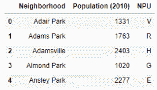

为了提取邻域坐标，使用了 *geopy* 库的*nominam*API，当邻域名称作为输入提供时，它返回纬度和经度信息。下面的示例显示了一个街区的过程—*Whittier Mill Village Atlanta*。

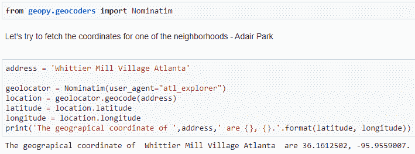

然后，这个过程被扩展为使用如下所示的代码提取所有邻域的坐标。由于邻域名称非常具体，因此存在根据所提供的输入未返回适当坐标的情况，在这种情况下，包含了一种错误处理机制，该机制为缺失的纬度和经度分别分配了虚拟值 998 和 999。这让我可以在以后像外科手术一样添加这些值。

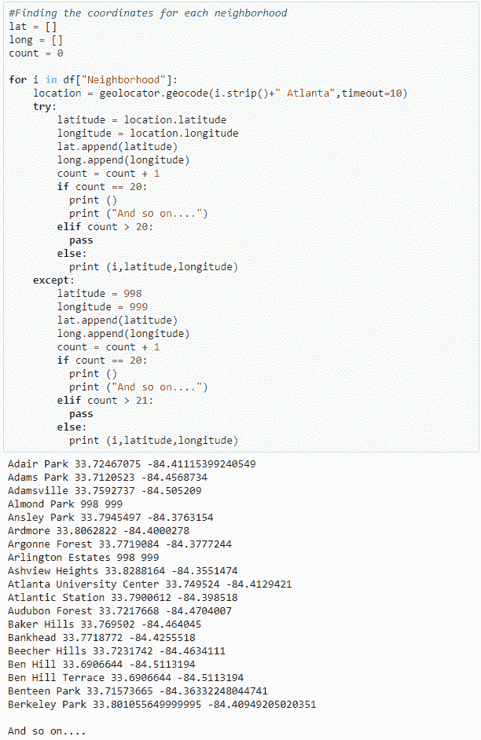

不幸的是，在 27 种情况下，坐标没有被返回，而 4 个邻居有错误的坐标，这意味着我们仍然有 130 个邻居成功返回。为了节省时间和精力，剩余的 31 个坐标通过快速在线搜索手动添加，并用于替换虚拟值。必须进行更多的数据处理，以将缺失/错误的坐标放入主数据框中。

我们的数据集开始成形。

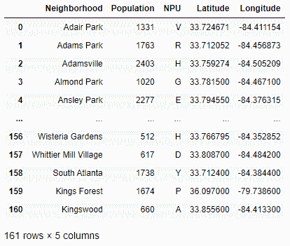

第三步包括使用 Foursquare API 从每个街区提取所有的地点。下面显示了一些示例代码和返回的原始 JSON 数据。如您所见，您首先需要创建**客户端 ID** 和**客户端秘密**凭证来开始使用 API，然后使用特定格式的 URL 来获取场地信息，接下来是一些 JSON 解析。

在上面的例子中，返回的场地名为“Jamrock Jerk Center”，分类为*加勒比海餐厅*(场地类型)。我们从这些数据中需要的最重要的信息是场地类型，以比较不同的社区，并根据最常见的类型将它们分成不同的组。

其余的提取过程是使用下面的代码自动完成的。

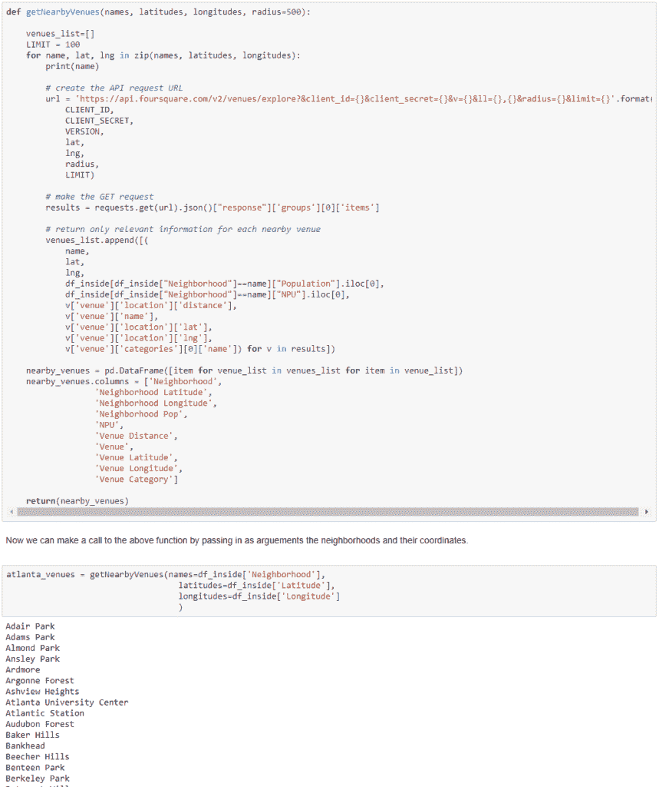

最后，下面的数据集就是最终产品。

下面是通过分析上述数据集得出的一些有趣的见解。

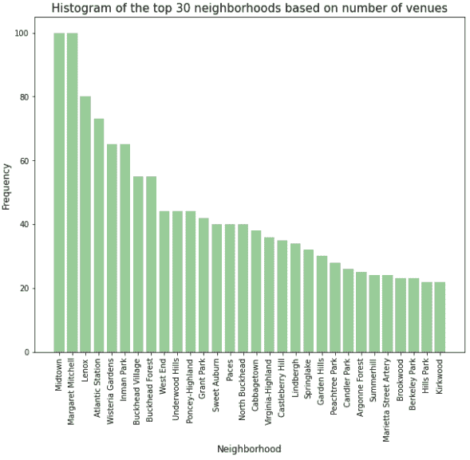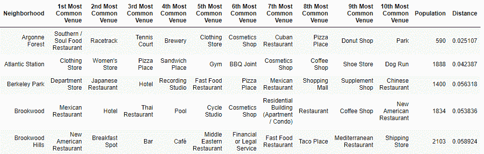

## 从谷歌工作表中分析世界幸福数据

坦率地说，这个分析纯粹是从一个有趣的角度来做的，而不是为了解决一个特定的问题。这也可以说是这篇文章中最简单的例子。我希望在未来使它有用，但目前它只是为了探索和实践。

最初，数据是以 CSV 文件的形式提供的，但是我把它转移到了 Google Sheet 上，以避免上传外部文件的需要。这样做是为了避免在 *Google Colab* 上挂载虚拟驱动器。笔记本在[这里](https://github.com/saychelsea11/Analyzing-Correlations-of-World-Happiness-to-Key-Factors/blob/master/world_happiness_report.ipynb)有售。如果您想使用 [CSV 文件](https://github.com/saychelsea11/Analyzing-Correlations-of-World-Happiness-to-Key-Factors/blob/master/world_happiness_dataset.csv)，该部分仍然在那里，但是已经和虚拟驱动器挂载一起被注释掉了。

这里有一些关于使用 *gspread* Python 库与 Colab 上的 Google sheets 进行交互的[文档](https://github.com/burnash/gspread),以及一篇带有逐步演练的[中型文章](/analytics-vidhya/colab-and-google-sheets-surprisingly-powerful-combination-for-data-science-part-1-bbbb11cbd8e)。

这一步会很快，关键步骤**是连接到谷歌表单**。整个过程如下面的代码片段所示。

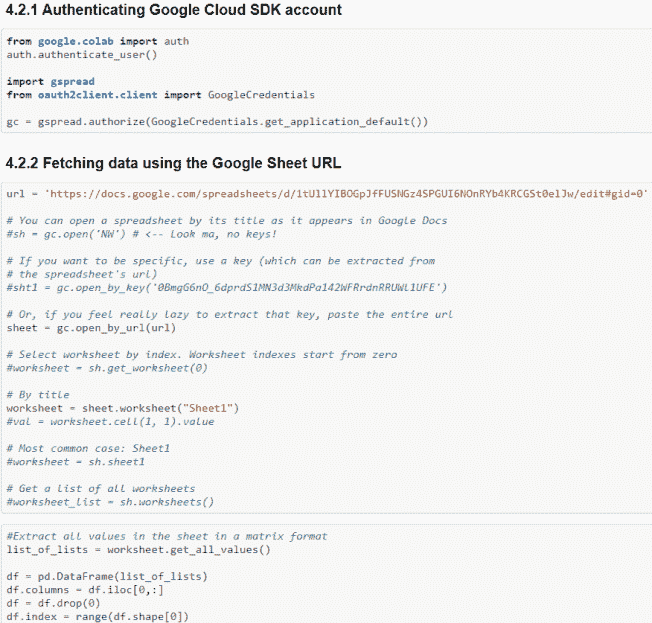

生成的数据框架与数值变量的可视化相关矩阵如下所示。

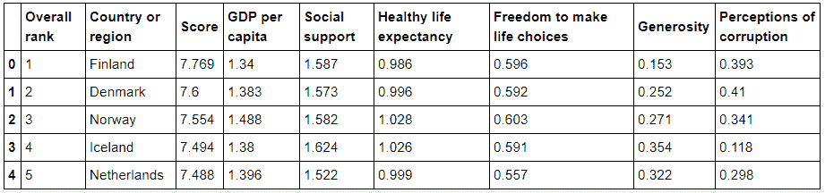

上面的例子展示了 ETL 过程中涉及的一些不同的方面和挑战。它们还描述了不同类型项目过程的多样性。尽管是在复杂的云数据基础设施之外完成的，但它们非常接近更大的流程。

我希望这些例子有助于阐明 ETL 过程，并从概念层面描述它的含义，以及展示它如何适用于不同的场景。

你参与过什么样的 ETL 过程，你面临过什么样的挑战？写在下面的评论里吧。

*原载于 2021 年 5 月 23 日 http://thecraftofdata.com***。**