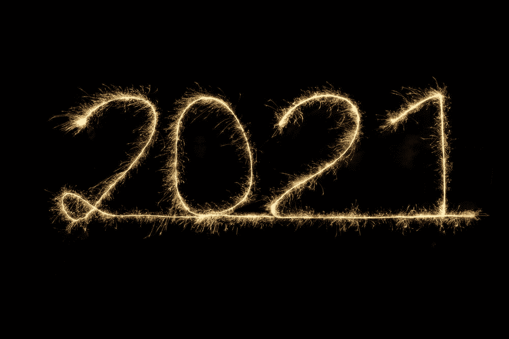
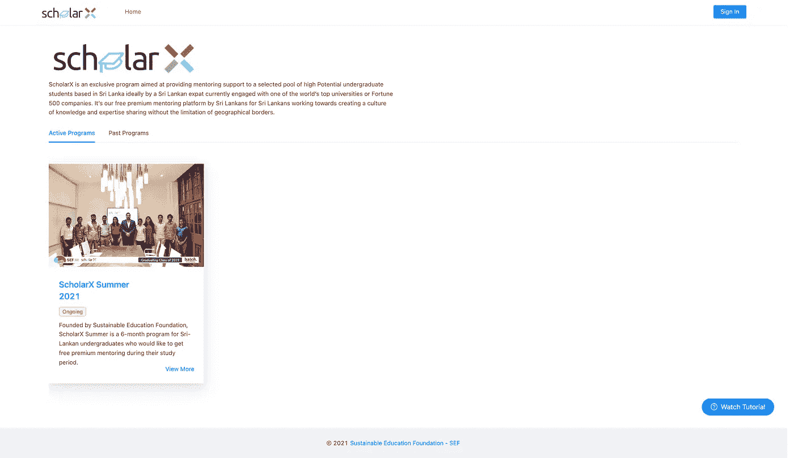
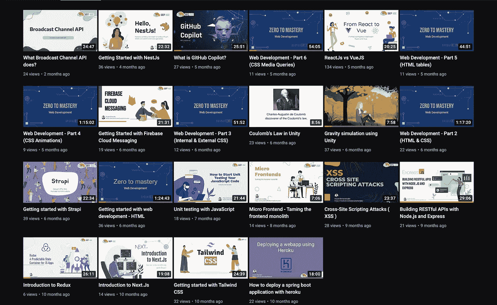
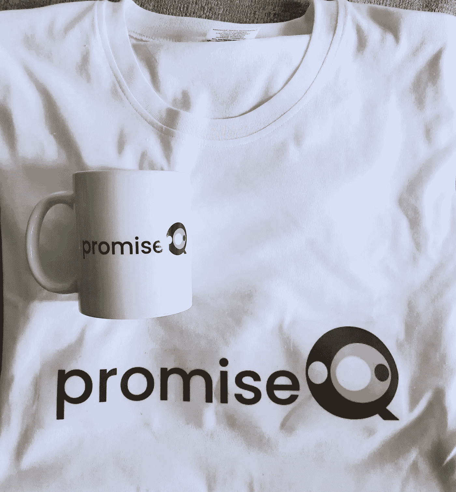

# 感觉结束的往往是开始

> 原文：<https://medium.com/nerd-for-tech/what-feels-like-the-end-is-often-the-beginning-14204463d9ea?source=collection_archive---------4----------------------->

资料来源:联合国人类住区规划署

随着 2021 年接近尾声，我想到了写一写我是如何度过 2021 年的，作为我每月的博客帖子。在这篇博文中，我将简单回顾一下发生在我身上的主要事情。没有别的事了，让我们开始吧。

## Rootcode 实验室

当 2021 年开始的时候，我正在根码实验室实习。不幸的是，因为疫情，我们不得不在家工作。这是一次非常棒的经历。感谢 Rootcode 实验室给我这个机会。

如果你想更多地了解我的实习经历，你可以阅读下面的博客。

[我作为 Rootcoder 的实习经历](/nerd-for-tech/my-internship-experience-as-a-rootcoder-80bdaec0aa35)

## 大学开学了

等了将近两年之后，大学终于在六月开学了。于是我不得不离开 Rootcode 实验室，开始我的本科生活。我们在网上讲课，我很傻，以为这很容易，就像我们做 A/Ls 时老师告诉我们的一样。我一点也不知道。无红利

## ScholarX 2021

我有幸被选为 ScholarX 2021 的学员。我的导师是[教授阿罗沙·班达拉](https://www.linkedin.com/in/akbandara/)。得到他的指导是一种荣幸。随着大学的开始，我一直在努力管理时间。我的导师向我介绍了这个“GTD”框架，它彻底改变了我管理时间的方式。ScholarX 计划在许多方面帮助了我。以下是我写的一些关于我的 scholarX 之旅的博文。

[到目前为止，作为学员，我学到了什么](https://anjulashanaka.medium.com/what-i-learned-so-far-by-being-a-scholarx-mentee-6836c5c614a1)

你想知道无压力生产的艺术吗？

## [SEF 可持续教育基金会](https://sefglobal.org/)

SEF 是一切开始的地方。我差不多两年前加入了他们。在过去的几个月里，我们一直致力于为 ScholarX 搭建一个平台。我们能够在该平台上成功运行一个试点项目，这是一个巨大的成就。目前，我们正致力于创建 v2。

ScholarX 平台

在 SEF，我们每两周举行一次知识分享会。我参加了 14 次[知识分享会](https://youtube.com/playlist?list=PLx4Ro8e0E8S_GmG75brlX1yGbILEiuY7m)，我很高兴能够与他人分享我的知识。

## OpenMRS

除了 SEF，我也开始为 OpenMRS 做贡献。今年早些时候，我正在为他们的 DHIS 2 模块做贡献，目前，我正在为 QA 框架做贡献，在那里我使用[柏树](https://www.cypress.io/)和[黄瓜](https://cucumber.io/)编写了我的第一个 E2E 测试。

## 新爱好

大学一开学，我就开始做一件我一直想做的事情，那就是弹吉他。于是买了一把木吉他，通过 youtube 学了一些和弦。然后我买了一把电吉他，因为我想演奏一些摇滚/金属歌曲。自从我开始打球已经快六个月了，我真的很喜欢打球，尽管我打得并不好。弹好的曲子需要大量的练习。下面是我玩的一些[小事。](https://youtube.com/playlist?list=PLx4Ro8e0E8S-jxgygO7sN8d5RSbBIPbdH)

## 我的新兼职工作

离开 Rootcode 实验室后，我得以加入一家来自德国的年轻初创公司，名为 [promiseQ](https://www.promiseq.com/) 。promiseQ 利用机器学习识别和人工验证来提供准确快速的警报检测决策。在过去的六个月里，我与 VueJs 和 Firebase 一起在那里工作。到目前为止一切顺利。那里也有很多斯里兰卡人。

圣诞礼物

## 2022 年的目标

**做谷歌夏天的代码**

这将是我 2022 年的主要目标。我今年也申请了谷歌代码之夏，但不幸的是，我没有被选中。

**更关注学术**

我想更多地关注学术，因为我觉得我在这方面做得不太好。

**放一些很酷的独奏曲**

我将坚持练习更多的吉他，成为一名中级演奏者，到明年，我想演奏我最喜欢的独奏。我可能会再买一把吉他。

说完，我们来到了文章的结尾。我对今年取得的成绩非常满意，并希望在 2022 年也能实现我的目标。

我祝你新年快乐，并希望你能够实现你的目标。别忘了看看我的其他文章。下次再见了。在那之前保持安全！✌️