# 当你在浏览器中输入网址时会发生什么？

> 原文：<https://medium.com/nerd-for-tech/what-happens-when-you-type-a-url-into-your-browser-ca500d86975c?source=collection_archive---------1----------------------->

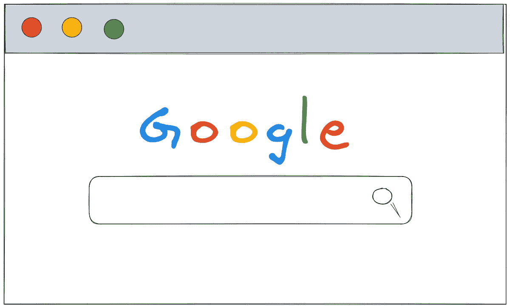

当你在浏览器中输入 www.google.com 时会发生什么？

*本文面向以下受众:*

*   *科技工作者*
*   *学生*
*   *产品经理*
*   *营销团队*
*   *销售团队*

阅读这篇文章没有先决条件。我假设您已经使用 web 浏览器浏览过互联网。原文发表在 [systemdesign.one](https://systemdesign.one/what-happens-when-you-type-url-into-your-browser/) 网站上。

*免责声明* : *系统设计问题是主观的。这篇文章是基于我对这个话题的研究而写的。欢迎分享您的反馈，并在评论中提问。*

## 当你在浏览器中输入*Amazon.com*或*www.google.com*时会发生什么？

在**高电平**下，当您在浏览器中键入一个 URL 并按 Enter 键时，以下操作在后台发生:

1.  DNS 解析
2.  TCP 三次握手
3.  HTTPS 升级
4.  HTTP 请求/响应
5.  浏览器呈现来自服务器的响应

# 术语

以下术语可能对您有用:

*   DNS:包含从域名到 IP 地址的映射的数据存储
*   HTTP:用于在互联网上交换文件的标准应用层协议
*   HTTPS:HTTP 的安全(加密)版本
*   TCP:定义如何在客户端和服务器之间建立和维护网络对话的标准
*   客户端:允许您在互联网上执行不同操作的网络浏览器或移动设备
*   服务器:以网站形式存储文件和信息的计算机
*   URL:标识互联网上 web 资源的网址

# 介绍

当您在浏览器中键入统一资源定位符( [**URL**](https://en.wikipedia.org/wiki/URL) )并按回车键时，大量操作将在后台执行。

HTTP 高级工作流

浏览器**(客户端**)必须找到托管网站的服务器的互联网协议( [**IP**](https://en.wikipedia.org/wiki/IP_address) )地址。客户端随后请求服务器的 IP 地址来传输或检索数据。当客户端在浏览器中输入缩短的 URL(使用 [URL 缩短器](/@system-design/url-shortening-system-design-88cd005604b4)创建)时，在客户端和服务器之间传输数据之前，会有一个额外的 URL 重定向步骤。

# 什么是域名解析？

域名系统([**)DNS**](https://en.wikipedia.org/wiki/Domain_Name_System))是一个数据存储，存储从域名(如 google.com)到其 IP 地址(142.250.185.78)的映射。你可以把域名系统比作地址簿或电话簿。

你需要一个[域名](https://en.wikipedia.org/wiki/Domain_name)(而不是直接使用 IP 地址)，因为记住一个人的域名很简单。每台服务器(例如 google.com)在互联网上都应该有一个唯一的 IP 地址。DNS 允许您使用域名在互联网上找到特定服务器的 IP 地址。

域名空间( **DNS 层级**)是一个倒树形结构。DNS 层次结构在顶级有一个域，称为根域。

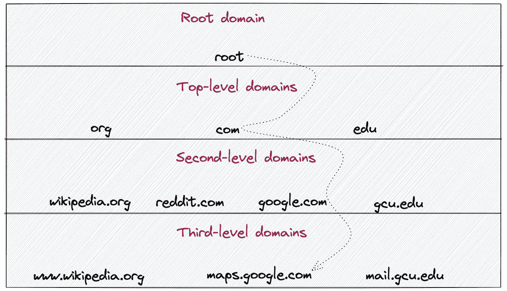

DNS 层次结构

DNS 解析从根域 TLD 开始，一路向下到二级域。DNS 解析可能会遍历多个三级域，直到网站的主机名解析为 IP 地址。

URL 由以下部分组成[2]:

*   协议(方案)
*   子整环
*   域名(二级)
*   一级域名

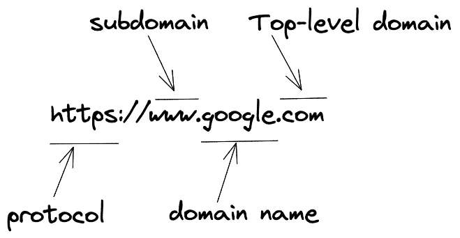

基本 URL 结构

URL 的协议部分通知 web 服务器在访问网站时使用哪种协议。子域表示网站提供的服务，如地图或邮件。二级域名表示网站名称。顶级域名表示该组织在互联网上注册的实体类型。

DNS 解析是一个连续的过程。只有在前面步骤中的缓存没有相关的 DNS 条目时，才会执行 DNS 解析的后续步骤。

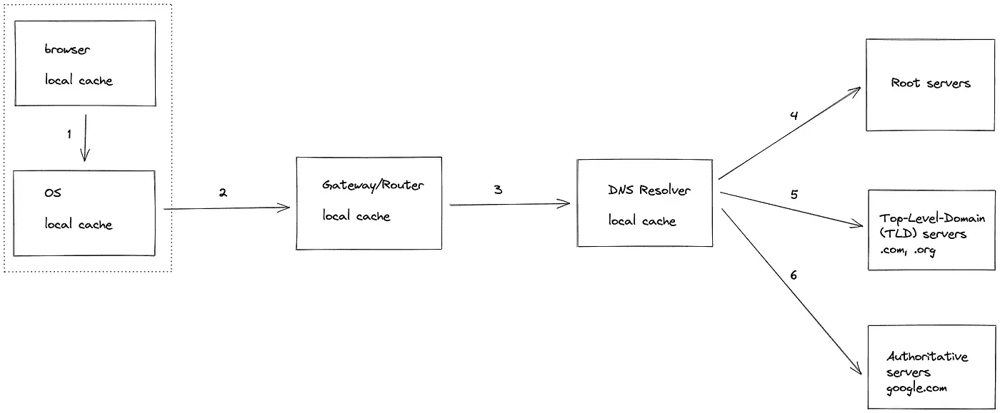

DNS 解析是如何工作的？

对于 DNS 解析，按顺序执行以下操作:

1.  浏览器(**客户端**)检查主机名到 IP 地址的映射是否存在于客户端的本地缓存中。
2.  如果最后一步失败，客户端通过执行系统调用( [syscall](https://en.wikipedia.org/wiki/System_call#:~:text=In%20computing%2C%20a%20system%20call,on%20which%20it%20is%20executed.) )来检查操作系统( [OS](https://en.wikipedia.org/wiki/Operating_system) )本地缓存。
3.  如果最后一步失败，客户端向网关/路由器发出 DNS 请求，并检查路由器的本地缓存。
4.  如果最后一步失败，路由器会将请求转发给互联网服务提供商( [ISP](https://en.wikipedia.org/wiki/Internet_service_provider) )，并检查 ISP 的 DNS 缓存。
5.  如果最后一步失败，DNS [解析器](https://en.wikipedia.org/wiki/Domain_Name_System#DNS_resolvers)查询根服务器(全球有 13 个根服务器有副本)。
6.  DNS 解析器查询顶级域(TLD)服务器，如。或. org。
7.  DNS 解析器查询权威的名称服务器，如 google.com。
8.  可选地，DNS 解析器根据您的查询查询权威子域服务器，如 maps.google.com 的*。*

*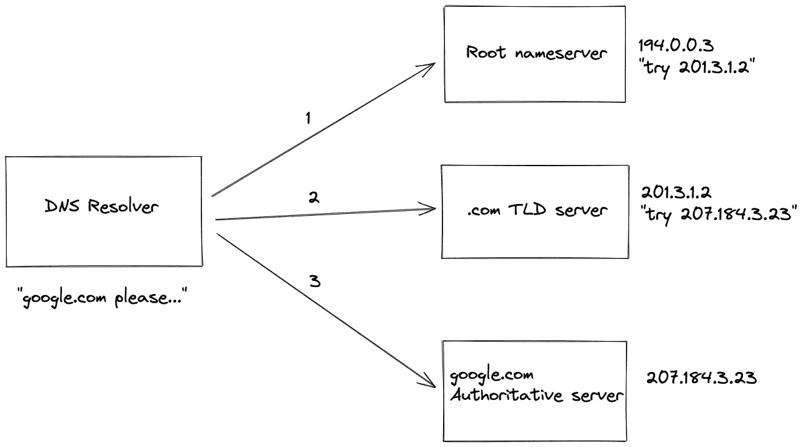*

*递归 DNS 查找*

*一旦解析了 DNS 查询，DNS 解析过程中的中间组件将缓存带有生存时间(TTL)到期时间限制的结果。如果您更改网站的 IP 地址，客户端应该等到 TTL 过期后自动使缓存失效。缓存还改善了后续客户端请求的延迟。*

# *TCP 三次握手*

*客户端应该创建一个到服务器的连接来传输和接收数据。传输控制协议( [**TCP**](https://en.wikipedia.org/wiki/Transmission_Control_Protocol) )是超文本传输协议( **HTTP** )中的底层协议之一。*

*您可以将 HTTP 比作客户端和服务器之间用于传输数据的抽象或高级协议(应用层或 [OSI](https://en.wikipedia.org/wiki/OSI_model) 模型中的第 7 层)。在 HTTP 中传输的数据是人类可读的。TCP 是一个低层协议(OSI 模型中的传输层或第 4 层),处理数据包的错误检测和重传[3]。*

*客户端与服务器进行三次握手，以建立 TCP 连接。由于双向通信信道，TCP 需要三次握手。如果进行双向握手，则只能启动单向通信通道。*

*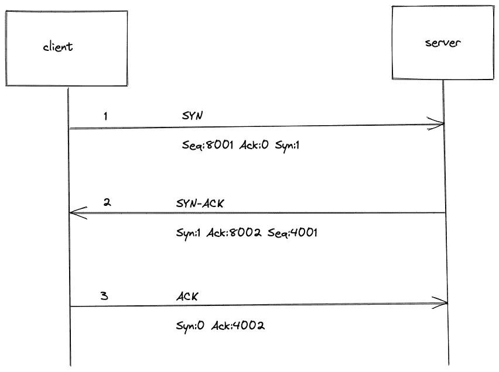*

*TCP 三次握手*

*以下 synchronize ( **SYN** )和 acknowledge ( **ACK** )消息在客户端和服务器之间发送，以打开 TCP 连接:*

1.  *客户端发送一个带有随机序列号的 SYN 请求( *x* )。*
2.  *服务器用 SYN-ACK 响应。确认号被设置为比接收到的序列号多 1(*x+1*)。服务器发送另一个随机序列号( *y* )。*
3.  *客户端发送 ACK。客户端发送一个比接收到的序列号多 1 的确认号( *y+1* )。*

# *HTTPS 升级*

*超文本传输协议 Secure ( [**HTTPS**](https://en.wikipedia.org/wiki/HTTPS) )是超文本传输协议( [**HTTP**](https://en.wikipedia.org/wiki/Hypertext_Transfer_Protocol) )的扩展。通过 HTTP 传输的数据没有加密，因此任何人都可以窃听传输的数据包。HTTPS 加密传输的数据，从而防止中间人攻击[4]。互联网上的大多数现代网站使 HTTPS 能够进行安全通信。默认情况下，HTTPS 使用端口 443，而 HTTP 使用端口 80。*

*在[非对称加密](https://en.wikipedia.org/wiki/Public-key_cryptography)中，有一个密钥对——公钥和私钥。公钥可以与互联网上的任何人共享，而私钥永远不应该共享。在[对称加密](https://en.wikipedia.org/wiki/Symmetric-key_algorithm)中，只有一个私钥，双方都应该可以使用同一个密钥来加密或解密消息。*

*你可以把不对称加密比作电子邮件服务。公钥是您的电子邮件地址，私钥是用于访问电子邮件帐户的密码。任何人都可以通过查看发件人的电子邮件地址来轻松验证您是否发送了该电子邮件。但是，如果任何人向您的帐户发送电子邮件，只有您可以使用密码访问它。*

*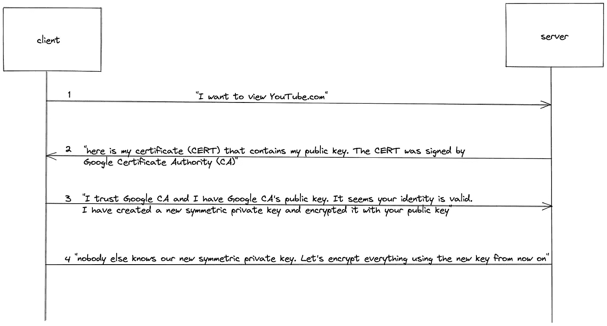*

*HTTPS 升级请求*

*在传输任何数据包之前，在客户端和服务器之间执行以下操作以将 HTTP 升级到 HTTPS:*

1.  *浏览器(**客户端**)使用 HTTP 请求头向服务器发出 HTTPS 升级请求。*
2.  *服务器用安全套接字层( [**SSL**](https://en.wikipedia.org/wiki/Transport_Layer_Security#SSL_1.0,_2.0,_and_3.0) )证书来响应客户端，该证书包含服务器的公钥，该公钥由认证机构( [**CA**](https://en.wikipedia.org/wiki/Certificate_authority) )签名。*
3.  *默认情况下，客户端拥有流行的 CA(例如，Google CA)的公钥。客户端可以使用 CA 的公钥，通过检查数字签名来验证 SSL 证书的有效性(数字签名在[非对称加密](https://en.wikipedia.org/wiki/Public-key_cryptography)中)。*
4.  *客户端创建新的 [**对称**](https://en.wikipedia.org/wiki/Symmetric-key_algorithm) 私钥，并用服务器的公钥对新的对称私钥进行加密。*
5.  *服务器使用服务器的私钥对客户端共享的新对称私钥进行解密。*
6.  *客户端和服务器之间的任何进一步通信都将使用新的对称私钥进行加密，因此保持安全。*

*由于不对称加密，任何侦听 HTTP 升级请求或响应消息的人都无法捕获任何有意义的数据。HTTPS 升级后，客户端和服务器之间的进一步通信将使用对称加密。*

*为了创建 SSL 证书，服务器向 CA 执行证书签名请求( [**CSR**](https://en.wikipedia.org/wiki/Certificate_signing_request) )。*

*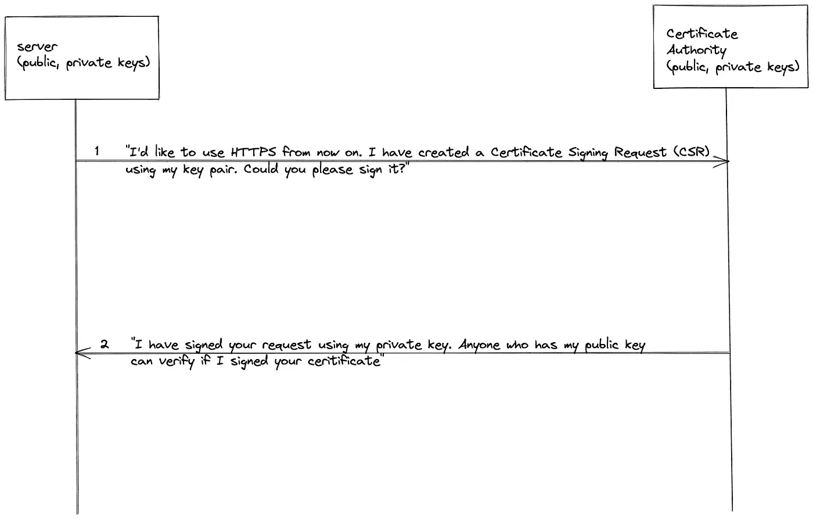*

*SSL 证书签名请求*

*CSR 将服务器的公钥传送给 CA。CA 有一对公钥和私钥。CA 使用 CA 的私钥签署服务器的公钥，并创建 SSL 证书。互联网上任何可以访问 CA 公钥的人都可以很容易地验证 SSL 证书的数字签名。*

# *HTTP 请求/响应*

*超文本传输协议( **HTTP** )是一种在客户端和服务器之间传输数据的机制。客户端向服务器发出 HTTP(S)请求来获取或传输数据。服务器响应请求的相关内容和完成状态信息[5，6]。*

**

*HTTP 简化工作流程*

*客户端发出一个 GET HTTP 请求来查看一个网站(比如 google.com)。如果客户端想要向服务器提交数据(比如在 google.com 中搜索某个关键字)，客户端会发出一个 POST HTTP 请求。*

*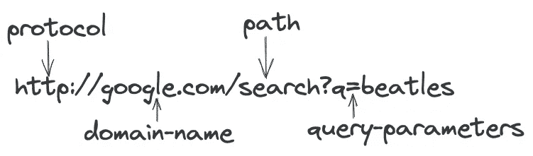*

*基本 HTTP URL 结构*

*URL 可以分解成多个部分。域名用于标识服务器。URL 路径用于标识服务器上的资源(特定文件或信息)。查询参数用于过滤或排序数据(或传输有状态的信息)。以下是您在客户端查看 google.com 网站时的简化工作流程[7，8]:*

1.  *客户端向 google.com 服务器发出 HTTP GET 方法请求*
2.  *如果成功，服务器响应一个 *200 OK* 状态代码*

*HTTP 请求由以下实体组成:*

*   *统一资源定位器(URL)*
*   *HTTP 标题*
*   *HTTP 正文(可选)*

*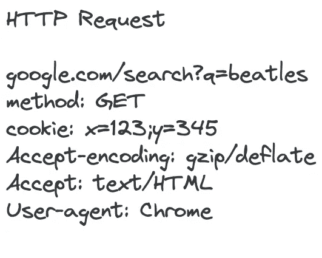*

*HTTP 请求*

*HTTP 请求方法(动词)定义了应该在服务器上执行的操作类型。下面是一些流行的 HTTP 方法:*

*流行的 HTTP 方法*

**幂等:资源的多次调用产生相似的结果**

**安全:调用不会修改资源**

*服务器( [Nginx](https://www.nginx.com/) ，Apache web 服务器)将 HTTP 请求委托给请求处理程序。请求处理程序是用任何服务器端编程语言(如 Python、Node.js 或 Java)定义的一段代码。请求处理器检查请求的 HTTP 头(*内容类型、内容编码、cookie*等)，然后验证 HTTP 请求体。请求处理器然后在客户端请求的*内容类型* (JSON，XML)中生成适当的响应。*

*HTTP 服务器响应由以下实体组成:*

*   *HTTP 标题*
*   *HTTP 正文*

*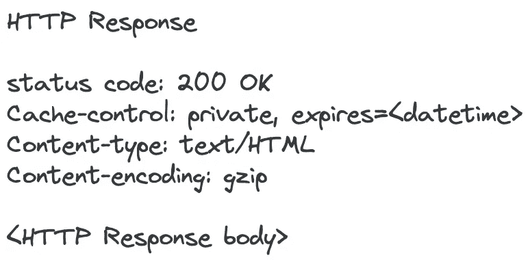*

*HTTP 响应*

*HTTP 响应状态代码帮助您排除故障。HTTP 状态代码可以分为以下几类[9，10]:*

*HTTP 状态代码*

*HTTP 请求和响应头用于控制缓存、授权客户端或压缩在客户端和服务器之间传输的数据。例如，*用户代理* HTTP 请求头帮助服务器识别客户机是移动客户机还是桌面客户机。下面是一些最流行的 HTTP 头:*

*流行的 HTTP 头*

# *浏览器呈现来自服务器的响应*

*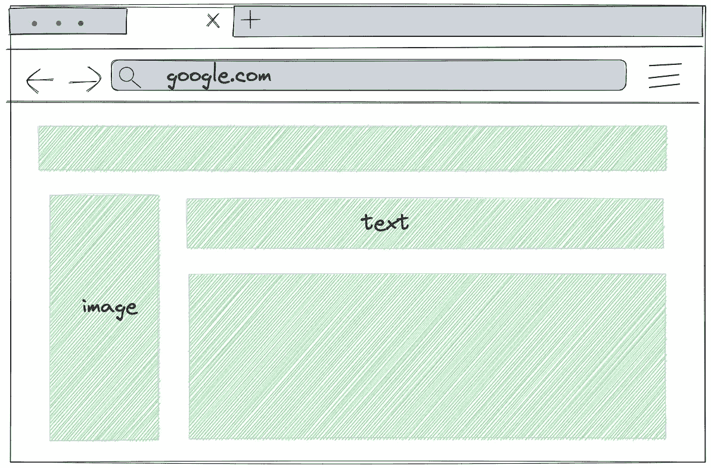*

*呈现网站的浏览器*

*浏览器可能会向服务器发出多个 HTTP 请求，以获取网站的所有相关数据，如级联样式表(CSS)、JavaScript 文件、图像或视频。最后，浏览器呈现 HTML 和从服务器接收的内容[11]。*

*根据 HTTP 响应头( *Cache-control* )，浏览器缓存响应以防止从服务器重新请求相同的数据。缓存改善了网站的延迟。*

# *摘要*

*客户端通常会缓存带有任意生存时间( [**TTL**](https://en.wikipedia.org/wiki/Time_to_live#:~:text=Time%20to%20live%20(TTL)%20or,data%20is%20discarded%20or%20revalidated.) )到期时间的 DNS 映射和服务器响应。由于本地缓存的原因，当您重新访问同一个网站时，不会多次查询 DNS 服务器。*

*在互联网规模的系统中，有多个组件作为中间层来满足传入的负载需求。内容交付网络( [CDN](https://en.wikipedia.org/wiki/Content_delivery_network) )、[负载平衡器](https://en.wikipedia.org/wiki/Load_balancing_(computing))和[反向代理](https://en.wikipedia.org/wiki/Reverse_proxy)是可能出现在大规模系统中的一些中间组件。*

# ***问题和解决方案***

*如果你想挑战你的知识，请访问媒体文章:[知识测试](/@system-design/knowledge-test-what-happens-when-you-type-a-url-into-your-browser-8b47056c59c)*

# *许可证*

*[原文章**必须反向链接**。](https://creativecommons.org/licenses/by-nc-nd/4.0/)*

# *参考*

*[1] [域名系统](https://en.wikipedia.org/wiki/Domain_Name_System)，Wikipedia.org*

*[2] [网址](https://en.wikipedia.org/wiki/URL)，Wikipedia.org*

*[3] [传输控制协议](https://en.wikipedia.org/wiki/Transmission_Control_Protocol)，Wikipedia.org*

*[4][Wikipedia.org HTTPS](https://en.wikipedia.org/wiki/HTTPS)*

*[5][MDN Web docs HTTP headers](https://developer.mozilla.org/en-US/docs/Web/HTTP/Headers)，Mozilla.org*

*[6] [MDN Web docs HTTP 响应状态码](https://developer.mozilla.org/en-US/docs/Web/HTTP/Status)，Mozilla.org*

*[7] [HTTP 请求方法【Wikipedia.org ](https://en.wikipedia.org/wiki/Hypertext_Transfer_Protocol#Request_methods)*

*[8] [什么是 HTTP](https://www.cloudflare.com/en-gb/learning/ddos/glossary/hypertext-transfer-protocol-http/) ，Cloudflare.com*

*[9] [RESTful web API 设计](https://learn.microsoft.com/en-us/azure/architecture/best-practices/api-design)，learn.microsoft.com*

*[10]多恩·马丁，[系统设计入门 HTTP 通讯](https://github.com/donnemartin/system-design-primer#communication)，GitHub*

*[11] [填充页面:浏览器如何工作](https://developer.mozilla.org/en-US/docs/Web/Performance/How_browsers_work)，Mozilla.org*