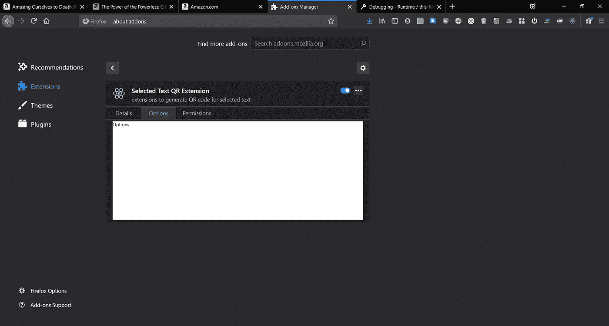
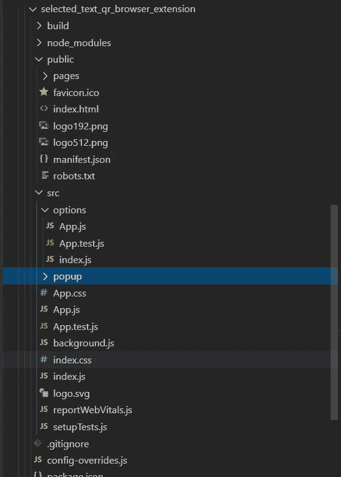

# 我构建了什么(4) —生成二维码的浏览器扩展

> 原文：<https://medium.com/nerd-for-tech/what-i-built-4-browser-extension-to-generate-qr-code-1ac6c17d00f7?source=collection_archive---------25----------------------->

这是一个浏览器扩展，为选定文本或当前页面 URL 生成 QR 代码。

# 意图和背景

这是我重新思考 OCR 解决方案的一个项目:

[](/swlh/what-i-built-1-a-website-that-ocr-selected-text-on-screen-fca8f107228c) [## 我建立了什么(1)-一个网站，光学字符识别选择屏幕上的文本

### 这是我在 WFH 期间建造的第一批东西之一。

medium.com](/swlh/what-i-built-1-a-website-that-ocr-selected-text-on-screen-fca8f107228c) 

OCR 解决方案的问题是准确性和速度不令人满意，因此考虑从 PC 复制文本并在移动电话中使用它的相同问题，一种方法是使用中间人，如 Signal、WhatsApp、email…但我的观点是使用相机(以前解决方案中的 OCR 或本解决方案中的 QR 码扫描)。

# 它的作用

它显示当前 URL 或选定文本的 QR 码，并允许手机扫描它以获取文本。


右上方的弹出窗口(单击扩展图标时)，通过单击按钮，它将当前 URL 或所选文本转换为 QR 码并显示在此面板中

# 使用的主要技术

*   React.js 带“创建-反应-应用”
*   “customize-cra”包创建多个入口点(因为 create-react-app 默认提供单个入口点)
*   “二维码”包生成二维码

# 开始吧

我遵循的主要参考是:

[](https://dev.to/jamalx31/use-create-react-app-to-develop-a-chrome-extension-14ld) [## 使用 create-react-app 开发 Chrome 扩展

### create-react-app (CRA)可能是构建、开发和部署 react 应用程序最常见的方式。几周前…

开发到](https://dev.to/jamalx31/use-create-react-app-to-develop-a-chrome-extension-14ld) 

## 为什么我需要多个入口点

答案是当前的实现还不需要这样做，但我觉得将来可能需要，所以我最好做好准备。人们可能会建议使用 webpack 来管理解决方案打包，我只是没有足够的经验来管理 webpack，create-react-app 有默认设置，应该会做得很好，在 customize-cra 的帮助下，确实达到了目的，这是我目前的“目标”，毕竟，学习新的东西是令人兴奋的。

# 代码/配置片段

## Manifest.json

我的清单文件如下所示:

```
{
  "name": "Selected Text QR Extension",
  "version": "0.0.0.1",
  "manifest_version": 2,
  "description": "extensions to generate QR code for selected text",
  "icons": {
    "128": "logo192.png"
  },
  "permissions": ["activeTab", "tabs"],
  "browser_action": {
    "default_icon": "logo192.png",
    "default_popup": "pages/popup.html"
  },
  "options_ui":{ "page": "pages/options.html" }
}
```

老实说，我不确定所定义的权限是否有点太多，但我使用 browser.tabs.executeScript()来调用“window.getSelection()。toString()”，我敢打赌这不是使文本被选中的最合适的方式，但这是我目前找到的第一个解决方案，这导致我添加“制表符”权限。

我添加了 2 个路由(页面)，将调用“pages/popup.html”来打开主弹出页面，pages/options.html 用于 option_ui 页面(目前是一个虚拟页面，但在将来的增强中应该是其他页面)。

清单中的“options_page”的行为似乎与“options_ui”不同，我还不知道“options_page”应该是什么样子。



虚拟选项用户界面页面。

## 配置-覆盖. js

此文件用于 customize-cra，multipleEntry 允许 create-react-app 有多个入口点(而不是只有“/”)，结果会将“Entry”和“template”文件复制到“outPath”。

“copyPlugin”是将配置中指示的非入口点文件复制到“build”文件夹根目录，因为我们的扩展将被压缩，并且这些文件应该在 zip 的根目录中找到,“to”是空字符串以指示根目录。

其余部分来自参考网页，我没有接触过它们。

```
const {
 override,
 overrideDevServer,
 addWebpackPlugin
} = require("customize-cra");
const CopyPlugin = require('copy-webpack-plugin');const multipleEntry = require('react-app-rewire-multiple-entry')([
 {
   // points to the popup entry point
   entry: 'src/popup/index.js',
   template: 'public/pages/popup.html',
   outPath: 'pages/popup.html'
 },
 {
   // points to the options page entry point
   entry: 'src/options/index.js',
   template: 'public/pages/options.html',
   outPath: 'pages/options.html'
 }
]);const devServerConfig = () => config => {
 return {
   ...config,
   // webpackDevService doesn't write the files to desk
   // so we need to tell it to do so so we can load the
   // extension with chrome
   writeToDisk: true
 }
}const copyPlugin = new CopyPlugin({
 patterns: [
  // copy assets
  { from: 'public', to: '' },
  { from: 'src/background.js', to: '' },
  // { from: 'src/content.js', to: '' }
  { from: 'node_modules/webextension-polyfill/dist/browser-polyfill.js' },
 ]
})module.exports = {
 webpack: override(
   addWebpackPlugin(
    copyPlugin
   ),
   multipleEntry.addMultiEntry,
 ),
 devServer: overrideDevServer(
   devServerConfig()
 ),};
```

## 文件夹结构

文件夹结构主要遵循 create-react-app 提供的内容，但以下内容除外:

```
Root
 > build/ // this is create by webpack
 > node_modules/
 > public/
   > pages/ // this is created to host the "templates" html 
     > options.html // copy of the index.html of create-react-app
     > popup.html // copy of the index.html of create-react-app
     > ...
 > src/
    > options/ // the files below are copy from create-react-app
      > App.js // modified to serve option page component
      > App.test.js
      > index.js // entry point of options page
    > popup/
      > ... // similar to options above
    ... // the rest from create-react-app
 > config-overrides.js // the override config file for customize-cra
 ... // the rest from create-react-app
```



为了补充上面的解释

请注意，src 文件夹级别仍然有 App.js 和 index.js，即使它们没有被使用，如果没有它们，构建将无法工作，它们可能是空文件。

## 获取选择文本并生成 QR 码的核心代码

这是我觉得我做得不是最好的部分(至少从安全角度来看，因为我使用 browser.tabs.executeScript，我觉得它在未来会受到限制)，下面是按钮单击事件处理程序的代码。

```
function handleClickGetUrl() {
  browser.tabs.executeScript( {
    code: "window.location.href.toString();"
  }).then(text => {
    QRCode.toCanvas(canvasRef.current, text);
  })
}
```

# 结论

对我自己来说，最快乐的收获是开始知道如何用 customize-cra 允许 create-react-app 的多个条目，这在我的其他项目中可能非常有用。