# 我在直角三角形上发现了什么？

> 原文：<https://medium.com/nerd-for-tech/what-i-discovered-on-right-angled-triangle-34e6054bc766?source=collection_archive---------22----------------------->

# 虽然费马做得更早…

# 动机

这件作品是我和一个精明的熟人讨论的结果。他的挑战是:“你能证明有或没有两个直角三角形共享一条边，并且其中一个的斜边是另一个的边，其中所有的边都是整数吗？”

也就是说，我们能有两个直角三角形，第一个有腿吗

**a** 、 **b** 和斜边 **c** 第二个有腿 **b** 、 **c** 和斜边 **d. a、b、c、d** 都是整数

因为我相信毕达哥拉斯，所以我可以这样写他的主张:

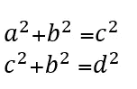

作者

## 全等数字

在我们继续我的工作之前，我将介绍**同余数**的概念

基本上，这些整数可以是有有理边的直角三角形的面积。人们可以通过表示 a、b、c 有理数来表述这一点，并且说 **n** 全等，如果:

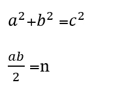

作者

通过做一些技术工作，我们可以说 **n** 是一个同余数，如果对于 a，b，c，d 有理数它满足

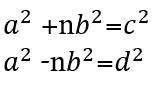

作者

如果我们用上面的等式

作者

问题变成了**“1 是全等数吗？”。**

在过去的某个地方我听说不是。但是你知道来自精明熟人的挑战需要思考而不是浏览。

# 让我们工作吧

我们用 **pair0 来表示这对方程。**我们假设 a、b 和 c 没有公因数。因为它们是整数，我们可以使用模式 4 的规则来推断出 **b** 是偶数

## 战略

我们知道，如果存在像 **pair0** 这样的方程对，那么就存在这样一个具有最小 **b 的方程对。我们将研究这种情况，旨在排除这个 **b****

我们可以写出上方程式

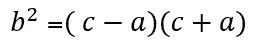

由于 c，a 是奇数，我们可以通过模(4)运算得出结论，其中只有一个是 4 的乘法。因此我们可以定义

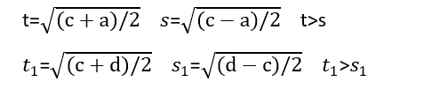

我们获得:

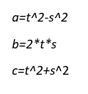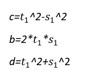

我们可以平分

*   **对于每一对(s，t)，其中一个数字是奇数(由于模 4 算法)**
*   **t** 不同于 **t1**

因此 **s** 和 **s1** 不能同时为 1

=> **b 有一个奇数因子**

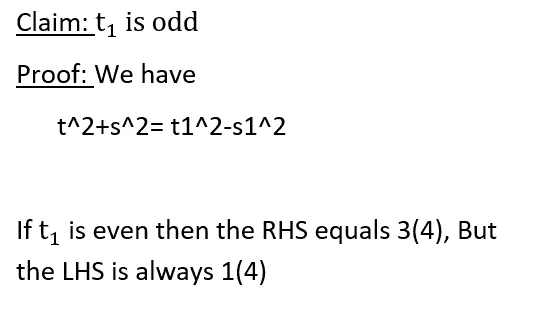

我们希望排除 t1 是奇数的情况，并排除整个概念(费马已经这样做了，但我将以我的方式进行)。下一个主张似乎对此有利

作者

让我们在 t1 上添加一个额外的信息

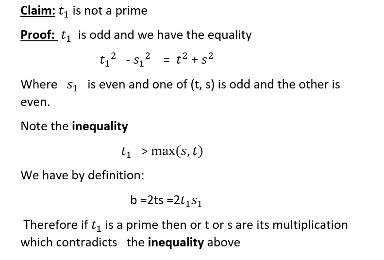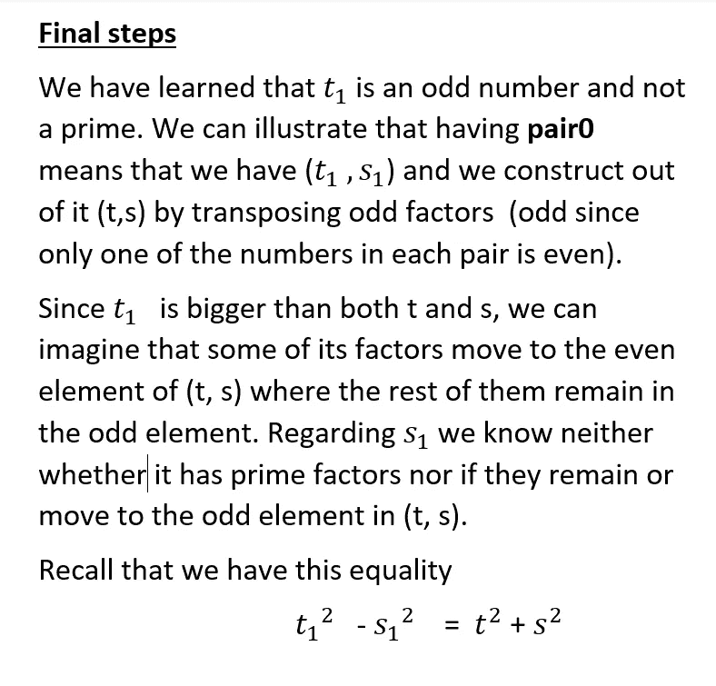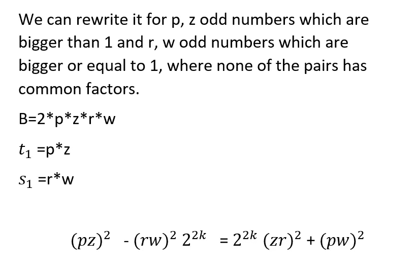

**我们强调 p，z > 1(因为 t1 不是素数)。关于 r，w，它们是奇数，但可以是 1。让我们移动缺口**:

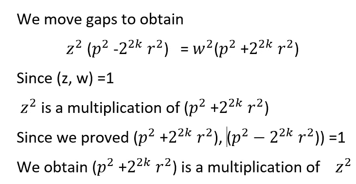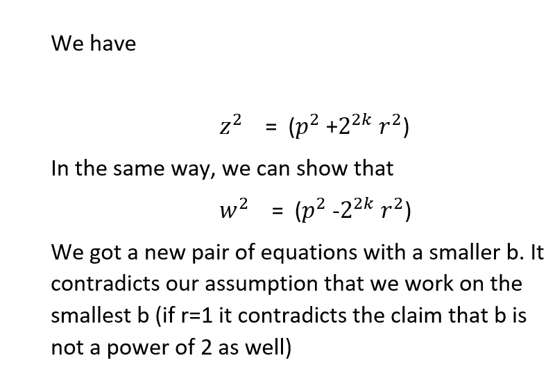

希望你喜欢