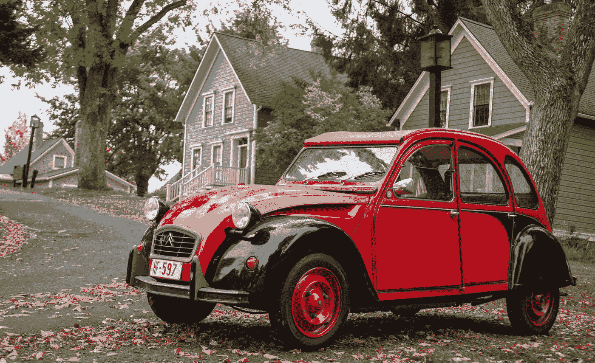
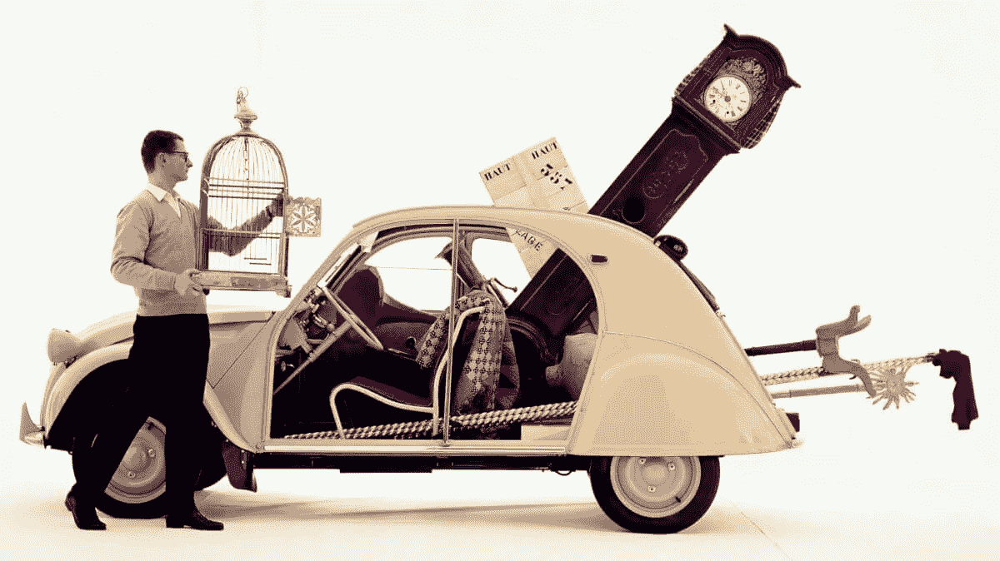
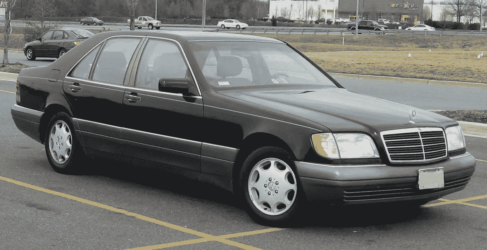
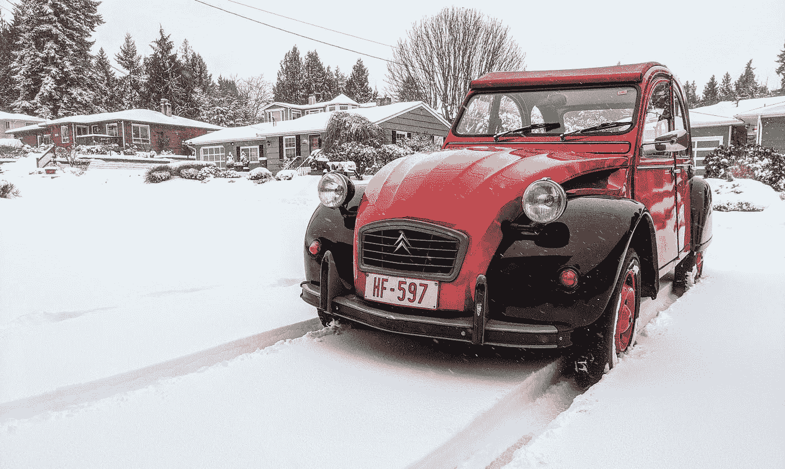

# 我从一辆 60 年的法国旧车中学到的软件工程知识

> 原文：<https://medium.com/nerd-for-tech/what-i-learn-about-software-engineering-from-a-60-yr-old-french-car-b565f881d31a?source=collection_archive---------0----------------------->

## 简单的 设计有一种优雅和永恒

几年前，我和妻子开车回家，我注意到停车场有一辆红黑相间的雪铁龙 2CV 老爷车。有人告诉我，就在那一刻，我发出了一声有趣而兴奋的尖叫。我不记得了。我只记得我疯狂地冲我的妻子大喊大叫，让她掉头去那个汽车经销商那里，当时我的心脏跳得很快。

雪铁龙是一家拥有百年历史的法国汽车制造商，在欧洲和拉丁美洲非常受欢迎，但从未真正在美国生产过。我不记得上次在镇上看到雪铁龙是什么时候了。

我最初对 2CV 感到兴奋是因为它是我童年的重要组成部分。上世纪 70 年代，我出生在阿根廷，当时法国和意大利的汽车随处可见:雪铁龙、雷诺、标致、菲亚特。我父母有一辆破旧的 1968 年雪铁龙 2CV，蓝色。他们开着它从阿根廷北部的大平原一直到巴塔哥尼亚，然后回来度蜜月。我出生的那天，我爸爸穿着它把我从医院带回家。他每天早上开车送我去学校。我仍然记得车里的味道:旧皮革和烧焦的油。还有换挡杆在路上噼啪作响时发出的噪音。最终，当我 12 岁的时候，这辆车有点生锈了，我爸爸升级到了雷诺 6。一年后，我爸去世了。我经常想起那个 2CV。

回到 2019 年，我和妻子把车停在车行的停车场后，我心跳加速地绕着车走了一圈，打开雪铁龙的后门，闭上眼睛，深吸了一口气。旧皮革和烧焦的油把我带回了十岁时坐在我爸爸汽车后座的时光。我开始哭泣，感觉自己和 30 多年前失去的父亲有了联系。

所以我冒险买下了它。我现在几乎每天都开它，尽管我有另外 3 辆更好的车。

现在你在想。好吧，这是一个可爱的多愁善感的故事，卡洛斯，但它与“软件工程”有什么联系呢？

**这辆车每天都在提醒我，简单中有一种优雅和永恒。简单的设计是美丽的。无论是汽车还是软件。这个世界充满了过度设计的东西。**

雪铁龙 2CV(法语:Deux Chevaux )是一款非常受欢迎的汽车，在 1948 年至 1990 年间售出了 400 万辆。这种汽车的设计在四十年中几乎没有改变。观看任何以巴黎为背景的电影(即使是儿童电影，如《料理鼠王》或《汽车总动员 2！)你会看到它们在巴黎鹅卵石街道上无处不在。

作为一名在微软、亚马逊和谷歌工作了 25 年的专业软件工程师，我对这个设计的非凡独创性感到敬畏。

奔驰开始制造漂亮的汽车，保时捷开始制造快速的 T2 汽车，宝马开始制造豪华的 T4 汽车……雪铁龙开始制造最便宜、最实用、最简约的汽车。他们的目标是使 20 世纪 30 年代法国仍在使用马车的大量农民机动化。这是一辆“工人阶级”的车。舒适、豪华、安全、速度和外观没有被优先考虑。相反，低拥有成本、简单维护和名义燃油消耗是指导原则。

到处都有极简风格。2CV 没有复杂的机制来上下滚动窗户，而是安装了手动铰链式前窗。这使得汽车拥有极薄的门板，降低了制造成本(减少了金属)和重量(更好的燃油消耗)，但为了增加车身的强度，金属是波纹状的。简单的解决方法，但是聪明有效。他们还节省了制造成本和重量，用帆布车顶代替金属车顶。这是一个功利的选择，但在阳光明媚的日子里，你可以放下车顶，在法国乡村享受一次光荣的驾驶。这也意味着，如果你有任何超大的物品，你可以打开顶部，把它装起来。还是那句话，简单，巧妙，有效。

它的 29 马力发动机不会随着加速而颤动(有比这更强大的割草机！)，但它确实每加仑能跑 80 英里(相比之下，大多数现代汽车每加仑能跑 20 英里左右)。即使以今天的绿色标准来看，这也是难以置信的。

车里的一切都在那里，因为它绝对需要在那里。我可以花几个小时谈论雪铁龙 2CV 的极简主义。那些法国工程师不是没想过 X，Y，Z，而是他们明确的想过:我们 ***不是*** 怎么可能有 X，Y，Z？然而，它很舒适，它的小引擎足以让我在西雅图的山上爬上爬下。这是一辆外观如此独特的车，以至于任何看到我开车上路的人都会笑逐颜开。

回到软件工程。我有一件尴尬的事要坦白。2013 年，我读了四人帮的[设计模式:可重用面向对象软件的元素](https://en.wikipedia.org/wiki/Design_Patterns)。我爱上了图案，并在任何地方都过度使用了图案。我在亚马逊(Amazon)谋求晋升为首席工程师，被告知我需要展示复杂性(T21)的技术产品。我认为设计模式是我向别人展示我是一名伟大的工程师的一种方式。看着我！我正在所有这些抽象之间创造这些真正复杂的交互！我很聪明！

我的观点已经发生了变化。不要误解我:设计模式这本书是任何软件工程师的必读之作。但是我认为在读完那本书之后，大多数人最终会把设计模式应用到任何会动的东西上。像所有美好的事物一样，适度是关键。我亲眼目睹了这一点，因为新来的初级工程师在我创建的代码库上大展拳脚，十年来一直诅咒我的名字。创造复杂的东西给下一代工程师留下了维护的噩梦。

我最终明白了，我们想要奖励的**复杂性是在*问题*中，而不是在*解决方案*** 中。我想表扬那些用简单的方法解决复杂问题的人。

事实上，这是我们在软件公司绩效评估时经常误解的一件事。讨论经常在“X 的设计复杂吗？X 造了什么复杂的东西吗？”而不是“*X 处理并消除了复杂空间的歧义？*“当你对一个复杂的问题有一个简单的解决方案时，通常很难理解这个问题有多复杂，需要多少智力才能提炼出这个简单的解决方案。

我最近在谷歌花了一周时间修改了 20 行代码。写下实际的 20 行大概花了我 10 分钟。测试这个变化花了我几个小时。但是找出哪 20 行是正确的花了我 4 天时间。我可以看到一个人看着代码评审心想，“哦，这很简单，他花了一周的时间在这上面？？?"

亚马逊([我 2009–2020](https://www.linkedin.com/feed/update/urn:li:activity:6879137570505265152?updateEntityUrn=urn%3Ali%3Afs_feedUpdate%3A%28V2%2Curn%3Ali%3Aactivity%3A6879137570505265152%29&lipi=urn%3Ali%3Apage%3Ad_flagship3_profile_view_base%3BTFyBv0czSP262UZAjpctlw%3D%3D)工作的地方)非常理解这个概念。亚马逊的整个文化和 DNA 被编入 [14 条领导原则](https://www.amazon.jobs/en/principles)，其中之一是:

> 创造和简化
> 领导者期望并要求他们的团队进行创新和创造，并且总是想办法简化。他们有外部意识，从任何地方寻找新的想法，并且不受“不是在这里发明的”的限制。当我们做新的事情时，我们承认我们可能会被误解很长一段时间。"

事实上,**发明**和**简化**都融入了相同的领导原则，这让亚马逊人有机会在讨论某人的表现时平等地关注这两者。但是由于大多数人倾向于过分强调**发明**的部分，我在审查和推广期间将成为**简化**部分的倡导者作为我的使命。

**“简单”就是系统能出问题的地方少。“简单”意味着更容易理解、维护和发展新的一代。**

在拥有 2CV 之前，我拥有几辆 S 级奔驰车型。一辆豪华德国轿车的工程数量令人难以置信。它有双层窗户以减少噪音，门很重，所以一个小真空泵可以帮助你:是的，[自动关闭的门](https://www.youtube.com/watch?v=346mnK91KGA)！在某个地方有一台小型电脑监控你的速度和转向，并不断地实时重新配置你座位的不同部分以适应弯道。奔驰 S 级座椅比整个 2CV 更具工程感。等等，等等，等等。全新的，非常有趣。几年后，我仍然发现这里和那里的一些小特征。随着汽车越来越旧，更多的这些东西开始失效。自动关门的泵坏了，需要 1000 美元来更换。那是我的最后一根稻草。这辆车令人惊叹，但在追求创造完美的豪华汽车的过程中，梅赛德斯·奔驰过度设计了这辆车的每一个方面。相比之下，在我拥有 2CV 的 3 年里，我只换了机油。这东西*60 年后还能用*。很多零件都是原装的。它是如此的简单，以至于我自己用最少的知识，一把螺丝刀和胶带就搞定了一两件事。很少会出错。

90 年代奔驰 S 级。如此美丽，如此过度设计…

是的，在微软、亚马逊和谷歌工作时，我一直抱着这样一个普遍的假设，即无论我在做什么，总有一天都会发展到数千、数百万甚至数十亿。但也许它不需要明天就这么做。也许建立一个[最小的令人愉悦的产品](https://blogs.harvard.edu/lamont/2013/09/16/mdp-minimum-delightful-product/#:~:text=Minimum%20Viable%20Product%2C%20or%20%E2%80%9CMVP,and%20helps%20guide%20future%20development.)并不懈地迭代是可以的。上市时间很重要。完美被高估了。也许产品的市场适合度还不清楚，在我们到达那里之前，我们需要调整一两次。2CV 每天都提醒我要斗志昂扬，对我真正需要的东西要冷酷而务实，仅此而已。

我们是工程师，我们是建筑工人。当然，我们*希望*制造带有自动关闭车门和抱枕座椅的奔驰 S 级。但有时，只建造 2CV 也是可以的。毕竟，雪铁龙卖出了 400 万辆——他们肯定做对了什么。这些汽车可以去任何地方——它们确实去了。一个人 4 年开了 10 万英里，[游了 54 个国家](https://www.youtube.com/watch?v=DBXd6YlMuUo)。另一个人开着他的[从布鲁塞尔到西非](https://www.offbeattravelling.com/driving-a-citroen-2cv-to-the-western-sahara-in-africa/)，在撒哈拉沙漠上。有一天，西雅图下了六英寸厚的雪，我当然得把我的拿出来看看它在雪地里是怎么处理的。它做得很好！

亚马逊对“发明和简化”的定义中有一句话很突出:*“当我们做新的事情时，我们承认我们可能会被误解很长时间。”当 2CV 问世时，公众讨厌它的外形。很奇怪，不精致。与任何人见过的都不一样。看起来不像人们想象中的汽车。它被称为[丑小鸭](https://www.sunstar.com.ph/article/31606/local-news/-citroen-2cv-a-legendary-ugly-duckling)。然而，多年来，它是历史上最受喜爱的汽车之一，并获得了[崇拜汽车的地位](https://www.catawiki.com/en/stories/4359-top-10-iconic-cult-cars-according-to-our-expert)，成为设计的标志。*

本质上与软件工程没有特别的关系，但是当我驾驶我的 2CV 时，它是关于*旅程*，而不是*目的地*。事实上，我驾驶它纯粹是为了旅途的乐趣。它迫使我慢下来。现代汽车有动力转向、动力制动、巡航控制、自动换档、传感器无处不在，并且每分钟都在代表你做成千上万的微决策。在未来的一代人中，无人驾驶汽车将成为常态。驾驶 2CV 是一种机械的 T4 体验，你所有的感官都参与其中。他们必须这么做。如果你没有 100%的注意力在如何让这个破旧的东西换挡、加速、刹车或转弯上，你就有麻烦了。这里有一个教训，在某些情况下*旅程比* *目的地更重要。*

所以，是的，一辆古怪的 60 岁的法国车每天都在提醒我，在简单的设计中有美丽、优雅和永恒。我从来没有想到，20 世纪 30 年代在法国农村设计的一个用来代替马匹的实用、简约的东西会给我上一堂软件工程的宝贵课——但它确实如此。