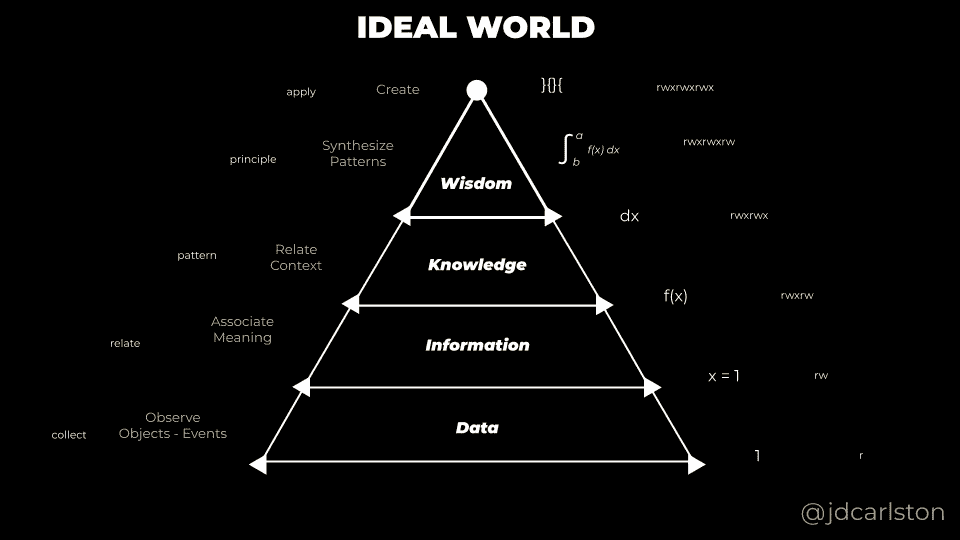
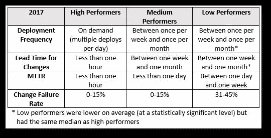
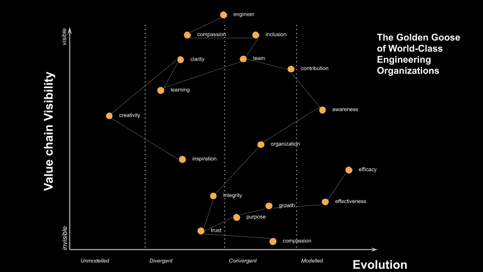

# 什么是世界一流的工程？

> 原文：<https://medium.com/nerd-for-tech/what-in-the-world-is-world-class-engineering-de966cdf7c0d?source=collection_archive---------1----------------------->

## 我们能测量“世界级”吗？世界级的工程师、团队和组织有什么特征？—第一部分

*   [阅读第二部分](https://jdcarlston.medium.com/what-in-the-world-is-world-class-engineering-part-2-4b384c74dc19)

就在新年前，我工作的公司宣布了一项所有权变更。当我和我的朋友们思考随着事情的发展可能会发生什么变化时，我想弄清楚有人提到的一个特别的习语。

我们如何才能抓住要点，定义什么是“世界级工程组织”？乍一看，我们如何开始测量一些不精确和定性的东西？

> 什么样的属性使某样东西成为世界级的？

# 我想更深层次地理解“世界级工程”的语言。

我认为意义和理解是我们语言和头脑中的关系运算符的结构。

为了赋予意义，我需要**数据**，产生意义的第一步是将值和对象分类到潜在相关的桶中。研究和科学探索始于**数据**阶段——但这不是终点。

数据帮助我了解情况。当我在其中分配属性时，它变成了**信息**。将许多属性放置在一个桶或精神空间内，帮助我将其转化为**知识。能够应用和覆盖其他地方的空间可以建立智慧。**

我自己版本的 DIKW 金字塔

这就是拉斯·阿科夫(以及其他人)所说的迪克夫金字塔。这是一个方便的思维地图，经常在系统理论中使用，以建立更好的理解和探究。这不是一个完美的模型，但我发现它有助于将理论转化为实践。

在[我自己的概念](https://docs.google.com/presentation/d/1hxUHkZvEV46LfZTSikAaDD8J8L_wkic7K9YL87sXUPM/edit?usp=sharing)中，我在顶部添加了**创造**作为金字塔的最终目的。这允许我们在任何面向目标的过程中近似和测量某种形式的有效性。我还添加了数学关系和事件语言来帮助我可视化这个过程和学习空间。

在这种情况下，我们希望能够创造具有特定特征的工程师和工程组织，但我们还不知道这些是什么。

# 从定义术语开始

当我开始研究一个新课题时，我通常会从定义术语开始。我希望将概念分解成更小的部分，尽可能具体、可论证和可证伪的东西。我先尝试用理性的方式去深入。请记住，用数学术语来说，合理化就是将某物降低到最低水平。

实际上，我去字典里查“世界级”和“工程”这两个词。我试图为每一个至少下三个定义。

## 世界级的/ˈˌwərld ˈˌklas/形容词

> (1)(指人、物或活动)世界上最好的，世界上最好的。(2)具有世界上最高的水平(3)在世界上名列前茅；杰出；臭名昭著。

## /ˌenjəˈniriNG/名词

> (1)有关引擎、机器和结构的设计、制造和使用的科学和技术分支。(2)工程师的工作或职业。(3)巧妙地工作以实现某事的行为。(4)将科学知识应用于设计、制造和使用发动机、机器和结构的实际目的

# 综合定义和意义

我综合了工程学的第四个定义。我记下了我对每个人的感觉。

我对“世界级”的第一印象是，这是一种说法，感觉有点滑。在这种情况下,“阶级”一词也可能被误解为贵族义务，并在某些方面(即使不是所有方面)产生一些有问题的影响和社会历史。我认为意识到这一点很重要。

这一切让我想找到更好的术语，并迭代和深入定义更多的特征。

我还注意到，我非常认同“工程”的第三个定义(*巧妙工作以带来某种东西的行为*)，它给我的印象是优雅。我意识到我的合成版本更准确。我努力寻找能引导我找到更多可测量的量或方法的语言。我认为重要的是要注意到工程包括技术和科学过程。

# 做笔记以供参考

我记下一堆相关的单词，并做一些个人自然语言处理。如果我想建立一个系统，以某种方式自动化评估世界级工程的过程，我可以稍后对此进行形式化。我看得更深一点，直到我对自己的定义感到更满意。我发现像这样的词:

*   有效、有用、优质、杰出、高排名、获奖、五星
*   设计，建造，引擎，机器，创造，应用，科学，技术，结构

一旦我这样做了，我就在一个[文档](https://docs.google.com/document/d/1GAgNXSBIPvvusEaTJRVEBNZCJxi55YVuWDrtc8xSRz8/edit?usp=sharing)中记下并提炼单词和定义。

# 获得外部视角

这些定义开始变得有些有趣了——*杰出的*可能是可以衡量的。*有用的*和*有效的*也可能是——表示某人/某事达到了目的或取得了结果。这是可以衡量的，有一个明确的目标。排名靠前的在某种程度上绝对是定量的。

我快速浏览一些看起来有用的链接。我保留了一些看起来最相关的:

*   **敏捷的 12 项原则** [https://www . Agile alliance . org/Agile 101/12-Principles-behind-the-Agile-manifesto/](https://www.agilealliance.org/agile101/12-principles-behind-the-agile-manifesto/)
*   **成为世界级工程师的途径**[https://www.engr.psu.edu/worldclass/](https://www.engr.psu.edu/worldclass/)
*   **什么造就了世界级的工程师**
    [https://medium . com/building-creative-market/What-Makes-a-World-Class-Engineer-557 cc 6d 717 cc](/building-creative-market/what-makes-a-world-class-engineer-557cc6d717cc)

# 展开讨论并认真倾听

我扩展到我的朋友和同事。我们的讨论带来了许多不同的想法。

# 确定兴趣点:

*   通过**负归纳和反模式**可以定义世界级的工程:

*瀑布，知识孤岛，低容错，低心理安全*

*   **快速有效地编码和部署迭代:**

小规模、快速、频繁的迭代和追溯(敏捷)。迭代变更可以使用软件领域的[加速](https://itrevolution.com/book/accelerate/)指标来衡量。

加速精益软件和 DevOps 的科学:建立和扩展高绩效的技术组织

## **对人充满热情**

出色的工程师了解人们的需求、优势和局限。他们有同情心和同理心，对一般生活有着无拘无束的好奇心。

## **经济焦点**

低 WIP，强大的优先化方法(精益)。[深度工作](https://www.calnewport.com/books/deep-work/)和[这是精益](https://thisislean.com/)是这方面很棒的书籍推荐。了解开发中的业务和现金流问题。

## **数据驱动**

与任何科学努力相似的品质——可重复，可证伪。利用[混沌工程](https://www.oreilly.com/library/view/chaos-engineering/9781491988459/)的原理。(科学)

## **对工作所需工具的深刻理解**

对新事物的认知有助于领先而不是落后。谨慎采用新技术。

## **对眼前问题的广泛理解**

高水平的领域知识和意识。[领域驱动设计](https://www.domainlanguage.com/ddd/)。

## 坚实的**学习者心态**

热情，有原则，乐于改变，有道德。我想我可能至少要写一整篇关于学习者心态的文章。那里有很多。关于这个主题的一本书是《第五项修炼》。

## 包容并能与他人合作愉快——团队合作者**团队合作者**

有团队精神的人会减少羞耻感，重视不同的投入。他们寻求共同的兴趣，寻求每个人的不同观点——从团队中经验最少的成员到最有经验的成员，跨越行业和学科。他们很有同情心和同情心。[敢于领导](https://daretolead.brenebrown.com/)对团队球员有很多很好的建议。

> Pluralsight 的 [**工程文档为一些人可能称为世界级工程的内容提供了一些非常好的指导。**](https://drive.google.com/file/d/1ot2G8tVK_eBIO5noCOmosqD3l99Eo8H0/view)

# 定义潜在需求

从那里，我确定了相关的人类需求(从非暴力沟通感觉和需求清单中)，我认为任何称职的工程师或工程组织都应该能够解决这些需求。

我使用[需求列表](https://www.cnvc.org/training/resource/needs-inventory)来帮助我理解不同人群的故事和感受。这些需求在人类中很普遍。他们帮助我归纳和发现“世界级”工程可能引发的共同思路和感受。

*   同情、信任、诚信、包容、贡献、灵感、意识、成长、学习、创造力、功效、效率、参与、清晰、目标。(这是一个很大的数字，但我可以稍后缩小范围。)

# 定义重要的品质(品质属性)

在定义需求的过程中，我对成功的重要品质有了更深的理解。我使用 Q[quality Attributes](https://en.wikipedia.org/wiki/List_of_system_quality_attributes)(即“能力”)来理解并开始衡量一个系统的总体目标。质量属性(和[质量属性场景](https://docs.google.com/presentation/d/1GgyaDnXs6LK0AYD9IWZRrOCnWkJMQTsYtMd0Eg2groo/edit))是我的架构工具箱中的一个重要工具。它们让我了解我可能在行为上寻找什么，建立可能值得注意的启发，甚至开始了解我可能开始测量的方法，最重要的是，证伪“世界级”

我通常会选择 3-5 个质量属性来衡量任何给定的系统。

*   适应性、自主性、可信度、稳定性、弹性

# 显示

这个过程帮助我记录，分解术语，概念化我的想法，分析价值观的语言学，并确定这个领域的基本原则。

将事物分解成组成部分的过程可能会让我们进入学习的**信息**阶段，可能会让我们涉足**知识**，但不会让我们深入到“为什么”(**智慧**)的领域。

当我开始充实我的想法时，*世界级的*作为一种模范行为开始看起来像是对许多人有用的东西，不管他们来自哪个国家、阶级或信仰——一个全世界的人都会认可并认为非常有用的应用程序。

通常，当我经历这个过程时，想法开始在我脑海中打转。我记下一些不断出现在我脑海中的东西。

# 模范行为

想起了一些我崇拜的世界名人。玛格丽特·哈米尔顿、格蕾丝·赫柏、史蒂夫·沃兹尼亚克、尼古拉·特斯拉、阿达·洛芙莱斯、伦勃朗、达芬奇、宾根的希尔德加德、阿基米德。强烈的认同感和思想的多样性是我脑海中的一个共同主题。

这些人对自己的身份和立场都很坚定和自信。他们都是博学的人，对许多学科都有影响。我从世界各地不同的文化和学科中寻找思考工程的其他方式。他们的价值体系可能会有很大的不同，世界级，在其最高的理想形式，将意味着能够解释和翻译。

# 回顾

我开始从概念上联系一切——经历和人。

我上面包含的来自宾夕法尼亚州的链接定义了 [**七个典型属性**](https://www.engr.psu.edu/worldclass/) :

> 扎实的基础、广泛的技术、全球参与、道德、创新、优秀的合作者和有远见的领导者

我之前和同事的研究让我对这七个属性有了更深的理解。然而，它们似乎还远远无法衡量。我已经把它们结合成一个更完整的理解，我脑海中有一些模型，我可以把它们作为历史上和我日常同事中的世界级工程师的例子。

作为一名工程师，我决定写一个关于每个属性的单行 IAM 故事:

*   我每天使用工作所需的工具练习我的技能
*   我紧跟 T2 的新技术
*   我采用**数据驱动**方法进行评估
*   当我构建系统时，我意识到全球关注的问题、挑战和差异，并提高对我在世界上的地位的认识
*   我选择做某件事是基于它在更广泛的道德背景下的价值，而不是对我个人的好处或回报
*   我**打破常规进行创新性思考**并以新颖的方式减少技术债务
*   我热衷于理解其他观点和**心智模型**
*   我关注自己和他人的**感觉和感官**。
*   我满足自己和他人的需求，并感到有必要欣赏他们的个性和共性
*   我**拥抱异议**并检查错误**而不感到羞耻**或责备
*   我在原则上有坚实的基础，并通过练习科目的深度和广度考试获得洞察力。(*我的知识和技能是“M”型的。*)
*   对于我是谁和我要去哪里，我有一个强烈的愿景和身份

# 定义后续步骤

在我的下一篇文章中，我将开始推断团队和组织层面的属性。请继续关注第二部分。

我将使用我的[质量属性场景画布](https://docs.google.com/presentation/d/1fpSdvbO8toVzJJIsENNb5pV9Uk-dypV3MrNbByz0l4M/edit#slide=id.ga85e345a72_0_0)来提出量化世界级工程师质量的指标，以及我们在组织中衡量他们的方法。

我已经开始构建一个[沃德利地图](https://docs.google.com/presentation/d/1zturYs_IeqHXeEwFAxTkqpLq8BTU_YRlpkmhnlA-Fz0/edit#slide=id.g7956e7d49c_0_112)来帮助我理解和想象更广阔的思想市场中的语言和进化空间。我们看看会有什么结果。

从那里，我可以开始根据我概述的场景进行潜在的系统测试。那些系统测试将帮助我们在前进的过程中为“世界级工程”的成功度量确定一个 MVP。

# 规划

请注意，所有这些初步/计划工作不会超过几天。建立一个输入、评估和报告系统需要更长的时间。

希望我们能提出一些可测量的或启发性的方法。当我们完成的时候，我们肯定会对世界级的工程习语有一个更一致的理解。

# 相关链接

*   世界一流工程到底是什么？-第二部分
*   [自我实现型人的特征](https://www.verywellmind.com/characteristics-of-self-actualized-people-2795963)
*   [自我实现](https://en.m.wikipedia.org/wiki/Self-actualization)
*   [信任是一个 Jenky 状态机](https://jdcarlston.medium.com/trust-is-a-jenky-state-machine-95e4663588fd)

一如既往，让我知道你在这里或者在 [twitter](https://twitter.com/jdcarlston) 上的想法。