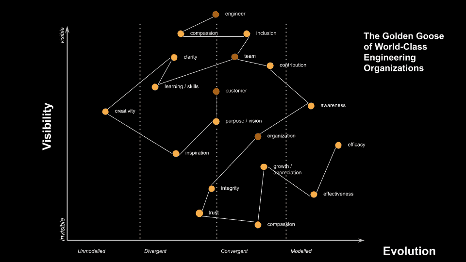
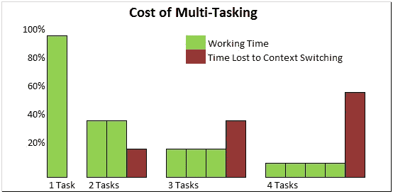
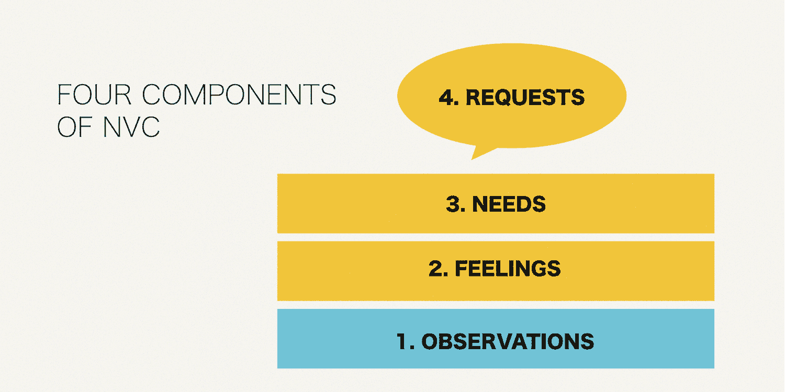
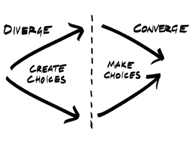
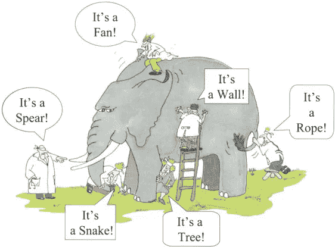
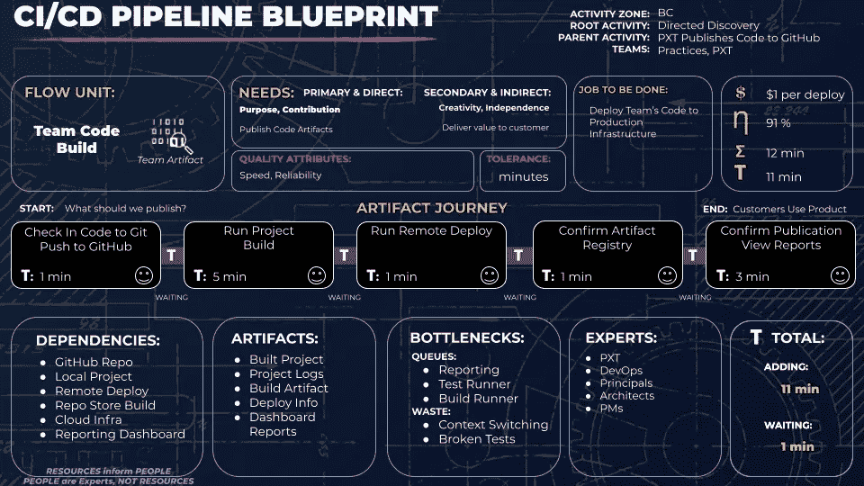
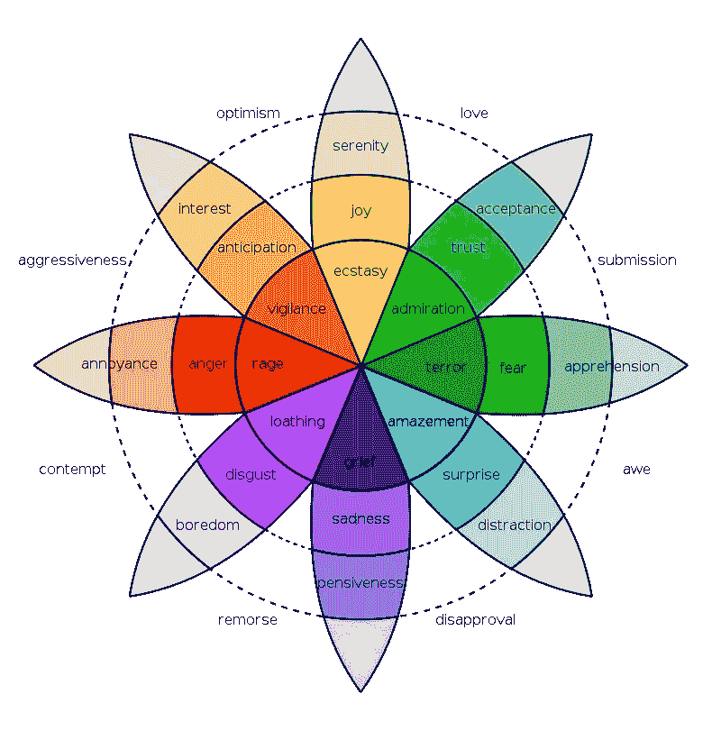
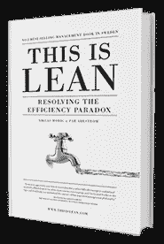

# 什么是世界一流的工程？—第二部分

> 原文：<https://medium.com/nerd-for-tech/what-in-the-world-is-world-class-engineering-part-2-4b384c74dc19?source=collection_archive---------10----------------------->

## 人类需要满足的复杂性

*   [阅读第 1 部分](https://jdcarlston.medium.com/what-in-the-world-is-world-class-engineering-de966cdf7c0d)
*   [阅读第三部分](https://jdcarlston.medium.com/what-in-the-world-is-world-class-engineering-part-3-7c4ccde0b454)

世界级工程的金鹅

# 获得可测量的

在我的[上一篇文章](https://jdcarlston.medium.com/what-in-the-world-is-world-class-engineering-de966cdf7c0d)中，我开始分解工程中描述“世界级”的定义、属性和陈述。

世界级的工程是不是像测量研究书 [Accelerate](https://itrevolution.com/book/accelerate/) 里的度量那么简单？我肯定地认为，证据表明这些措施让许多工程师和组织走在了游戏的前面。(见下图。)

加速精益软件和 DevOps 的科学:建立和扩展高绩效的技术组织

*   **部署频率**
*   **变更的提前期**
*   **平均恢复时间**
*   **改变故障率**
*   [**在制品限制**](https://en.wikipedia.org/wiki/Work_in_process) 在一个 [**团队**](https://agilevelocity.com/lean-economics-101-the-power-of-wip-limits/) 和 [**组织**](https://www.scaledagileframework.com/improving-strategic-investment-impact-by-limiting-portfolio-wip/) 层次也浮现在脑海里。

WIP 限制降低了多任务处理的成本

所有这些指标在任何工程系统中都是关键的性能指标。(在这篇文章的后面会有更多关于这些的内容。)

也就是说，有一些**品质**支撑着鼓励特殊行为的工程组织和团队的成功。

卓尔不群是一个不断变化的目标，但这并不意味着它不值得努力，即使是为了它自己。

上面的[加速](/slashdeploy/book-review-accelerate-92ebc00f4354)指标和 WIP 限制让我们得以交付，但它们与价值的联系仅隐含在团队所做的 ***研究*** 中，以了解客户的旅程、他们要做的工作，以及对底层 ***需求的分析*** ，这些需求激励业务领域中的迭代、行为和事件。

> 需求是价值硬币的另一面

## 理解 ***需要*** 在世界一流的体系中传递价值。

# 从哪里开始传递价值？

当计划策略或评估一个计划时，管理者通常从目标和/或要做的工作开始。

基于[上一篇文章](https://jdcarlston.medium.com/what-in-the-world-is-world-class-engineering-de966cdf7c0d)中的定义，我认为世界级的组织是在全球范围内排名很高，对数百万(如果不是数十亿)人有效的组织。为了做到这一点，我们必须直接与**人类需求**联系起来，以传递价值**。**

> 与人类经历相关的需求是有限的，是所有人类共有的需求。

当我完成第一部分的练习时，我意识到需求是我发现的最重要和最有趣的属性。

需求逻辑的一个令人满意的地方是，它可以帮助我们聚焦和组织我们的目标和 [**从**需要满足**的角度来看**](https://hbr.org/2016/09/know-your-customers-jobs-to-be-done) 要做的工作。它可以简化我们对质量的看法，并优先考虑对我们的业务重要的事情。换句话说，它帮助我们建立了一种*、连贯和衔接的方式——*【改善】(change for better)实际上有很多关于**需要教给我们的东西。****

**作为人类，我们有一套基本的需求，在任何时候我们都试图满足这些需求。熟悉 [**马斯洛层次结构**](https://www.simplypsychology.org/maslow.html) 的人都知道我在说什么。人类有五种基本需求。从这里开始。**

**

[马斯洛的人类需求层次理论](/@kilianmarkert/the-ultimate-driver-of-human-motivation-on-the-quest-of-finding-meaning-fb6652e851f4)** 

**稍微更细微的需求可以被指定为大约 80-100 个术语，正如我在[上一篇文章](https://jdcarlston.medium.com/what-in-the-world-is-world-class-engineering-de966cdf7c0d)中提到的由 [Marshall Rosenberg](https://en.wikipedia.org/wiki/Marshall_Rosenberg) 编辑的[非暴力沟通需求清单](https://www.cnvc.org/training/resource/needs-inventory)中提到的。**

**

[https://www . the little black coffee cup . com/journal/make coffee better](https://www.thelittleblackcoffeecup.com/journal/makecoffeebetter)** 

**[*维克多·弗兰克尔*](https://en.wikipedia.org/wiki/Viktor_Frankl) *还有一本很厉害的书叫* [*人对意义的追寻*](https://www.brainpickings.org/2013/03/26/viktor-frankl-mans-search-for-meaning/) *如果你想进一步探索基础性的自我实现和人类的需求。***

# **组织实现**

**我认为组织是人类可以(也应该)用来满足需求的工具。简而言之:**

****人类** →使用→ [**组织**](https://www.humanocracy.com/) →满足→ **需求→** 交付→ **价值****

**而不是把我们自己束缚在官僚机构的默认思维模式中:**

****机构** →使用→ **人类→** 增加→ **利润/影响****

**官僚主义将机构视为主要推动者，将收入而非价值交付视为最终目标。我个人认为这造成了我们在当今文化中看到的许多问题。官僚主义是一种非个人化和非人性化的组织原则，在此基础上建立我们的业务和现实。这首歌平克·弗洛伊德唱得很好。)**

**墙上的另一块砖，机器上的另一个齿轮**

**诚然，对人类而言，官僚制度已被证明比工业革命前某些帝国社会的所有权和控制权模式更好。**

**当商业和更广阔的市场与人类需求更紧密地结合在一起时，市场会变得更有同情心。我们衡量成功的标准很重要。将收入和组织结构与被满足的需求联系起来是一种实践，这种实践可以通过一个简单的规则从根本上改变这个星球，就像改变[康威的](https://en.wikipedia.org/wiki/John_Horton_Conway) [生命游戏](https://playgameoflife.com/)中的初始配置一样。**

**围绕*需求*理解和组织机构有助于我们在快速变化的环境中对人类行为做出更好的预测。它还帮助我们关注并进一步将[关怀伦理](https://en.wikipedia.org/wiki/Ethics_of_care)融入我们的日常选择中。它开始将我们的模式从交易型转变为转型型。**

**我们如何思考和应对变化对地球至关重要。需求帮助我们更紧密地与重要的生命周期保持一致——让生命得以延续。**

# *****我们可以学习并做得更好*****

**[*Humanocracy*](https://www.humanocracy.com/)*是我想到的一本书。我在经营一个关于它的读书俱乐部时，从它那里找到了一些例子。在那本书里，作者提出了这些操作问题:***

## **官僚机构会问:**

> **我们如何让人类/团队更好地为组织服务？**

## **[人道](https://www.humanocracy.com)问:**

> **什么样的组织能够激发并值得人类所能给予的最好的东西？**

## **你认为哪个问题更具可持续性，为什么？各有什么优缺点？**

**我将把它留给读者作为练习。**

**组织和任何一个人一样需要存在的理由。**

****人类** →使用→ [**组织**](https://www.humanocracy.com/) →满足→ **需求→** 交付→ **价值****

**我不会冒险说:**

> *****组织为人类提供多少服务就存在多少。*****

**他们赋予个人权力。我们都可以问自己，与我们结盟的组织如何增强我们的能力，以及他们在现实中增强了谁的能力。**

**我们分配权力和金钱的方式改变了需求得到满足的方式。收入是衡量一个更广泛的组织内权力流动性的指标。收入的分配会改变决策。知识的广度和深度都必须反映在我们的账本和权力分配中。**

**认为人们存在是为了服务于“组织”是一条客观化的危险道路，在哲学和实践上，在存在主义的层面上，在不平等的权力动态方面，如主人-奴隶和主人-奴隶关系。企业通常仍以这种方式组织。**

**同样，我在这里有很多想法，[敏捷联盟、](https://www.agilealliance.org/)以及其他许多组织也是如此。**

**研究最初的敏捷宣言背后的驱动力和“为什么”,以及此后所做的所有工作，对我们都有好处。系统理论家和技术专家已经谈论和研究它很长时间了。**

**只要有一点点意愿，我们就能组织一个更加多样化的思想市场，并在我们创建的每一个组织中建立更有效的权力结构。**

## **感到好奇**

**让我们打开黑匣子，帮助企业与人类的基本需求联系起来，并在实践中通过科学、工程和技术将其与我们的物理现实联系起来。这让我们更接近*“世界级工程”的理想***

# **沃德利绘制人类需求图**

**所有这些让我们开始思考我在上一篇文章中选择围绕工程师、团队和组织绘制相关人类需求背后的“为什么”。**

**最初，我使用的是**未建模-发散-收敛-建模**轴。如果使用得当，发散/收敛是一种非常有效的实践。**

**

[https://tutorial . math . lamar . edu/classes/calcii/convergence of series . aspx](https://tutorial.math.lamar.edu/classes/calcii/convergenceofseries.aspx)** 

**在任何时候，参与谈话的每个人都可能只看到大象的一部分[这就是问题所在。](https://www.peacecorps.gov/educators/resources/story-blind-men-and-elephant/)[沃德利地图](https://www.youtube.com/watch?v=IJcLmoKR6v8)可以帮助我们看到更多方面，并指出系统和市场中的紧急约束。*更多信息请点击*[*learnwardleymapping.com*](https://learnwardleymapping.com/)*或* [*此处*](/wardleymaps/on-being-lost-2ef5f05eb1ec) *。***

****

**尿毒症的大象:氧化应激是尿毒症心血管疾病的统一概念。肾脏国际 62 5(2002):1524–38。G. Renee Guzlas，艺术家**

**我认为“团队合作”和“组织化”甚至“制度化”的理想是人们学习、建模、预测、决策和协作行动的进步。我认为这就是为什么[世界级组织](https://docs.google.com/presentation/d/1zturYs_IeqHXeEwFAxTkqpLq8BTU_YRlpkmhnlA-Fz0/edit#slide=id.g7956e7d49c_0_709) *的金鹅(以及我对* [*的动机*](https://docs.google.com/presentation/d/12PiffUPPB_WqKdE8laLdAs1iQBE_OzLJRGwMslFIZ8M/edit#slide=id.gbb2fa27cf9_0_93) *，我将在下一篇文章中谈到)*会变成这样*。***

**

世界级工程迭代的金鹅** 

## **对需求的推理帮助我看到了一个更大的关于团队和组织的故事**

> **精益方法中推荐理解、建模和映射*需求*。**
> 
> **沃德利地图帮助我在一个想要维持、约束和支持自己的组织中可视化需求和依赖性的重要性——以保持敏捷。**

## **我很乐意就此进行进一步的讨论。**

**我创造的东西最后看起来有点像鸟(一只鹅！这是一个快乐的惊喜，讲述了一个更大的故事。**

**脱离任何一个单独的部分都会使工程师的需求脱离团队、组织或客户的需求。**

**商业(以及任何一种相互关联的人际关系)依赖于同情和信任。用各种方式传达这一点似乎是一项重要而有价值的努力。**

# **所有的需求都相互作用**

**如果我们把这只金鹅切开，我们就不能再下蛋了(传递价值)。这个比喻似乎很恰当，也很有纪念意义。*真是* [*神话*](https://en.wikipedia.org/wiki/Mythopoeia) *也是！***

**我现在对某些概念有了一个更大的“为什么”,并能以更完整的方式讲述它们的故事。**

**我意识到在某种程度上，我可能想弄清楚这些组件与人类需求进化的关系。通过这个练习，我意识到这种映射也可能成为自我实现的有用工具。我可以看到马斯洛的层次结构是如何在自助圈里用于个人发展的。**

**[苏珊·阿尔蒙](https://twitter.com/susanalmon?lang=en)一直在敏捷社区内围绕*倦怠*的概念开展工作。希望我们将来能一起工作，在更广泛的意义上帮助他人满足个人需求。我认为倦怠、焦虑和抑郁都是长期需求得不到满足的结果。**

**[卡特彼勒·斯威特尔](https://www.catswetel.com/)围绕业务指标、道德和职能提出了许多经过深思熟虑的意见。我真的很感激在我的地图制作之旅中遇到了这么多了不起的人。**

# **衡量满足的需求**

**有些人测量参与度或 NPS，并进行行为分析。其他人接受采访——或者以上所有方式。我相信有很多方法。与此同时，如果你通过一个需求系统来衡量**流动效率**，你可以用一些简单的度量标准走得很远。**

**我认为流动效率可能是衡量满足需求的最佳方式之一。但是你的流动单位是什么以及你如何测量它很重要。**

# **能衡量的就能完成**

**看看下面的蓝图。在右上角有价值转移( **$** )、流程效率( **η** )、总时间(σ)、吞吐量( **T** )和等待时间( **τ** )的度量。**

****

**CI/CD 管道精益蓝图**

# ****加速指标& WIP 限制****

**在蓝图上面的加速度量**部署频率**相当于 [**流动效率**](https://jlcinternational.com/what-flow-units-do-you-want-to-use/) 。**

***(图中未显示其他加速指标。)***

**[加速](https://itrevolution.com/book/accelerate/)还包括部署出现问题的频率(**变更失败率**)以及从故障中恢复需要多长时间( **MTTR** )，但这些都没有显示出来。**变更的交付时间**衡量前期生产能力。一般来说，交付周期越短，变化越小。小而快的变化创造更多的利润。**

****WIP 限制**帮助我们专注于流程，并减少花费在上下文切换上的时间。在周期结束之前，在管道上交付可能是您唯一的工作进展。**

**为了做出小的改变，你必须充分了解客户想要迭代的东西，以提高他们在自己的工作管道中的满意度。**

# ****$:价值转移****

> ****价值转移 **=一个周期每流量单位的客户费用******

*******成本* :** 衡量价值转移。如果你能把一美元数额与一项活动和一次顾客旅行联系起来，那就去做吧。你越能把某些东西与财务价值交付联系起来，你的公司对市场条件的反应就越敏捷。了解通过您的系统转移客户的收益和成本。使用仪表板来帮助您做到这一点。先在纸上猜测。(这通常并不容易，但即使试图计算它也能极大地增强你的业务运营)。****

# ******花在倾听和分析顾客行为上的时间******

*****(一段时间内 X 个客户的客户满意度)*****

*******倾听&同情* :** 同情帮助我们根据他人的感受采取行动。衡量你倾听客户的时间。找到花费在工程上的时间的平衡。能够设身处地为客户着想的工程师将会走得更快。****

# ****在需要的时候建立****

****我敢打赌，花在倾听他人(直接或间接)上的时间有一个健康的比例。还不确定这是什么，但我的直觉告诉我这是衡量成功的最重要的标准之一。与你的客户和领导保持密切联系可以减少其他类型的耦合。****

****你可以用你的感觉和综合感受(见下面的[图表](https://martecgroup.com/using-plutchiks-wheel-of-emotions-in-market-research/))来确定在这个过程中的任何一个给定点需求得到了多大程度的满足。可以绘制一条路径上的情感流，并根据这些情感的向量来确定需求是否得到满足。我希望在建立我的博客时能进一步探索这一点。****

********

****[罗伯特·普卢奇克的](https://en.wikipedia.org/wiki/Robert_Plutchik) [情感之轮](https://martecgroup.com/using-plutchiks-wheel-of-emotions-in-market-research/)****

# ****τ: **吞吐量=流量单位*** 周期时间****

*****(流量单位平均起搏)*****

****吞吐量是指您能够在系统中移动多少个流动单元来完成一个价值传递周期。****

****流动单位几乎可以是任何东西。从精益的角度来看，以人为本([以人为中心的设计](https://en.wikipedia.org/wiki/Human-centered_design))通常是好的。****

****在上面的蓝图中，我们从工程团队开始，并意识到他们每天都在构建工件。团队是一个流动的单元，工件也是。****

****客户可以是流动单位。感觉和需求也可以是流量单位，也可以是管道流量上的[温度计。已满足和未满足的需求会导致不同温度或向量的不同感觉——我有一个想法是，它们可能会通过改变粘度来阻碍或停止流动。当我进一步探索这个领域时，我希望能够解决细节问题。](https://jlcinternational.com/what-flow-units-do-you-want-to-use/)****

# ******等待**价值转移所花费的时间****

****流动单元在状态变化之间等待的时间会影响流动效率。这段时间可能会产生积极或消极的影响。****

## ****直接需求和间接需求可以在上下文中相互制约****

****例如，如果你在发型师那里，你可能是流动单位。你需要社交，也需要美丽。既能满足这两种需求又不会赶你出门的造型师更有可能获得你的业务。这不仅仅是人的吞吐量，而是满意度的吞吐量。****

****相比之下，在车管所，你可能想尽可能快地进出。****

# ****η:流动效率——增值时间****

*   ****你花了多少时间为客户的旅程增加价值？****
*   ****有几个步骤？****
*   ****他们在两个步骤之间要等多长时间？****

> ****η=σ$**值/** τ吞吐量****

# ****衡量什么是重要的****

****当你对人们感同身受，并为他们规划出一条快乐的道路时，你就能开始发现是什么在他们的日常工作中阻碍了他们。然后你就可以开始迭代改进了。****

> ****有效性=效率 x 人类需求****

****当你认真对待它时，资源优化可能比流程优化效率低得多，甚至在某些情况下成本更高。重复和测量*需求*有助于你看到这一点。****

****美国和其他地方的医疗系统是资源效率陷阱的一个典型例子，在那里人们的生命危在旦夕。人们因为围绕资源优化的盲点而死去。这种形式的优化甚至会导致全球成本飙升。不要相信我的话，阅读 [This Is Lean](https://thisislean.com/) 了解更多关于如何优化流量和保持低成本的信息。这本书看似简单，却值得一读。****

****

这是精益书皮**** 

****在第 3 部分中，我将研究一些世界级工程在组织层面上的更多例子。****

****我计划提供一些真实世界的例子和更多关于如何组织实现和可持续发展的实际想法。如果我们想成为世界级的，我们必须合作做出更加综合的预测和决策。****

*   ****[阅读第一部分](https://jdcarlston.medium.com/what-in-the-world-is-world-class-engineering-de966cdf7c0d)****
*   ****[阅读第三部分](https://jdcarlston.medium.com/what-in-the-world-is-world-class-engineering-part-3-7c4ccde0b454)****

*****如果您对*[*Twitter*](https://twitter.com/jdcarlston)*有任何评论、更正或想法，请随时联系我。*****