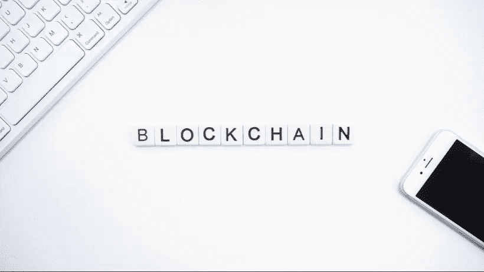

# 什么是区块链甲骨文，如何成为区块链甲骨文？

> 原文：<https://medium.com/nerd-for-tech/what-is-a-blockchain-oracle-and-how-to-become-one-3fbc209f335c?source=collection_archive---------2----------------------->

智能合约正变得越来越受欢迎，而且有一批人正在构建越来越复杂的合约。什么是智能合同？本质上是一个合同转换成区块链上的一段代码。从天气风险产品到欧元掉期合约，凡是你能想到的，很可能都有一家公司支持这种合约。为什么智能合约越来越受欢迎？他们提供了传统合同无法提供的效率。在智能合同下，支付的交换在几分钟内发生，也许几秒钟，而在传统合同下，支付结算可能需要几天。然而，智能合约有一个众所周知的问题，它被称为 Oracle 问题。简单来说，运行在区块链(on-chain)上的智能合约对真实世界没有概念，它需要链外(不在区块链上)的系统或 Oracles 为它提供来自真实世界的外部数据。为什么区块链不能直接从外部数据提供商那里获取数据？区块链设计原则不适合获取主观数据或验证外部数据的质量。区块链很难获得一条简单的信息，如比特币的价格是多少，计算量很大。

## 什么是区块链甲骨文？

那么到底什么是区块链甲骨文呢？嗯，它是一个软件和硬件解决方案链外(也称为节点)，为智能合约提供它需要的来自现实世界的数据。它是如何获得这些数据的？它从外部数据源获取数据。来自外部来源的可靠数据的一个例子是来自 TraderMade API 的外汇和 CFD 数据。现在您可能会问，智能合约用户如何确保来自 Oracles 的数据是可靠和准确的？因此，Chainlink 等公司围绕智能合同建立了基础设施，以确保数据的可靠性和准确性。企业如何做到这一点？首先，他们使用分散的 oracle 网络集群来获取数据，而不是依赖一个节点或 Oracle 来满足数据需求。其次，他们使用排名系统来突出好的和差的数据提供者，以确保用户可以通过查看过去的性能历史来做出明智的决定。

## 如何成为区块链甲骨文？

成为区块链 Oracle 很简单 Oracle 或 Node 需要找到智能合约正在寻找的可靠数据源，然后在智能合约需要时将数据提供给智能合约。许多公司通过让个人设置节点，使得在链上写数据更加容易。你可以通过阅读[什么是链节节点操作符来获得更多的信息？](https://blog.chain.link/what-is-a-chainlink-node-operator/?_ga=2.94271252.829628262.1637577033-461165470.1611764244)一旦您与这样的公司建立了一个节点，您就可以从数据提供商那里获得您的数据。如果你有兴趣为智能合约提供外汇和 CFD 数据，你可以[注册 TraderMade](https://marketdata.tradermade.com/signup) 和[获得你的 API 密匙](https://marketdata.tradermade.com/myAccount)。我们每月免费提供 1000 个请求，足以测试您的 Oracle 或节点。接下来剩下的就是开始设定价格，以满足智能合约的要求。

如果您需要更多关于成为节点提供商或将数据纳入您自己的智能合同的信息，请联系我们。我们总是乐于接受建议和想法，所以不要犹豫[联系](https://tradermade.com/contact)。