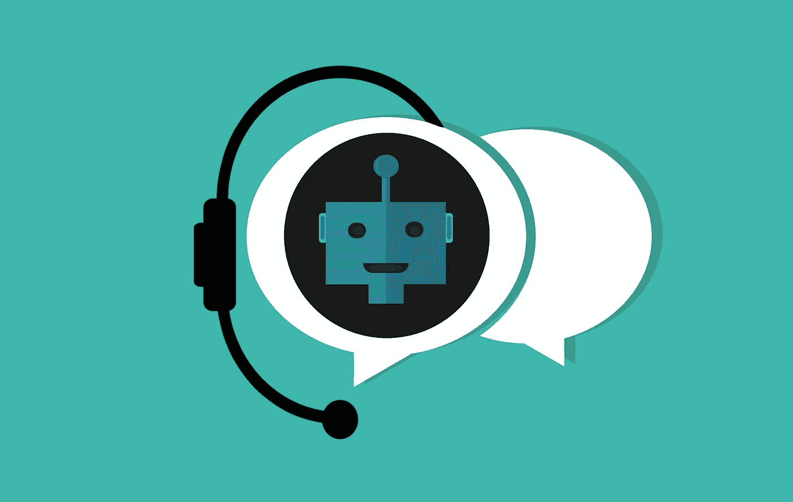
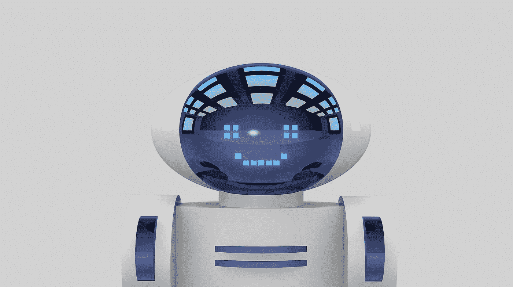
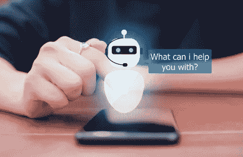
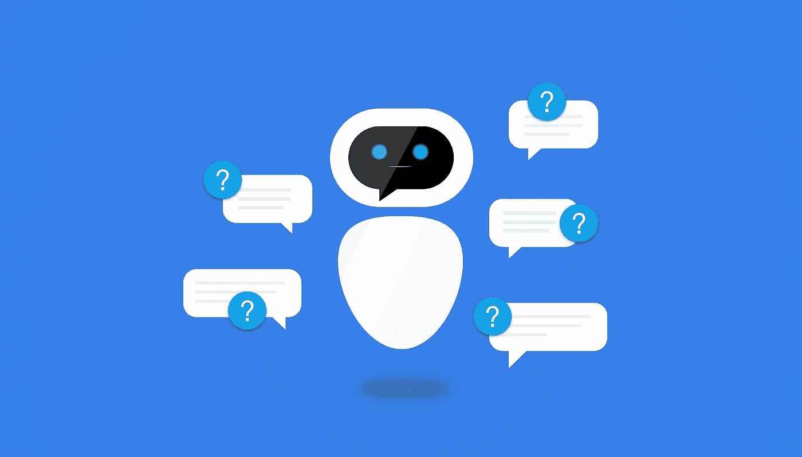
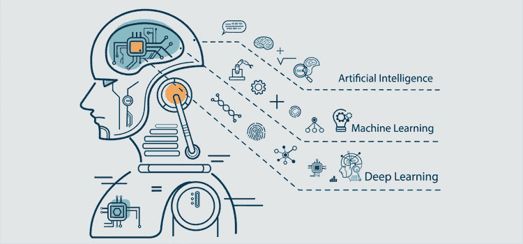
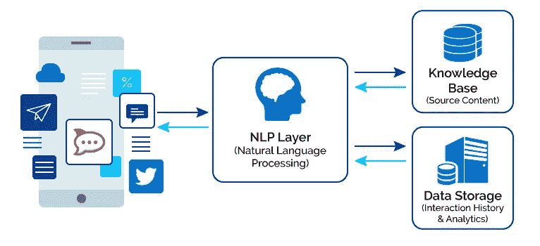
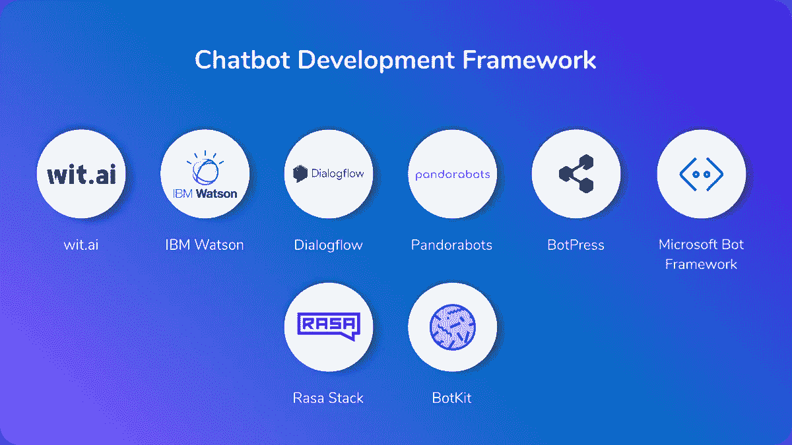

# 什么是聊天机器人？

> 原文：<https://medium.com/nerd-for-tech/what-is-a-chatbot-e583eb90ad1d?source=collection_archive---------14----------------------->

在本教程中，您将全面了解聊天机器人，它们是什么，它们是如何产生的，它们的类型，以及它们如何解决您当前的问题？

# 先决条件

对网络技术及其应用充满热情。

# 介绍

从日出到日落，技术不断发展，试图让地球上的人类生活更加轻松。这种愿望的主要部分来自于人们简化生活、合理管理时间、精力和资源的需要。我们从口头交流开始，现在我们有了聊天应用和聊天机器人。我们可能使用过聊天应用，也对它们的操作有一定程度的了解。但是我们真的知道聊天机器人是什么以及它们是如何工作的吗？如果没有，让我们跳出来揭开它的神秘面纱。

# 什么是聊天机器人？

聊天机器人

聊天机器人的基本形式是一种计算机程序，它将人类自然语言作为输入，对其进行处理，并生成人类可解释的结果。

维基百科将聊天机器人归类为一种软件应用程序，用于通过文本或文本到语音进行在线聊天，而不是提供与真人代理的直接联系。

聊天机器人接受文本或语音等人类输入，构建、合成并处理这些输入，以产生人类简化的响应，从而为您分解这些输入。

# 聊天机器人简史

聊天机器人历史

在个人电脑问世之前，开发了最早的聊天机器人。它是由约瑟夫·韦岑鲍姆在 1966 年建造的，被麻省理工学院人工智能实验室命名为伊莱扎。

Eliza 评估了传入的输入关键字，然后根据一组标准激活它们。多个聊天机器人仍然利用这种方式产生输出。

随后，其他虚拟助手已经开发出来。第一个引入聊天助手的是苹果公司的 Siri。这个想法很受欢迎，在谷歌推出谷歌安卓助手后不久。之后，Cortana 从微软应运而生。

考虑到这一点，智能扬声器已经被创造出来，使人类和聊天机器人之间能够进行语音交互。另一类聊天界面是亚马逊的 Alexa & Google Home。

# 聊天机器人的使用案例

聊天机器人用例

以下是聊天机器人主要用于的领域:

1.  回答问题和询问。
2.  预订活动/演出的门票。
3.  查找产品、检查库存和推荐商品。
4.  构建卓越的客户体验。
5.  处理退货和换货请求。
6.  确认订单和跟踪运输。
7.  有效收集客户反馈。
8.  将客户请求分配给支持团队。
9.  用有趣的对话推销产品。
10.  与客户进行问答、促销和竞赛。
11.  介绍新产品/服务。
12.  成为个人购物助理等。

# 聊天机器人之前—服务台系统

服务台系统

在聊天机器人出现之前，用于支持客户的传统系统是服务台。服务台系统用于为查询机构、产品或服务的用户提供及时的支持。

这种传统系统接收来自世界各地好心用户的来电，并将它们分配给一系列可用的支持代理。

不管这些公司对他们的客户做出了什么样的同情姿态，在解决他们独特的问题时，服务台系统面临着不可避免的挑战。并且这个问题与满足所有用户投诉的延迟和资源不足相关联。以下是服务台系统在满足所有客户需求时面临的困境。

# 服务台系统的问题

交通堵塞

服务台系统很有帮助，但不足以满足世界人口不断增长的需求。这种限制经常导致顾客的争吵和不满。由于服务台系统的这种不利情况，企业、产品和服务经常受到许多客户的负面评价，这些客户在使用服务台解决他们的问题时有不愉快的经历。

客户所面临的恼人情况的主要原因分类如下:

*   等待时间是难以忍受的，特别是对于迫切希望解决问题的客户，服务台经常无法及时处理所有的来电和电子邮件。
*   资源的高使用率经常成为公司的一个问题，因此公司只能支付几个服务台助理的费用。
*   高昂的基础设施成本也很快成为一种负担。随着业务的扩展，不可避免地需要扩大工作空间和购买新设备。
*   人类的局限性，每天的工作时间即将结束，工人们总是渴望回家照顾家庭和其他生活事务。

# 聊天机器人解决方案

聊天机器人解决方案

在开发一个计算机程序来处理大量帮助台限制的过程中，我们发现 90%来自客户的投诉通常是常见的。因此，需要开发一个计算机程序来帮助客户解决平台上最常见的问题，这就是聊天机器人的由来。

标准是聊天机器人必须能够接受人类自然语言的用户输入(文本或语音)，处理并返回人类可以理解的响应。据此，聊天机器人被开发并部署在网络和移动平台上。

# 聊天机器人的类型

聊天机器人一般有两种类型:传统的 ***或基于规则的聊天机器人和对话式或基于人工智能的聊天机器人*** 。

基于规则的聊天机器人利用树流设计模式来帮助访问者提问，而不是人工智能。换句话说，聊天机器人将通过后续问题帮助你找到正确的解决方案。所有的结构和回复都是预先定义好的，这样对话就在你的控制之下。

基于人工智能的聊天机器人通过消息应用程序模拟用户与自然语言的对话。它使用机器学习和自然语言处理(NLP)来提供接近人类的对话体验。

例如，一个用户名 Mark 希望在网上商店订购一件商品，对于基于人工智能的聊天机器人来说，对话将以这种方式进行。

*马克:你好，我想下订单。*

*聊天机器人:嗨，马克，我想我可以帮你，你想点什么？*

马克:一台 Macbook Air M1 笔记本电脑。

聊天机器人:好的，这是可用选项的列表(1、2、3 等)。

马克:太好了，你能把第二个放在购物车里吗？

聊天机器人:你想要 8GB 内存的还是 16GB 内存的？

*Mark: 8GB 会很棒！*

聊天机器人:好的，它已经被添加到您的购物车中了，您还需要其他物品吗？或者您想结账吗？

马克:不，我没问题，请结帐。

聊天机器人:好的，你的订单已经核实了，详情已经发送到你的邮箱了。你还需要我们商店的其他帮助吗？

马克:不，我很好。

聊天机器人:谢谢你和我们一起购物，祝你愉快！

# 聊天机器人和人工智能

聊天机器人生态系统

人工智能中的聊天机器人构成了一个舒适的利基(AI)。更确切地说，他们有几个类似的 AI、ML 和 DL 组件。以下是单词的定义。

人工智能(AI)与人或动物显示的自然智能相比，是机器显示的智能。

机器学习(ML)是人工智能和信息学学科，它使用数据和算法来逐步提高学习过程的准确性，并复制人们的学习方式。

相比之下，深度学习(DL)是一种人工智能(AI)机制，模仿人脑在数据处理和决策过程中的功能。

现代聊天机器人在人工智能、机器学习和深度学习中使用自然语言处理(NLP)、自然语言理解(NLU)和自动语音识别(ASR)等技术。

自然语言处理(NLP)或语言学处理，特别是计算机如何处理和分析大量自然语言输入，是语言学、计算机科学和人工智能的主题。

自然语言理解(NLU)或自然语言解释是人工智能中自然语言处理的子主题，处理机器阅读理解。

自动语音识别(ASR)是使用基于计算机硬件和软件的技术来识别和处理人的声音。它用于识别一个人说过的话，或者验证在系统中说话的人的身份。

# 聊天机器人如何工作

聊天机器人架构

一个基本的聊天机器人将从用户那里获取自然输入，这可能是文本或语音数据，并将其发送到系统中。聊天机器人的自然语言处理(NLP)立即开始合成输入数据。实际上，这种自然语言处理由非结构化数据组成，然后由自然语言理解层进行结构化。

自然语言理解找出实际的用户意图，并查询聊天机器人系统的知识库，从而返回适当的答案。

在聊天机器人系统中，如果用户的输入是基于文本的，自然语言理解(NLU)被用来组织数据。而如果是语音输入，则使用自动语音识别器(ASR)。

# 聊天机器人框架

聊天机器人框架

聊天机器人框架是一个开发平台，附带了从头构建聊天机器人所需的软件代码和库。

有了聊天机器人框架，你可以从头开始构建自己的聊天机器人，其中一些框架只需要一点点编码技能。下面是聊天机器人框架及其各自链接的列表。

1.  [Wit.ai](https://wit.ai/)
2.  [IBM 沃森](https://www.ibm.com/watson)
3.  [对话流](https://dialogflow.cloud.google.com/)
4.  [潘多拉机器人](https://www.pandorabots.com/)
5.  [机器人新闻](https://botpress.com/)
6.  [微软 Bot 框架](https://www.botframework.com/)
7.  [Rasa 堆栈](https://rasa.com/)
8.  [僵尸工具](https://botkit.ai/)等。

# 结论

总之，在本教程中，我们已经了解了很多关于聊天机器人的知识。我们已经讨论了聊天机器人的基本细节，它们是什么，它们如何操作，以及它们如何改善你的生活和业务。

CometChat 致力于让您对新技术保持敏感，尤其是在网络和移动通信方面。您还可以在我们的[网站](https://app.cometchat.com/signup)上查看我们的最新产品，如 ChatAPI 或 [ChatSDK](https://www.cometchat.com/pro) 。

# 关于作者

福音达林顿是一个远程全栈 web 开发者，在**前端**和 **API** 开发方面多产。他对开发高级的、响应迅速的 web 应用程序非常感兴趣。他目前正在探索改进渐进式网络应用的新技术。福音书达林顿目前是一名自由职业者，他利用空闲时间指导年轻人如何在生活中获得成功。他的爱好包括发明新食谱、写书、写歌和唱歌。你可以通过 [LinkedIn](https://www.linkedin.com/in/darlington-gospel-aa626b125/) 、 [Twitter](https://twitter.com/idaltonic) 、[脸书](https://www.facebook.com/darlington.gospel01)或 [GitHub](https://github.com/Daltonic) 联系我。

# 了解 API 更多信息的主要资源

*   聊天机器人的历史和演变。
*   聊天机器人使用案例:25 个现实生活中的例子。
*   基于规则和基于人工智能的聊天机器人。