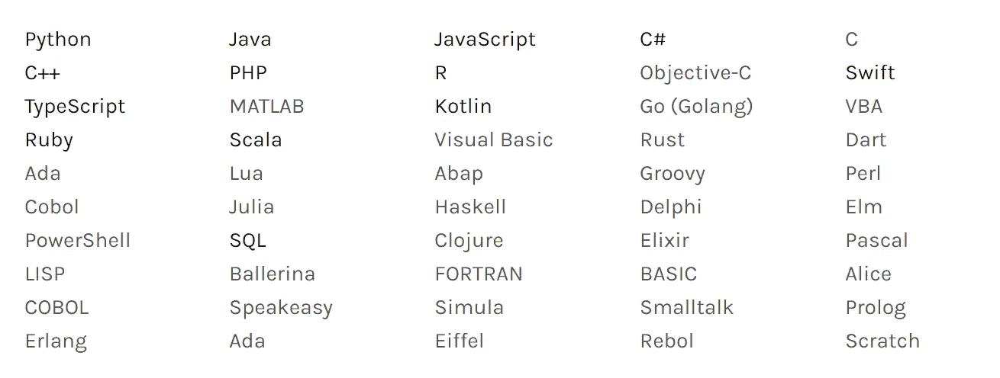
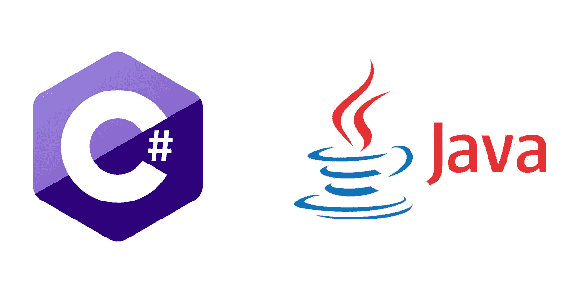
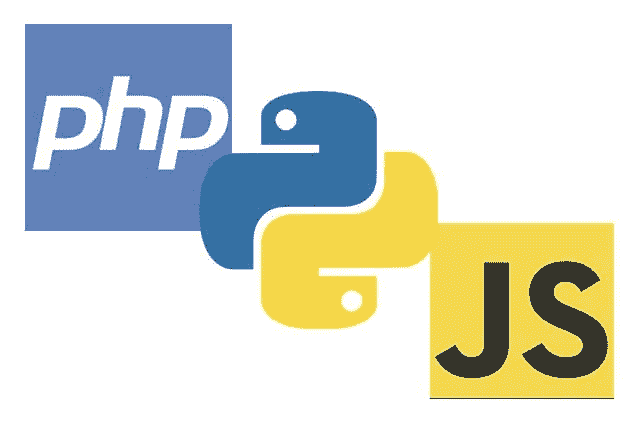
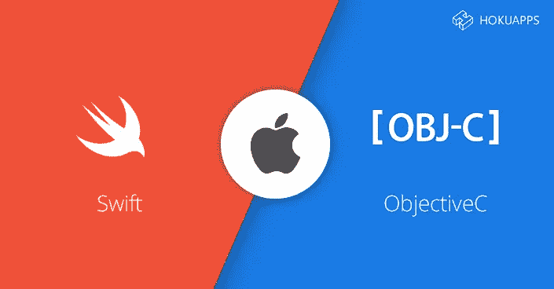

# 什么是计算机编程语言？

> 原文：<https://medium.com/nerd-for-tech/what-is-a-computer-programming-language-6cea72217a16?source=collection_archive---------17----------------------->

你如何与其他人类交流？使用基于人类的语言，类似地，计算机编程语言被用来**与计算机**通信。但是计算机如何理解编程语言呢？计算机只理解语言的一部分，叫做“**二进制**”。将编程语言翻译成二进制被称为“**编译**”。

根据维基百科*的说法，现存的大约有 **700 种编程语言**，但是其中只有十几种是受欢迎的并且非常重要。*

**

*流行语言*

*计算机不理解英语、印地语、马拉地语或泰米尔语，但理解由 0 和 1 组成的二进制，因此需要某种人机交流的中间方式，我们称之为编程语言。*

*如今有几十种编程语言，但下面列出的这些编程语言是最重要、最相关和最受欢迎的:*

1.  *Python 2。Java 语言(一种计算机语言，尤用于创建网站)*
2.  *Ruby on Rails*
3.  *超文本标记语言*
4.  *Java Script 语言*
5.  *C*
6.  *C++*
7.  *C#*
8.  *目标-C*
9.  *服务器端编程语言（Professional Hypertext Preprocessor 的缩写）*
10.  *结构化查询语言*
11.  *迅速发生的*

*中级语言更接近于机器，但是高级语言处理更多的事情。有些语言对于机器来说是高度优化的，而有些对于程序员来说是非常灵活的。高级编程语言经过了很好的优化，解释型语言更加灵活，对于初学者来说可能是更好的选择*

*Java 遵循“一次编写，随处运行”的原则，因为它运行在可以在各种不同硬件上运行的虚拟机上。Java 是创建 Android 应用程序最受欢迎的选择。在大公司中，它既用于内部，也用于网站。*

*C#是微软的 Java 变种，它提供了一些比 Java 更多的特性，但缺乏多平台支持。*

**

*java 和 c#*

***Java** 和 **C#** 是两种非常相似的高级编程语言，有更严格的规则来防止编程错误。这些语言的代码需要“**编译**成**低级代码**。这两种语言在大公司、大项目和需要优化代码的项目中都很流行。*

*根据 [Stack Overflow 的 2020 年开发者调查](https://insights.stackoverflow.com/survey/2020#technology-programming-scripting-and-markup-languages-professional-developers) , **JavaScript** 目前是全球最常用的**语言** (69.7%)，其次是 HTML/CSS (62.4%)、SQL (56.9%)、Python (41.6%)和 Java (38.4%)。JavaScript 用于创建动态网页和现代网络应用程序。JavaScript 可以在所有的浏览器中运行，这使得它成为学习语言的好选择*

*PHP 是一种服务器脚本语言，也是制作动态和交互式网页的强大工具。PHP 是一个广泛使用的、免费的、高效的替代品，可以替代微软的 ASP。 **PHP 7** 是最新的稳定版。*

**

*Python、PHP 和 JavaScript*

*Python 是一种**通用语言**，经常在网站之外使用。Python 的目标是可读性很强，这使得它变得简单，初学者也能理解。Python 具有使用**缩进**的不寻常特性，这使得代码看起来**不那么杂乱**。Python 是一个很好的选择，除非你有一个特定的目标，只适合其他语言。*

*由于 C 语言对编程语言的影响，它可以被认为是现代编程语言的祖先。*

**

*快速和客观-C*

***Objective-C** 是苹果为**MAC**和**iphone**创建应用程序的 C 的变种。它仍然需要程序员做某些现代语言自动处理的事情。苹果**最近**推出了 **Swift** ，作为 Objective-C 的一个更简单的**替代方案**，Swift 提供了各种**初学者友好的**功能，比如可以看到你的代码实时执行的操场。如果您对创建 iPhone 应用程序感兴趣，Swift 是一个不错的选择。*

## *如何选择学习一门编程语言？*

*一旦你考虑了你想要学习、构建和贡献什么，你就可以开始考虑学习哪种语言了。在选择编程语言时，总会有一些选项，而且仍然会有困惑——稍后会有更多的解释。然而，每种语言都有长处和短处。*