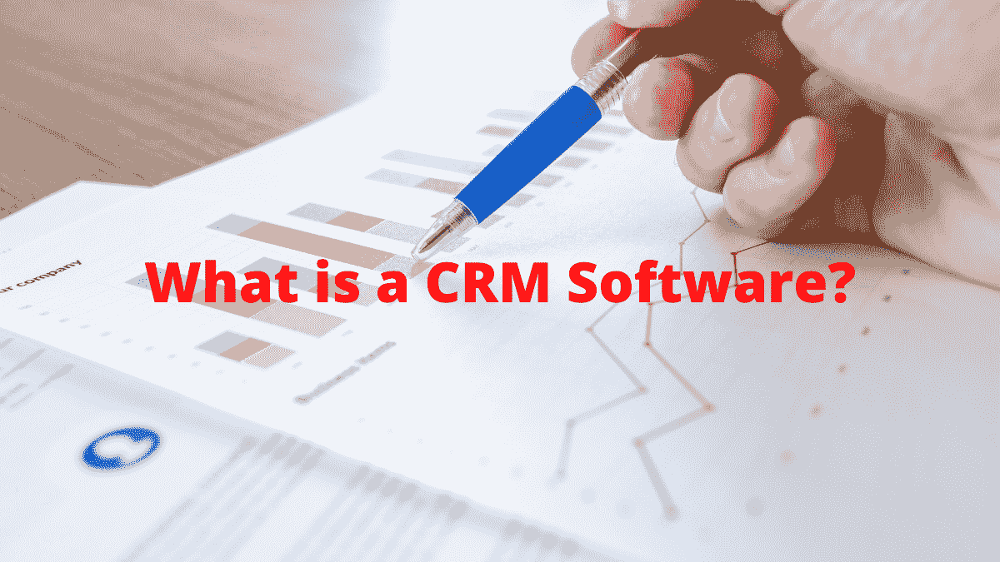

# 什么是 CRM 软件？

> 原文：<https://medium.com/nerd-for-tech/what-is-a-crm-software-ae4ade18a5de?source=collection_archive---------21----------------------->

# CRM 市场规模是多少？

2020 年，全球客户关系管理市场规模为 437 亿美元，预计到 2028 年将增长到 965 亿美元，2021 年至 2028 年的复合年增长率(CAGR)为 10.6%。(来源— [Grandview research](https://www.grandviewresearch.com/press-release/global-customer-relationship-management-crm-market) )。

根据该研究，该行业的一个主要趋势是通过软件即服务(SaaS)模式部署客户关系管理(CRM)套件和解决方案的需求不断增长。

# 什么是 CRM 软件？

**客户关系管理**是 CRM 的全部。CRM 软件允许公司改善与客户的业务关系。它是一个连接组织中不同部门的平台，从营销到销售到客户服务，将他们的笔记、活动和指标组织到一个集中的系统中。

**客户关系管理**是管理现有、过去和潜在客户转化的过程。

# 为什么 CRM 软件很重要？

一个 CRM 软件为你提供了一个清晰的前景和客户概述。它就像一个集中的仪表板，您可以在一个地方看到一切，可以向您显示客户以前与您的关系、他们的订单状态、任何悬而未决的客户服务问题等等。

# CRM 软件有哪些不同的类型？

市场上有两种不同类型的 CRM 软件。

1.  云 CRM 软件
2.  内部 CRM 软件

**1。云 CRM 软件**

云 CRM 软件由 CRM 软件服务提供商在其服务器上构建和维护。客户可以通过浏览器在互联网上访问该服务，从而允许客户在其组织的计算机上不安装任何软件的情况下部署该服务。

**2。内部 CRM 软件**

内部 CRM 软件通常涉及在客户办公室设置服务器，并在客户组织的本地网络上的所有必需设备上安装软件。这将升级、定制和维护的责任完全交给了客户组织中的客户 IT 部门。

# CRM 软件的优势

**1。充当中央数据库**

CRM 软件为您的销售和营销团队充当了一个集中的数据库，可以在一个地方更新所有的潜在客户信息。世界上任何地方的销售和营销团队的任何人都可以通过共享位置访问它。CRM 软件帮助销售团队找到他们需要的关于潜在客户的信息，以跟进和完成交易。

**2。跟踪与潜在客户的所有接洽**

内部和外部的所有参与都可以通过 CRM 软件进行跟踪。这使得销售代表可以跟踪客户旅程的所有部分，包括每次互动、电子邮件、电话、面对面会议等

CRM 软件提醒销售和营销团队按时跟进潜在客户。

**3。仪表板**

CRM 软件提供报告功能，如销售仪表板和报告。这些仪表板和报告允许销售团队更好地自动化和管理他们的渠道、交易和联系人。销售代表可以评估他们的个人表现，跟踪他们的目标，并可以做必要的工作来达到他们的销售目标。

销售主管可以使用 CRM 软件仪表板和报告来监控每个销售代表的个人表现，他们还可以看到销售渠道和成交。

**4。绝不错过后续**

通过使用 CRM 软件，你将永远不会错过与你的前景跟进。CRM 软件跟踪您的所有潜在客户活动，这有助于销售代表知道他们何时需要跟进特定的潜在客户。CRM 软件提醒销售人员及时跟进潜在客户。这将有助于销售团队增加赢得更多交易的机会。

**5。销售预测**

CRM 软件允许销售经理通过使用销售仪表板和报告来预测他们的销售。由于潜在客户的每一项活动都会被跟踪，因此销售主管可以提前做出明智的决策，从而制定未来几个月的销售预测。

**6。移动无障碍**

带有移动应用程序的 CRM 软件可确保您的销售团队无论身在何处都能获得所有必要的 CRM 数据。现场销售代表可以访问附近客户的任何信息，参加会议，并通过登录 CRM 软件，随时通过他们的移动应用程序输入更新，轻松更新销售团队关于客户的任何新信息。

**7。CRM 软件提供更好的客户支持。**

一个 CRM 软件可以帮助你提供你的客户正在寻找的高质量的客户服务支持。您的客户服务支持代理可以快速检查客户订购了哪些产品，并且他们可以获得每次沟通的跟踪记录，以便为客户提供他们正在寻找的答案。

**8。轻松集成**

CRM 软件提供了与第三方应用程序集成的选项。CRM 软件供应商指导您如何根据您的需求将其与其他应用程序集成。

# 如何选择最好的 CRM 软件？

**1。业务需求**

选择 CRM 软件最重要的因素是确保它适合您的业务需求，并解决所有的销售挑战

**2。预算**

一旦您了解了业务需求，就可以确定适合您销售预算的成本。查看维护、实施和支持方面的隐性成本。

**3。易于使用**

请选择一个简单易用的 CRM 软件。如果 CRM 软件使用起来很复杂，就不要选择它。

**4。查看客户评论**

在你做决定之前，通过做一个简单的调查和访问可信的评论网站，查看客户对 CRM 软件的评论。

# CRM 市场统计

1.  65%的销售专业人员使用 CRM，97%的人认为销售技术“非常重要”或“重要”(来源— [LinkedIn](https://www.linkedin.com/business/sales/blog/sales-ops/why-virtual-selling-and-data-are-the-future-of-b2b-sales) ，2020)
2.  员工人数超过 10 人的组织中有 91%使用 CRM 软件(来源:Grandview research)
3.  65%的品牌在最初五年内采用了 CRM 系统。(来源— [Capterra](https://www.capterra.com/customer-relationship-management-software/user-research-infographic) )
4.  82%的组织使用 CRM 系统进行销售报告和流程自动化(来源— [软云](https://softclouds.com/index.html))
5.  2020 年，65%的销售组织使用 CRM 系统，而 2018 年为 59%。(资料来源— [Salesforce](https://www.salesforce.com/content/dam/web/en_us/www/documents/research/Trends-in-Sales-Ops-Salesforce-Research.pdf) ，2020 年)

*原载于 2021 年 5 月 30 日 http://digitalthoughtz.com***。**