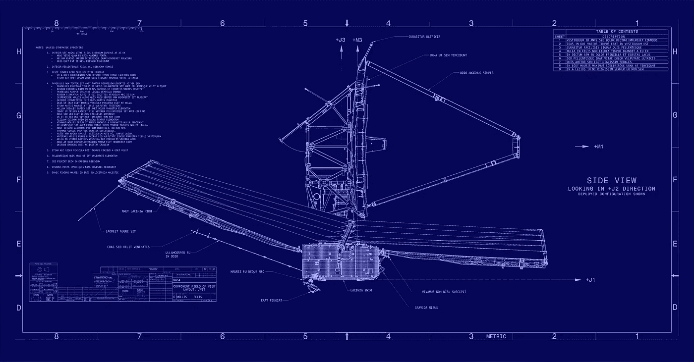

# 什么是拉格朗日点，为什么我会在 2021 年开始听到它们？

> 原文：<https://medium.com/nerd-for-tech/what-is-a-lagrange-point-and-why-will-i-start-hearing-about-them-in-2021-36b8d111c7fc?source=collection_archive---------1----------------------->

在太空中停放东西是极其困难的。来自太阳、行星和银河系的引力影响如此之多，以至于如果我把我的千年隼停在一个地方，然后去购物，就会有东西开始拉它，它就会开始朝那个方向漂浮，让我在停车场徘徊几个小时。