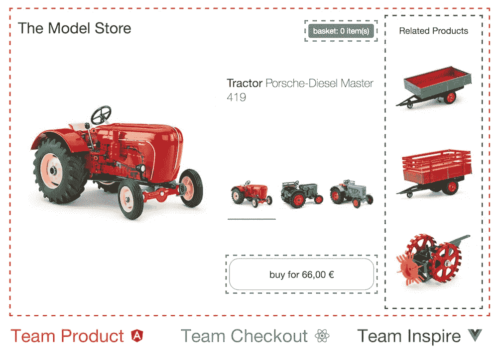

# 什么是微前端？

> 原文：<https://medium.com/nerd-for-tech/what-is-a-micro-frontend-1f66729315ad?source=collection_archive---------5----------------------->

简单地说。

由[诺德伍德主题](https://unsplash.com/@nordwood?utm_source=unsplash&utm_medium=referral&utm_content=creditCopyText)在 [Unsplash](https://unsplash.com/s/photos/responsive?utm_source=unsplash&utm_medium=referral&utm_content=creditCopyText) 上拍摄的照片

# 介绍

我已经见过几次术语'[微前端](https://micro-frontends.org/)，但我并不真正知道它是什么。所以我踏上了一段旅程去找出它到底是什么。

微前端的概念是基于这样一种思想，即 web 应用程序是基于功能的组合。所有这些特性可以由不同的团队拥有，他们对特性都有不同的想法，因为他们都有不同的任务。

# 核心理念

微前端 idealogy 的特点是一些核心思想。它们可以被视为构建微前端的指导方针。

*   **成为技术不可知论者。所有团队都应该能够更新和选择他们的堆栈，而不必与其他团队协调。**
*   **隔离团队代码**
    不要共享一个运行时环境，即使所有人都使用相同的框架。构建独立的应用程序，不依赖于共享状态或全局变量。
*   **设置团队前缀**
    在无法隔离的情况下，就命名约定达成一致。在 CSS、函数和存储中避免冲突，并明确它是谁的代码。
*   **尽可能使用本地特性** 如果不可能使用本地事件，尽量保持 API 简单。
*   建立一个有弹性的网站
    你的特性应该是有用的，即使 JavaScript 失败或者还没有执行。

这些核心思想中的大部分，如果不是全部，都是关于团队的，但是你也可以很容易地把它应用到个人项目中。虽然一开始听起来可能很奇怪。

# 页面构成

一个网页由多个组件组成。如果你计算所有较小的组件，你可能会有十个按钮，一个页脚，一个页眉，内容，等等。更全面地说，您可以将所有协同工作的组件定义为单个微前端。在一个简单的网店中，你会有“导航”、“购物车”和“产品”。

图片来自[https://micro-frontends.org/](https://micro-frontends.org/)

这些确实需要一些相同的数据，并且可以调用相同的 API 来获取这些数据。但是组件本身不需要有相同的框架。有些甚至可能是另一个父微前端组件的子组件。

对于组件之间的通信，你不能选择像反应状态这样的东西，因为孩子可能不会使用反应。但是所有这些组件都可以读写的一个东西是 HTML 属性。

# 个人项目

在大多数单人项目中，这样工作没有太多意义。这可能会很有趣，而且在使用多个框架的同时，您肯定会学到一些东西。

当你独自工作时，你会取得和在团队中一样的成绩。您将为项目的不同部分(如导航或产品页面)创建多个项目。你可以用更自然的方式而不是状态将它们连接在一起。

# 结论

我对微前端的想法很感兴趣，但我不愿意在任何实际项目中使用它。想法是有的，但还可以完善。虽然这篇文章只是简单介绍了一些基础知识，但是看看它是否会变得更加主流还是很有意思的。

在我看来，React 组件的使用和微前端一样好。但是我明白为什么这能在企业规模的应用中工作。如果你想了解更多，你可以查看官方网站[这里](https://micro-frontends.org/)。

感谢您的阅读，祝您愉快。