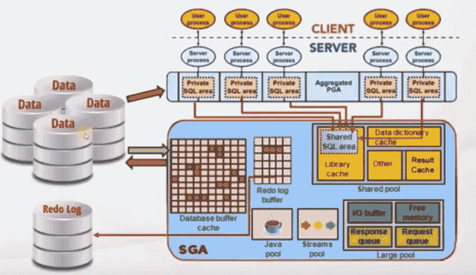
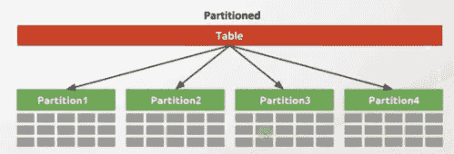
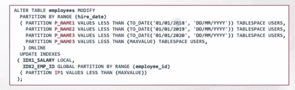

# Oracle 中的分区是什么？

> 原文：<https://medium.com/nerd-for-tech/what-is-a-partition-in-oracle-29f4d6dc5c2a?source=collection_archive---------2----------------------->

在这里，我们将了解 oracle 中的分区概念

oracle 中的表分区

**什么是隔断？**

*   当我们运行查询时，oracle 将检查查询结果是否已经存在于结果缓存中。
*   如果它不存在，那么是时候从内存中获取了。
*   此外，它需要一个适当的执行计划。
*   首先，它检查共享 SQL 区域是否有类似的执行计划。
*   如果没有，它将创建一个新的执行计划。
*   因为我们现在有了执行计划，所以它首先检查缓冲区缓存是否有与该查询相关的数据。
*   如果没有，就该去光盘了。
*   我们知道，我们的表数据存储在“块”中。当服务器转到光盘时
*   它有许多不同的读取光盘的方法。
*   大多数时候，它会读取一个表的所有块来查找一些数据。
*   如果表很大，这个操作的执行成本会很高。

Oracle 架构图

*   即使您为此创建了索引，有时这也不起作用。因为，您可能知道，索引是通过它们的 rowids 转到行的。
*   当您搜索某个范围的数据时，索引将不会如此有效。因为数据将位于许多不同的块中，并且对于每个块和行，服务器将搜索每行的索引并转到不同的块。
*   因此，这将是一个代价高昂的操作，数据库服务器不会这样做。
*   例如，如果您在 employee 表的 hire_date 列中有一个索引，并且如果您搜索一个单一的 hire_date，它将很好地与索引一起工作。
*   但是，如果您查询在某个日期范围内雇用的员工，它将不起作用。相反，它会读取所有的表，然后按日期过滤。
*   如果您的表非常大，您可能会在几分钟内得到这个结果，也可能需要几个小时。

表分区来源:google

*   Oracle 发布了一个名为“**表分区**的特性。分区意味着在物理上将一个表划分成更小的表。
*   例如，在我提到的查询中，我们可以根据 hire_date 列将表划分成更小的分区。例如，我们可以说，为 2018 年第一天之前的日期创建一个分区，然后为 2019 年之前的日期创建一个分区，如果您愿意，您可以创建更多分区。
*   您可以创建任意多的分区。
*   因此，当您插入一行时，例如，如果插入行中的雇用日期低于 2018 年
*   它被插入到相关的分区中。
*   如果 hire_date 在 2018 年以上 2019 年以下，那么它也会被插入到相关的分区中，这样继续下去。
*   因此，我们将把相关数据物理分组到子表中。但是你可以看到并触及这些分区

**分区对性能有什么影响？**

*   当我们在一个表上运行查询时，如果我们的查询搜索存储在一个分区中的重要数据，服务器将不会搜索该表的所有数据。
*   相反，它将只从一个分区读取。
*   假设，如果您的表有 100 个分区，而您的查询结果只有一个分区，那么您将获得比普通表读取快 100 倍的速度。
*   因此，如果您的表很大，您需要根据最常用的过滤器将它们划分成分区。

Oracle 支持多种分区方法:

*   **范围划分** —数据基于值的范围分布。
*   **列表分区**数据分布由离散的值列表定义。一列或多列可以用作分区键。
*   **自动列表分区** —通过为任何新的分区键值自动定义新的分区来扩展列表方法的功能。
*   **哈希分区** —对分区键应用内部哈希算法来确定分区。
*   **复合分区** —使用两种数据分布方法的组合。首先，通过数据分布方法一对表进行分区，然后使用第二种数据分布方法将每个分区进一步细分为子分区。
*   **多列范围分区** —当分区键由几列组成时的一个选项，后续列定义了比前几列更高的粒度级别。
*   **区间分区** —通过使用区间定义作为表元数据的一部分，为任何未来分区自动定义均分范围，扩展了范围方法的功能。
*   **引用分区分区** —利用现有父子关系的表。主键关系用于将父表的分区策略继承到其子表。
*   **基于虚拟列的分区** —允许分区键是一个表达式，使用表中的一个或多个现有列，并将该表达式仅存储为元数据。
*   **区间引用分区** —引用分区的扩展，允许使用区间分区表作为引用分区的父表。

**结论:**

*   对于分区，我们可以做的是，如果我们的表很大，并且有一个通用的过滤器，这意味着我们需要为特定的表或索引创建分区。
*   这将大大提高性能。好吧。
*   **通过只处理相关数据来提高性能**。
*   **通过独立分区的可管理性提高可用性**。
*   **通过适当存储数据降低成本**。
*   实现很容易，因为它不需要改变应用程序和查询。