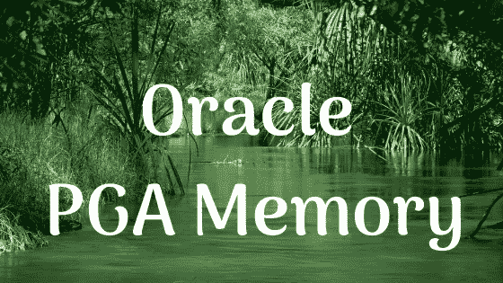
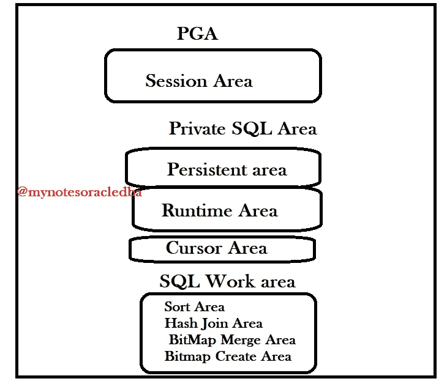

# 甲骨文的 PGA 是什么？

> 原文：<https://medium.com/nerd-for-tech/what-is-a-pga-in-oracle-2af7bd08bd9f?source=collection_archive---------2----------------------->

在这里，我们将了解 PGA 的组件

**Oracle PGA 内存**

**什么是 PGA？**

*   一个 PGA，是程序全局区的缩写，或者是私有全局区。
*   它是一个包含几个子区域的内存区域。与 SGA 不同，PGA 对每个用户都是私有的。因此任何其他用户都无法看到或触摸该存储区域。
*   在 PGA 中，有几个子存储区。正如你在图表中看到的

**PGA 组件**

*会话区、
*私有 SQL 区、
*光标区、SQL 工作区。

**会话存储区:**

*   第一个是会话存储区。当用户连接到数据库时，数据库会为该用户创建一个会话。
*   该会话信息存储在该区域中。
*   这里它基本上存储了会话的变量、登录信息、会话状态等。所以，如果你打开了不必要的连接，你应该知道它们在数据库中都有一些内存。
*   当你使用另一种语言如 Java 或。网络等。因为有时你忘记关闭连接，这会导致一些问题。
*   所以我们需要在你完成后关闭所有的连接。

**私有 SQL 区:**

*   它分为两个子区域。
*   持久区域和运行时间区域。

**I)持久区域:**

*   持久区域包含游标的绑定变量值。
*   在 Oracle SQL support 中，每个查询都被转化为数据库中的一个游标。
*   您可以将其创建为显式游标或隐式游标。
*   因此，这些游标中使用的绑定变量存储在这里，并在游标关闭时释放。另一个私有 SQL 区域组件是运行时区域。

**II)运行时间区域:**

*   它存储执行状态信息。其中包含我们是否开始读表，或者到目前为止我们读了多少百分比，或者我们是否从表中读完的信息。
*   PGA 中的下一个存储区是光标区。

**光标区域:**

*   该区域存储光标的信息。

**SQL 工作区:**

*   下一个内存区域是 SQL 工作区。
*   该区域用于操作从光盘返回的数据。
*   这个区域做这些种类的操作。正如我们所看到的，它分为 4 个子区域。
*   从光盘中读取的数据是按照查询的 order by、group by、roll-up 或 window 命令进行排序的。
*   从名字上我们很容易理解下一个是做什么的。
*   从光盘中读取的数据按照查询的 order by、group by、roll-up 或 window 命令进行排序。从名字上我们很容易理解下一个是做什么的。
*   他们进行**散列连接操作**，**位图合并和位图创建操作。**

**结论:**

*   PGA 的大小很重要。
*   如果我们为 PGA 分配较少的内存，将会降低性能。
*   为 PGA 分配大内存将显著提高性能，尤其是对于需要大内存的会话。
*   在这个博客中，我们将了解私有全局区域或编程全局区域的组成部分。