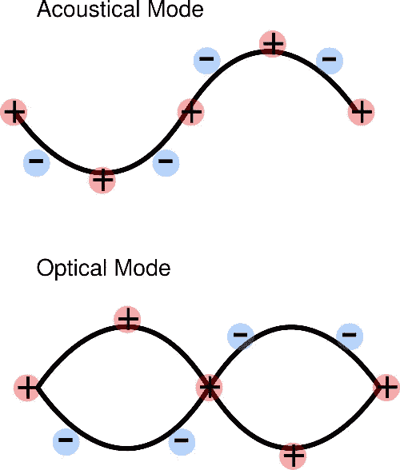
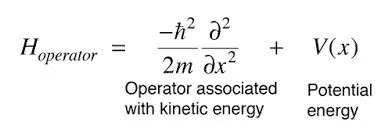
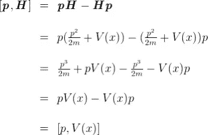
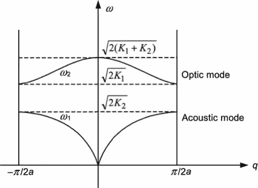

# 什么是声子？

> 原文：<https://medium.com/nerd-for-tech/what-is-a-phonon-6e098de4f404?source=collection_archive---------1----------------------->

## IUPAC 定义

> 晶格振动的量子力学处理中的基本激发。一种能量束，表现为能量为 h ν的粒子，ν是振动频率，h 是普朗克常数。

## 加热元件

在晶格中，当提供外部能量时，例如电磁能量辐射对材料的影响，将导致晶格内的原子振动。它们根据朝向彼此和远离彼此方向的能量量子振动。这种能量量子被称为光学声子。那些沿同一方向振动的原子被称为声学声子。

声子可以被视为热元素，因为它发生在量子力学状态下，振动导致类似于空气分子的运动。

## 哈密尔顿函数

粒子振动的解，无论是一维还是二维，都是用哈密顿能量算符求解的。哈密顿量是用动量和位置表示的算符或能量分量。

基本上是这样的表达:

> 作为算符的哈密顿量

> 哈密顿量作为系统的能量。这描述了哈密顿量与动量的可交换性。

> 晶格的力学是用哈密顿量算出或求解的。

## 布里渊区

你在这里看到的框架描绘了第一个布里渊区。存在许多声子能量波函数重复的布里渊区，它们在晶格的每单位长度上被段“a”分开。而“a”是晶格周期，晶胞的数量是晶格的单位长度除以晶格周期的比值。

## 声子

由于声子是一种量子化的能量，它可以被认为是热粒子。声子转移发生在原子之间。声子振动是根据附着在单原子分子上的弹簧中的势能和动能来确定的。在双原子分子中，振动引起两种溶液声振动和光振动。

# 更多细节请阅读麻省理工学院提供的材料科学课程。