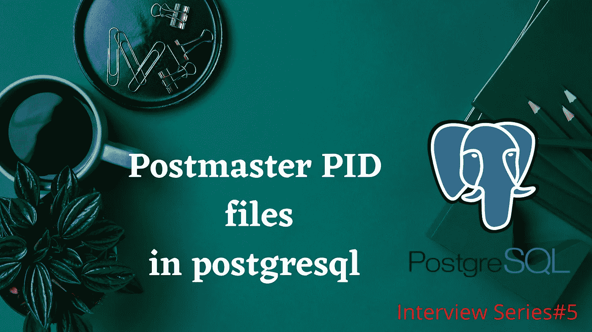

# PostgreSQL 中的 Postmaster PID 文件是什么？|采访问答

> 原文：<https://medium.com/nerd-for-tech/what-is-a-postmaster-pid-file-in-postgresql-interview-q-a-db27f657ce78?source=collection_archive---------2----------------------->

Postmaster 下的 PID 文件在 PostgreSQL 中使用



*   根据 PostgreSQL 架构，postmaster 是集群启动时启动的第一个后台进程。
*   它是所有其他后台进程的父进程。
*   如果任何其他后台进程失败，postmaster 会自动重启死进程。
*   它也作为一个听众工作。当客户端向服务器发出请求时，它首先会进入 postmaster 并执行语法和语义检查，一旦通过，就会产生一个新的连接，这个过程称为“ **Pgprocess** ”。
*   postmaster 作为父进程的监听器，所以它也被称为“**监督**”。

```
**ps -ef|grep postmaster**postgres 393 32729 0 22:28 pts/3 00:00:00 grep postmaster
```

**邮件管理员 PID 文件的用途:**

*   当群集启动并运行时，postmaster PID 文件驻留在数据目录中。
*   该 PID 文件用于捕获

1.当前邮局主管进程 ID (PID)，

2.群集数据目录路径、邮局主管开始时间戳，

3.端口号，

4.Unix 域套接字目录路径，

5.监听地址(IP 地址)

6.共享内存段 id。

*   当群集启动并运行时，捕获的 PID 文件详细信息被锁定。它保护另一个集群启动或运行访问相同的端口号或数据目录。

```
**$cd $PGDATA****$ls**base     pg_commit_ts  pg_ident.conf  pg_notify    pg_snapshots  pg_subtrans  PG_VERSION  postgresql.auto.conf  **postmaster.pid**
global   pg_dynshmem   pg_logical     pg_replslot  pg_stat       pg_tblspc    pg_wal      postgresql.conf
logfile  pg_hba.conf   pg_multixact   pg_serial    pg_stat_tmp   pg_twophase  pg_xact     postmaster.opts
```

要查看邮局主管 PID 文件:

```
**$ cat postmaster.pid****4693****/u01/pgdatabase/data****1615688485****5432****/tmp*********5432001 3604491****ready**
```

现在我刚刚使用 pg_ctl 停止了我的集群服务

```
**pg_ctl stop -mf**waiting for the server to shut down.... doneserver stopped
```

群集停止后，我们验证邮局主管 PID 文件是否已从数据目录中自动消失。

**总结:**

当群集服务启动并运行时，将自动生成邮局主管 PID 文件。

它是一个锁定文件，用于维护当前的集群详细信息，即不允许使用这些详细信息在同一端口或数据目录上运行另一个集群