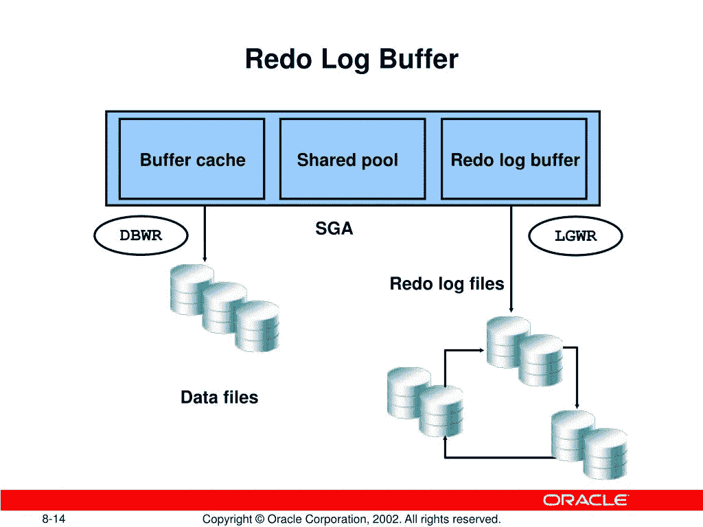

# 什么是重做日志缓冲区？

> 原文：<https://medium.com/nerd-for-tech/what-is-a-redo-log-buffer-47e83f4f5793?source=collection_archive---------0----------------------->

这里我们要了解一下 oracle 架构中的重做日志缓冲区。

什么是重做日志？

*   当我们通过 insert、update、delete、create、alter、drop 操作对表数据进行任何更改时。
*   当我们通过 insert、update、delete、create、alter、drop 操作对表数据进行任何更改时。
*   捕捉数据库一致性以维护更改是非常重要的。

来源:甲骨文

**为什么我们使用重做日志？**

*   如果您需要将数据库或表恢复到以前的状态，可以使用重做日志数据进行恢复。
*   DBA 可以执行这些恢复过程，但是作为程序员没有资格执行。
*   这些重做日志条目存储在 SGA 的重做日志缓冲区中。
*   重做日志缓冲区是存储这些条目一段时间的内存区域。

**SCN:**

*   当我们完成提交或缓冲区变满时，日志写入程序会为这些重做日志条目提供一个系统更改号，并将它们写入重做日志光盘中的重做日志文件。
*   它并不等待所有的缓冲区都被填满才进行写入。
*   当缓冲区满了三分之一时，它会进行写入。
*   日志编写器进程不会等待这些事情发生。
*   它每 3 秒钟运行一次，并将这些内容写入光盘。

**循环缓冲:**

*   这个存储区域是有限的。此后，它被创建为一个循环缓冲区。
*   意思是满了的时候。服务器开始从头开始向其写入。由于这是一个循环动作，他们称这种缓冲区为循环缓冲区。
*   但有时，重做日志在您提交所有更改之前就被填满了。日志编写器进程将更改保存到重做日志文件中，如果您回滚，这些更改将从日志文件中删除。
*   超过提交或内存限制后，它们将被存储到磁盘中的重做日志文件中。
*   因此，每当您需要将数据库或表恢复到以前的状态或某个时间段时，使用重做日志文件就可以轻松完成。

**结论:**

*   当意外情况发生时，如系统崩溃或类似情况，恢复就完成了。
*   到目前为止，不要认为回滚是通过重做日志文件完成的。
*   这可以通过其他方式实现，但是数据库中每个更改的重做日志的重要性将创建一个重做日志条目，这将对数据库产生开销。