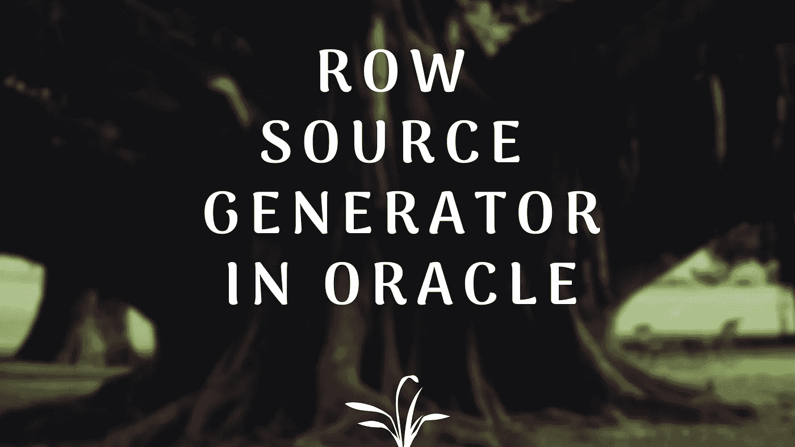
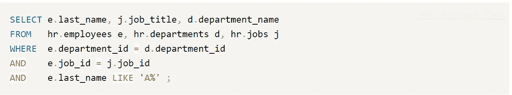
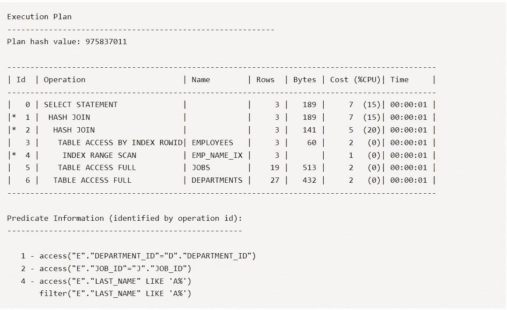

# Oracle |访谈问答中的行来源生成器是什么

> 原文：<https://medium.com/nerd-for-tech/what-is-a-row-source-generator-in-oracle-interview-q-a-88cf78915451?source=collection_archive---------1----------------------->

在这里，我们将了解 oracle 中的行源生成器

**什么是行源生成器？**

*   行来源生成器是计划生成器的下一步。
*   一旦计划生成器生成了最佳计划，它就会将其处理到行源生成器中。
*   计划生成器决定如何连接两个表，如何访问表或索引，以及应用什么连接方法。
*   行生成器推进这个计划，并生成一个对数据库更有用的迭代执行计划。
*   它创建了一个逐行执行的行源。
*   行源是我们获取行集的区域。它们可能是一个表、一个视图或一个连接或分组操作的结果，等等。因此，行源生成器生成一个行源树，它是行源的集合。
*   在每一步中，返回一个行集，下一步将使用该行集。
*   行源树显示了语句中表的执行顺序、每个表的访问方法、连接方法、数据操作，如过滤、排序、聚集等。
*   它生成一个迭代执行计划。
*   在下面的例子中，我们可以看到迭代执行计划的表示。

**连接查询示例**

**样本执行计划**

*   每一步都有不同的缩进。这些缩进表示首先执行哪个，然后将结果传递给缩进较小的那个。
*   它是执行计划的最终表示。

**结论:**

*   行源生成器创建迭代执行计划。逐步执行和这些执行的来源。
*   我们的查询按照与该计划完全相同的顺序执行。