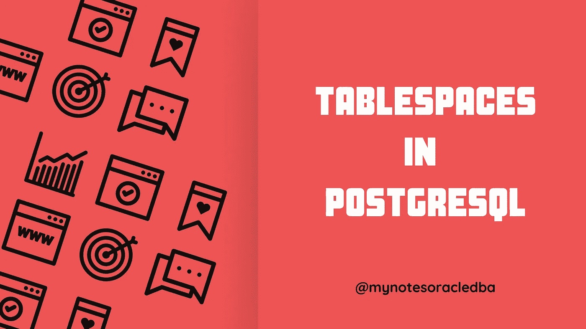
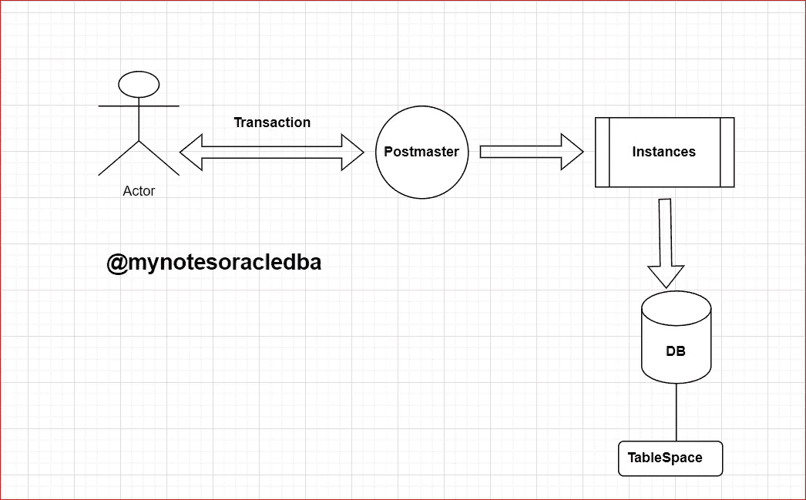

# PostgreSQL 中的表空间是什么？

> 原文：<https://medium.com/nerd-for-tech/what-is-a-tablespace-in-postgresql-2605e817360d?source=collection_archive---------1----------------------->

在这里，我们将理解 PostgreSQL 中的表空间概念



**什么是表空间？**

*   表空间是磁盘上用于存储数据库对象的位置
*   创建数据库对象时，可以通过名称来引用表空间。

**数据将如何存储到表空间中？**

*   一旦 postmaster 认证了连接，就会产生一个新的进程叫做 **pgprocess** 。
*   数据将存储在数据库中，以防用户为该特定数据库创建表空间，数据将存储在此处，否则所有默认用户数据将在 **pg_default** 表空间下维护。



**PostgreSQL 中的表空间**

**表空间的类型:**

*   **1。默认表空间**
*   当我们在默认情况下创建数据库而不指定表空间位置时，对象被存储在
    pg _ default
    1 . pg _ default→所有与用户相关的对象都存储在这里
    2.pg_global →所有与系统相关的对象都存储在这里
*   **2。非默认表空间**
    数据库对象存储在用户定义的特定位置/目录中。

**使用非默认表空间有什么好处？**

1 .在逻辑上维护特定目录中的对象
2 .更好的 I/O 保持能力
3 .维护活动(如备份特定卷备份)

**定义一个表空间**

```
CREATE TABLESPACE tbspace1 LOCATION '/u01/postgresql/data';
```

**注:**

*   该位置必须是 PostgreSQL 操作系统用户拥有的现有空目录。随后在表空间中创建的所有对象都将存储在该目录下的文件中。
*   表空间的创建本身必须以数据库超级用户的身份完成，但在此之后，您可以允许普通数据库用户使用它

**使用表空间创建数据库:**

```
CREATE DATABASE Sports TABLESPACE tbspace1;
```

**查看表空间:**

*   这里这个系统编目查看现有的表空间。

```
SELECT * FROM pg_tablespace;
```

**查看表空间的列表命令:**

*   下面的元命令对于列出现有的表空间也很有用。

```
\db
```