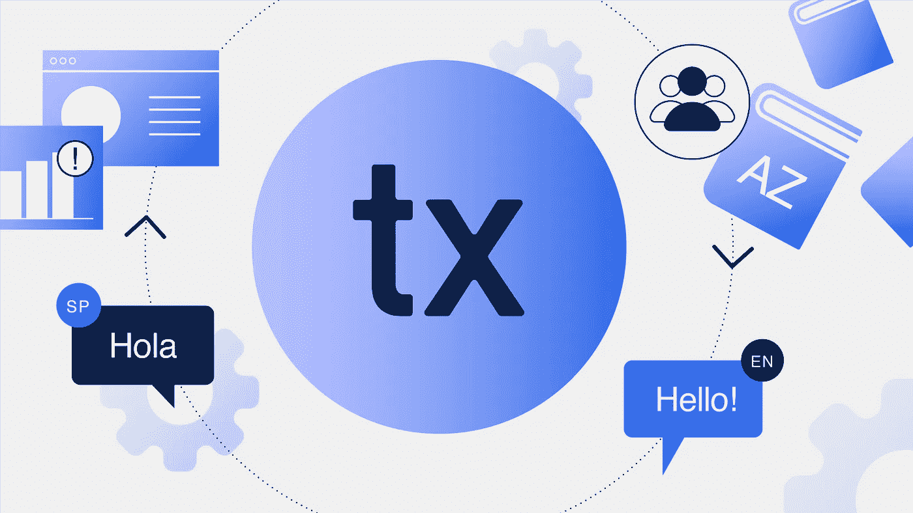
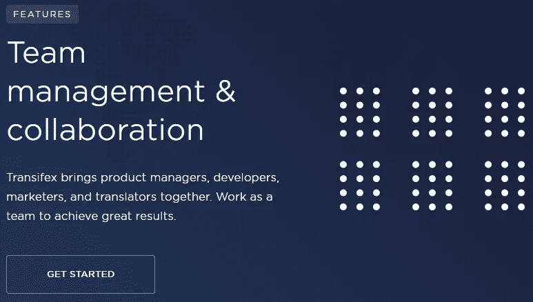
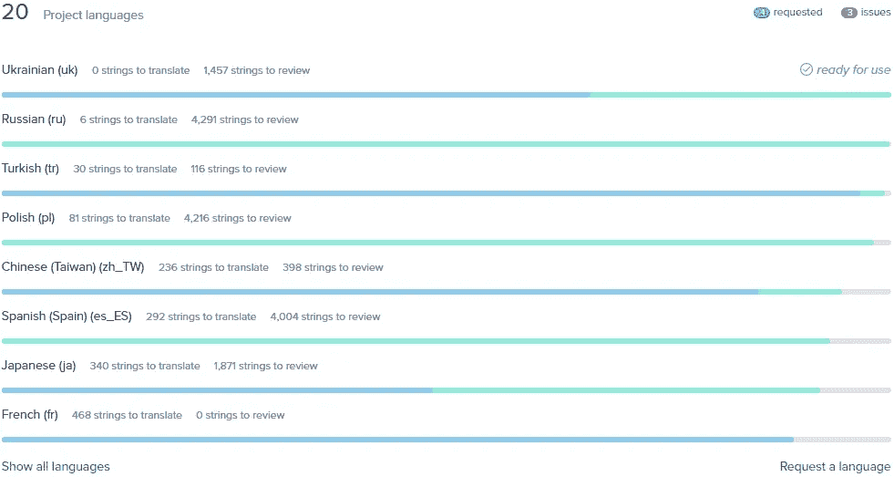
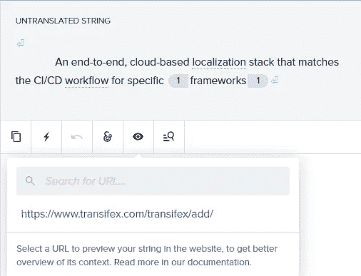
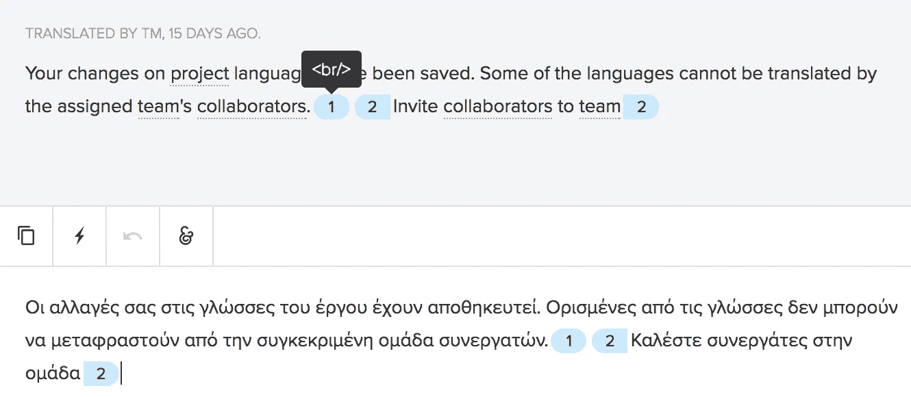
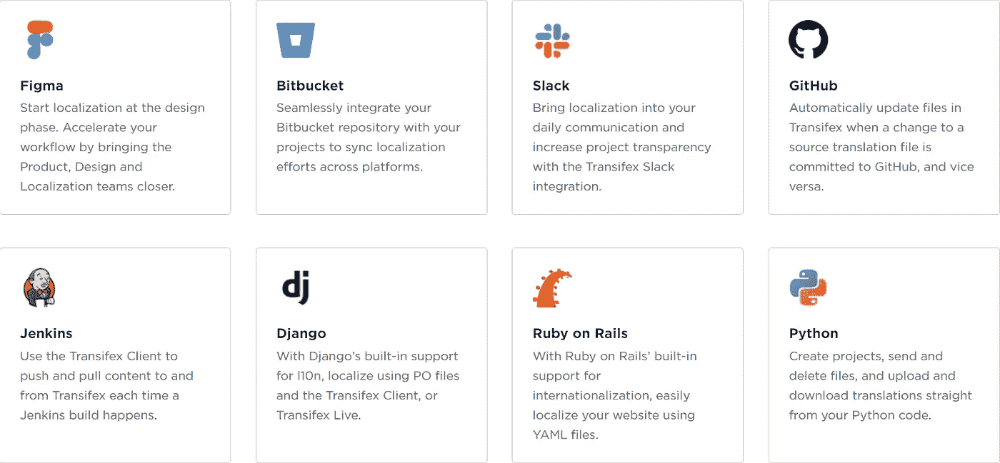
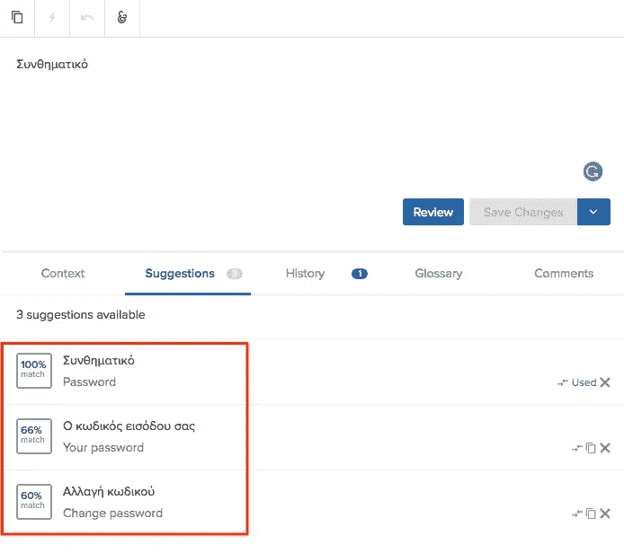

# 什么是翻译管理系统？

> 原文：<https://medium.com/nerd-for-tech/what-is-a-translation-management-system-7aaa11c569e6?source=collection_archive---------1----------------------->

翻译管理系统，也称为 TMS，对于将内容翻译成多种语言非常有用。然而，许多专业人员仍然依赖电子表格，要么是因为担心切换到不同的技术，要么是因为不知道这些更先进的解决方案。

本文旨在帮助您了解什么是翻译管理系统，它们如何工作，它们如何帮助您，以及您如何使用它们！因此，没有任何进一步的麻烦，让我们马上进入它！

# 什么是翻译项目管理？

顾名思义，翻译项目管理就是项目管理。吉拉和 T2 是公司通常用于项目管理的两个非常受欢迎的软件例子。

但是，翻译项目呢？你是如何处理如此复杂的事情的？这就是翻译管理系统的用武之地！

# 什么是翻译管理系统？

翻译管理系统是一个平台，你可以使用它来翻译和本地化你的产品，简单，快捷，并且[成本效益](https://www.transifex.com/resources/localization-roi-by-the-numbers/)。

使用 TMS 时，翻译项目管理分为多个层次，例如:

*   基础平台
*   团队协作工具
*   编辑帮助(术语表、指南、跟踪等)
*   自动化功能(机器翻译、翻译记忆等)
*   视觉上下文(用于视频字幕、一般上下文等)
*   更多

虽然所有这些可能令人不知所措，但一旦我们一步一步地把它们分解开来，理解起来就会容易得多。

但是，简而言之，TMS 帮助您将所有团队、合作者和内容集中到一个地方。与老式的本地化方法相比，在这种情况下，您可以更高效地轻松管理任何事情和任何人，同时还可以自动化许多任务。

# 什么是本地化？

正如我们已经提到的，TMS 基本上是一个软件，你可以用它来更有效地本地化你的产品。但是[到底什么是本地化](https://www.transifex.com/blog/2021/what-is-localization/)？

本地化就是采用产品的原始形式和语言，通常是英语，然后使其对当地社区更有吸引力/更合适。

注意到我们没有提到“翻译”吗？这是因为本地化不仅仅是翻译文本。产品本地化可能还需要您采用其他形式的媒体，例如:

1.  形象
2.  录像
3.  旗帜
4.  法律文件
5.  广告
6.  动画片
7.  更多，这取决于您拥有的内容类型

这在视频游戏等内容中尤为普遍，在这些内容中，根据地区的不同，经常需要多次修改甚至审查。

# 为什么翻译管理系统是必要的？

TMS 可以使本地化经理、翻译人员，甚至工程师的工作变得更加轻松。

如果没有 TMS，大多数人会使用电子表格。如果您发现自己属于这一类，那么您已经知道在成千上万的列和单元格中爬行并不完全理想。

正如我们即将看到的，这种工作流引入了许多挑战，如果没有专门的软件，这些挑战是很难解决的。我们指的是沟通挑战、文件管理问题、质量保证等。

更不用说任何关于:

1.  自动化
2.  小组管理
3.  提高翻译质量和速度
4.  [工具集成](https://www.transifex.com/integrations/)

在处理这类问题时，TMS 可以证明是非常宝贵的。

即使没有这些，本地化本身的 ROI(投资回报)也足够进行本地化了。所以，如果你必须本地化你的产品，为什么不用现代软件更有效地做呢？

而且还有更多好处。将您的内容本地化为多种语言可以[帮助您的品牌在更多地区排名](https://developers.google.com/search/docs/beginner/seo-starter-guide)，这意味着您在让您的品牌闻名全球的同时，也获得了更多的客户。

最后，但并非最不重要的是，重要的是要记住，使用新工具不仅仅是为了获得更多；这也是关于解决问题和摆脱问题。

# 使用 TMS 解决本地化挑战

从传统的本地化过程转换到 TMS 可能是一个令人生畏的想法，尤其是如果你对软件工具和自动化不太熟悉的话。

在迈出一大步之前，重要的是想一想你想迈出这一步的原因。在这种情况下，TMS 可以帮助我们应对哪些精确的[本地化挑战](https://www.transifex.com/blog/2018/6-biggest-challenges-of-localization-and-translation-management/)？

# 文件管理

首先，在本地化产品时，您必须跟踪您的文件。在大多数情况下，这包括:

*   应用程序
*   网站内容
*   所有源内容及其多种语言的翻译

对于老式的本地化方法来说，跟踪一切，尤其是在本地化过程中，无疑是一项具有挑战性的任务。

但是，通过使用 TMS，您基本上将所有文件和内容都放在了一个地方，这使得文件和内容管理变得更加容易。

举个例子，想想像 WordPress 这样的内容管理系统。没有 WordPress，你必须花更多的时间去寻找你想要的文章，管理它，修改代码，甚至不要考虑使用第三方插件，除非你真的知道你在做什么。

但是有了 WordPress，任何知道如何使用基本应用的人都能够轻松管理所有的内容和插件。翻译管理系统也是如此。

# 团队管理和沟通

本地化中的团队沟通和团队管理与文件管理一样困难，甚至更困难。

在翻译管理系统出现之前，专业人员别无选择，只能通过众多第三方交流平台和链接来处理一切，如 [Slack](https://slack.com/) 。

现在，我们可以选择将管理员、项目维护人员、审核人员、语言协调员、翻译人员、工程师以及几乎所有人都放在一个 UI 中，每个人都可以在其中工作和交流。

如果没有 TMS，修复错误的唯一方法就是花时间说这样的话，“platform.md 的第 34 行有一个法语拼写错误。请修理它。”。那么翻译人员也会浪费宝贵的时间去寻找那个文件、行和错别字。

另一方面，使用翻译管理系统，您只需将一个翻译标记为错误，翻译人员就会得到通知，然后按下按钮就可以找到该翻译——从长远来看，这将节省大量时间和精力。

值得记住的是，每个人在 TMS 中都有自己的角色和权限。由于这一点，你将不必担心翻译编辑字符串，他们不应该访问或类似的事情。

此外，您可以在需要翻译的内容下留下评论和注释，就此而言，您不再需要在第三方交流平台之间来回奔波，或者搜索需要修改的翻译。一切都集成到 TMS 的 UI(用户界面)中。

# 周转时间、效率和质量保证

使用[传统的本地化流程](https://www.transifex.com/blog/2021/what-is-localization/#The_Traditional_Localization_Process)，您需要将源文档发送过来进行翻译，然后检查并做出任何必要的注释，然后再次返回进行翻译，直到一切准备就绪。

这是一个管理时间、人力资源、预算以及保持高质量标准的问题。

TMS 通过改善不同团队之间的协作来帮助您解决这个问题，让您可以选择在翻译字符串下留下上下文注释，以及可视上下文(如果需要的话)。

例如，希腊语中的“你好”一词，可以是:

1.  问候
2.  招呼
3.  告别

所以，在这种情况下，你需要一个 TMS 来给你这个词所指的上下文。这提高了质量，减少了周转时间，并为您提供了一种确保翻译准确的简单方法。

此外，Transifex 编辑器有一个内置工具，用于审查已完成的翻译，并在必要时重新分配它们，这是质量保证的一个额外步骤，甚至在翻译记忆库等软件介入之前。关于这些事情以后再说。

# 后端通信

本地化不仅仅是本地化。在本地化完成之前、期间和之后，大量的工作都投入到软件工程中。同样的事情也适用于[持续本地化](https://www.transifex.com/blog/2021/what-is-continuous-localization/)，工程师需要定期与本地化团队一起工作。

翻译管理系统可以以多种方式帮助您最大限度地减少软件工作和故障排除，从使用基本解决方案，如 [HTML 占位符](https://docs.transifex.com/translation/html-files)到[直接编辑网页内容](https://docs.transifex.com/live/introduction)，而无需干预代码。

只需做一点点工作，您甚至可以通过使用 Transifex Native 之类的东西[来完全自动化整个拉/推过程！初始设置无疑比传统的 TMS 设置需要更多的工作，但从长远来看，大多数人可能会认为这是值得的。事实上，](https://www.transifex.com/native/) [Transifex 只用了几周的时间就将](https://www.transifex.com/blog/2021/how-we-migrated-to-tx-native-in-2-weeks/)完全移植到了 Transifex Native 的本地化版本中，并且已经证明它对于我们的合作者和工程师来说都是一个无价的工具。

# 使用多个平台

如今，大多数公司都依赖大量工具来完成工作，本地化行业也不例外。本地化团队和软件工程师一起使用许多第三方平台进行设计、开发、发布等工作并不罕见！

虽然所有这些工具毫无疑问是无价的，但在它们之间来回切换可能会令人痛苦，这是 TMS 可以派上用场的另一种方式，因为大多数允许你将众多工具集成到软件中。

例如，Transifex 提供集成，例如:

*   松弛的
*   菲格玛
*   开源代码库
*   计算机编程语言
*   wordpress 软件
*   头脑清楚
*   谷歌翻译
*   DeepL

还有更多！

# 自动化

对于任何想以更少的工作获得更高的生产力的人来说，尽可能多的自动化工作流程是至关重要的——这也适用于本地化。显然，自动化像本地化这样复杂的事情绝不是一件容易的事情，但是我们仍然可以在一定程度上做到这一点。

例如，[翻译记忆库](https://www.transifex.com/blog/2021/translation-memory-software/)会记忆译文，而[会自动填充](https://www.transifex.com/blog/2021/translation-memory-software/#TM_Fill-Ups)人类尚未完成的相同译文。有了这种自动化，你可以节省大量的时间，同时减少开支。

不要忘了机器翻译工具，比如谷歌翻译和 DeepL。您可以从 TMS 的用户界面直接使用它们，虽然它们可能无法与人类翻译竞争，但它们仍然可以

您还可以使用其他种类的自动化，如 [Transifex 的 API，来自动检测新内容，](https://www.transifex.com/case-studies/eventbrite/)通知翻译人员，然后发布更新的内容，这对于持续本地化来说是极好的。

此外，在集成和软件工程师的帮助下，翻译管理系统实现自动化的可能性是无限的！

# 你如何用翻译管理系统管理翻译？

所有这些信息可能会让人感到不知所措。毕竟，有大量的功能可供选择，我们甚至还没有详细介绍它们。但是没必要担心。

包括 Transifex 在内的翻译管理系统具有友好的用户界面，非常易于使用。你要做的就是:

1.  [创建免费账户](https://www.transifex.com/signup/)
2.  [上传需要翻译的内容](https://docs.transifex.com/projects/uploading-content#:~:text=If%20a%20project%20already%20has%20a%20resource&text=Click%20the%20Resources%20link.,Click%20Upload%20file%20when%20ready.)
3.  [邀请您的团队和合作者参加](https://docs.transifex.com/teams/inviting-collaborators)
4.  开始本地化
5.  发布您现在本地化的内容

这篇文章最初发表在这个页面上。