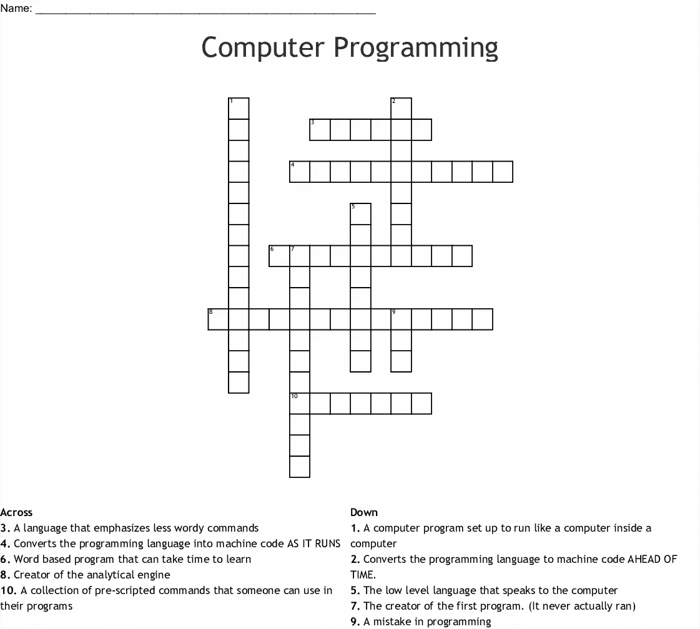

# 什么是编程中的对象？

> 原文：<https://medium.com/nerd-for-tech/what-is-an-object-in-programming-4d36523f3e?source=collection_archive---------4----------------------->

# 介绍

**面向对象编程，或 OOP，**是一种解决问题的方法，其中所有的计算都是使用对象进行的。对象是程序的一部分，它知道如何执行某些操作，以及如何与程序的其他元素进行交互。对象是面向对象编程的基本单位。[一个对象最简单的实例是一个人](https://www.technologiesinindustry4.com/)。从逻辑上讲，我们希望一个人有一个名字。这将是被记住的人的财产。我们也可以期待一个人能够做一些事情，比如走路或开车。这将被认为是人的一种方法。

面向对象编程中的代码是围绕对象组织的。一旦我们有了自己的对象，它们就可以相互作用，让事情发生。假设我们希望有一个程序，其中一个人进入一辆汽车，并驾驶它从一个地方到另一个地方。这包括方法:一个人知道如何开车，一辆车知道被驾驶是什么感觉。一旦我们有了我们的对象，我们把它们放在一起，这样这个人就可以进入汽车并驾驶。

# 类别和对象

一个**类**是一个对象的蓝图。我们可以把类想象成一个概念，对象就是这个概念的体现。在创建对象之前，我们需要有一个类。假设我们想在程序中使用一个人。我们希望能够描述这个人，并让这个人做一些事情。一个名为“person”的类将为一个人的长相和能力提供一个蓝图。为了在我们的程序中实际使用一个人，我们需要创建一个对象。我们使用 person 类创建一个“person”类型的对象。现在我们可以描述这个人，并让它做一些事情。

类在编程中非常有用。考虑这样一个例子，我们不想只用一个人，而是用 100 个人。我们可以使用同一个 person 类创建 100 个“person”类型的对象，而不是从头开始详细描述每个对象。我们仍然要给每个人一个名字和其他属性，但是人的基本结构是一样的。

# 方法和功能

一旦我们创建了对象，我们希望它们能够做一些事情。这就是方法的用武之地。面向对象编程中的方法是与一个**类**相关联的描述。方法解释从类创建的对象的行为。换句话说，我们可以说方法是一个对象能够执行的动作。方法和类的结合称为绑定。考虑使用 person 类创建的“person”类型的对象的例子。与该类交互的方法可以包括行走和驾驶。方法很少与函数混淆，但它们是不同的。

**功能**是为实现某种结果而组合的指令组合。一个函数通常需要一些输入(称为参数)并返回一些结果。例如，考虑驾驶汽车的例子。为了确定里程，我们需要使用行驶的距离和使用的燃料量进行计算。我们可以写一个函数来做这个计算。输入函数的参数是距离和油耗，结果是里程。[每当我们想确定里程数时，我们只需调用函数来执行计算。](https://www.technologiesinindustry4.com/)

这与方法有何不同？该函数是独立的，不与类相关联。我们可以在代码中的任何地方使用这个函数，并且不需要有一个对象来使用它。

现在，如果我们将函数与“汽车”类型的对象相关联，会怎么样呢例如，我们希望能够在仪表板上显示汽车的里程。里程计算已经成为一种方法，因为在这种情况下，它是与汽车类别相关联的程序。每当我们使用 car 类创建一个“car”类型的新对象时，这个方法将成为对象的一部分。汽车现在要做的动作是计算里程。这是由独立函数执行的类似计算，但是现在被绑定到汽车。

# 面向对象编程中的填字游戏

这个纵横字谜涉及面向对象编程中的对象、类和方法。

第一个程序的创建者。(它从未真正运行过)AdaLovelace
分析引擎的创造者 charlesbabage
它与计算机组件对话的低级语言
提前将编程语言转换成机器代码。编译器
在作为解释器
运行时将编程语言转换成机器代码，这是基于单词的程序，学习 JavaScript 可能需要时间

一个计算机程序被设置为像计算机虚拟机中的计算机一样运行
一个编程错误
一串预先编写好的命令，人们可以在他们的程序库中使用。
强调不那么罗嗦的语言命令 Python 对象作为数据结构

面向对象的基本概念是对象和类。对象可以是包含关于状态和行为的信息的排列。例如，代表客户的对象可以有一个特定的电话号码和与之相关的电子邮件，以及类似 placeOrder 或 cancelOrder 的行为。代表 internet 站点上的按钮的对象可以有一个标签，并在按下时触发事件。OOP 的特点是状态和行为是捆绑在一起的:我们不把客户数据和客户行为分开考虑，而是期望它们一起作为代表客户的单元。这通常被称为封装，是面向对象编程的核心原则之一。

# 作为蓝图的类

OOP 的真正优势来自于对类的利用。类就像对象的蓝图。它们描述了特定类型的每个对象可能具有的状态和行为。例如，如果您说“每个客户都将有一个电话号码和一个电子邮件，并且可以随时下订单和取消订单”，我们只定义了一个类！这样，我们将在统一的方式中提及客户。作为蓝图的类

那么选择的客户对象就是这个类的一个实现，带有特定的状态值。

# Python 中的对象

在 Python 中，一切都是对象。数字、字符串、数据帧，甚至函数都是对象。尤其是，我们在 Python 中影响到的所有东西都有一个类，一个与之相关的蓝图。[这些统一接口的存在，是你以同样方式使用任何数据帧的原因](https://www.technologiesinindustry4.com/)。我们将在任何 Python 对象上调用 type()来找出它的类。例如，numpy 数组的类别实际上叫做 ndarray(n 维数组)。

# 属性和方法

类包含了关于状态和行为的信息。Python 中的状态信息包含在属性中，而行为信息包含在方法中。以 numpy 数组为例:我们已经使用了它的许多方法和属性！例如，每个 numpy 数组都有一个属性“shape ”,我们只需通过指定数组名、点号和形状就可以访问它。它还有一些方法，比如 max 和 reshape，也可以通过 dot 访问。

# 对象=属性+方法

Python 对象中的属性(或状态)由变量表示，如数字、字符串或元组，在 numpy 数组形状的情况下。方法或行为由函数表示。两者都可以使用点语法从对象中访问。我们将通过调用 dir()列出一个对象的所有属性和方法。例如这里，我们看到 numpy 数组有 trace 和 transpose 这样的方法。

更多详情请访问:[什么是编程中的对象？—欢迎来到工业 4 的持久和新兴技术|科技博客(technologiesinindustry4.com)](https://www.technologiesinindustry4.com/2020/11/what-is-an-object-in-programming.html)