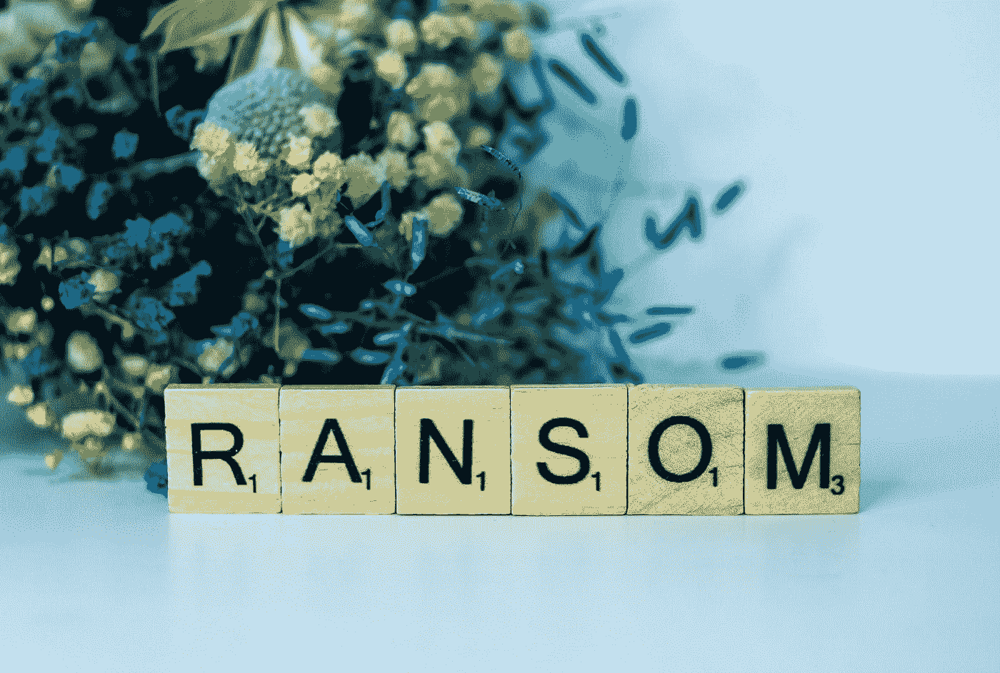
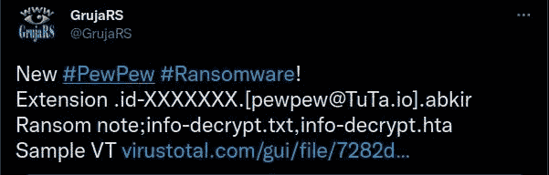
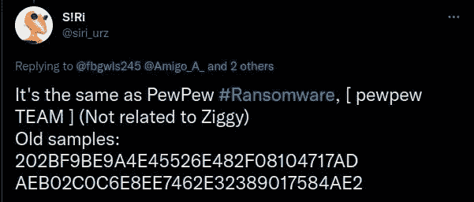

# 阿尔忒弥斯勒索软件是什么？

> 原文：<https://medium.com/nerd-for-tech/what-is-artemis-ransomware-c2b036e9a211?source=collection_archive---------3----------------------->

亚历克斯·舒特在 [Unsplash](https://unsplash.com?utm_source=medium&utm_medium=referral) 上的照片

也许你的杀毒软件发出了警报，说它发现了阿尔忒弥斯，但这是什么？

我是博客 [StackZero](/@stackzero/what-is-malware-analysis-and-why-is-it-important-stackzero-757a7ed7a9f4) 的作者，在这篇文章中，我想以一种信息丰富的方式来描述什么是 Artemis 勒索软件。
在继续之前，我想简单介绍一下勒索软件。

# 什么是勒索软件？

简言之，勒索软件是一种可以加密你的文件并勒索赎金的病毒。

它通常会在您的屏幕上显示一条消息，告诉您如何支付赎金并取回您的文件。

 [## 什么是恶意软件？你需要知道的是

### 对什么是恶意软件以及如何识别和防御恶意软件的初学者友好概述。

medium.com](/codex/what-is-malware-what-you-need-to-know-2d445ede2c01) 

# 有哪些著名的勒索软件？

一些著名的勒索软件包括 WannaCry、Petya 和 Locky。

*   **Wannacry** 是 2017 年 5 月发现的勒索病毒加密蠕虫。它的目标是运行微软视窗操作系统的电脑。它加密用户数据，并要求用比特币支付赎金。
*   **Petya** 是 2016 年发现的勒索病毒加密蠕虫。它加密主引导记录，以控制计算机的启动过程，并阻止 Windows 的启动。
*   **Locky** 对受害者电脑上的文件进行加密，使其无法访问。解密它们的赎金必须用加密货币支付。2016 年 2 月发现的。

# 什么是 PewPew 勒索软件？

在谈论最近的阿尔特弥斯之前，我想谈谈它的爸爸:皮尤。
9 月 15 日 **GrujaRS** 在 Twitter 上宣布发现了一个新的勒索软件: **PewPew** 。

您可以轻松识别感染，因为它以这种方式重命名文件:
。id-XXXXXXX。【 [pewpew@TuTa.io](mailto:pewpew@TuTa.io) 】。abkir，其中由 Xs 组成的字符串表示唯一的受害者 id。

该勒索软件还会在目标目录中创建两个文件:

*   **info-decrypt.txt**
*   **info-decrypt.hta**

它给出一条勒索信息，声明加密使用这些算法:

*   AES-256
*   RSA-2048

它还告诉我们，解密它们的唯一方法是使用可以从 PewPew 的开发者那里购买的解密工具。
最后，这条消息提供了两封电子邮件，以获得必须用比特币支付赎金的指令。

现在我们准备好了解阿尔忒弥斯了！

# 阿尔忒弥斯勒索软件是什么？

2021 年 3 月 18 日！安全研究员 Ri 在推特上谈论 Artemis:PewPew 勒索软件的新变种。

阿尔忒弥斯和它的父亲非常相似:

*   加密文件
*   修改它们的文件名
*   创建 info-decrypt.hta 文件

阿尔忒弥斯以这种方式重命名文件:

**文件名-XXXXXX。【khalate@tutanota.com】。artemis，其中 FILENAME 是原始文件的名称，Xs 字符串是受害者的唯一 id。**

作为它的父亲，它提供了两封电子邮件来联系恶意软件开发者。

除了电子邮件和加密文件的名称之外，主要的区别在于赎金信息。

特别是，他们不谈论他们的加密系统，他们要求发送 5 个文件进行解密，作为拥有解密工具的证明。

这是您将看到的消息:

> 你所有的文件都被加密了！
> 
> 由于您的电脑存在安全问题，您的所有文件都已加密。如果你想恢复它们，给我们写电子邮件:【khalate@tutanota.com
> T2 在你的邮件标题中写下这个 ID:XXXXXXXX
> 
> 如果在 12 小时内没有回复，请发邮件到这个邮箱:[khalate@protonmail.com](mailto:khalate@protonmail.com)
> 
> 解密 n 个比特币都要付费。价格取决于你给我们写信的速度。付款后，我们会寄给你的工具，将解密你所有的文件。
> 
> 免费解密作为保证
> 在付款之前，您可以向我们发送多达 5 个文件进行免费解密，文件的总大小必须小于 4Mb(非存档)，并且文件不应包含
> 有价值的信息。(数据库备份、大型 excel 表格等。)
> 
> 如何获得比特币
> '最简单的方式购买比特币 LocalBitcoins 网站。你必须注册，点击购买比特币，并通过支付方式和价格选择卖家。
> https:/local Bitcoins . com/buy icons
> ’你也可以在这里找到其他购买比特币和新手指南的地方:
> 
> 立正！
> 不要重命名加密文件。
> (不要尝试使用第三方软件解密您的数据，这可能会导致数据永久丢失。
> (在第三方的帮助下解密您的文件可能会导致价格上涨(他们会将他们的费用加到我们的费用中)或者您可能会成为骗局的受害者。

 [## 什么是恶意软件分析，为什么它很重要？—堆栈零

### 一个关于恶意软件分析和如何使用它的简单的非技术性介绍，以使读者更加熟悉…

medium.com](/@stackzero/what-is-malware-analysis-and-why-is-it-important-stackzero-757a7ed7a9f4) 

# 如何保护自己！

这种勒索病毒主要通过使用社会工程和 malspam 来传递。

所以最好的防御就是预防和良好的网络安全意识。然而，如果攻击成功，千万不要支付赎金，恢复文件的最佳方式是恢复备份。在这种情况下，一定要寻求专业帮助。

# 结论

总之，勒索软件对企业和个人都是一个严重的威胁，正如我所说，最好的防御是预防。
所以有点偏执可以成为网络安全领域的一种品质！

如果你喜欢我的工作，反馈和后续将不胜感激，可以帮助我提高我的内容很多。

如果你从技术角度对网络安全感兴趣，请访问我的博客[Stackzero.net](http://stackzero.net)。

*如果你想订阅 Medium，可以考虑使用我的推荐链接，这对你来说不是额外的费用，但对我来说却是一个很大的帮助。*

 [## 用我的推荐链接加入媒体- StackZero

### 我们的最新报道(以及数以千计的其他报道)一经发布，您就可以立即获得。成为会员后，您将获得所有权限…

medium.com](/@stackzero/membership)