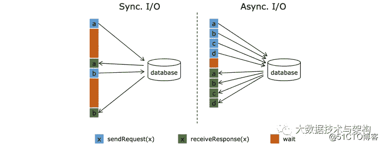
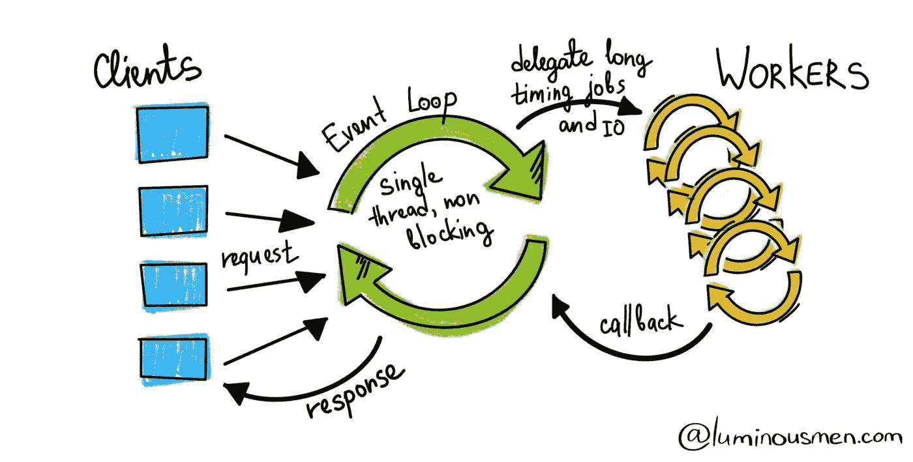
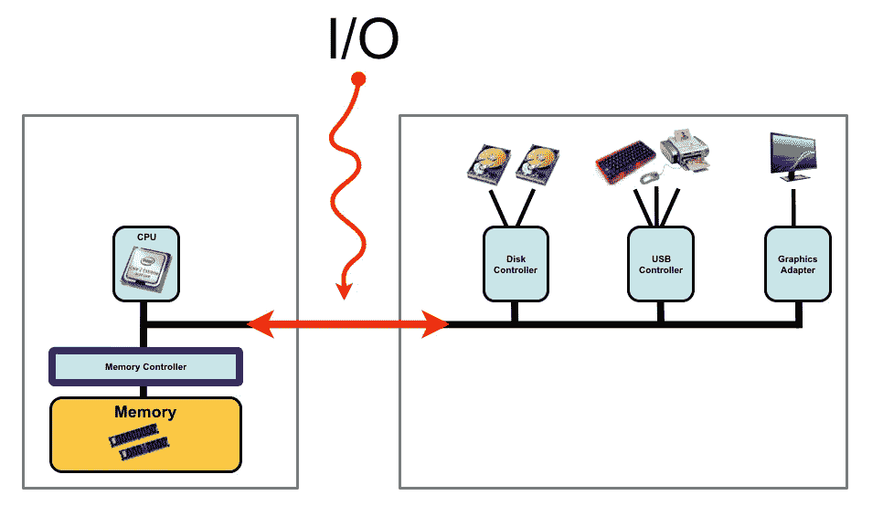

# 什么是异步输入输出？

> 原文：<https://medium.com/nerd-for-tech/what-is-asynchronous-i-o-b37994359471?source=collection_archive---------0----------------------->

> 首先，我们将讨论异步的含义和例子

# 异步是什么意思？

在计算机科学中，异步操作意味着一个进程独立于其他进程运行，而同步操作意味着该进程仅在其他进程完成或移交时运行。

# 例子

异步运行程序的一个简单例子是打印机的嵌入式软件。当打印机向用户发出墨粉不足警告时，它会继续打印。打印机不会停止一切来发出警报，然后继续。发出警报的程序部分不依赖于触发打印的部分。它们可以同时发生，因为它们独立发挥作用。

另一个更抽象的例子是在普通编程语言中使用异步方法，比如 JavaScript、Python 和 C#。也被称为*非阻塞代码*，异步编程为程序提供了在等待长时间运行的任务完成时继续运行其他代码的机会。这项耗时的任务在后台执行，而其余代码继续执行。

这些语言中支持异步编程的特性被称为*回调函数*。在 JavaScript 中，函数中嵌套的所有操作都被发送到 web 应用程序或数据库，以收集必要的信息，同时程序的其余部分继续运行。当信息被收集时，它通过程序被发送回来，并应用于程序中依赖它的函数，因此有了*回调*。

# 异步 I/O 的工作原理

1.  线程告诉内核它想要完成什么 I/O 工作(“请从这个套接字读取”或“请写入这个文件”)。
2.  内核为线程提供了一个句柄来监控请求。
3.  内核将请求添加到要照看的项目列表中。
4.  线程继续运行，定期检查事件的 I/O 句柄。
5.  每当有趣的事情发生时，内核都会向 I/O 句柄发送一个事件。
6.  Thread 获取每个事件，处理它，并检查更多的事件，直到请求的操作完成。

> 现在，我们将讨论操作系统中的异步

# 系统调用

**系统调用**(通常缩写为**系统调用**)是计算机程序向执行它的操作系统内核请求服务的编程方式。这可能包括与硬件相关的服务(例如，访问硬盘驱动器或访问设备的摄像头)、新进程的创建和执行，以及与集成内核服务(如进程调度)的通信。系统调用在进程和操作系统之间提供了一个重要的接口。

# 向上调用

我们可以使用系统调用来完成应用程序
和操作系统内核之间的大部分通信。当一个程序需要请求一些受保护的操作时，它可以请求内核代表它执行操作。同样，如果内核中有应用程序需要的数据，程序可以简单地执行一个系统调用来检索它。

但是如果我们想让应用程序能够实现类似操作系统的功能，我们需要更多的东西。出于操作系统内核需要基于中断的事件交付的许多原因，当一些值得立即关注的事件发生时，应用程序也可以从被告知中受益。在本书中，我们会反复看到这种模式:需要虚拟化操作系统内核的某个部分，以便应用程序的行为更像操作系统。我们称虚拟中断和异常为向上调用。在 UNIX 中，它们被称为信号，在 Windows 中，它们被称为异步事件。

# 带有向上调用的即时事件交付非常有用的情况

## 异步输入输出通知

系统调用被设计为等待，直到所请求的操作完成，然后返回。如果该进程在此期间还有其他工作要做呢？一种方法是异步 I/O:系统调用启动请求并立即返回；稍后，应用程序可以轮询内核的 I/O 完成情况，或者当
I/O 完成时，可以通过 upcall 向应用程序发送一个单独的通知。

## 进程间通信

大多数进程间通信都可以用系统调用来处理——一个进程写入数据，而另一个进程稍后读取数据。如果一个进程生成了一个需要另一个进程立即关注的事件，就需要内核向上调用。例如，当调试器希望
暂停或恢复进程时，UNIX 将发送一个 upcall 来通知进程。另一个用途是注销——通知
应用程序应该保存文件数据并干净地终止。

## 用户级资源分配策略

操作系统的任务之一是资源分配——决定哪些用户或哪些进程获得多少 CPU 时间、多少内存等等。反过来，许多应用程序是资源自适应的——能够针对不同的 CPU 时间或内存量优化它们的行为。一个例子是像 Java 运行时这样的垃圾收集系统。在一定范围内，Java 进程可以通过改变运行垃圾收集器的频率来适应不同的可用内存量。内存越多，时间越少

# 优点和缺点

如上所述，异步通信格式的好处是增加了信息交换结构的灵活性，并且不依赖于通用时标或对话逻辑。

然而，异步的主要缺点是它会给通信带来一层复杂性，这会使信息交换复杂化，甚至破坏信息交换。

这些优缺点在异步计算机代码中显而易见。例如，编写过多的回调函数会变得混乱，成为试图分析它们的程序员的噩梦。语法特性，比如承诺和 async/await 模式，已经被引入来简化代码语法，并简化程序员的阅读体验。尽管如此，这些特性还是增加了代码的复杂性。

如果程序的唯一目的是运行简单的、顺序的任务——比如数据处理，它可以忍受同步编程的停止和等待——那么同步是更好的选择。异步代码的优点使其更适合需要响应事件的程序，如图形用户界面(GUI)程序。

# 结论

最后，你应该从像
- [操作系统:原理与实践第二版](https://www.amazon.com/Operating-Systems-Principles-Thomas-Anderson/dp/0985673524)这样的书中读到更多关于这个话题的内容

或者像那些[操作系统笔记](https://applied-programming.github.io/Operating-Systems-Notes/)的文章