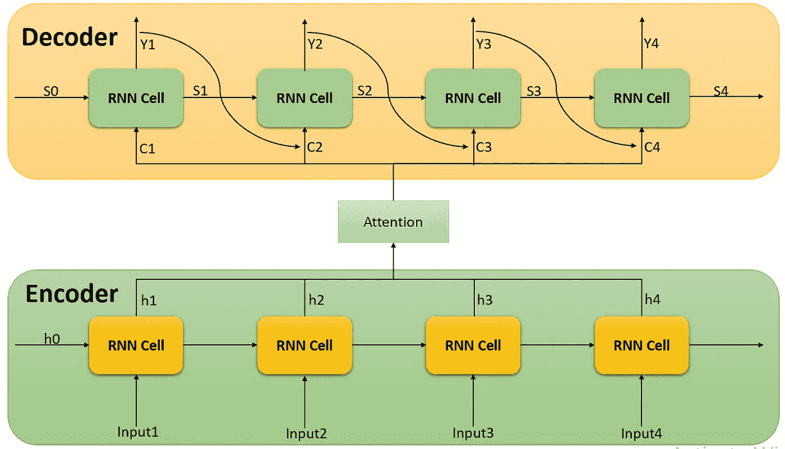
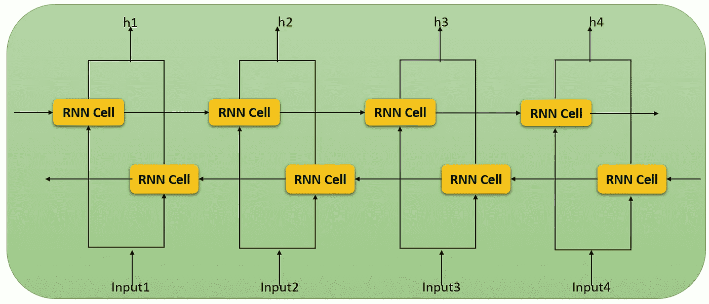
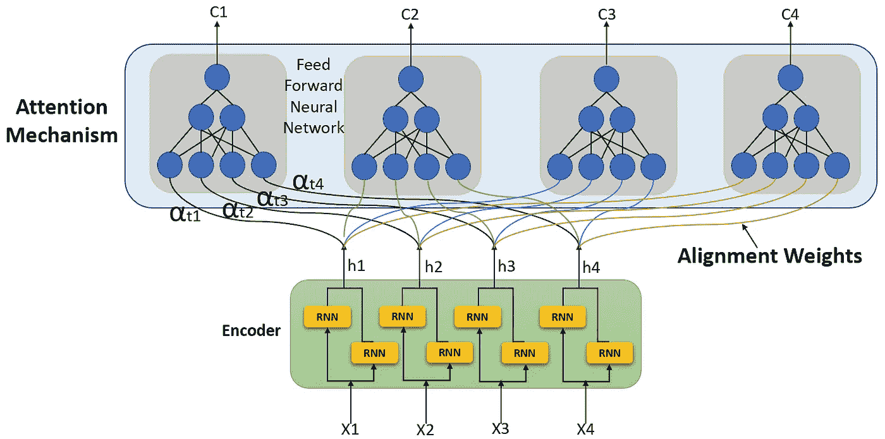
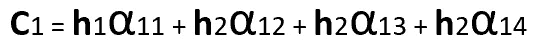
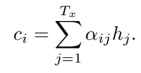
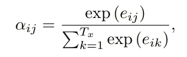
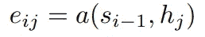
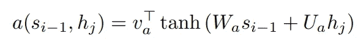
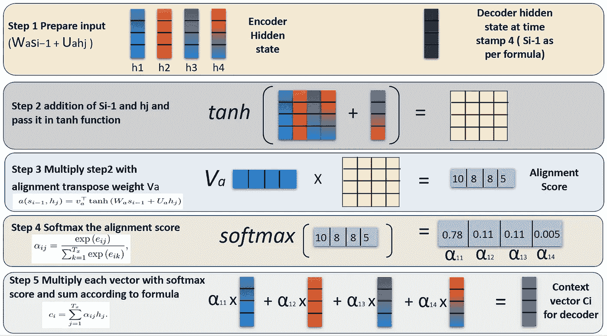
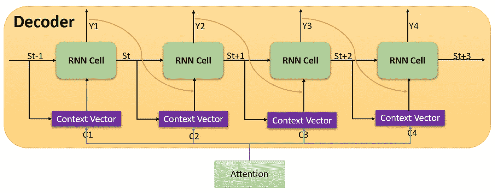

# NLP 中的注意力是什么？

> 原文：<https://medium.com/nerd-for-tech/what-is-attention-in-nlp-f67411426e64?source=collection_archive---------2----------------------->

*在这个博客中，我们将关注自然语言处理领域的关键研究，它改变了整个世界对自然语言处理的看法，即所谓的* ***注意力。***

在我之前的文章中我们已经看到了 [RNN](https://jaimin-ml2001.medium.com/understanding-rnn-91d548c86ac9?source=your_stories_page-------------------------------------) 、 [LSTM](https://jaimin-ml2001.medium.com/what-is-lstm-peephole-lstm-and-gru-77470d84954b?source=your_stories_page) 、[双向 RNN](https://jaimin-ml2001.medium.com/what-does-it-mean-by-bidirectional-lstm-63d6838e34d9?source=your_stories_page) 、[编码器解码器](https://jaimin-ml2001.medium.com/encoder-decoder-model-for-machine-translation-8a90be12ac32?source=your_stories_page)。此外，所有这些体系结构都有自己的局限性。然而，在编码器/解码器结构中，解决了语义信息和与每个字的相互关系的问题，它仍然有一些局限性。首先，每当我们处理长句时，我们都会因为结构而丢失信息。其次，我们只允许作为最后一个编码器单元输出的上下文向量作为解码器的输入。这意味着我们可以在句子生成中释放语义信息和单词的依赖性。

为了解决以前方法的所有问题[，2016 年首次引入了注意力](https://arxiv.org/pdf/1409.0473.pdf)。在这篇研究论文中，我们提到了如何使用**注意力**在输出生成中获取单词的语义信息和单词的相互关系。

让我们仔细比较一下传统编码器和解码器的架构。

**编码器解码器架构**

[http://www . wild ml . com/2016/04/deep-learning-for-chatbots-part-1-introduction/](http://www.wildml.com/2016/04/deep-learning-for-chatbots-part-1-introduction/)

在这种架构中，以上下文向量的形式将最后一个编码器单元的输出提供给解码器。

**关注编码器解码器架构**

在这种结构中，增加了关注层，编码器 RNN 单元每层的输出 Oi 给关注层，关注层的输出给解码器 RNN 单元。

第一个注意力是由 Dzmitry Bahdanau 引入的，这是附加注意力。目的改进 seq2seq 模型，增加注意事项。让我们一步步深入这个模型的实现。

## 1)编码器

编码器结构与 seq2seq 架构相同。在这里，根据上面提到的研究论文[双向](https://jaimin-ml2001.medium.com/what-does-it-mean-by-bidirectional-lstm-63d6838e34d9?source=your_stories_page) RNN 细胞被纳入架构。

输入给每个 RNN 单元，每个 RNN 单元 Oi 的状态被发送到下一层，如下图所示。

**tensor flow 中编码器的代码实现**

我们已经使用 **tf.keras** 建立编码器模型。我们使用了 **__init__** 方法和 **call** 方法来构建编码器架构。在 Encoder 类中，我们定义了一个初始化隐藏状态的方法。在 __init__ 方法中，我们定义了在这个架构中需要的层。例如，嵌入和 GRU 层。我们还添加了构建这一层所需的参数。我们添加了以下参数。

1.  batch_size:这是在每个时期传递的数据的大小。该参数会对模型性能产生很大影响
2.  vocab_size:训练数据集中唯一单词的总数
3.  enc _ units:LSTM/GRU 单位总数
4.  embedding_dim:这个参数影响模型的计算能力。这表示嵌入层的尺寸，其在下一阶段被传递到 LSTM/ GRU 层。

在 call 方法中，我们刚刚通过了遵循该方法的过程。在前向传播路径中，输入被获取并传递到嵌入层。然后嵌入数据和初始隐藏状态被传递到 LSTM/GRU 层。

**2)注意机制**

注意力的目标是为解码者获取上下文信息。

注意机制的前馈神经网络

该机制将识别每个输入 X1、X2、X3、X4 的权重。例如，上下文向量 C2 依赖于 X2 和 X4 输入，那么它将降低 X1 和 X3 的权重。这样，注意力就集中在输入数据上，并与解码器的隐藏状态一起传递给解码器。

我们基于编码器的每个 RNN 单元处的权重α输入输出 O1 来计算上下文向量。上下文向量 **C** 可以通过以下公式计算。

上下文向量 C1 计算

因此，yt 的上下文向量可以根据研究论文用下面的公式计算。

Ci 是上下文向量

αij 是校准权重

上下文向量是由对齐分数加权的隐藏状态的简单和。这里，我们讨论的是加法注意，称为 Bahdanau 的注意和另一个是乘法注意，称为 Luong 的注意。**当我们开始关注时，需要注意的一点是，αij 应该≥ 0，因为不需要与负权重成负关系。此外，αij 的总和应该= 1** 。每个注释 hj 的权重αij 计算如下

[https://arxiv.org/pdf/1409.0473.pdf](https://arxiv.org/pdf/1409.0473.pdf)

这个等式有点像 **Softmax** 函数**输出** **范围**将从 0 到 1，所有概率的总和将等于一，满足上述规则。所以，下一个术语是起着举足轻重作用的 eij 被称为**注意功能。**注意函数的公式表示为

[https://arxiv.org/pdf/1409.0473.pdf](https://arxiv.org/pdf/1409.0473.pdf)

eij，它对第 j 个位置的输入和第 I 个位置的输出的匹配程度进行评分。编码器输出 hj 和前一单元 si-1 的解码器隐藏状态将计算注意力得分。根据研究论文，eij 实际上是用以下公式计算的。

[https://arxiv.org/pdf/1409.0473.pdf](https://arxiv.org/pdf/1409.0473.pdf)

其中，Wa，Ua 和 va ∈ R n 是权重矩阵。整个过程如下图所示。

注意机制是如何一步步运作的

**tensor flow**中 Bahdanau 的 **注意** **的代码实现**

在 BahdanauAtenntion 类中，与嵌入层一样，我们创建了 init 和 call 方法。在 init 方法中，创建了 3 个密集层，即 W1、W2 和 v。如上图所示，根据公式，这两个指标都用作 Wa 和 Ua。我们将编码器输出和解码器当前状态传递给 W1 和 W2。

在调用方法 W1 和 W2 中给出了查询和值，它们分别是隐藏状态和编码器输出。然后使用 tanh 函数计算分数，并将该分数传递给 softmax 函数以生成注意力权重。最后，使用注意力权重和值来生成上下文向量 Ci。

**3)解码器**

解码器模型与[编码器解码器](https://jaimin-ml2001.medium.com/encoder-decoder-model-for-machine-translation-8a90be12ac32?source=your_stories_page)文章中描述的相同，唯一不同的是添加了注意层，因此解码器的输入分别改变。

这里，根据编码器输出和解码器隐藏状态 St-1 计算输入上下文向量 Ci。然后，具有输出 Y 的上下文向量作为输入被提供给 RNN 单元。这就是解码器架构的不同。

**tensor flow**中解码器 **的代码实现**

这里，我们创建了相同的 init 和 call 方法。在 init 方法中，我们按照通用解码器架构传递嵌入、GRU 和密集层。注意，在 call 方法中，我们使用上下文向量和 attention_weights 作为输出来启动注意力层。然后，上下文向量与解码器输入连接。这是给 GRU 和全连接层的最终输出。输出被给定为 x，state 和 attention_weights，它们将被用于调整反向传播中的权重。

在这篇博客中，我们已经讨论了带注意机制的编码器和解码器。**在** [**下一篇**](https://jaimin-ml2001.medium.com/the-transformers-in-nlp-d0ee42c78e00?source=your_stories_page-------------------------------------) **中，我将在上面提到的架构基础上添加变压器架构。**

***随时欢迎建议。***

**参考文献**

1.  [https://www . tensor flow . org/tutorials/text/NMT _ with _ attention](https://www.tensorflow.org/tutorials/text/nmt_with_attention)
2.  [https://jalammar . github . io/visualizing-neural-machine-translation-mechanics-of-seq 2 seq-models-with-attention/](https://jalammar.github.io/visualizing-neural-machine-translation-mechanics-of-seq2seq-models-with-attention/)
3.  [https://towards data science . com/sequence-to-sequence-models-attention-network-using-tensor flow-2-d 900 cc 127 bbe](https://towardsdatascience.com/sequence-to-sequence-models-attention-network-using-tensorflow-2-d900cc127bbe)
4.  [https://arxiv.org/pdf/1409.0473.pdf](https://arxiv.org/pdf/1409.0473.pdf)