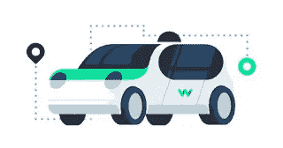

# 什么是自动化车辆技术？

> 原文：<https://medium.com/nerd-for-tech/what-is-automated-vehicle-technology-45023d6e740?source=collection_archive---------6----------------------->

# 描述

通常，自动驾驶系统是在性能上运行的特定自动系统的统一包。自动驾驶表明驾驶员已经放弃了向车辆自动化系统驾驶的能力。自动化系统控制所有功能，同时驾驶员可以集中注意力，随时准备采取行动。自动驾驶系统通常是临时性的。由此推断，自动化系统是由自动驾驶完成的，而不是在正常操作过程中遇到的所有情况。因此，人类驾驶员在功能上必须启动自动驾驶系统。

# 自治程度

汽车工程师协会(SAE)已经开发了自动驾驶汽车的等级系统。车辆有六个级别的自主性。

**0 级:**完全不自动化。

**一级:**驾驶员支持:[汽车可以在确切的条件下自主控制转向或速度，以帮助驾驶员。](https://www.technologiesinindustry4.com/)

**级别 2:** 分数自动化:车辆可以在精确的情况下自动控制转向和速度，以协助驾驶员。

**第三级:**条件自动化:机动车在正常环境条件下可以自主控制转向和速度，但需要驾驶员失误。

**级别 4:** 高度自动化:车辆可以在正常环境条件下自主行驶，不希望驾驶员疏忽。

**第五级:**满载自主:车辆可以在任何环境条件下自主完成一次行驶。

# 自动驾驶汽车中的技术应用

应用自动驾驶汽车的主要价值在于人工智能的使用。为了实现全自动驾驶汽车，在进入下一个级别之前，必须仔细验证和应用较低级别的自动化。[自主汽车制造商通过规划和应用不同的汽车系统来实现最高水平的自主，而不是实施自主系统](https://www.technologiesinindustry4.com/)。自主车辆可以使用车辆可接受的 AI 的机器学习方面，通过使用人工智能方法来控制每个其他自主系统和程序。

许多公司都在不断开发技术，以便在他们的自动驾驶汽车中实施。在我们实现完全自动驾驶汽车之前，技术仍需要进一步发展。自动驾驶汽车的安全标准正在由系统解决，其中明确强调它是完美的。如果一个有缺陷的系统被开发出来，人类的生命将会受到损害。自动驾驶汽车制造商现在已经开发出了充当汽车支持功能的系统。这些系统被认为是渐进式驾驶辅助系统。这些系统包括并行停车和紧急制动等操作。

除了这些系统之外，自主导航系统在自主车辆的发展中也发挥了作用。在应用导航系统时，有两种方式可以实现导航，首先是从一个车辆到另一个车辆的感测，其次是从基础设施的感测。这些导航系统将与 GPS 等现有的导航系统协同工作。它们还能处理路线信息、道路建设和交通堵塞。

随着自动驾驶汽车的发展，这些车辆中的许多可能主要是电动的。这意味着车辆的主要能源将是电力，而不是化石燃料。大量的现有车辆部件仍可用于自动车辆，例如使用自动变速器和操作者保护设备，如安全气囊。

大多数公司都在考虑运营商在活动方面的偏好和愿望。这些实例包括允许用户减少时间、遵循特定路线和适应操作员可能有的任何可能的残疾。许多城市政府正在考虑成为一个明智的城市，以便为自动驾驶汽车提供足够的基础，以考虑这一新的因素。

# 技术领域的成就

美国汽车协会交通安全基金会对两种自动紧急制动系统进行了测试:旨在防止撞车等，旨在形成不太严重的撞车。测试检查了热门车型，如 2016 款沃尔沃 XC90、斯巴鲁力狮、林肯 MKX、本田思域和大众帕萨特。当接近一个移动的和不移动的目标时，测试者会测试每个系统停止的程度。[它起源于，完成停止碰撞的系统将车辆速度降低了仅为减轻碰撞严重性而设计的系统的两倍。](https://www.technologiesinindustry4.com/)当两辆测试车辆以 30 英里/小时的速度行驶时，即使是那些旨在轻松减轻碰撞严重程度的车辆也有 60%的几率避免了碰撞。自动驾驶系统的成就已被公认为在农村道路设置等情况下具有生产力。乡村道路设置的交通量较小，驾驶能力和驾驶员类型差异较小。

# 自动化车辆面临的挑战

在发展全自动驾驶汽车的过程中有许多障碍。

## 技术

*   软件集成:由于自动驾驶汽车需要大量的传感器和安全流程，软件集成仍然是一项具有挑战性的任务。强大的自动驾驶汽车应该确保硬件和软件的混合可以克服组件故障。
*   自动驾驶汽车之间的预测和信任:完全自动驾驶的汽车应该像人类一样准备好预测其他汽车的行动。人类司机非常擅长预测其他司机的行为，即使只有少量的知识，如眼神交流或手势。首先，汽车应该就交通规则达成一致，在十字路口该轮到谁开车，等等。由于更多的不确定性，当人类驾驶的汽车和自动驾驶的汽车都存在时，这就成了一个更大的问题
*   扩大规模:自动驾驶汽车测试的覆盖面不够准确。它需要自动车辆更快的反应时间或更好的跟踪算法。

## 社会的

实现自动驾驶汽车的一个关键步骤是公众的接受。这是一项至关重要的正在进行的研究，因为它为汽车行业提供了提高设计和技术的指导方针。TAM 研究模型将影响消费者接受度的重要因素分解为:有用性、易用性、信任和社会影响。信任因子研究自动驾驶汽车的安全性、数据隐私和安全保护。一个更可信的系统对消费者决定使用自动驾驶汽车具有积极的影响。

## 监管的

自动驾驶车辆的实时测试是该方法中不可避免的一部分。与此同时，汽车自动化监管机构面临着保护公共安全，同时允许自动驾驶汽车公司检查其产品的挑战。代表自动驾驶汽车公司的团体正在反对大多数法规，而代表弱势道路使用者和交通安全的团体正在推动监管壁垒。控制者被鼓励寻找一个中间地带，保护公众免受不成熟技术的影响，以提高交通安全，同时让自动驾驶汽车公司检查其系统的实施情况。

更多详情请访问:[https://www . technologiesinindustry 4 . com/2020/12/what-is-automated-vehicle-technology . html](https://www.technologiesinindustry4.com/2020/12/what-is-automated-vehicle-technology.html)