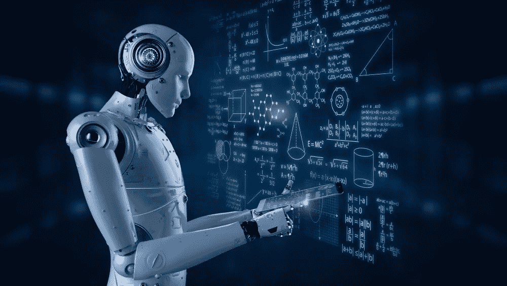
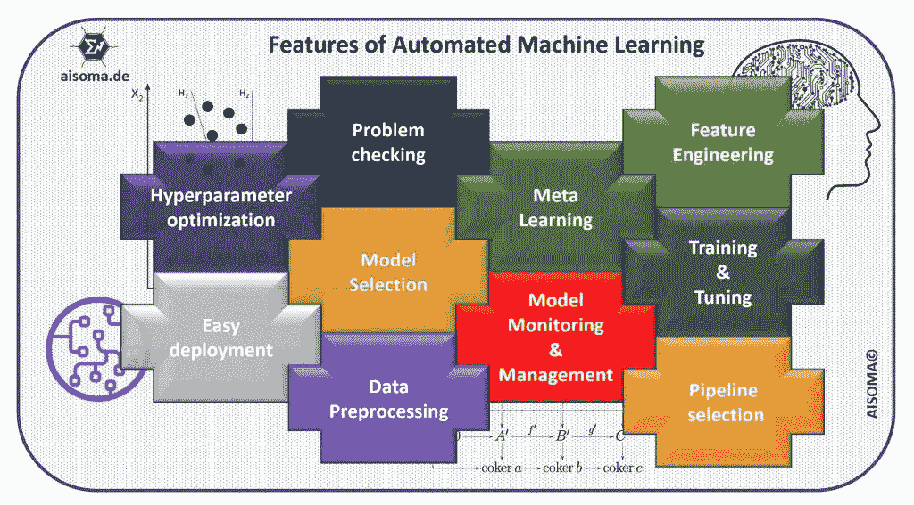
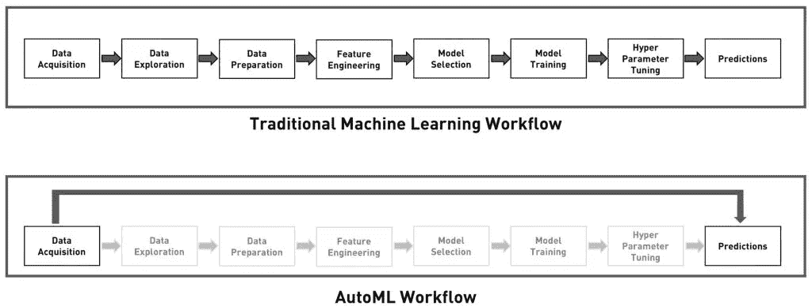

# 什么是 AutoML(自动机器学习)？—简要概述

> 原文：<https://medium.com/nerd-for-tech/what-is-automl-automated-machine-learning-a-brief-overview-a3a19c38b5f?source=collection_archive---------2----------------------->

(shutterstock: [峰谷摄影](https://www.shutterstock.com/de/g/PhonlamaiPhoto)

AutoML 的受欢迎程度稳步上升(见[。尤其是在实践分析中的大量成功的推动下。此外，在一个越来越多的设备产生数据并联网的世界里，数据不成比例地增长。因此，AutoML 迫切需要从这些快速增长的数据中及时获取知识。我们假设 AutoML 在未来几年变得更加重要，并且分析方法会提供更加精确和快速的结果。因此，数据科学家的活动领域不会消失，相反，他的重点将转移到更具体或更复杂的分析技术上。简而言之:AutoML 节省时间和金钱(你不需要更大的数据科学和机器学习专家团队)。这也是进入人工智能或机器学习世界的最简单、最便宜的方式。](https://www.forbes.com/sites/janakirammsv/2018/04/15/why-automl-is-set-to-become-the-future-of-artificial-intelligence/?sh=7071300f780a)

# AutoML 的特点

[AISOMA—AutoML 的特点](https://www.aisoma.de/what-is-automl-automated-machine-learning/?preview_id=6192&preview_nonce=24f9b4421c&_thumbnail_id=6058&preview=true)

# 那么什么是 AutoML 呢？

自动机器学习(AutoML)是将机器学习应用于现实世界问题的端到端过程自动化的过程。在典型的机器学习应用中，专家必须应用适当的数据预处理方法、特征工程、特征提取和特征选择来制作用于机器学习的数据集。在这些预处理步骤之后，从业者必须执行算法选择和超参数优化，以最大化最终机器学习模型的预测性能。由于其中许多步骤往往超出了外行人的能力，AutoML 已被开发为一种基于人工智能的解决方案，以应对不断增长的应用机器学习的挑战。自动化应用机器学习的端到端过程提供了产生更直接的解决方案、更快速地创建这些解决方案以及通常优于手工设计模型的模型的好处。

# 传统机器学习工作流与 AutoML 工作流的比较。

AutoML 工作流([源](https://www.forbes.com/sites/janakirammsv/2018/04/15/why-automl-is-set-to-become-the-future-of-artificial-intelligence/#7e00fafd780a))

**自动化的目标:**

自动化机器学习可以捕获机器学习过程的不同阶段:

*   自动化数据准备和记录(从原始数据和各种格式)
*   自动列类型识别，例如布尔、离散数字、连续数字或文本识别。
*   自动列意图识别；例如目的地/标签、数字特征、分类文本特征或自由文本特征。
*   自动任务识别；例如二元分类、回归、聚类或排序
*   自动化特征工程
*   特征选择
*   特征抽出
*   元学习和迁移学习
*   失真数据或缺失值的检测和处理
*   自动化模型选择
*   学习算法的超参数优化和函数化
*   时间、存储和复杂性约束下的自动化流水线选择
*   估价指标/验证程序的自动选择
*   自动化问题检查
*   “泄漏”点的检测
*   错误配置的检测
*   对取得的结果进行自动分析
*   自动化机器学习的用户界面和可视化

**以下是 AutoML 供应商列表:**

*   [AutoWEKA](http://www.cs.ubc.ca/labs/beta/Projects/autoweka/) 是一种同时选择机器学习算法及其超参数的方法；结合 WEKA 包，它自动为各种数据集提供良好的模型。
*   [Auto-sklearn](https://automl.github.io/auto-sklearn/master/) 是 AutoWEKA 的 Python 库 scikit-learn 的扩展，是常规 scikit-learn 分类器和回归器的替代产品。
*   [TPOT](http://epistasislab.github.io/tpot/) 是一名数据科学助理，使用遗传编程优化机器学习管道。
*   [H2O 汽车](http://docs.h2o.ai/h2o/latest-stable/h2o-docs/automl.html)为 H2O 机器学习和数据分析平台提供自动化模型选择和编译。
*   [TransmogrifAI](https://github.com/salesforce/TransmogrifAI) 是一个运行在 Spark 上的 AutoML 库。
*   MLBoX 是一个 AutoML 库，有三个组件:预处理、优化和预测。
*   [Google Cloud AutoML](https://cloud.google.com/automl/) 是一个机器学习产品套件，即使是在这方面知识不多的开发人员也可以根据他们的特定需求训练高质量的模型。
*   Azure Automated ML 基于我们微软研究部门的一项突破。该方法结合了协同过滤和贝叶斯优化的思想，智能有效地搜索可能的机器学习管道的巨大空间。

*(注:该列表仅代表一小部分供应商。)*

作者:缪拉·杜马斯(著有:**[**《艾思书》**](https://www.amazon.com/dp/B08Z4BWN1X)**)****

**这可能很有趣:**