# 什么是 AWS Amplify 框架，如何从 AWS Amplify 开始？

> 原文：<https://medium.com/nerd-for-tech/what-is-aws-amplify-framework-and-how-to-start-with-aws-amplify-fdbc76431197?source=collection_archive---------1----------------------->

本文介绍了另一种 AWS 服务，它为开发人员提供了使用其他 AWS 服务(如 AWS MFA(多因素身份验证)服务、AWS AppSync、AWS Analytics 等)轻松构建云驱动的移动和 web 应用程序的能力。

AWS Amplify 是一个基于 JavaScript 的开发框架，由库、UI 组件和 CLI 接口组成，用于构建和部署移动(android、ios)和 web 应用程序。该服务有助于构建、部署和托管单页面应用程序以及具有无服务器后端的静态网站。无服务器意义上的开发者只需要专注于应用程序代码实现，不需要考虑服务器的安排和其他资源管理，AWS 或其他云厂商通过查看流量等来负责管理和运营基础设施。有了这种无服务器的特性，使用 amplify 我们可以创建安全且可扩展的移动和网络应用程序。

如前所述，放大器由三个主要部件组成

*   UI 组件:有很多预建的 UI 组件可供使用，如登录表单等，这些组件的好处是所有的 UI 组件都是可定制的。因此用户可以按照他们对应用程序的期望来排列这些 UI。
*   库:帮助集成 AWS 服务并与之交互。这将有助于增加应用程序的功能，如推送通知服务、认证等。
*   CLI:通过 CLI 命令配置 AWS 服务，帮助轻松管理 AWS 托管后端。

AWS 放大器概述

# AWS 放大器的特点

当我们谈到 Amplify 中可用的功能时，它有一些非常酷的东西。

*   分析学
*   证明
*   推送通知
*   文件存储器
*   公共订阅
*   数据同步和安全性
*   数据存储
*   预测(ML 和 AI)
*   互动。

还有更多的人在那里。

本文将向您介绍如何开始使用 AWS Amplify 服务的一些基础知识。本文将介绍如何设置 AWS Amplify。如果我们希望开始使用这项服务，我们应该注意哪些基本命令？在本文中，我们不做任何应用程序开发，只是让您对 AWS Amplify 有一些了解。

让我们看看如何使用 AWS Amplify 服务创建一个简单的 React 应用程序。

在开始使用 Amplify 之前，我们需要设置 3 样东西。

1.  设置一个 AWS 帐户。
2.  安装 Node.js 的最新版本。
3.  安装最新版本的 NPM。

一旦建立了这三个基本要求，你就可以开始了。

接下来，我们需要安装 Amplify 控制台来使用。

打开 cmd 并键入以下命令。

```
npm install -g @aws-amplify/cli
```

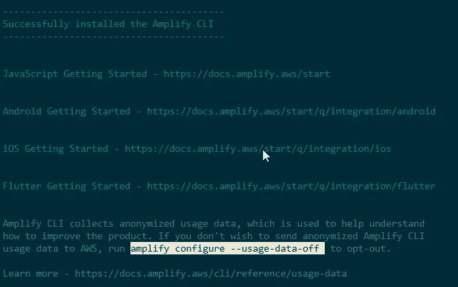

Amplify CLI 安装成功消息

让我们使用以下命令配置放大器。

```
amplify configure
```

一旦我们执行了这个命令，我们需要指定 AWS 区域，IAM 用户名，如下所示。这将打开一个浏览器窗口，我们可以在其中设置 IAM 管理控制台中的 IAM 用户详细信息。

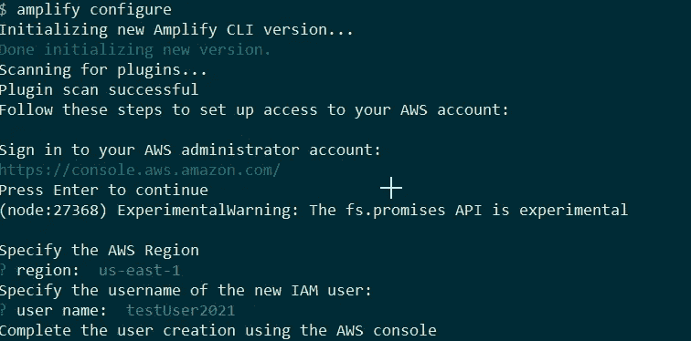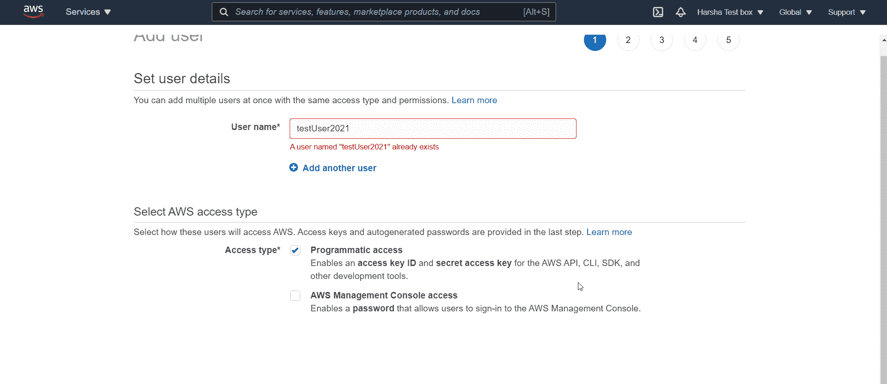

*注意:需要为用户设置 AdministratorAccess，并请确保下载用户安全凭证。第一次之后，访问密钥 Id 和秘密访问密钥不可见。

成功创建 IAM 用户后，您需要在 cmd 中输入之前停止的那些密钥 Id 和密钥。

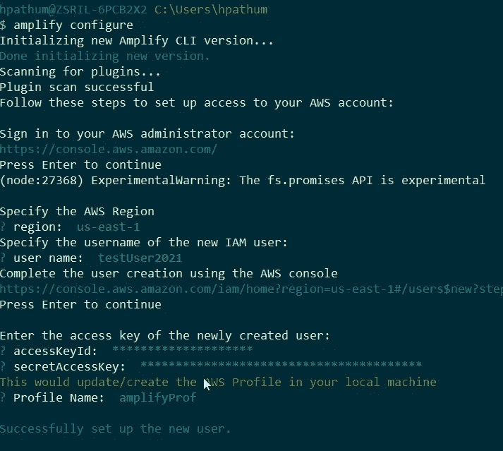

放大器配置成功完成

由于这是一个 react 应用程序，我们需要使用 react 特定的命令。

*   使用 react 命令创建 react 应用程序—生成示例前端代码。

```
npx create-react-app <application-name>
```

*   进入之前创建的 react 应用程序后，运行 amplify init 命令，生成这个应用程序的后端[更多的](https://aws.amazon.com/blogs/mobile/amplify-cli-adds-scaffolding-support-for-amplify-apps-and-authoring-plugins/)。

```
amplify init
```

它将拍摄出一些问题，如下图所示

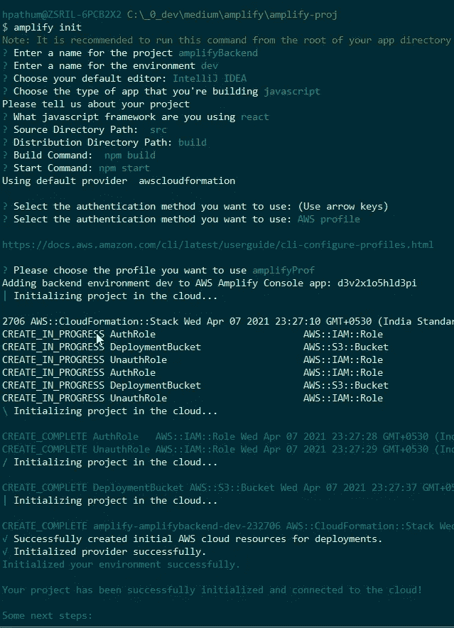

成功的集成将在 Amplify 控制台中创建一个应用程序，如下图所示。

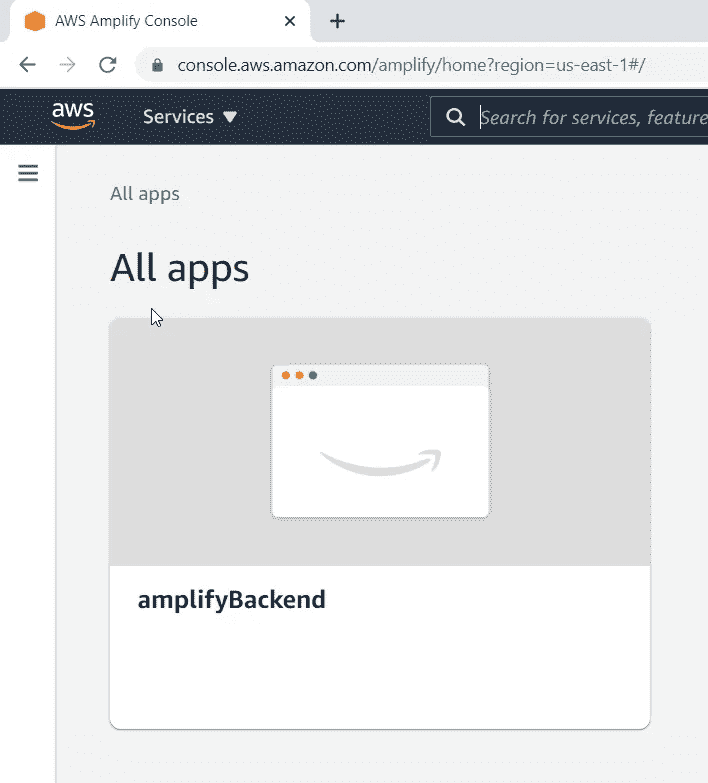

成功集成后，您可以在 react 应用程序文件夹中看到一个名为 amplify 的文件夹。该文件夹包含与后端服务相关的信息。还有另一个新的文件生成调用 aws-exports.js，它包含使您能够从客户端连接到后端的信息。

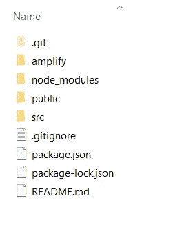

现在，我们可以使用以下命令轻松地从 cmd 访问 amplify 控制台。

```
amplify console
```

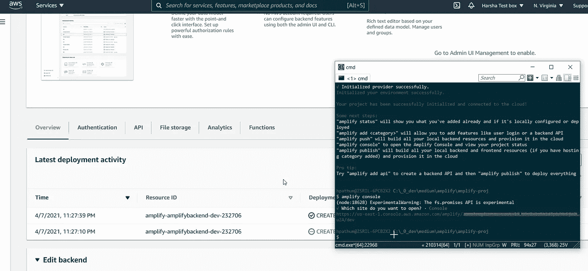

接下来，我们需要将上面创建的后端与我们使用 react 创建的前端应用程序连接起来。正如我之前提到的，我们可以使用 Amplify 提供的 UI 组件。在这里，我们将为 react 框架安装 UI 组件。(我将包括必要的链接，提供更多关于命令的信息和其他与放大到底部相关的细节)

```
npm install aws-amplify [@aws](http://twitter.com/aws)-amplify/ui-react --save
```

*注意:`@aws-amplify/ui-react` 提供容易连接到后端的 React 组件。在应用程序中与 AWS 服务交互的核心库是`aws-amplify.`

从您最喜欢的文本编辑器或支持 react 的 IDE 中打开 react 项目。

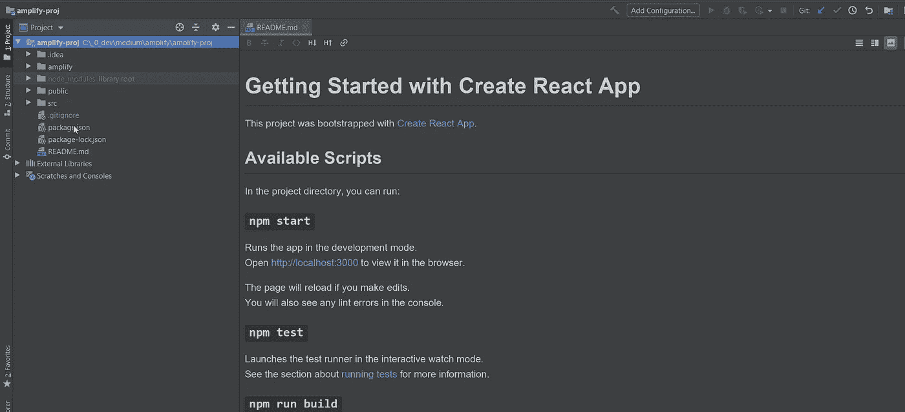

打开 src/index.js，导入`aws-exports`和`Amplify`库。`aws-exports`包含与 AWS 后端服务连接的必要信息。

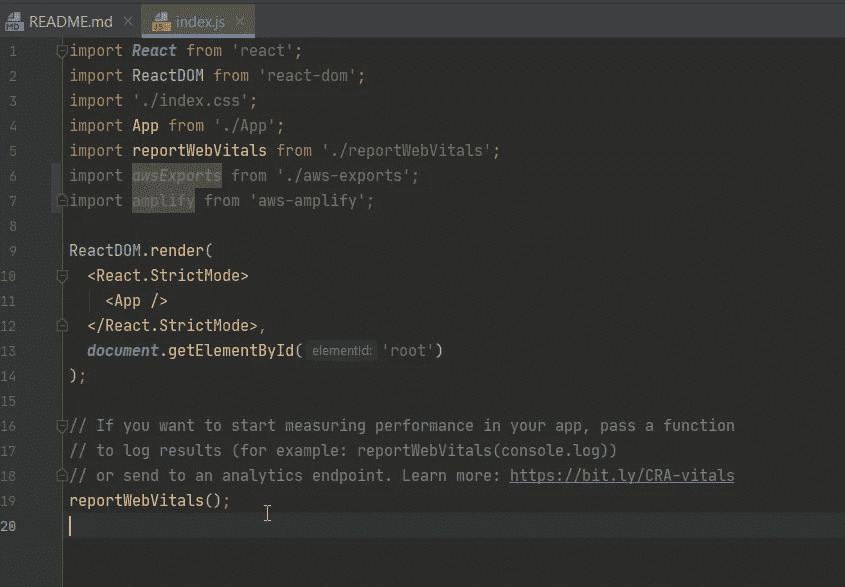

一旦导入后，你可以继续编写前端代码。

为了保持前端和后端之间的交互，我们需要在后端实现 REST/GraphQL API，以便向前端应用程序发送数据。

所以我们可以使用`amplify add api`命令开始后端编码。

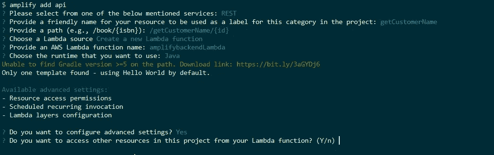

在完成 API 创建之前，会有几个问题。正确定义 REST API 后，相应地修改 react 代码库 app.js。

想象一下，我们需要添加一些服务，如认证、推送通知等

简单通过使用下面的命令你可以添加服务到你的项目。

```
amplify add <featurename>eg: amplify add auth
    amplify add notifications
```

同样，您可以轻松地将更多的 aws 服务集成到您的应用程序中。

我们将在下一篇文章中尝试 amplify 应用程序的所有开发，您将有机会更好地理解应用程序开发。

添加特性后，运行下面的命令来构建所有本地后端资源，并在云中提供它们。

```
amplify push
```

此后，我们可以通过将服务导入到必要的地方来使用它。

最后，我们需要做的是部署应用程序。

通过使用 CLI，我们可以毫无困难地轻松部署和托管应用程序，因为后端是无服务器的，我们不需要太担心基础架构安排。

```
amplify add hosting
```

上面的命令将托管应用程序，一旦我们运行下面的代码

```
amplify add publish
```

应用程序将上线，您将在 CMD 上收到一个公共 URL 来访问该应用程序。

以下是一些必备链接，可以参考。

[](https://docs.amplify.aws/start/getting-started/setup/q/integration/react) [## 教程-设置 fullstack 项目-放大文档

### Amplify 框架入门——设置一个完整的堆栈项目

docs.amplify.aws](https://docs.amplify.aws/start/getting-started/setup/q/integration/react) [](https://docs.amplify.aws/cli/start/workflows#clone-sample-amplify-project) [## 开始-典型工作流程-放大文档

### 要初始化一个新的 Amplify 项目，请从您的前端应用程序的根目录运行以下命令。

docs.amplify.aws](https://docs.amplify.aws/cli/start/workflows#clone-sample-amplify-project) 

[https://aws-amplify.github.io/amplify-js/api](https://aws-amplify.github.io/amplify-js/api/)

[](https://docs.amplify.aws/lib/push-notifications/getting-started/q/platform/js) [## 推送通知-入门-放大文档

### 为 Android 和 iOS 提供了设置说明，两个平台的配置可以包含在同一个…

docs.amplify.aws](https://docs.amplify.aws/lib/push-notifications/getting-started/q/platform/js) 

将在下一篇文章中看到您的实现:)