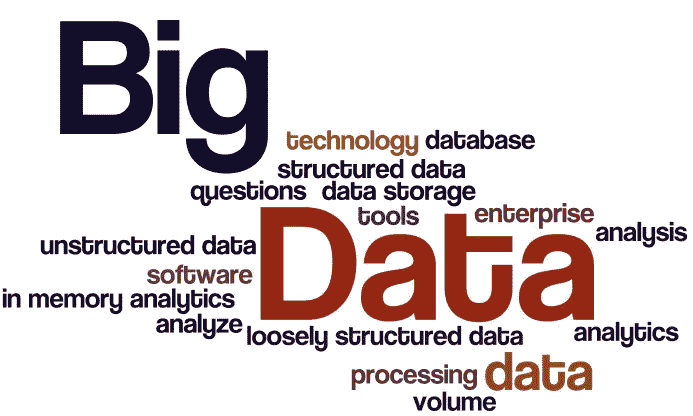
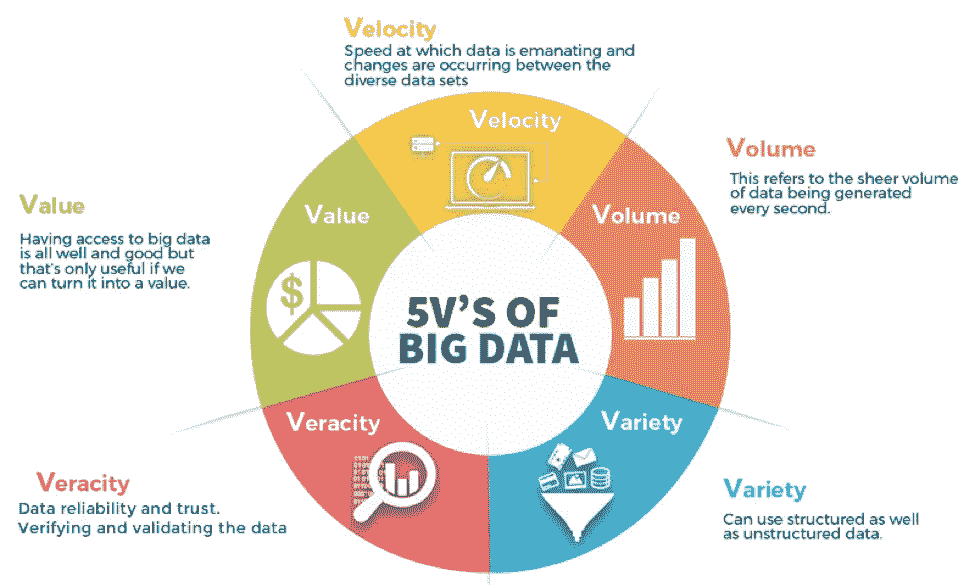
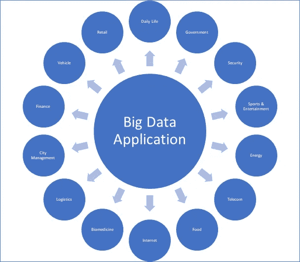

# 什么是大数据？

> 原文：<https://medium.com/nerd-for-tech/what-is-big-data-6c47407bfbe5?source=collection_archive---------0----------------------->

来源:网络百科

> “世界是一个大数据问题。”安德鲁·麦卡菲

# 什么是大数据？

**大数据**是描述**大量数据**的术语，包括结构化数据和非结构化数据。但是数据量并不重要。重要的是组织如何处理数据。

术语“大数据”指的是如此**庞大、快速或复杂**以至于难以或不可能使用传统方法处理的数据。为分析而访问和存储大量信息的行为已经存在很长时间了。但大数据的概念在 21 世纪初获得了发展势头。

# 大数据的特征

来源:TechEntice

**1)量:**
**量**是指每秒钟从社交媒体、手机、汽车、信用卡、M2M 传感器、图像、视频等等产生的难以想象的信息量。**仅脸书就可以产生约 10 亿条消息，是“喜欢”按钮记录的 45 亿倍，每天有超过 3.5 亿条新帖子上传。**

**2)多样性:**
数据以各种格式出现，从**结构化的**传统数据库中的数字数据到**非结构化的**文本文档、电子邮件、视频、音频、股票数据和金融交易。

**3)准确性:**
**准确性**指数据的质量。因为数据来自如此多不同的来源，所以很难跨系统链接、匹配、清理和转换数据。这方面的一个例子是从医学实验或试验中产生的数据。

**4)价值:**
**价值**实际上是**有价值的、可靠的、值得信赖的**数据的数量，这些数据需要被存储、处理、分析以找到洞察。

**5)速度:**
**速度**定义为数据源生成数据的速度。大数据速度的一个例子是 Twitter 上的推文或脸书上的帖子。

# 大数据的应用

来自不同领域的组织正在投资大数据应用，**用于检查大型数据集，以发现所有隐藏的模式、未知的相关性、市场趋势、客户偏好、**和其他有用的业务信息。

**1)医疗保健**
大数据分析通过提供个性化医疗和处方分析改善了医疗保健。研究人员正在挖掘数据，以了解对于特定情况，什么样的治疗方法更有效，确定与药物副作用相关的模式。
通过将医疗保健数据与地理数据集对应起来，可以预测特定地区将会升级的疾病。基于预测，更容易制定诊断策略和计划储备血清和疫苗。

**2)网络安全&情报**
联邦政府启动了一项网络安全研发计划，该计划依靠分析大型数据集的能力来提高美国计算机网络的**安全性。**
**国家地理空间情报局**正在创建一个**“世界地图”**，它可以收集和分析来自各种来源的数据，如卫星和社交媒体数据。

**3)犯罪预测和预防**
警察部门可以利用先进的实时分析来提供可操作的情报，用于了解**犯罪行为，识别犯罪/事件模式，并发现基于位置的威胁**。

天气预报
**NOAA(美国国家海洋和大气管理局)**每天每分钟都从**陆地、海洋和太空传感器**收集数据。每日 NOAA 使用大数据从超过 20tb 的数据中分析和提取价值。

**5)交通优化**
大数据有助于整合从道路**传感器、GPS 设备和摄像机**收集的实时交通数据。通过实时调整公共交通路线，可以预防密集区域的潜在交通问题。