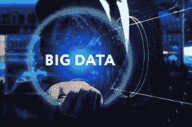
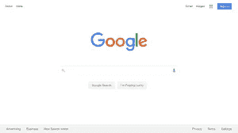
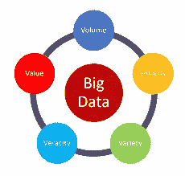

# 什么是大数据？

> 原文：<https://medium.com/nerd-for-tech/what-is-big-data-b95548cd4091?source=collection_archive---------5----------------------->

## 让我们开始…

我们都用智能手机。你有没有想过它会以文本、照片、视频、电话、通话、电子邮件、搜索、音乐等形式产生多少数据？单个智能手机用户每月会产生 40 的数据。想象一下 40*5，000，000，000 智能手机用户。这对我们的大脑来说太多了，不是吗？事实上，传统的计算系统处理不了这么多数据，这种海量数据就是我们所说的大数据。

让我们看看互联网上每分钟产生的数据

***2.1*** 每分钟在 snapchat 上分享百万张快照。

谷歌上每分钟有 380 万次搜索查询。

每分钟有 100 万人登录脸书。

每分钟有 450 万个视频在 You tube 上被观看。

每分钟发送 8800 万封邮件。

这是大量的数据。

## 如何将数据归类为大数据？

[来源](https://www.google.com/search?q=5+v%27s+of+big+data&rlz=1C1CHZN_enIN931IN931&source=lnms&tbm=isch&sa=X&ved=2ahUKEwiPyNudgYzuAhUb8XMBHV1lCb0Q_AUoAXoECBEQAw&biw=1536&bih=735&dpr=1.25#imgrc=naNCQeBiWaBnIM)

这个数据在 5v 的概念中是可能的

*   卷
*   速度
*   多样化
*   诚实
*   价值

让我用一个例子来解释这一切

以医疗保健行业为例，世界各地的医院和诊所产生大量数据，每年以患者记录和测试结果的形式收集 2313 的数据，所有数据都以极高的速度生成，这归因于大数据的速度。多样性是指各种数据类型，如结构化数据(如 Excel 记录)、半结构化数据(如日志文件)和非结构化数据(如 x 光图像)。准确性和可信度被称为准确性分析，所有这些数据都将通过实现更快的疾病检测、更好的治疗和更低的成本而使医疗行业受益，这就是大数据的价值。

## 我们如何存储和处理这些大数据？

为了完成这项工作，我们有 Cassandra、Hadoop、Spark 等框架。

让我们以 Hadoop 为例，看看 Hadoop 是如何存储和处理大数据的。Hadoop 使用一种称为 Hadoop 分布式文件系统的分布式文件系统来存储大数据。如果您有一个巨大的文件，您的文件将被分成较小的块，并存储在不同的机器上。不仅如此，如果您破坏了文件，您还会将它复制到不同的节点上。这样，您可以以分布式方式存储大数据，并确保即使一台机器出现故障，您的数据在另一台机器上也是安全的。

Map Reduce 技术用于处理大数据，将一个冗长的任务 A 分解为较小的任务 b、c、d。现在，不再是一台机器，而是三台机器并行处理并完成每项任务，最终得到类似的结果。处理变得越来越快，这就是所谓的并行处理。

## 我们可以用分析过的数据做什么？

[来源](https://www.import.io/post/business-data-analysis-what-how-why/)

现在，我们已经存储并处理了我们的大数据。现在，我们可以为《光环 3》和《使命召唤》等游戏中的众多应用分析这些数据。设计师分析用户数据，以了解大多数用户在哪个阶段暂停、重启或退出游戏。这一见解可以帮助他们重新设计故事情节，改善用户体验，从而降低客户流失率。同样，在 2012 年飓风桑迪期间，大数据有助于灾害管理。它用于更好地了解风暴对美国东海岸的影响以及必要的措施，因为它可以提前五天预测飓风登陆，而这在以前是不可能的。一旦经过精确的处理和分析。

# 别忘了留下你的回答。✌

大家敬请关注！！为了把我的故事发到你的邮箱里，请**订阅我的时事通讯。**

感谢您的阅读！不要忘记给你的掌声，分享你的回答，并与朋友分享！