# 什么是 Chef-Server |节点配置中的引导|上传指南

> 原文：<https://medium.com/nerd-for-tech/what-is-bootstrapping-uploading-cookbook-in-chef-server-node-configurations-db59c1991514?source=collection_archive---------12----------------------->

先决条件:[https://medium . com/nerd-for-tech/attributes-in-chef-a 56073 de 90 ea](/nerd-for-tech/attributes-in-chef-a56073de90ea)

[https://medium . com/nerd-for-tech/run list-multiple-recipes-Linux-group-users-in-chef-170 afcb 51 FBA](/nerd-for-tech/runlist-multiple-recipes-linux-group-users-in-chef-170afcb51fba)

**步骤 1:** 访问您的亚马逊 EC-2 机器，并遵循以下命令:

> 须藤秀
> 
> cd 烹饪书

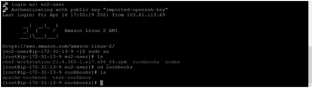

**第二步:**

创建一个厨师服务器帐户。去[https://manage.chef.io/login](https://manage.chef.io/login)，为你的厨师-服务员创建一个组织。一段时间后，我们将看到“初学者工具包”下载它。使用它，我们可以连接我们的厨师工作站与不同的节点。

Start-kit 包含所有用于连接服务器的服务器文件。按顺序遵循下面的输出。

首先，去 https://manage.chef.io/login>注册，并验证你的账户

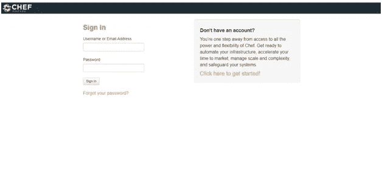

其次，创建一个组织，一个弹出对话框将出现点击继续。

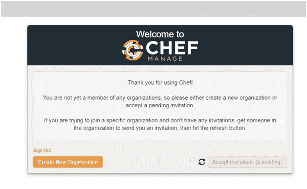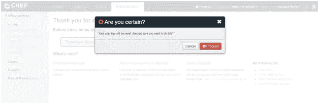

最终的厨师管理网页将如下所示

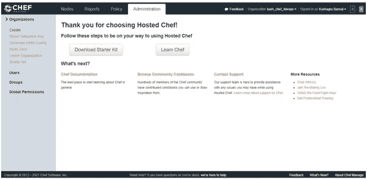

第三，下载 starter-kit(服务器文件) >解压并使用 WinSCP 软件将其转移到一台 Linux EC-2 机器上。

a.主机名=公共 IPv4 DNS 的值

b.用户名= Linux 实例用户名，即“ec2-用户”

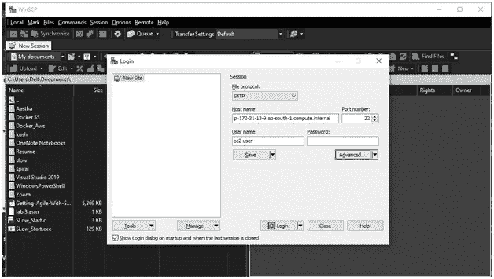

之后，单击高级选项>身份验证，并提供 EC-2 Linux 实例的密钥。

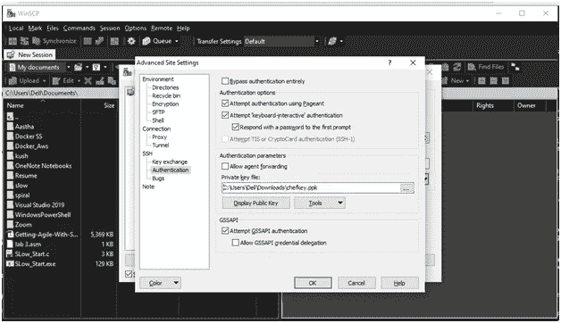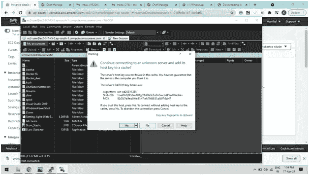

单击“OK”>“log in ”,我们将重定向到 WinSCP 应用程序。让我们转到必须解压缩初学者工具包的目录。从左到右拖放“chef-repo”目录意味着本地机器到 Linux 服务器。

 [## 正在下载 WinSCP-5 . 17 . 10-setup . exe::WinSCP

### WinSCP 是一个免费的 SFTP、SCP、亚马逊 S3、WebDAV 和 FTP 客户端。

winscp.net](https://winscp.net/download/WinSCP-5.17.10-Setup.exe) 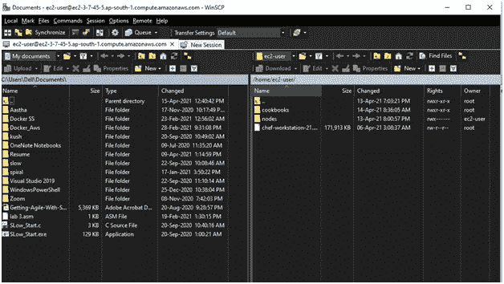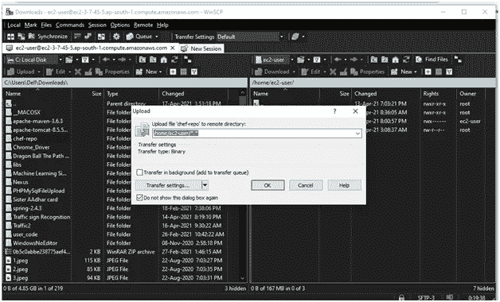

第四，让我们验证我们在 Linux 服务器中共享的文件。

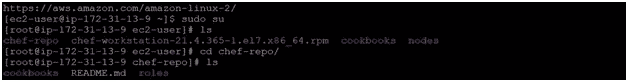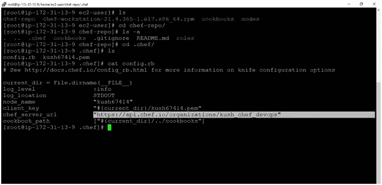

要验证我们的 Linux 工作站是否已经连接到 chef-server，请使用以下命令。

> 刀 SSL 检查

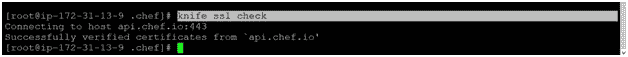

**第三步:**

引导一个节点= >

当工作站和节点位于同一可用性区域时，将节点连接到 chef-server 称为引导。

现在，要将 chef-server 连接到节点，首先要重定向到 chef-repo 目录，其中包含所有服务器文件。

首先，创建一个 Ec-2 实例(chef-node-1)

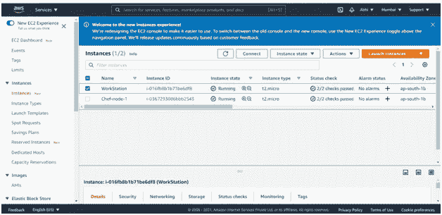

第二，在创建实例时，我们在 windows 本地机器上下载了扩展名为. pem 的实例密钥对。

用 WinSCP 机器把它转移到我们的 Linux 工作站上

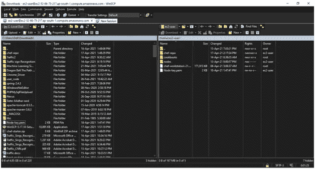

让我们在 Linux 实例(工作站)中验证密钥对

> 须藤秀
> 
> cd chef-repo
> 
> ls

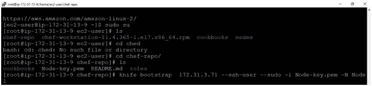

第三，将节点与工作站链接

命令:

> 刀引导 172 . 31 . 3 . 71-连接-用户 ec2-用户-sudo-I Node-key . PEM-N Node 1

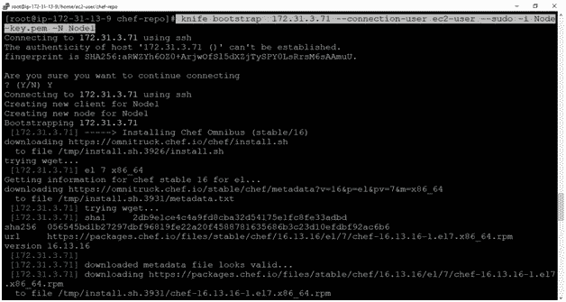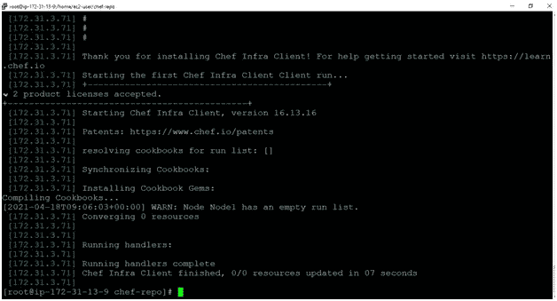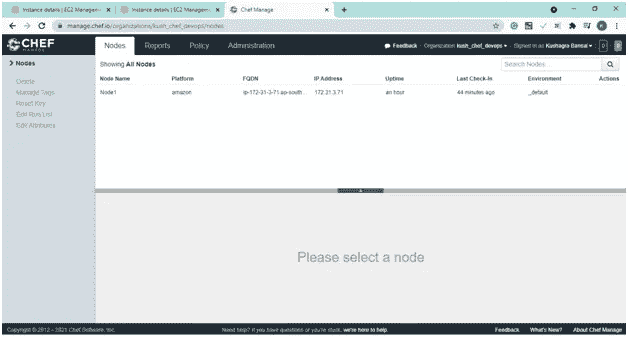

**第四步:**

现在，我们的工作站中有两个 cookbook，我们只需要一个 cookbook 目录，该目录当前位于“chef-repo”文件夹中。

将现有的烹饪书移至 chef-repo/cookbooks/并删除当前的烹饪书，即烹饪书。

命令:

> ls
> 
> ls 烹饪书
> 
> ls 厨师报告/烹饪书
> 
> mv 烹饪书/测试烹饪书厨师报告/烹饪书
> 
> mv 烹饪书/Apache-烹饪书厨师-报告/烹饪书
> 
> RM–射频烹饪书/

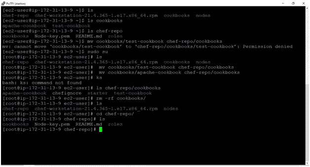

**第五步:**

让我们把我们的食谱之一“apache-cookbook”上传到 chef-server

命令:

> 刀食谱上传阿帕奇-食谱
> 
> 刀具食谱清单

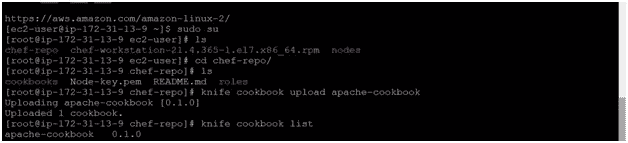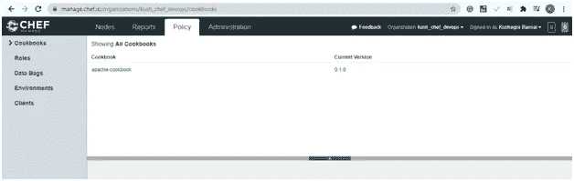

其次，如何将配方添加到特定节点的 run_list 中

> 刀节点 run_list set Node1 "配方[Apache-cookbook::Apache-recipe]"

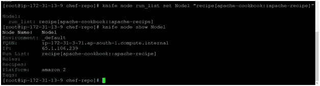

检查添加到 run_list 的现有配方

> 刀节点显示<node_name></node_name>
> 
> 刀节点显示节点 1

第三，要以图形方式检查这个 run_list，请转到 chef-server > Nodes > node 1 > edit run list。

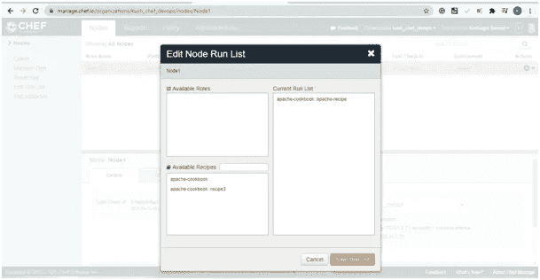

**第六步:**

在上面的步骤中，我们已经将 cookbook (apache-cookbook)更新/上传到 chef-server。由于这里我们没有使用自动化，我们将手动转到节点(Node1)并运行命令 chef-client。这将有助于运行作为运行列表添加的脚本。

转到 Node1 并遵循下面的命令。

> Sudo su // root
> 
> 厨师客户端//从父厨师服务器运行食谱

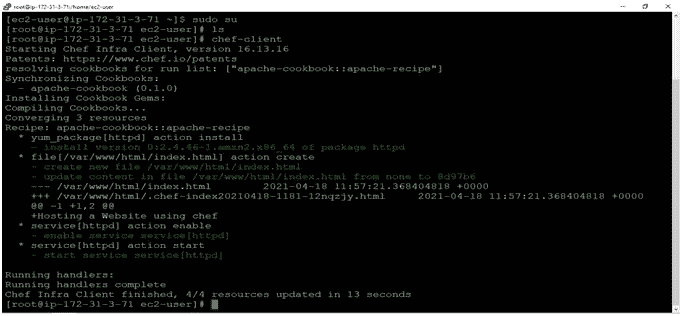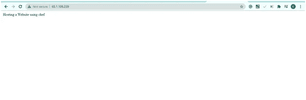

现在，让我们自动执行从工作站到主厨服务器再到节点的流程

让我们在工作站上对我们的食谱(apache-recipe.rb)做一些修改。

> cd chef-repo
> 
> VI cookbooks/Apache-cookbook/recipes/Apache-recipe . Rb

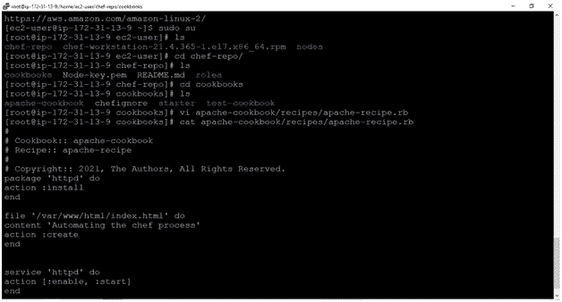

转到该节点并尝试运行更新运行列表配方。它将输出显示为最新的。

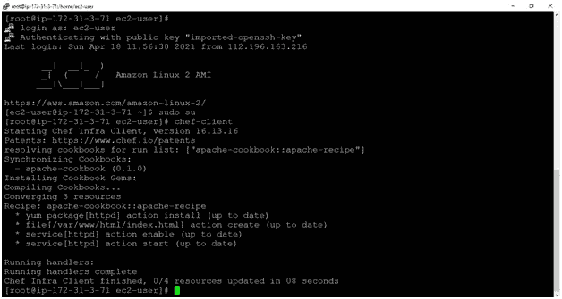

这意味着在修改脚本后，我们必须再次将它上传到 chef-server。

如果我们将食谱上传到 chef-server，然后尝试在节点上手动运行它，我们可以看到变化。

工作站:

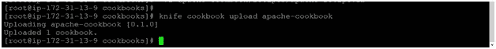

节点:

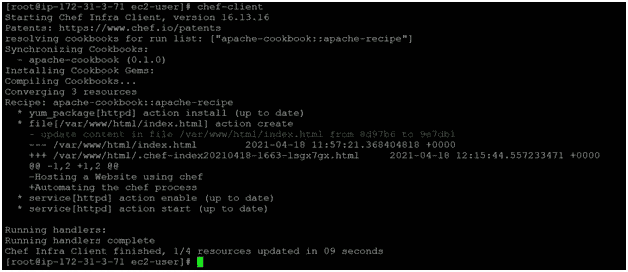

**第七步:**

现在让我们自动化这个过程。如果我们改变一个脚本节点，将自动调用 chef-server 并相应地更新它。这里我们将使用 crontab 调度程序来自动化这个过程。

转到节点 1 并设置调度程序。

> 须藤秀
> 
> vi /etc/crontab

代码:

> * * * * * root chef-客户端
> 
> //这意味着这个具有 root 权限的命令将每分钟运行一次。

回到工作站，对菜谱(apache-recipe.rb)做一些修改

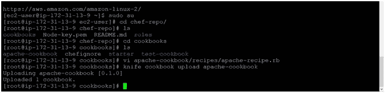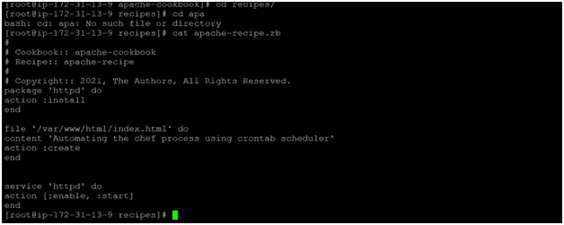

此外，修改后的食谱必须上传到 chef-server，然后刷新一分钟，我们可以看到节点调用了 chef 服务器。

> 刀食谱上传阿帕奇-食谱

**输出:**

*[root @ IP-172–31–13–9 食谱]#刀刀食谱上传 apache-cookbook*

*上传 apache-cookbook [0.1.0]*

*上传了 1 本食谱。*

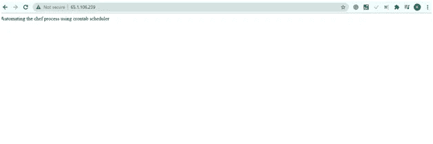