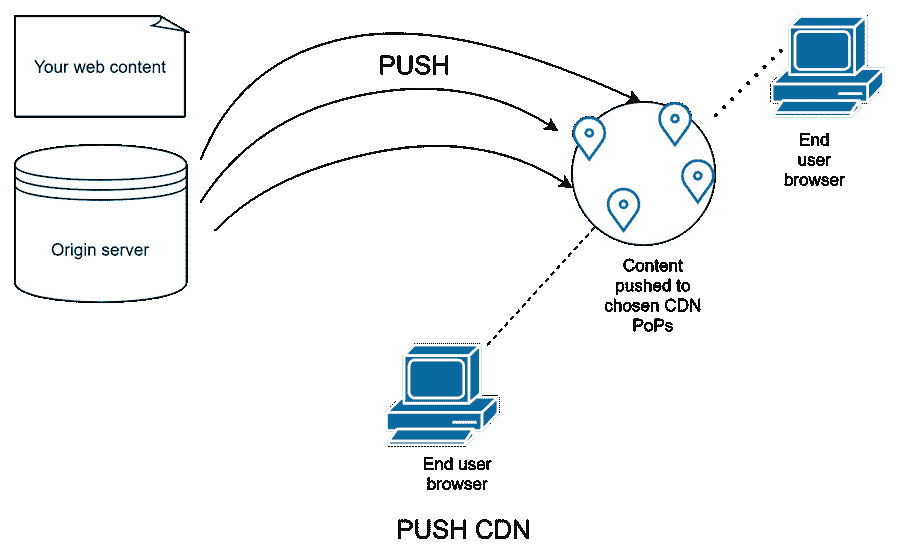
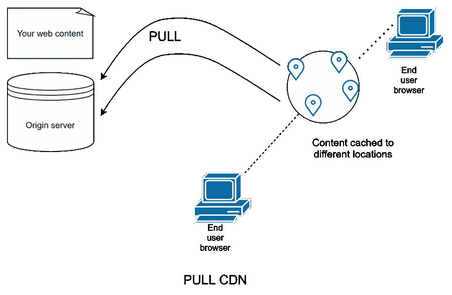

# 什么是 CDN，它有哪些类型

> 原文：<https://medium.com/nerd-for-tech/what-is-cdn-and-what-are-its-types-ce4b05103e32?source=collection_archive---------5----------------------->

内容交付网络(缩写为 CDN)是大多数现代网站和应用程序不可或缺的一部分。通常通过 CDN 可以在网站或应用程序上查看内容。我们大多数人从未意识到我们每天都在与 CDN 互动——无论是在网上阅读新闻还是在购买您最喜欢的产品时。

但是 CDN 到底是什么，为什么它被如此广泛的接受。让我们找出答案。

**目录**

1.  了解 CDN
2.  CDN 的优势
3.  CDN 的类型
4.  两者哪个是更好的 CDN？
5.  停业清理

# 了解 CDN

CDN 是一个由服务器组成的全球分布式网络，能够在发布网站内容的同时为网站提供更快的性能、更短的加载时间和高级安全性。

让我们假设您已经为您的商店创建了一个电子商务网站，并将其托管在加利福尼亚州的一台服务器上。网站上显示的内容，无论是文本、图像还是视频，都必须根据用户的请求加载到他们的设备上，无论他们位于何处。

现在，鹿特丹的一个用户请求将资源显示在您的网站上，该网站是从位于加利福尼亚的服务器上调用的。由于加州的服务器和鹿特丹的用户之间的距离约为 5435 英里，加载时间增加了几百毫秒，这使最终用户感到沮丧，甚至影响到你的网站在搜索引擎中的排名。这是 CDN 展现其潜力的地方

# CDN 的优势

## 更快的加载时间

回想一下，CDN 是一个全球分布式服务器网络。现在，这些服务器分布在世界各地的不同地理位置，被称为 CDN PoPs(接入点)。与从位于世界某个角落的服务器传送网站资源不同，距离用户地理位置最近的 CDN PoPs 可以更快地将您的网站内容传送到用户的屏幕上。随着更少的加载时间，您的最终用户将享受到更好的用户体验，您的搜索引擎优化排名会更高。

## 网站安全

由于 CDN PoP 位于接收传入流量的第一层，它将您的实际服务器隐藏在几层之下。CDN PoPs 可以区分好的和坏的网络流量；好的流量被重定向到服务器，而坏的流量由最近的 CDN PoPs 处理，从而减轻 DDoS 攻击并优化性能。

## 降低带宽成本

带宽消耗是当今许多网站关注的主要问题。通过缓存和其他优化技术，CDN 提取的数据比原始服务器提供的少。这降低了企业的网站托管成本，并确保最终用户的无缝体验，这是一个双赢的局面。

# CDN 的类型

有两种类型的 CDN，它们有自己的运行模式。

1.  推送 CDN
2.  拉 CDN

## 推送 CDN

Web 内容被主动从您的托管服务器推送到嵌套在您的最终用户位置附近的 CDN PoP。当最终用户请求 web 资源时，最近的 CDN 有一个填充了 web 内容的整洁包。然后，它无缝地将它们传递给浏览器。

推送 CDN 是指将内容从服务器推送到最近的 CDN，然后再推送到生产。网上有很多免费的 ping checkers 来检查你的请求和回复。

## 拉 CDN

当使用拉式 CDN 时，只有在第一次请求发出后，web 内容才会缓存在最近的 PoP 服务器中。在第一次请求时，数据不是每次都调用服务器，而是实际上从托管服务器中提取并缓存在 CDN PoP 服务器中。一旦发出第一个请求，网站就会启动并运行。第一个请求对于引发连锁反应至关重要，连锁反应包括在不同地理区域的 CDN 缓存中提取和存储数据。

# 两者哪个是更好的 CDN？

如果你认为为你的网站在推送 CDN 和拉取 CDN 之间做出选择是一项艰巨的任务，那么你就错了。这两个 cdn 做得一样好，服务于目的。然而，在某些情况下，一个可能比另一个更好。

为了让您更好地理解，拉 cdn 用于经常有大量网络流量的网站。这是因为内容是相对稳定的，一旦被获取，它就会被广泛传播。

当您的网站需要最小的流量时，您可能更喜欢推送 CDN，因为内容只从主服务器推送到 PoP 区域一次，并在需要更改时进行修改。

推送 CDN 还为网站所有者提供了内容灵活性。作为网站所有者，你是决策者。您应该决定哪些内容应该推送到 CDNs，内容何时到期以及内容何时更新。网络流量也得到有效处理，因为只有当内容发生变化时，内容才会从源服务器推送到 CDN PoPs。

另一方面，拉 CDN 很容易建立，并为你做了很多工作。此外，因为它在第一次请求发出后就提取 web 元素，所以减少了存储消耗。

然而，当用户第一次请求资源或缓存中的内容过期后，拉 CDN 可能会导致页面加载速度比推 CDN 慢。

# 正在结束…

停机和缓慢加载页面会在关键交易过程中干扰用户，并可能损害您的公司在观众眼中的信誉。您可以使用 CDN (push 或 pull)来优化加载时间性能，以便用户在重要事务期间不会感到焦虑。

*原载于*[*https://www . partech . nl*](https://www.partech.nl/en/publications/2021/08/what-is-cdn-and-what-are-its-types)*。*