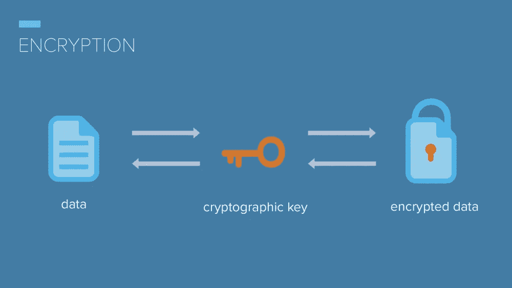
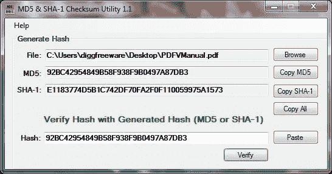
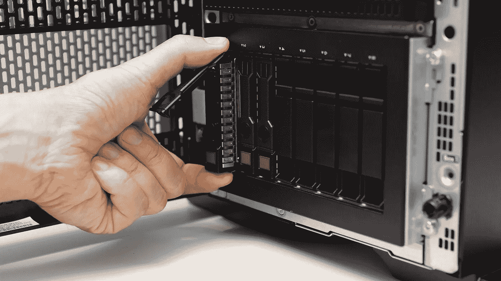

# 什么是中情局三合会？—信息安全的支柱

> 原文：<https://medium.com/nerd-for-tech/what-is-cia-triad-the-backbone-of-information-security-712659c7206e?source=collection_archive---------1----------------------->

在当今世界，收集、组织和分析数据催生了新技术，创造了大量财富。世界上最有价值的资源不再是石油，而是数据。通过 apple watch 等健康监测设备，理解和创建数据平台的能力使得帝国得以建立，生命得以拯救。如何使用这些数据是另一个时代的主题，但如何保护数据是我在本文中想要关注的。在基本层面上，中央情报局是保护所有类型数据的骨干力量。CIA traid 代表**保密性**、**完整性**和**可用性**。理解 CIA 在信息安全中的作用是非常重要的。我将解释中情局三位一体的每个组成部分，以及用来确保它们不被违反的不同机制。

# **中情局三人组**

> **机密性** —确保数据和资源只对那些被授权的人可用。

**举例**:我在销售部，可以接触到销售月报。

**用于保密的工具:**

*   数据加密— SHA-256 或 Bcrypt

图像[来源](/searchencrypt/what-is-encryption-how-does-it-work-e8f20e340537)

*   多因素身份认证(MFA) —通过电子邮件或文本发送的一次性密码(OTP)
*   访问控制— Kerberos AAA 服务器提供 IT 系统的身份验证、授权和审计
*   管理政策—离职政策
*   SIEM —安全信息和事件管理用于监控事件并为 IT 专业人员创建警报。

**对保密性的威胁:**

*   键盘记录器—捕获击键的设备或软件
*   网络钓鱼电子邮件—社会工程
*   密码破解—字典、暴力破解、彩虹表、哈希冲突
*   数据包嗅探—读取用户流量并捕获数据

> **完整性** —数据受到保护，不能被篡改，以确保数据的可靠性和准确性。

**例**:财务数据是准确的，没有被篡改，所以季度报告是准确的。

**用于保护完整性的工具:**

*   [校验和](https://www.lifewire.com/what-does-checksum-mean-2625825) —创建并比较加密哈希，帮助确保您的文件副本真实无误。

图片[来源](https://amanda-cle.info/zcredirect?visitid=4264f5f2-85f4-11ec-9094-0ab9f9504401&type=js&browserWidth=1920&browserHeight=905&iframeDetected=false)

*   备份数据—操作系统快照和[增量备份](https://recoverit.wondershare.com/computer-backup/windows-10-incremental-backup.html)
*   删除[重复文件](https://www.easyduplicatefinder.com/duplicatefilecleaner.html)
*   验证数据和输入

**对诚信的威胁:**

*   会话劫持
*   任何类型的中间人(MITM)攻击
*   加密薄弱或实施不佳— [由于哈希冲突，SHA-1 被认为是不安全的](https://www.pcworld.com/article/412161/stop-using-sha1-it-s-now-completely-unsafe.html)

> **可用性** —及时、不间断地访问资源和系统

**示例**:我是一名客户，我可以通过手机应用程序访问我的银行账户。

**用于保护可用性的工具:**

*   [冗余](https://www.atulhost.com/what-are-the-best-backup-strategies) —备份硬件，如服务器和硬盘

图像[来源](https://www.atulhost.com/what-are-the-best-backup-strategies)

*   [负载平衡](https://www.nginx.com/resources/glossary/load-balancing/) —当流量很大时，将流量导向其他服务器

[持续监控](https://www.fireeye.com/products/helix/what-is-siem-and-how-does-it-work.html) —监控互联网流量和性能的软件

**可用性威胁:**

*   分布式拒绝服务(DoS)攻击—淹没服务互联网流量，合法设备无法访问服务。
*   对基础设施的物理攻击
*   自然灾害——飓风、洪水、龙卷风、地震等

信息安全专家专注于保护 IT 系统的机密性、完整性和可用性。已经开发了工具来帮助完成这项艰巨的任务。越来越多的威胁正在出现，保护我们的数据至关重要。所有的工具、流程和程序都与保护中情局有关。感谢您的阅读，我希望这有助于您更好地理解中情局作为信息安全支柱的重要性。

**来源:**

 [## 什么是校验和？查看定义、示例等

### 校验和是对一段数据运行一种称为加密哈希函数的算法的结果，通常是一个…

www.lifewire.com](https://www.lifewire.com/what-does-checksum-mean-2625825)  [## 如何进行 Windows 10 增量备份？

### 你好，我试图使用 Windows 10 文件历史功能对我的文件进行增量备份，但刚刚发现…

recoverit.wondershare.com](https://recoverit.wondershare.com/computer-backup/windows-10-incremental-backup.html) 

[https://www . easyduplicatefinder . com/duplicatefilecleaner . htm](https://www.easyduplicatefinder.com/duplicatefilecleaner.html)l

 [## 最好的备份策略是什么？-阿图尔霍斯特

### 对于备份，每个人都使用某种解决方案。然而，即使有最适合您企业的数据备份解决方案…

www.atulhost.com](https://www.atulhost.com/what-are-the-best-backup-strategies)  [## 停止使用 SHA1 加密:它现在完全不安全，谷歌证明

### 安全研究人员已经实现了对 SHA-1 散列函数的第一次真实世界的碰撞攻击，产生了两个…

www.pcworld.com](https://www.pcworld.com/article/412161/stop-using-sha1-it-s-now-completely-unsafe.html)  [## 什么是负载平衡？负载平衡器如何工作

### 负载平衡指的是在一组后端服务器之间有效地分配传入的网络流量，也…

www.nginx.com](https://www.nginx.com/resources/glossary/load-balancing/)