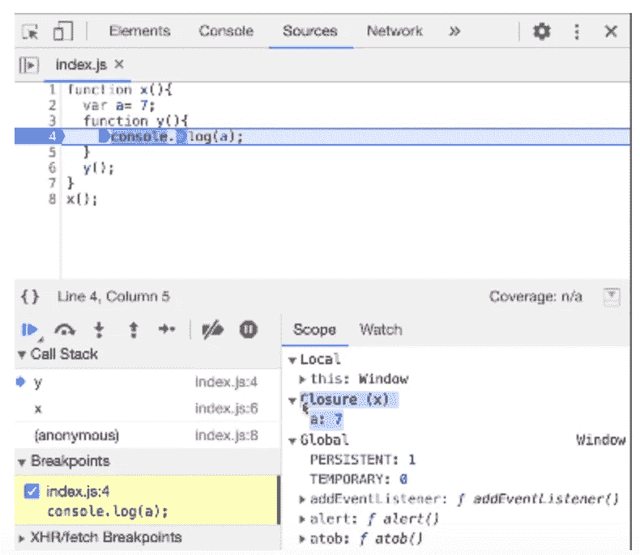

# 什么是终结？

> 原文：<https://medium.com/nerd-for-tech/what-is-closure-64f1274c1847?source=collection_archive---------0----------------------->


嗨，朋友们，在本帖中我们将会看到闭包的含义，以及为什么理解它对每个开发者来说如此重要。对于 javascript 或前端面试准备来说，闭包是最重要的话题之一。

现在我们来谈谈**闭包**到底是什么？

闭包只不过是函数及其词法范围环境。希望大家熟悉什么是词法作用域？

让我给你一个简单的闭包例子。假设我们有一个名为 inner()的函数嵌套在另一个名为 outer()的函数中，我们希望在内部函数中访问外部函数中的变量。

```
function outer(){
  var a = 7;
  function inner(){
     console.log(a);
  }
}outer();
```

在上面的例子中，当我们调用函数 outer()时，它的控制台将输出记录为 7。因为函数 inner()与其父函数的词法环境形成了一个闭包，因此我们能够访问函数 inner()内部的变量。



让我们看另一个闭包的例子来更好地理解这个主题。假设我们想打印从 1 到 5 的数字，数字 1 延迟 1 秒，数字 2 延迟 2 秒，依此类推。

为了解决上述问题，大多数开发人员将简单地编写一个 for 循环，并在循环中使用 setTimeout，如下所示，我们将得到奇怪的输出。

```
function x(){
   for(var i=1; i<=5; i++){
      setTimeout(function(){
         console.log(i)
      }, i*1000)
  }
}====== OUTPUT WILL BE =====
6
6
6
6
6
```

为什么它会这样…？让我破解密码，向你解释这里到底发生了什么。因此，在上面的代码 var 中，I 从 1–6 递增，并且在 console.log(i)运行变量 I 时，为引用 I 的每次迭代设置 setTimeout，变量 I 的值将为 6，因此每次都打印 6。

那么我们如何使用闭包来解决上述问题呢？让我们看看下面的代码。

```
function x(){
   for(var i=1; i<=5; i++){
      function y(t){
         setTimeout(function(){
            console.log(t)
         }, t*1000)
      }
      y(i)
   }
}
===== OUTPUT WILL BE ======
1
2
3
4
5
```

这一次，我们为 I 的每次迭代调用函数 y(t ),它为自己创建 I 的新副本，并分别传递给 setTimeout 函数。

所以最后的结论是“闭包只不过是函数与其词法环境的捆绑”。

> *如果你仍然不清楚什么是终结？我会推荐在阿克谢赛尼的 Youtube 频道* *观看* [*封关视频。这个帖子也是看他的 Namaste Javascript 系列写的。*](https://www.youtube.com/watch?v=qikxEIxsXco&t=927s)