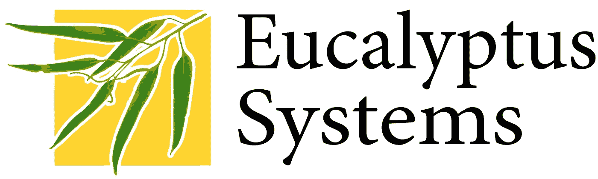
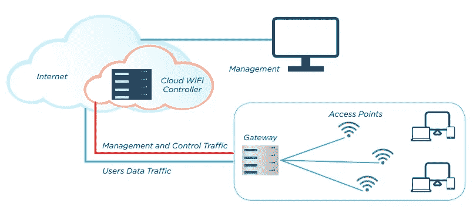

# 什么是云计算桉树系统？

> 原文：<https://medium.com/nerd-for-tech/what-is-cloud-computing-eucalyptus-system-ba631553e2de?source=collection_archive---------2----------------------->

## 介绍

云计算 Eucalyptus 系统是一款开源的付费计算机软件。它是在集群上应用云计算的基础设施。Eucalyptus 支持用户通过基础设施即服务(IaaS)产品按需设置计算和存储资源。公司使用 Eucalyptus 的软件来构建私有、公共或混合云。

除了服务器、网络、存储等 IT 资源，我们还可以使用 Eucalyptus 软件将我们自己的数据中心变成私有云。许多构建私有云的公司担心这一发展领域缺乏价值。他们现在不需要创造一个选择。这将把他们锁定在一个确切的供应商，并使其在未来很难改变。

Eucalyptus 起源于加州大学圣巴巴拉分校计算机科学系的一个研究项目。它在 2009 年开发了一个名为 Eucalyptus Systems 的营利性行业。

Eucalyptus 提供了一套组合的应用编程接口(API)。这与亚马逊网络服务非常匹配。2012 年 3 月，Eucalyptus Systems 宣布与亚马逊网络服务(AWS)签订正式合同。那就是同意管理员在 Eucalyptus 私有云与 Amazon Elastic Compute Cloud (EC2)之间移动请求，以创建混合云。

## 描述

桉树有许多不规则的特征。有些被强调为:

*   将 Linux 和 Windows 虚拟机(VM)结合在一起。
*   与 Amazon EC2 平台匹配良好的应用程序接口。
*   与亚马逊网络服务(AWS)和简单存储服务(S3)友好。
*   使用 VMware、Xen 和 KVM 与许多虚拟机管理程序协同工作。
*   可以从源代码或 DEB 和 RPM 包中安装和部署。
*   内部流程基础设施通过 SOAP 和 WS-Security 得到保护。
*   许多集群可以虚拟化为一个云。
*   目录结构，例如用户和组管理和报告。
*   自动缩放允许应用程序开发人员根据使用 Amazon EC2 兼容的 API 和工具定义的策略来扩展或缩减 Eucalyptus 资源
*   兼容 AWS 的服务弹性负载平衡为应用程序提供了更好的容错能力。
*   兼容 AWS 的服务 CloudWatch 使用户能够收集指标、修复警报、对趋势进行分类。还要采取措施来保障应用程序的轻松运行。
*   资源标记是针对按存储容量使用显示和按存储容量使用计费情形的细粒度报告。这使得 IT 或开发人员能够形成报告，按应用程序、部门或用户展示云操作。

## 软件架构

[Eucalyptus 命令](https://www.technologiesinindustry4.com/industry-4-0-microsoft-cloud-computing-based-windows-365/)可能同时实现亚马逊和 Eucalyptus 实例。用户也可以在 Eucalyptus 私有云与 Amazon Elastic Compute 云之间移动实例来构建混合云。硬件虚拟化将应用程序与计算机硬件细节分开。

**桉树公司使用的术语**

映像—映像是一组静态的软件模块。它从一个众所周知的基线开始。当捆绑和上传到 Eucalyptus cloud 时，这会开发一个 Eucalyptus 机器映像(EMI)。

实例—当放置图像以供使用时，它被命名为实例。配置在运行时执行。云控制器决定了映像运行的位置。还决定存储和网络连接的位置，以满足资源要求。

IP 寻址——Eucalyptus 实例可能有公共和私有 IP 地址。从映像创建实例时，会为实例分配一个 IP 地址。这些都是桉树云预先分配的。这些可以重新分配给正在运行的实例。

安全— TCP 或 IP 安全集合共享一组通用的防火墙规则。这是一种使用 IP 地址和端口阻塞或阻塞功能来隔离实例机制。实例在 TCP 或 IP 第 2 层是远程的。如果不存在，用户可以操作实例的联网。此外，用户可以获得相邻实例的入口，这违反了实例隔离和分离的简单云原则。

网络—体系结构中有三种网络模式。

*   在管理模式下，Eucalyptus 实现了一个本地实例网络，带有安全组和 IP 地址。
*   在系统模式下，Eucalyptus 分配一个 MAC 地址，并通过节点控制器的纽带将实例的网络接口分配给物理网络。系统模式不处理弹性 IP 地址、安全组或虚拟机分离。
*   在静态模式下，Eucalyptus 允许实例使用 IP 地址。静态模式不处理弹性 IP、安全组或虚拟机分离。

访问控制 Eucalyptus 的用户被分配一个身份。身份可以被分组在一起用于访问控制。

## 组件

云控制器(CLC)可以是一个 Java 程序，它提供 EC2 兼容的接口，也可以作为到地面世界的互联网接口。此外，为了处理传入的请求，CLC 通过云管理的管理界面来执行操作，并执行高级资源调度和系统记帐。CLC 从命令行界面(如 euca2ools)或基于 GUI 的工具(如 Eucalyptus 用户控制台)接收用户 API 请求。它实现了基本的计算、存储和网络资源。每个云可能只有一个 CLC。它处理验证、办公、报告和配额管理。

Walrus，也是用 Java 写的，是那种像 AWS 一样的桉树简单存储服务(S3)。Walrus 将确定的存储分配给 Eucalyptus 云中的所有或任何虚拟机。它可以用作简单的 HTTP put 或 get 存储即服务解决方案。对于 Walrus 来说，数据类型没有什么限制。它可以包含映像、卷快照和应用程序数据。每朵云上可能只有一只海象。

集群控制器(CC)是用 C 编写的，它充当 Eucalyptus 云中集群的前端。它连接存储控制器和节点控制器。它管理每个集群的实例(即虚拟机)执行和修复级别协议(SLA)。

存储控制器(SC)是用 Java 打印的。它连接集群控制器和节点控制器，并管理 Eucalyptus 块卷。它为特定集群中的实例拍摄快照。如果一个实例需要将持久数据写入集群之外的内存，它可能会写入 Walrus，Walrus 位于任何集群中的任何实例。

VMware 代理是一个可选组件，它为 VMware 环境提供了一个 AWS 兼容的接口，并在群集控制器上运行。VMware 代理重叠当前的 ESX 或 ESXi 主机，并将 Eucalyptus 机器映像(EMI)转换为 VMware 虚拟磁盘。VMware 代理协调集群控制器和 VMware 之间的交互。它可以连接到 ESX 或 ESXi 主机，也可以连接到 vCenter Server。

节点控制器(NC)用 C 编写，托管虚拟机实例。它实现了虚拟网络端点。它从 Walrus 下载并缓存图像，同时创建并缓存实例。虽然每个集群的节点控制器数量没有理论上的限制，但性能限制确实存在。

更多详情请访问:[https://www . technologiesinindustry 4 . com/what-is-cloud-computing-eucalyptus-system/](https://www.technologiesinindustry4.com/what-is-cloud-computing-eucalyptus-system/)