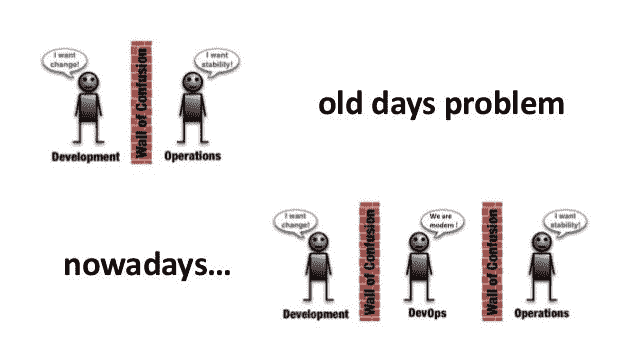
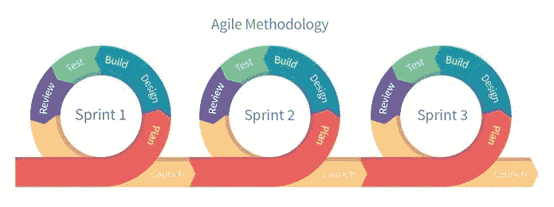
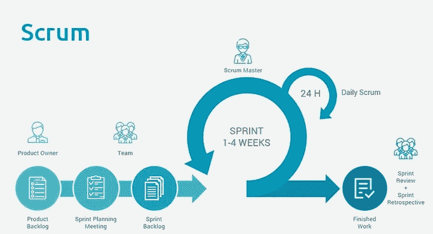
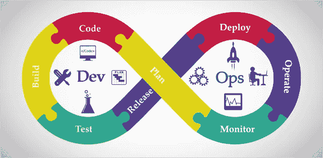
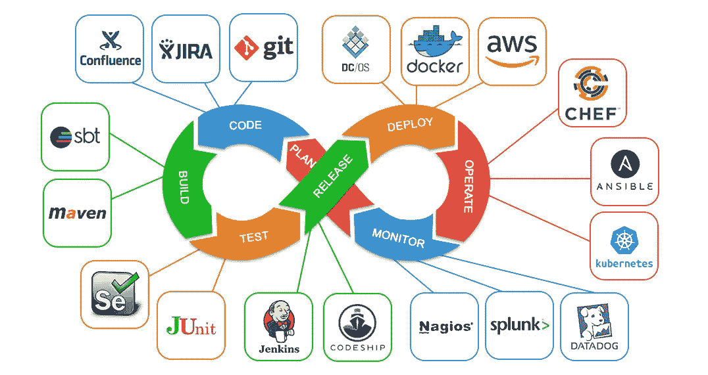

# DevOps 是什么？？？

> 原文：<https://medium.com/nerd-for-tech/what-is-devops-8c96cf591738?source=collection_archive---------10----------------------->

图片:[来源](https://www.google.com/url?sa=i&url=https%3A%2F%2Fwww.slideshare.net%2Falimenkou%2Ffunny-stories-and-antipatterns-from-devops-landscape&psig=AOvVaw1W5MlT3k0Q1vdJ54pO8Ybg&ust=1623699600681000&source=images&cd=vfe&ved=0CA0QjhxqFwoTCLjYzcKulfECFQAAAAAdAAAAABAO)

> 使命召唤:特种作战::软件开发:DevOps

DevOps 是**Dev**development 和**Op**operation**s**之间的紧密合作，以自动化软件开发和部署。简单来说，它可以被描述为通过构建应用程序的人员和操作人员之间的清晰沟通来创建更好产品的过程。

> DevOps 是软件开发中的新文化

# 与其他车型有何不同？

## 瀑布模型:

软件开发:瀑布模型

这种型号可以追溯到二战时期。这是一种传统的方法，一步一步来。在这种情况下，关键交付件通过一组阶段级联，以构建解决方案。让我们简单介绍一下每个步骤。

***需求:*** 与客户坐下来谈的步骤🤵理解并分析他们在解决方案(软件)中实际寻找的是什么。

***设计*** :项目 plan✍是为了评估成功交付所需的工作水平而建立的🤝给客户的解决方案。

***开发:*** 这一步是实际解决方案构建发生的地方即程序员👩‍💻👨‍💻开始编码，构建应用。根据应用和要求，这可能需要几周或几个月的时间。

***测试:*** 在这个阶段，编码预计完成。它被发送给另一组人👨‍💼👩‍💼根据应用程序附带的系统和数据库测试应用程序。

***部署:*** 在所有测试之后，应用程序或解决方案最终被部署到生产环境中。

***维护:*** 这一步有助于我们确保应用程序保持无缝运行，并解决任何潜在的风险或问题。

这一切看起来都很好，直到客户对部署的解决方案提出额外的要求或更改。这意味着我们必须重启整个项目。想象一下它会变得多么昂贵和耗时。

图片:[来源](https://www.google.com/url?sa=i&url=https%3A%2F%2Fblogs.cfainstitute.org%2Finvestor%2F2016%2F07%2F27%2Ftheory-to-practice-siegel-and-waring-on-retirement-spending-rules%2F&psig=AOvVaw0Rh4b-Cjh9P7tK-VpF7LBz&ust=1623112799166000&source=images&cd=vfe&ved=0CA0QjhxqFwoTCMi-7sWkhPECFQAAAAAdAAAAABAJ)

其他模式的动机:

(I)在项目期间或项目结束后进行变更非常昂贵

㈡软件必须以更快的速度和更少的资源交付

(III)在开发前的第一阶段，无法理解所有客户要求

## 敏捷模型:

图片:[来源](https://www2.stardust-testing.com/en/blog-en/testing-in-an-agile-project)

在这种模式下，程序员可以准备原型来理解客户的需求。客户可以给出一些有价值的反馈。构建软件的整个过程被分成称为 sprints 的小块。一个 sprint 包含(计划、设计、构建、测试和评审)阶段。它可以持续大约两个星期，这比瀑布模型好得多。因此，这里鼓励对代码进行持续改进或实现，以满足客户需求。下图非常清晰地解释了敏捷模型中的每个周期。

图片:[来源](https://www.google.com/url?sa=i&url=https%3A%2F%2Foperationsclubimi.wordpress.com%2F2019%2F05%2F23%2Fopscoop-chapter-iii-issue-xxxiv-embracing-agile%2F&psig=AOvVaw09PDZ1toUGCdL5WDrdc2kP&ust=1623202209034000&source=images&cd=vfe&ved=0CA0QjhxqFwoTCLiMqczxhvECFQAAAAAdAAAAABAJ)

在这个过程中，客户需求得到了更好的理解，我们可以更快地交付解决方案。一些缺点包括缺少生产环境中的测试，因为产品只在开发人员系统上进行测试。此外，开发人员和运营团队独立工作，很少或没有沟通。

开发团队将他们的工作提交给运营团队进行部署。当产品在生产服务器中失败时，操作团队毫无头绪，将产品送回开发团队。他们的主要挑战是他们不知道完整的代码是如何工作的。

这就是 **DevOps** 的用武之地…

图片:[来源](https://www.google.com/url?sa=i&url=https%3A%2F%2Ftenor.com%2Fsearch%2Fpresenting-gifs&psig=AOvVaw2taDzxI9TpDQ4dRIviOTXj&ust=1623203344475000&source=images&cd=vfe&ved=0CA0QjhxqFwoTCOCFgPL1hvECFQAAAAAdAAAAABAf)

## DevOps 简介

开发人员和运营团队的合作是成功和持续交付的关键。这是敏捷模型的一个发展。将它们结合在一起有助于无缝执行流程，以构建在类似生产的环境中测试的解决方案。在这种情况下，运营团队很容易发挥他们的优势，即监控应用程序并向开发人员提供相关反馈。

## 开发阶段

图片:[来源](https://www.google.com/url?sa=i&url=https%3A%2F%2Fwww.eginnovations.com%2Fblog%2Ftop-devops-tools%2F&psig=AOvVaw2q9bk155gdeTGCRHkI77BQ&ust=1623100108784000&source=images&cd=vfe&ved=0CAMQjB1qFwoTCPDV7aP1g_ECFQAAAAAdAAAAABAD)

***计划:*** 在这个阶段，业务所有者和软件开发团队讨论项目目标并创建计划

***代码:*** 程序员然后设计并编写应用程序，并使用类似 Git(分布式版本控制环境)的工具来存储应用程序代码

***构建:*** 像 Maven 和 Gradle 这样的构建工具从不同的存储库中获取代码，并将它们组合起来构建完整的应用程序。

***测试:*** 使用 Selenium 和 JUnit 等自动化测试工具对应用程序进行测试，以确保软件质量。这可以通过使用脚本进行有效的自动化测试来有效地完成

*发布/集成:当测试阶段完成后，通常使用 Jenkins 将新特性自动集成到已经存在的代码库中。这也被认为是部署前的发布阶段*

****部署:*** 应用程序在发布后打包，并最终确定从开发服务器部署到生产服务器*

****运营:*** 一旦部署了代码，运营团队就配置服务器，并为它们提供所需的资源。像 Chef 和 Ansible 这样的工具在生产环境中检查代码的符合性*

****监控:*** 监控允许 IT 组织识别特定版本的特定问题，以了解对相应最终用户的相应影响*

## *DevOps 工具*

**

*图片:[来源](https://www.google.com/url?sa=i&url=https%3A%2F%2Fwww.learnitguide.net%2F2018%2F02%2Fdevops-tutorial-for-beginners-online.html&psig=AOvVaw28zsGR9A0fnv178lEjkOIt&ust=1623717100924000&source=images&cd=vfe&ved=0CA0QjhxqFwoTCMD5rNvvlfECFQAAAAAdAAAAABBI)*

*这是一些 DevOps 工具的明细。这些工具是开源工具。还有许多其他工具，这些只是最流行的一些。你可能已经用过很多了。一些工具有助于创建完全可脚本化的环境。将脚本生产化和自动化会更有效。更有效的自动化也保证了我们一致的体验。*

## *DevOps 流程*

**

## *DevOps 优势*

*DevOps 的好处可以通过多种形式体验。*

*(一)**技术效益**:*

*(a)连续软件交付*

*(b)降低复杂性，更快解决问题*

*(二)**文化福利:***

*(a)更快乐和更有成效的团队*

*(b)更好的职业发展和更高的员工参与度*

*(三)**商业利益:***

*(a)更快地交付解决方案或功能*

*(b)更稳定的运作环境*

*(c)改善团队之间的协作(开发和运营)*

*(d)有更多时间进行创新*

*这种趋势软件开发方法使用适应性发布管理、更短的开发周期、更高的部署频率和更快的到达。它还带来了组织内部的文化变革，因为它主要依赖于沟通、协作和创新。*

**

*这些是一些出色使用 DevOps 的开创性公司。一个人不需要成为热门的网络公司或 IT 巨人就能擅长开发运维。无论大小和年龄，许多人都做出了杰出的贡献，对自己和世界都产生了影响。*

*你还在等什么？？*

**

****参考文献:****

* [## DevOps 教程| devo PS 简介| Edureka

### 本 DevOps 教程提供了一系列主题，包括什么是 DevOps，其阶段，DevOps 工具，DevOps 工程师工作…

www.edureka.co](https://www.edureka.co/blog/devops-tutorial)  [## 10 家公司在 DevOps 大获成功

### 关于 DevOps 是什么已经写了很多，但是关于它能为一个组织做什么却没有说很多。的…

techbeacon.com](https://techbeacon.com/devops/10-companies-killing-it-devops)  [## 2021 年 49 大必备开发运维工具

### 没有 DevOps 和 DevOps 工具，创建软件产品在今天几乎是不可能的。除非你是…的超级粉丝

blog.exigence.io](https://blog.exigence.io/top-49-devops-tools-for-2021)  [## DevOps 简介

### DevOps 快速入门。查看我的其他相关文章。

javier-ramos.medium.com](https://javier-ramos.medium.com/introduction-to-devops-ee81fd1578be)*