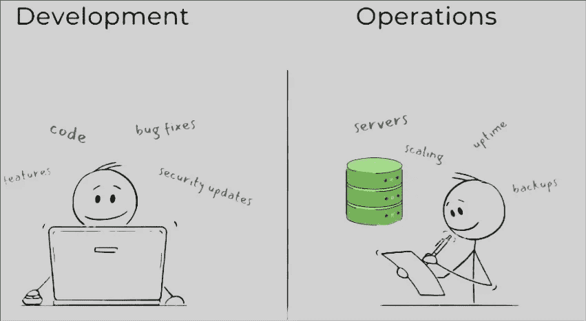
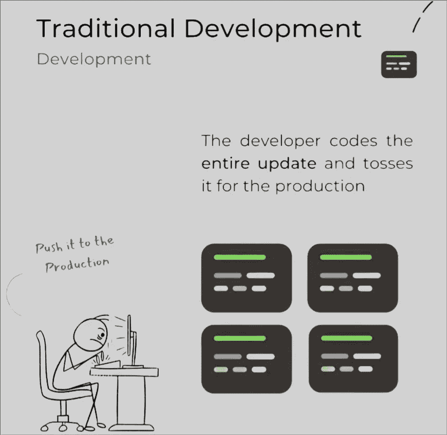
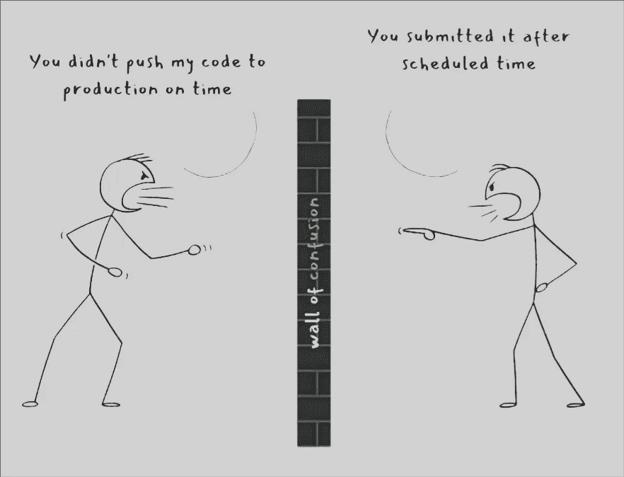
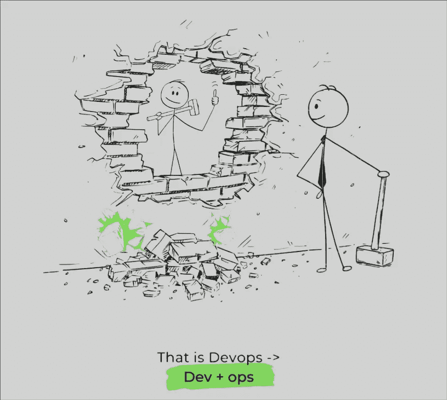
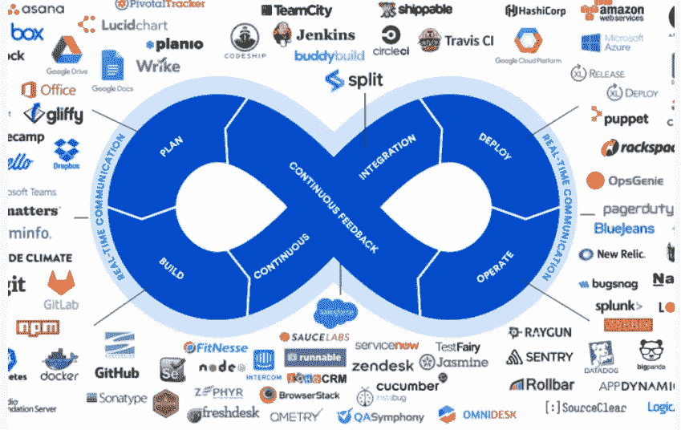
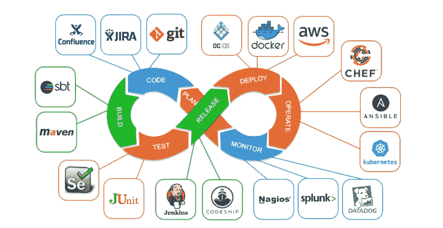

# 什么是 DevOps

> 原文：<https://medium.com/nerd-for-tech/what-is-devops-a152160037f3?source=collection_archive---------3----------------------->

敏捷软件开发

DevOps 方法依赖于优秀的技术来让团队快速可靠地为他们的客户进行部署和开发。这些技术应该使团队**到**能够大规模管理复杂的系统，自动化繁琐的活动，并让工程师控制开发人员的高速步伐。

# 过去的故事是什么？

让我们考虑大型组织，他们正在开发一个应用程序。最有可能的是**，**他们曾经有不同的团队，如下图所示。

1.  开发人员将处理所有的编码和包数据等。
2.  运营部将处理扩展、部署等事宜。
3.  作为组织，我们必须跟踪每一个变化和版本。
4.  手动将代码推送到生产环境，或者针对不同的操作使用不同的工具。

## 传统开发方法:

开发人员将开发应用程序的完整代码，并将其推向 SVN，进一步生产。

开发人员尝试编写所有应用程序的代码，并向运营团队提供生产中代码库的更新。运营团队将创建一个文件夹，对最新代码进行版本控制，并将其添加到生产中。

在许多情况下，如果开发人员忘记了一些更新/错过了任何功能，就会被带回给他，然后循环重新开始。有时由于人为错误，我们可能会错过一些代码版本，或者将旧版本部署到生产环境中。

当这些更新出现延迟时，开发人员和基础设施团队之间就会开始相互指责。也可能有一些代码不匹配，这将导致最终产品的更多延迟和客户信任的损失。

那么，是什么导致了这个问题呢？

那么，我们如何解决这个问题呢？为什么不干脆打破这堵墙？

当团队一起工作时，开发和部署中出错的机会就会减少。

## DevOps 不是技术、工具或框架

DevOps 是一场文化运动。心态，用来协调和生产更好更可靠产品的哲学。

DevOps 实践依赖于有效的工具来帮助团队快速可靠地为他们的客户进行部署和创新。这些工具应该自动化手动任务，帮助团队管理大规模的复杂环境，并让工程师控制开发运维的高速度。

DevOps 工作流程由多个阶段组成:

*   规划产品开发的下一次迭代
*   构建代码
*   测试并部署到生产环境中
*   交付产品更新
*   监控和记录软件性能，收集客户反馈

在 DevOps 中，通过自动化基础设施和工作流并持续测量应用程序的性能，团队利用了许多工具。

DevOps 是一组实践，强调软件开发人员和其他信息技术(IT)专业人员之间的协作和交流，同时自动化软件交付和基础设施变更的过程。它的实现可以包括在生命周期的不同阶段使用的一组工具的定义。

下面是一些可以在 DevOps 生命周期中使用的工具。

我们可以将 DevOps 流程想象成一个无限循环，通过图示步骤和反馈，以及计划，继续重置循环。

“DevOps 只是增加了一个想法，即小型的跨职能团队应该拥有从概念到用户反馈和生产监控的整个交付过程。”—马克·施瓦茨