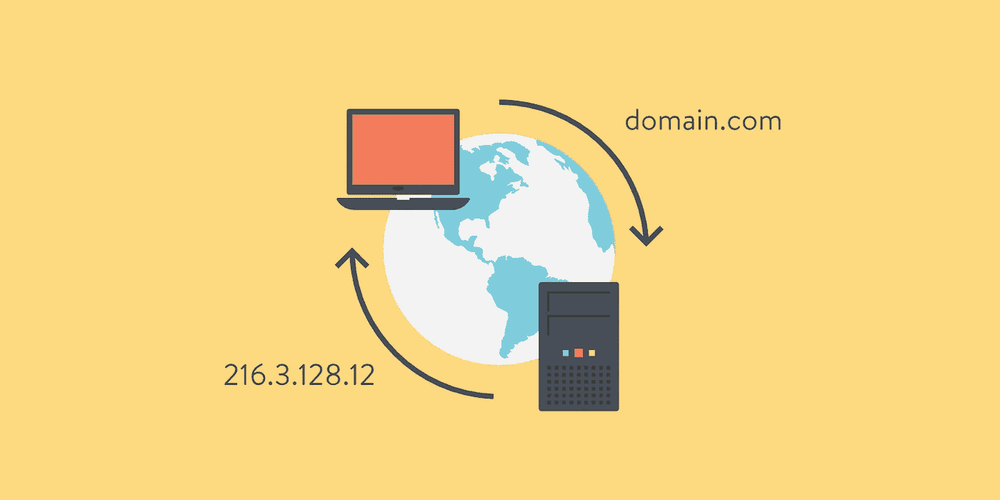
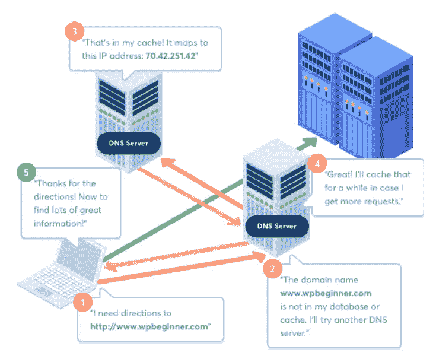
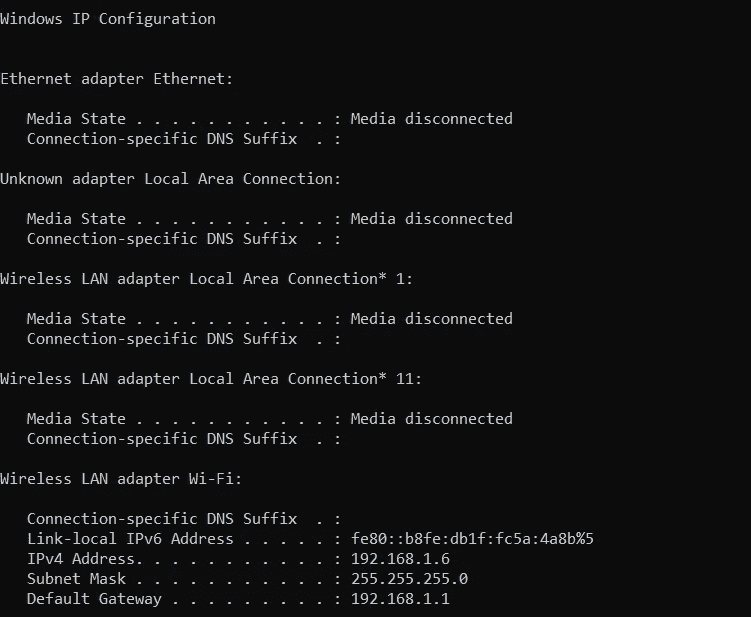
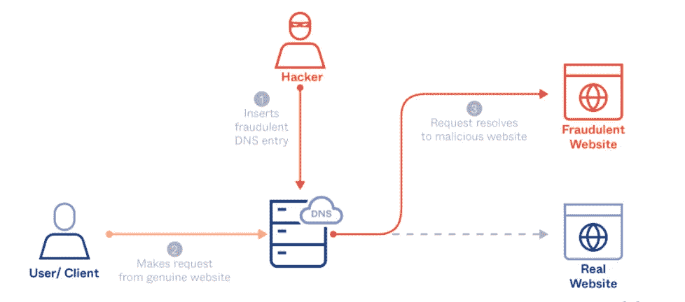

# 什么是 DNS 欺骗？

> 原文：<https://medium.com/nerd-for-tech/what-is-dns-spoofing-b19b91ced0c9?source=collection_archive---------21----------------------->



图片由 vednam.com 拍摄

DNS 欺骗(又名 **DNS 中毒**)是一种常见的网络攻击，当虚假信息进入域名服务器的缓存时就会发生。因此，DNS 查询会将用户重定向到虚假网站。因此，攻击者可以窃取有价值的信息，如密码、账号和个人信息。因此，在这篇文章中，我将解释 DNS 欺骗。但是在开始之前，我们应该对 DNS 及其工作原理有适当的了解。

# 什么是 DNS(域名系统)？

在互联网诞生之初(20 世纪 80 年代初)，人们很容易通过特定的计算机与特定的 IP 地址保持联系。因为那时互联网是一个非常小的网络。但随着时间的推移，互联网越来越受欢迎，吸引了更多的人进入网络。从那时起，人们想要一个地址，由容易记住的单词组成，这就是**【域名】**的由来。

DNS 是一个提供基础设施的计算机系统，允许我们浏览互联网。您可能已经知道，计算机使用 IP 地址相互通信。但问题是，我们无法记住所有成千上万的数字来访问网站。所以，这就是我们用域名代替 IP 地址的原因。记住域名比记住它的 IP 地址要容易得多。例如，我们可以使用 DNS 通过域名在线访问信息，如 google.com 或 wikipedia.org。

当你想要一个使用域名的访问网站时，我们通常在浏览器中输入 URL。然后 DNS 做的是，它将把域名转换成 IP 地址，因为你的计算机需要知道该域名的确切 IP 地址。简单地说，我们把这个转换过程称为查询。为了理解这个过程，让我们来详细看看 DNS 是如何工作的。

# DNS 是如何工作的？

如果你想用手机给某人打电话，通常你要做的是在联系人列表中浏览那个人的名字，而不是在拨号盘上拨号。所以，当你想访问一个网站时，DNS 做什么是一样的。让我们看看 DNS 在这个过程中需要哪些步骤。



图片:域名系统如何工作(www.wpbeginner.com)

1.  **发送域名信息请求:**当您在浏览器中输入一个网站的 URL 时，您的计算机会询问一个 IP 地址以便加载该网站。因此，你的计算机将要做的是，它将尝试通过 DNS 缓存和任何可用的外部资源搜索信息。
2.  **本地搜索 IP:**但是在搜索外部资源之前，您的计算机会加载本地 DNS 缓存，以检查您是否已经为输入的域名请求了该 IP 地址。每台计算机都有这个缓存，它包含我们最近所有请求的信息。然而，如果它有你正在寻找的网站的信息，网站将很快加载。原因在于，您的计算机不需要将请求转发给 ISP。
3.  **联系 ISP 和它的递归 DNS 服务器:**DNS 缓存并不总是有你的电脑寻找的数据。在这种情况下，您的计算机将查询另一台服务器。这些服务器(递归 DNS 服务器)具有与您的计算机相同的本地缓存。通常互联网服务提供商(ISP)使用相同的递归 DNS 服务器。因为所请求的域可能存在于其高速缓存中。如果存在，那么查询将结束，网站将显示给您。
4.  **查询权威 DNS 服务器:**在这种情况下，如果递归 DNS 服务器没有要查找的域名信息，搜索将继续，直到在这些权威 DNS 服务器中找到该域名的域名服务器。
5.  **访问 DNS 记录:**为了找到您正在寻找的 IP 地址，权威名称服务器将查询地址记录。递归 DNS 服务器从权威名称服务器访问该域名的地址记录。那么它将存储在本地缓存中。因此，如果你试图在另一天再次访问该网站，递归服务器有信息。
6.  **最终 DNS 步骤:**在最终步骤中，递归 DNS 服务器会将信息返回到您的计算机，并将记录存储在其本地缓存中。现在，IP 地址被识别并传递到您的浏览器。所以，浏览器会显示那个网站的内容。

如果您好奇并想知道您的计算机的 IP 地址、DNS 设置、子网掩码和默认网关信息，您可以简单地将以下命令粘贴到您的计算机终端。

```
**- ipconfig
- ipconfig/all**: It gives the full configuration of the system.
```



图:显示配置信息

> 如果你想找到你的外部 IP 地址，你可以简单地访问**[**whatismyipaddress.com**](https://whatismyipaddress.com/)**网站，它会显示你的外部 IP 地址。****

# ****DNS 欺骗(DNS 中毒)****

****DNS 欺骗是一种常见的网络攻击，当虚假信息进入域名服务器的缓存时就会发生。因此，DNS 查询会将用户重定向到虚假网站。假设这个假网站是脸书的复制品。在这个假冒的网站上，它会要求用户使用他们的帐户凭证登录他们的帐户。因此，攻击者将窃取他们的用户凭据和其他敏感信息。此外，假冒网站可能会在用户的计算机上安装病毒和恶意软件，使攻击者能够长期访问机器及其存储的数据。****

********

****图片:DNS 欺骗(www.okta.com)****

****当 DNS 服务器缓存 DNS 转换以加快浏览速度时，攻击者会利用这个机会进行 DNS 欺骗。因此，攻击者所做的是，他将注入一个伪造的 DNS 条目到 DNS 服务器。因此，所有用户都将使用伪造的 DNS 条目，直到缓存过期。但是缓存过期后，DNS 条目会恢复正常状态。即使攻击者已经完成了他的任务，如果 DNS 服务器的软件仍然没有更新，他可能会继续欺骗。****

****DNS 中毒的主要原因很难发现，因为攻击者确保建立一个与原始网站完全相似的假网站。****

****执行 DNS 欺骗攻击主要有两种方式，如下所示。****

*   ******中间人(MITM)攻击:**这基本上是通过阻止用户和 DNS 服务器之间的通信来实现的，以便将用户路由到恶意的 IP 地址。如果你想知道更多关于 MITM 袭击的细节，我已经在这里单独写了一篇文章[](/geekculture/understanding-arp-poisoning-mitm-attack-7b12a3b061bd)**。******
*   *******DNS 服务器受损:**这是通过直接劫持 DNS 服务器实现的，该服务器被配置为返回恶意 IP 地址。*****

# *****如何防止 DNS 欺骗*****

*****作为普通网站用户，我们无法阻止 DNS 欺骗。相反，网站所有者和 DNS 服务提供商有责任保护用户免受 DNS 攻击。*****

*****有几种方法可以防止 DNS 欺骗。*****

*   *******实施 DNS 欺骗检测机制:**实施或使用工具，在允许 DNS 数据进入用户之前对其进行扫描。*****
*   *******使用加密数据传输协议:**使用端到端加密，发送出去的数据是加密的，因此攻击者无法访问 DNS 数据。*****
*   *******使用 DNSSEC:** DNSSEC 的首字母缩写代表域名系统安全扩展。开发此协议是为了通过添加额外的验证方法来保护 DNS。因为 DNS 是一种未加密的协议，它很容易成为攻击者通过欺骗拦截流量的目标。*****

*****但是我们最终可以遵循几种方法来保护自己。*****

*   *****不要点击你不认识的链接*****
*   *****使用虚拟专用网络(VPN)*****
*   *****定期扫描您的计算机中的病毒和恶意软件*****
*   *****刷新 DNS 缓存以解决中毒问题*****

*****所以，这是文章的结尾，我希望你喜欢它。快乐编码👨‍💻。*****

## *****参考*****

*****[](https://phoenixnap.com/kb/what-is-domain-name-system-works) [## 什么是域名系统&它是如何工作的？| PhoenixNAP KB

### 域名系统(DNS)最早出现于 20 世纪 80 年代初。它代表了一个互连的服务器系统…

phoenixnap.com](https://phoenixnap.com/kb/what-is-domain-name-system-works) [](https://www.networkworld.com/article/3268449/what-is-dns-and-how-does-it-work.html) [## 什么是 DNS，它是如何工作的？

### 域名系统(DNS)是互联网的基础之一，然而网络之外的大多数人可能…

www.networkworld.com](https://www.networkworld.com/article/3268449/what-is-dns-and-how-does-it-work.html) [](https://www.keycdn.com/support/dns-spoofing#summary) [## 什么是 DNS 欺骗？-key dn 支持

### 当特定的 DNS 服务器的记录被恶意“欺骗”或更改以将流量重定向到…

www.keycdn.com](https://www.keycdn.com/support/dns-spoofing#summary) [](https://www.imperva.com/learn/application-security/dns-spoofing/) [## 什么是 DNS 欺骗|缓存中毒攻击示例| Imperva

### 域名服务器(DNS)欺骗(也称为 DNS 缓存中毒)是一种攻击，在这种攻击中，被篡改的 DNS 记录被用来…

www.imperva.com](https://www.imperva.com/learn/application-security/dns-spoofing/)*****