# 什么是虚拟变量陷阱？如何使用 python 来处理它？

> 原文：<https://medium.com/nerd-for-tech/what-is-dummy-variable-trap-how-it-can-be-handled-using-python-78ec17246331?source=collection_archive---------3----------------------->

照片由[像素](https://www.pexels.com/photo/arachnid-branches-close-up-cobweb-276243/?utm_content=attributionCopyText&utm_medium=referral&utm_source=pexels)的[皮克斯拜](https://www.pexels.com/@pixabay?utm_content=attributionCopyText&utm_medium=referral&utm_source=pexels)拍摄

**虚拟变量陷阱**发生在预测器多重共线时，即一个预测器可以预测另一个预测器。

**虚拟变量陷阱的统计分析**

例如，如果我有一个如下所示的数据集(这里只显示了 15 行)，其中前 4 个特征用于预测利润。前 3 列包含数字数据，第四列 D 包含分类数据。在建立模型之前，要对分类数据进行编码。

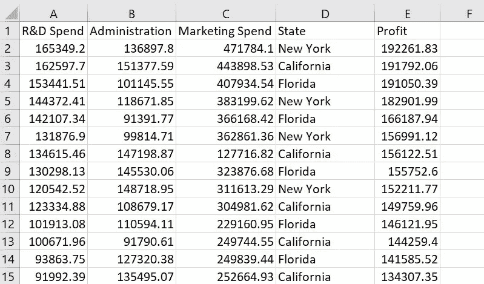

数据集来自 Kaggle 的 karthickveerakumar

进一步分析 D 列，很明显利润预测是针对美国 3 个州加利福尼亚、佛罗里达和纽约的。

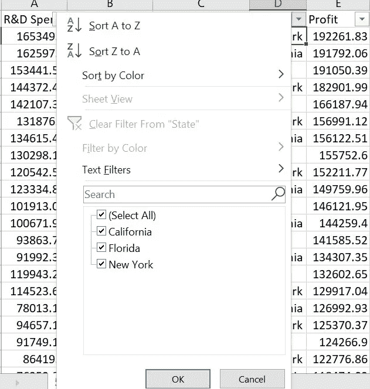

对于 D 列分类数据的编码，让我们用 3 个虚拟变量 D1 代表加利福尼亚州，D2 代表佛罗里达州，D3 代表纽约州。

设加利福尼亚州的矩阵表示为[100]，佛罗里达州为[010]，纽约州为[001]。

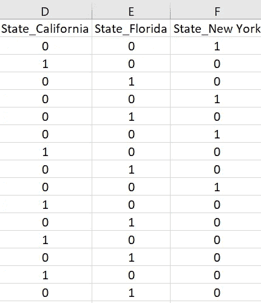

D1、D2 和 D3 高度相关或多重共线性，因为如果 D1 和 D2 为零，显然 D3 将为 1。即。如果数据不属于加利福尼亚州或佛罗里达州，那么可以肯定的是，数据属于纽约州。这意味着两个虚拟变量可以预测第三个变量。

或者在更广泛的意义上，可以说，如果一个虚拟变量被丢弃，则不会丢失相关信息，因为其他虚拟变量可以完全解释被丢弃的特征。因此，如果有 n 个虚拟变量，n-1 个虚拟变量将能够预测第 n 个虚拟变量的值。因此，为了避免****虚拟变量陷阱，必须丢弃**一个虚拟变量。**

**这里，回归模型可以表示为**

**y =β0+β1(X1)+β2(x2)+β3(X3)+β4d 1+β5d 2+β6d 3+ε—**等式 1****

**我们有 D1+D2+D3 = 1**

**或者 D3 = 1- (D1+D2) — **等式 2** 表明 D3 可以由另外两个虚拟变量 D1 和 D2 完美地解释**

**如果我们在 1 中使用**等式 2，**我们得到**

**y =β0+β1(X1)+β2(x2)+β3(X3)+β4d 1+β5d 2+β6(1-(D1+D2))+ε**

**y =β0+β1(X1)+β2(x2)+β3(X3)+β4d 1+β5d 2+β6-β6 D1-β6 D2+ε**

**y =(β0+β6)+β1(X1)+β2(x2)+β3(X3)+(β4-β6)D1+(β5-β6)D2+ε**

**y =β0 *+β1(X1)+β2(x2)+β3(X3)+β4 * D1+β5 * D2+ε—**等式 3****

**从等式 3 可以清楚地看出，系数β0、β4 和β5 受 D3 系数β6 的影响。因此，应该删除一个虚拟变量，以避免被虚拟变量捕获。**

****用 Python 构建回归模型处理虚拟变量陷阱****

**导入 python 库，然后导入数据集。**

**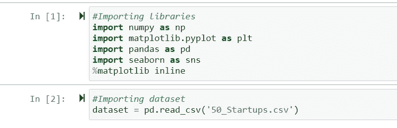**

**要查看数据集的前 15 行，我们可以使用 **dataset.head(15)** 。**

**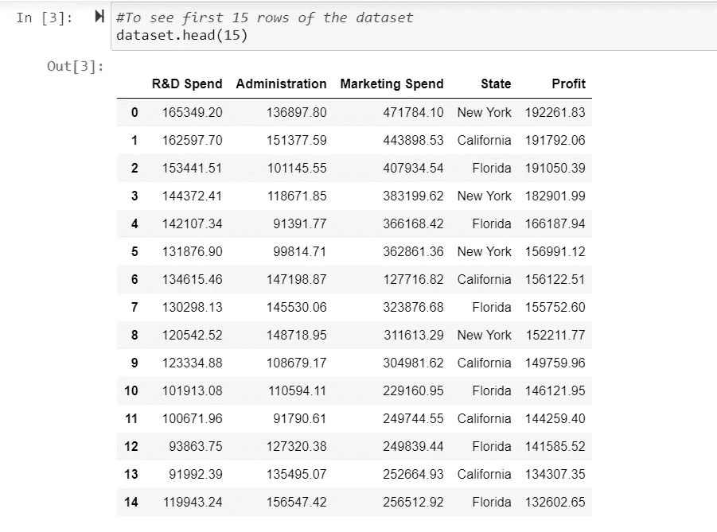**

**要检查是否有数据丢失，可以使用 **dataset.info()** 。**

**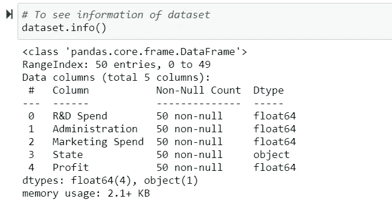**

**没有丢失数据，因为所有 5 列都有 50 个非空值。**

**要找到相关性的数值**可以使用 dataset.corr()** 并查看变量之间的关系**可以使用 sns.pairplot()** 。**

**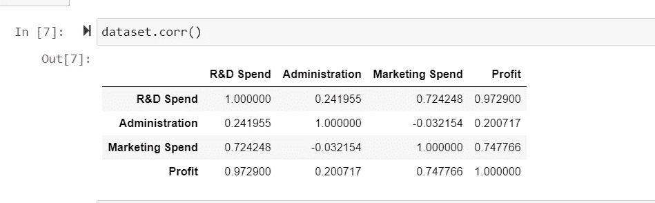****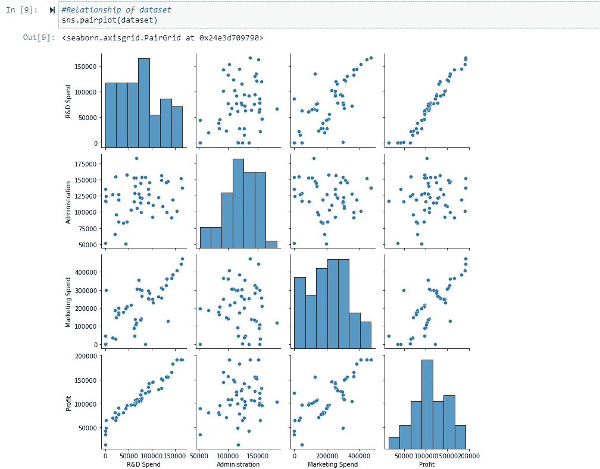**

**从 **dataset.corr()** 和 **sns.pairplot()，**可以明显看出，利润与研发支出高度相关，与营销支出相关性较好，与管理相关性较低。**

**使用热图可视化数据集可通过 **sns.heatmap()** 完成，并使用“annot = True”相关值将显示在热图中。**

**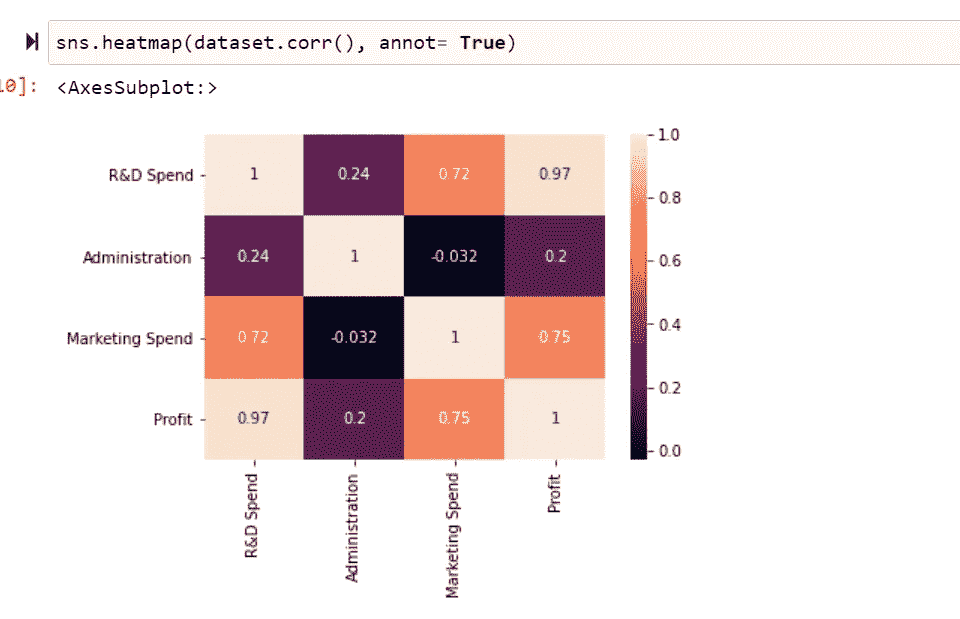**

**在 X 中指定自变量，在 y 中指定因变量利润。**

**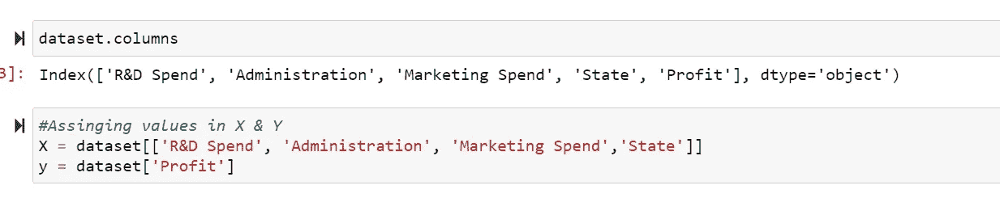****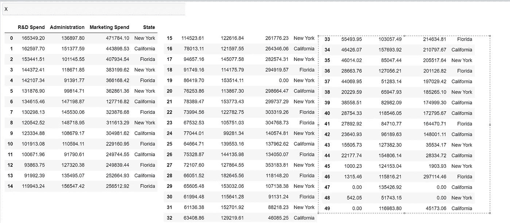****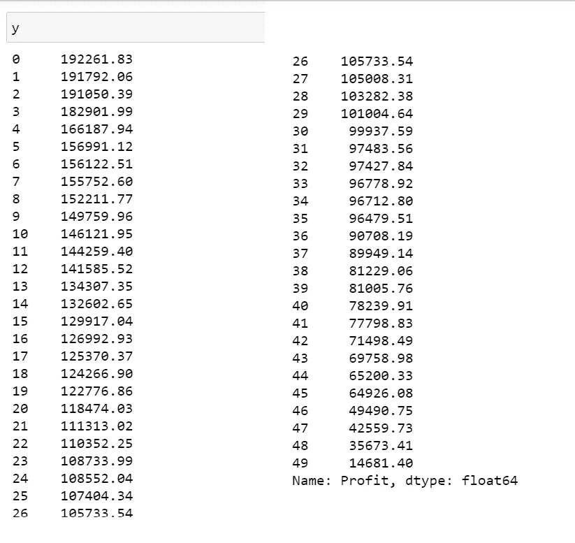**

**由于第四列“state”包含分类数据，因此应该在构建模型之前对其进行编码。**

**对于编码分类数据，如果我们对加利福尼亚州采用 3 个虚拟变量 D1，对佛罗里达州采用 D2，对纽约州采用 D3，这将导致虚拟变量陷阱。如前所述，D1、D2 和 D3 高度相关或多重共线性，因为如果 D1 和 D2 为零，显然 D3 为 1。即。，如果数据不属于 State_California 或 State_Florida，那么可以肯定，数据属于 State_NewYork。**

**因此，为了避免虚拟变量陷阱，我们必须在构建模型时删除一个虚拟变量。**

**这可以通过 **X=pd.get_dummies(X，drop_first=True)，**来完成，它将删除一个虚拟变量。**

**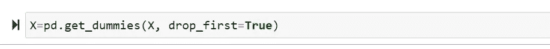**

**州的矩阵表示将是[100]代表加利福尼亚州，[010]代表佛罗里达州，[001]代表纽约州。“drop_first = True”将删除虚拟变量 State_California。**

**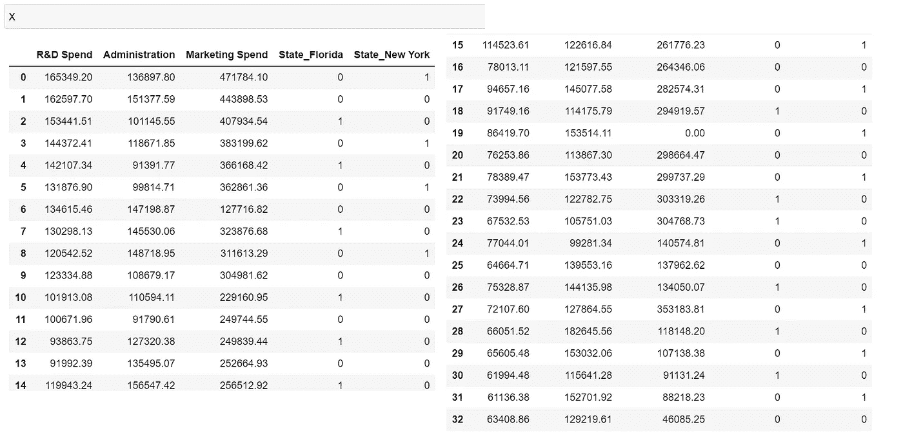****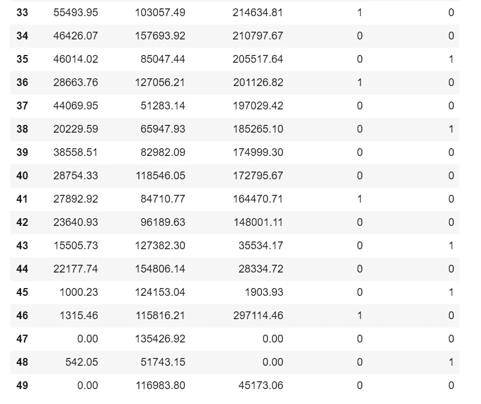**

**通过使用 **Scikit-learn** 库的 **Model_selection** 模块中的函数**train _ test _ split function**，可以将数据集拆分成训练集和测试集。测试大小取总数据集的 1/3，random_state 取 101。**

**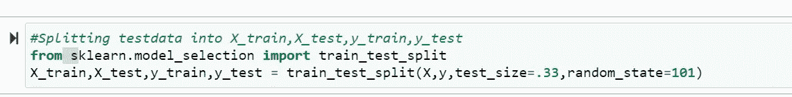****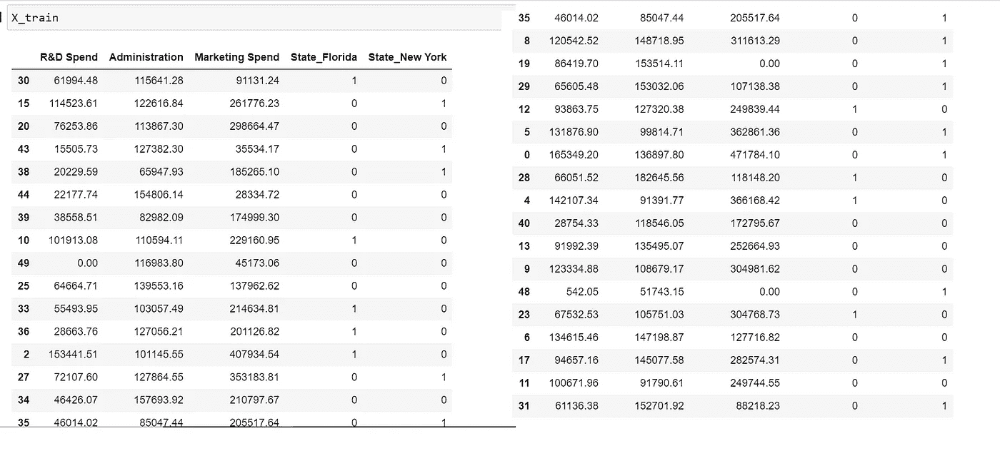****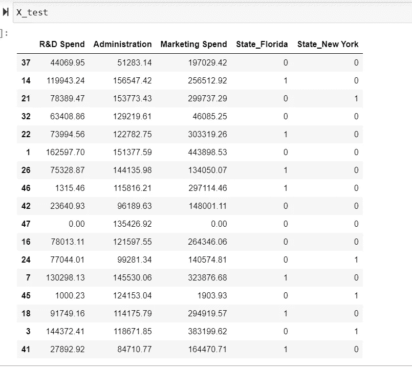****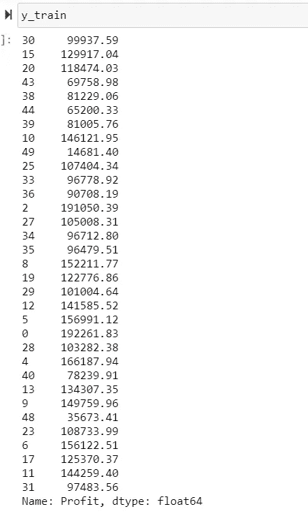****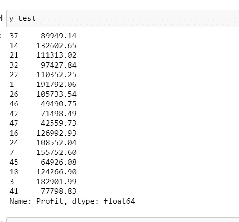**

**线性回归模型' lr '可以通过使用 **Scikit-learn** 库的模块 **linear_model** 来构建。**

**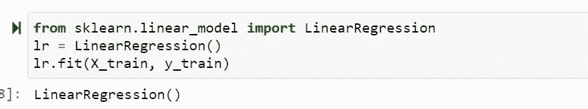**

**可以使用 **lr.predict()** 来预测 y 值。**

**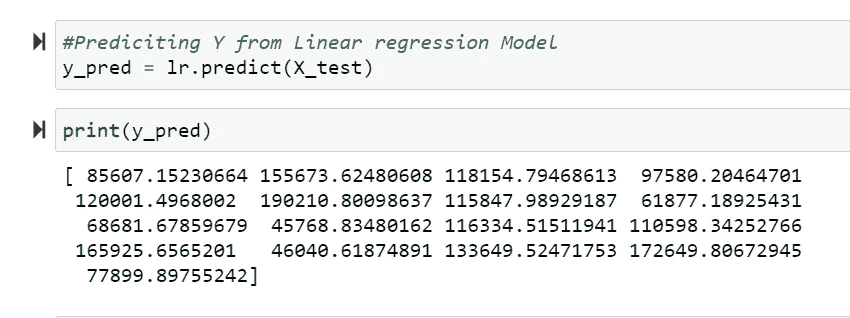****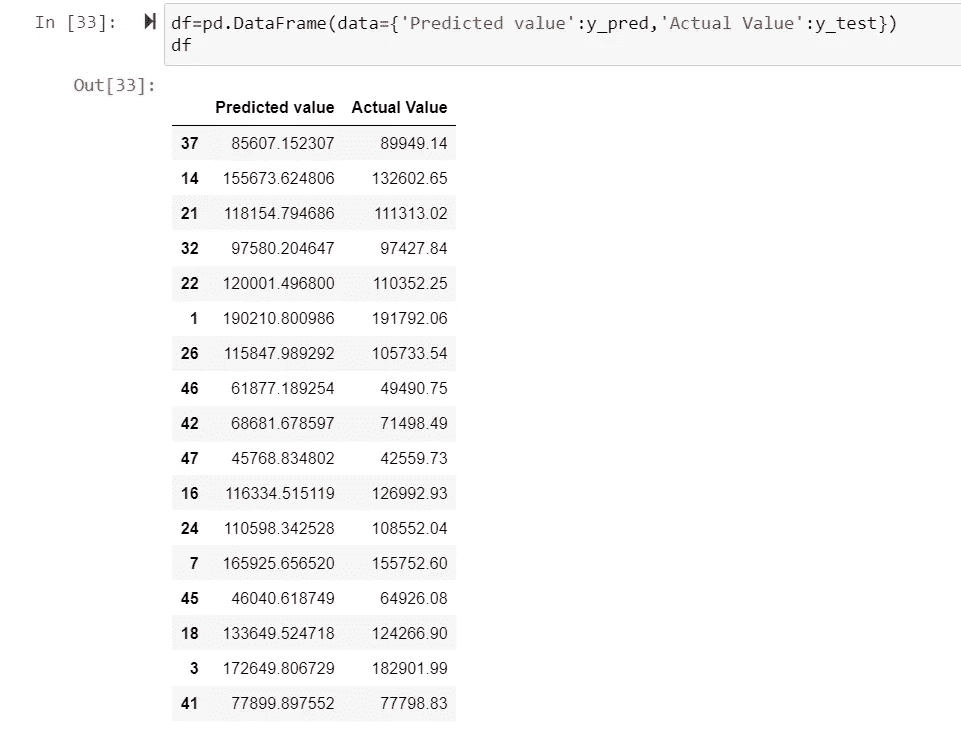**

**可以通过导入 **Scikit-learn** 库的度量模块来计算回归评估度量，如均方误差、平均绝对误差和均方根误差以及回归模型精度 R-Square。**

**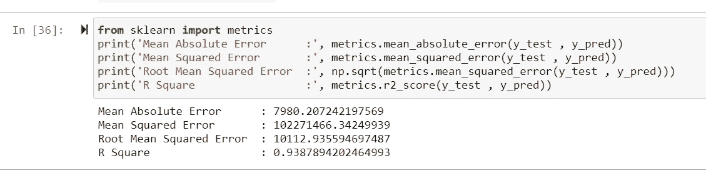**

**r 平方为 0.9387894202464993，精度较高。**

**截距值和回归系数可以如下获得。**

**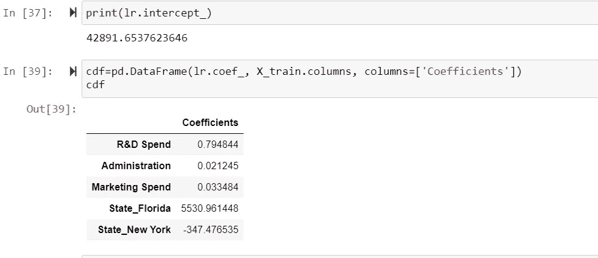**

**为了使用这个回归模型预测一个值，应该按照下面的细节输入数据。**

**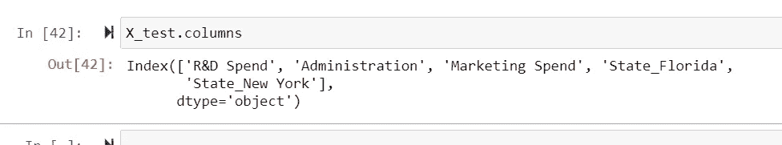**

**如果预测加利福尼亚州的利润**

**R &D 费用:132455.87
行政费用:1235674.98
营销费用:678343**

**State_Florida 和 State_New York 的虚拟变量将为零。**

**y 可以通过下式计算:**

**42891.6537623646+0.794844 * 132455.87 + 0.021245 * 1235674.98 + 0.033484 * 678343 +5530.961448 * 0 -347.476535 * 0**

**等于 19738.96**

**通过使用模型，我们可以预测如下。**

**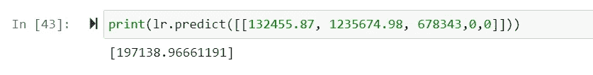**

****感谢阅读！！！！如果这篇文章对你有帮助，欢迎鼓掌，分享和回复。****