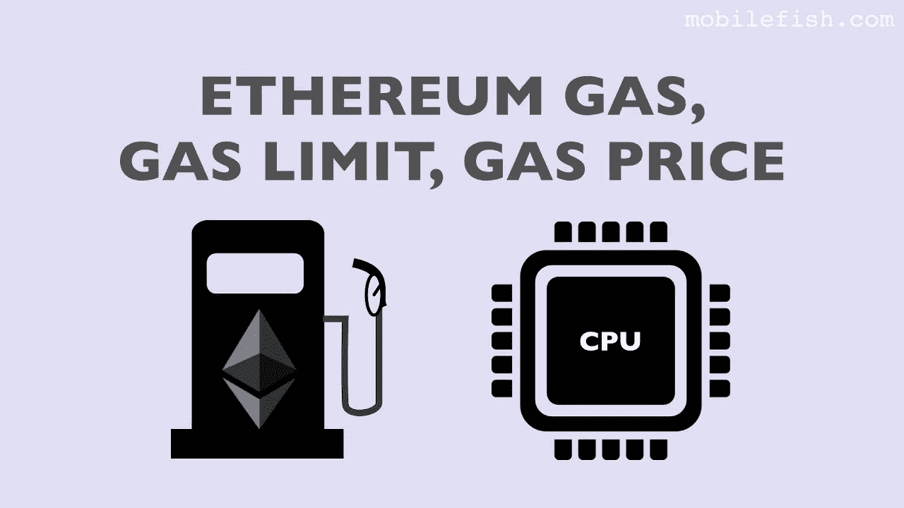

# 以太坊交易气、价格、限额是什么？

> 原文：<https://medium.com/nerd-for-tech/what-is-ethereum-transaction-gas-price-and-limit-60a268829e4?source=collection_archive---------10----------------------->

# 交易确认步骤

1.  交易显示和未确认。
2.  交易[在阻塞期间等待合并，并将](https://www.technologiesinindustry4.com/)添加到区块链。
3.  在传统术语中，这被称为清算。
4.  一旦交易被确认，我们将得到我们的比特币。

# 常见交易形式

1.  最常见的交易可能是从一个地址到另一个地址的简单付款，这通常包括返回给第一个所有者的一些“零钱”。
2.  另一种常见的事务是将几个输入集合成一个输出。[这代表了一个重要的世界，相当于把一堆硬币和纸币换成一张更大的纸币](https://www.technologiesinindustry4.com/)。
3.  第三种事务是将一个输入分配给代表多个接收者的多个输出。这种交易有时被商业实体用来分配资金。

# 将交易记录添加到分类帐

*   钱包应用程序创建的交易包含验证资金所有权和分配新所有者所需的一切。
*   现在，交易必须传输到比特币网络，在那里它将成为分布式账本的一部分。
*   如何或从哪里传输到比特币网络并不重要[。](https://www.technologiesinindustry4.com/)
*   比特币网络可能是一个对等网络，因此比特币客户端通过连接到许多其他比特币客户端来参与网络。
*   比特币网络的目的是向所有或任何参与者传播交易和区块。

# 交易气体

*   气体是以太坊的燃料。
*   天然气不是以太——它是一种独立的虚拟货币。
*   气体对乙醚有自己的交换速率。
*   以太坊使用 [gas 来调节事务的资源使用](https://www.technologiesinindustry4.com/)。
*   开放式(图灵完全)计算模型需要某种计量，以避免拒绝服务攻击或无意中吞噬事务的资源。

# 天然气价格

*   钱包可以在自己发起的交易中调整气价，实现更快的交易确认。
*   油价越高，交易可能就越快得到确认。
*   汽油价格通常被设置为最小值为零。
*   气体限制给出了交易发起者为了完成交易而愿意购买的气体的最大单位数。

# 气体极限

*   天然气限额是指交易发起者愿意购买的最大天然气量。
*   对于合同来说，天然气的数量无法准确确定。因为合同的执行是不可预测的。
*   这个值是不安全的，以防万一你的交易出现问题(如无限循环),你的账户不会被清空。
*   我们只为您的交易实际消耗的汽油付费。

更多详情请访问:[https://www . technologiesinindustry 4 . com/2020/10/what-is-ether eum-transaction-gas price-and-limit . html](https://www.technologiesinindustry4.com/2020/10/what-is-ethereum-transaction-gasprice-and-limit.html)