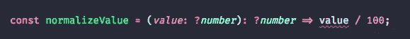
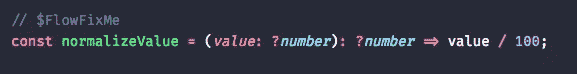

# 什么是 FlowJS？

> 原文：<https://medium.com/nerd-for-tech/what-is-flow-f84b1e40cbc0?source=collection_archive---------1----------------------->

# 介绍

Flow 是 JavaScript 的静态类型检查器，换句话说，它是动态类型语言。我们可以把它想象成一个生产力工具，在程序运行前捕捉常见错误，工作方式类似于 linter。它实时检查类型声明，如果我们使用连接到您的文本编辑器或 IDE 的插件，或者您检查源代码的类型，并通过运行命令来响应任何可能的错误。

# 流动的好处

如上所述，flow 的主要目的是静态类型检查，但它也提高了速度和开发人员的效率，因此他们在使用 Javascript 时可以更有效率。熟悉 Flow 的人会知道 TypeScript，微软团队创建了这种符合 javascript 的语言，还具有类型注释的特性。

# 流动的某些功能

Flow 允许您在返回错误代码上方写一个注释，以便暂时消除错误。 **//$FlowFixMe** 用于静音流的错误检测，并允许开发人员继续编码。下面提到的图片是一个示例，它让我们清楚地了解了该功能。

使用 **//$FlowFixMe** 注释来消除这个错误，以便以后处理它。当你有一些我们可能不知道它将有什么样的内容或者我们不能控制的类型时，Flow 允许你通过键入它们作为最通用的类型来逃避类型检查，下面是一些最通用的类型:

*   Any:顾名思义，可以是任何值类型
*   函数:泛型函数，你不知道参数或者它返回什么；
*   Object:通用 JS 对象，内部可以有任何值或键。

我们必须非常小心地使用这些类型，因为它们消除了我们前面概述的所有类型系统的可靠性。如果您使用它编写代码，您将会失去类型检查提供给您的安全性。

# 流动的缺点

在 Flow 中，使用它的主要缺点是每个 JS 库都需要实现它的类型，并随着库的发展保持更新。这给库开发人员增加了一个自然的开销，许多人不愿意这么做，或者看不到好处。

# 结论

当编写 JavaScript 代码时，您必须等到运行时才能接收到这个棘手的错误，但是在 Flow 中，另一方面，它集成了您最喜欢的编辑器，并在您编写代码时分析代码的正确性。如果您要引用一个不存在的函数，Flow 不仅会立即告诉您，还会提供额外的上下文，使错误更容易修复。而 Flow 主要用于 React 等前端技术。

## 参考

[https://medium . com/magnetis-back stage/go-the-flow-js-53c 104305 a23](/magnetis-backstage/go-with-the-flow-js-53c104305a23)