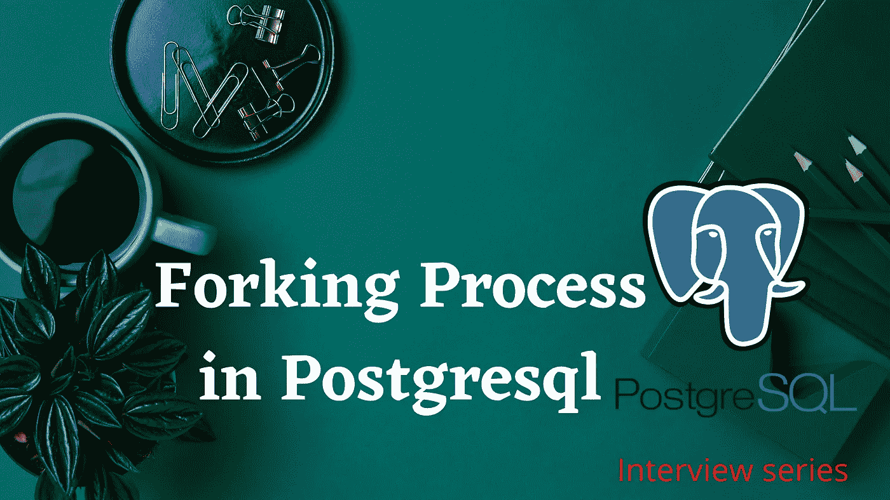

# Postgresql 中的 Forking 是什么？|采访问答

> 原文：<https://medium.com/nerd-for-tech/what-is-forking-in-postgresql-58e23458f026?source=collection_archive---------27----------------------->

为了理解 Fork 进程将使用相同的 Postmaster ID 运行不同的 ID



Postgresql 中的分叉过程

*   这是一个创建子进程的过程，该子进程看起来与创建它的父进程相似。子进程被称为“分叉”。
*   父进程和子进程都有相同的段代码，但地址空间不同。
*   派生进程(a)子进程具有不同的进程 ID。
*   根据 PostgreSQL 架构，postmaster 是集群启动时启动的第一个后台进程。基于邮局主管 ID，下面给出了其他后台实用程序进程的详细信息。

```
*BG writer, 
*Check pointer, 
*WAL writer, 
*Archive WAL writer,
*Logger,
*Statistical collector,
*Autovacuum launcher
```

*   所有这些进程都是由 postmaster 创建或“派生”为子进程的，如果您看到下面每个子进程都有不同的 ID，但具有相同的父 ID(post master ID)

**检查 Postgres 运行状态**:

```
[postgres@Prime~]$ **ps -ef|grep data**postgres 818 1 0 Feb25 ? 00:00:06 /usr/pgsql-12/bin/postmaster -D /var/lib/pgsql/12/data/postgres 29802 29777 0 06:21 pts/0 00:00:00 grep --color=auto data
```

这里，我们的 Postgres 集群运行在 postmaster ID 818 上，基于 postmaster ID，另一个后台进程运行在不同的 ID 上

```
[postgres@Prime~]$ **systemctl status postgresql-12**● postgresql-12.service - PostgreSQL 12 database serverLoaded: loaded (/usr/lib/systemd/system/postgresql-12.service; enabled; vendor preset: disabled)Active: active (running) since Thu 2021-02-25 00:53:07 UTC; 5 days agoDocs: https://www.postgresql.org/docs/12/static/Process: 799 ExecStartPre=/usr/pgsql-12/bin/postgresql-12-check-db-dir ${PGDATA} (code=exited, status=0/SUCCESS)**Main PID: 818 (postmaster)**Tasks: 8 (limit: 4774)Memory: 196.0M**CGroup: /system.slice/postgresql-12.service****├─ 818 /usr/pgsql-12/bin/postmaster -D /var/lib/pgsql/12/data/****├─ 826 postgres: logger****├─1036 postgres: checkpointer****├─1037 postgres: background writer****├─1038 postgres: walwriter****├─1039 postgres: autovacuum launcher****├─1040 postgres: stats collector****└─1041 postgres: logical replication launcher**
```

**查看分叉过程:**

```
[postgres@Prime~]$ **ps -ef|grep postgres**postgres 818 1 0 Feb25 ? 00:00:06 /usr/pgsql-12/bin/postmaster -D /var/lib/pgsql/12/data/postgres 826 818 0 Feb25 ? 00:00:00 postgres: loggerpostgres 1036 818 0 Feb25 ? 00:00:00 postgres: checkpointerpostgres 1037 818 0 Feb25 ? 00:00:04 postgres: background writerpostgres 1038 818 0 Feb25 ? 00:00:04 postgres: walwriterpostgres 1039 818 0 Feb25 ? 00:00:04 postgres: autovacuum launcherpostgres 1040 818 0 Feb25 ? 00:00:08 postgres: stats collectorpostgres 1041 818 0 Feb25 ? 00:00:00 postgres: logical replication launcherroot 29776 29754 0 06:21 pts/0 00:00:00 su - postgrespostgres 29777 29776 0 06:21 pts/0 00:00:00 -bashpostgres 29852 29777 0 06:28 pts/0 00:00:00 ps -efpostgres 29853 29777 0 06:28 pts/0 00:00:00 grep --color=auto postgres
```

**总结:**

一旦群集基于此 ID 启动，将分配邮局主管 ID。其他后台进程将启动并在具有相同父 ID 的不同 ID 上运行。此邮局主管 ID 将在群集停止和启动时更改。