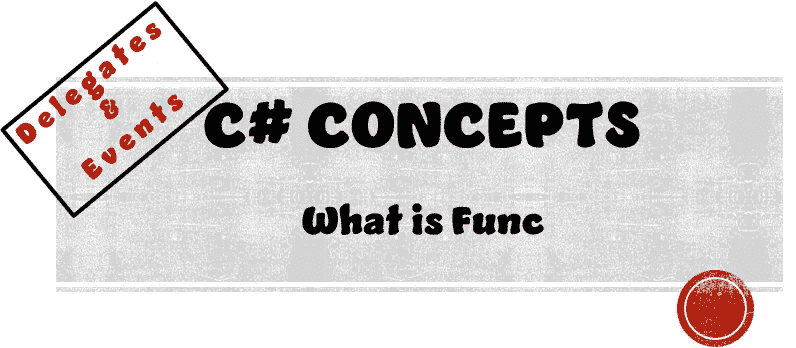
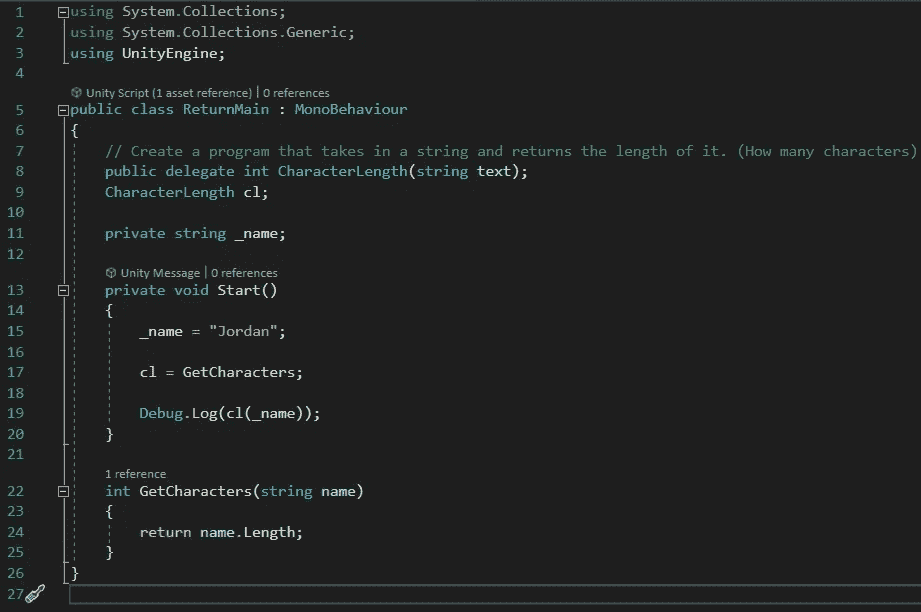
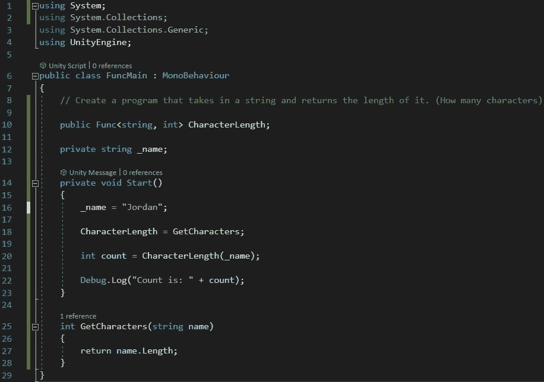
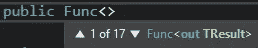
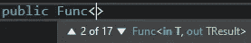
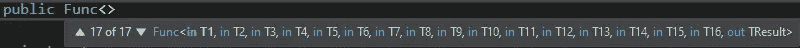

# 什么是 Func

> 原文：<https://medium.com/nerd-for-tech/what-is-func-a9ae1f04cb57?source=collection_archive---------1----------------------->

## C#概念|委托和事件

> **目的:**
> 使用返回类型 Delegate Func 优化(第二次)我们的返回方法程序



我们已经优化了这个程序，从它的起点(使用返回方法)到使用返回类型委托(什么是返回委托)。现在，我们可以更进一步，进一步优化这段代码。

以下是我们的代码目前的情况…



经过一些优化后，现在看起来像…



像过去一样，让我们一行一行地检查新代码，解码我们的程序，以了解这里发生了什么。

## **一号线**

```
using System;
```

为了使用 Func 类型的委托，我们需要使用系统库。

## 第 10 行

```
public Func<string, int> CharacterLength;
```

就像动作类型委托在一行代码中创建事件类型委托一样。Func 类型委托在一行代码中创建返回类型委托。

这一行声明该委托是 **public** ，它是一个 Func 类型的委托，带有关键字 **Func** ，它需要一个**字符串**的输入值，并返回一个**整数**值。

如果您在创建 Func 委托时查看 Visual Studios 工具提示，您可以看到如何布局 t 形括号(< >)。正如您在下面看到的，我们可以包含多达 16 个输入值和 1 个返回值。



## 第 18 行

```
CharacterLength = GetCharacters;
```

因为我们都创建了返回委托并在 Func 函数中创建了它的变量，所以我们只需要跟踪委托的一个名称。在我们技术上有两个之前，CharacterLength 是委托名，cl 是委托类型变量。

但是现在，我们只有一个，所以现在只要我们的方法签名模板匹配我们的返回方法，我们就可以用它原来的名字实例化我们的委托。

## 第 20 行

```
int count = CharacterLength(_name);
```

这行代码创建了一个名为 *count* 的整数变量。然后，它实例化我们的 count 变量，并让它保存 GetCharacters 方法返回的返回值。然后，我们将我们的 _name 变量传递给我们的方法，以获得我们的整数值。

# 试验

一旦我们运行这个程序，它会返回一个注释“Count is: 6”，其中“Jordan”有 6 个字符。

