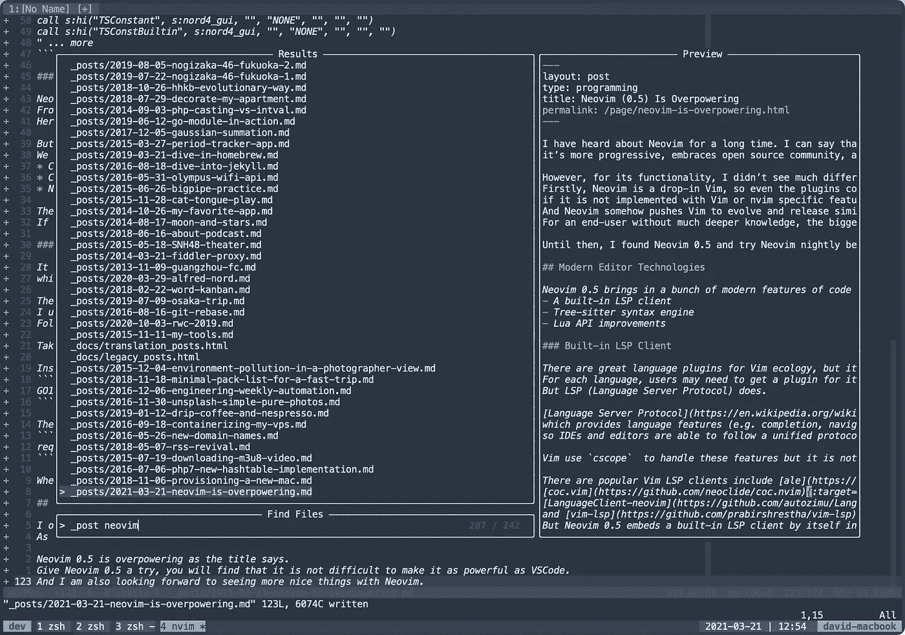
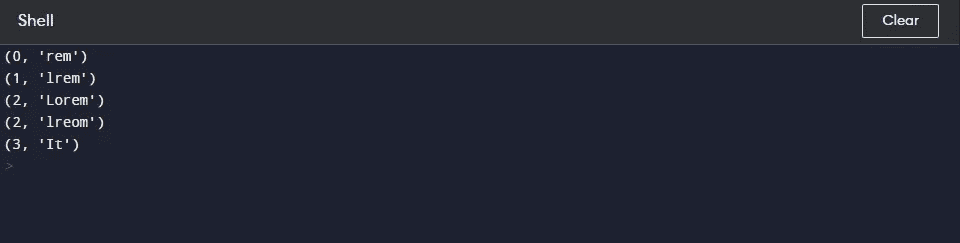

# 什么是模糊搜索？

> 原文：<https://medium.com/nerd-for-tech/what-is-fuzzy-search-4e4227c3c5f5?source=collection_archive---------2----------------------->

是不是每个搜索功能都是用 ElasticSearch 或者 Apache Solr 实现的？你能想出其他的搜索方法吗？也许可以用正则表达式搜索。但是，当我们有算法可以解决我们的问题时，我们真的需要使用正则表达式吗？你有没有想过当你不记得文件名时，在你最喜欢的文本编辑器中搜索是如何工作的？他们使用正则表达式来查找文件吗？不完全是。编辑器使用模糊搜索来实现搜索功能。

# 模糊搜索🤔

你一定想知道什么是模糊搜索。模糊搜索是一种算法，用于在字符串中查找模式(近似字符串匹配)。它会显示最相关的搜索结果。它基于创建一个等同于模式的字符串的最小相关成本。

让我们创建自己的模糊搜索实现，并尝试理解代码中发生了什么。

## 我们来谈谈这个算法是如何工作的

在我们的代码中，我们使用 [Levenshtein_distance](https://en.wikipedia.org/wiki/Levenshtein_distance) 算法来计算最小成本，这就是通常所说的编辑距离。这里有一个视频，你可以观看，以了解这个算法是如何工作的。

如果你已经走了这么远，我希望你们能理解“最小成本获取模式”是如何工作的。让我们看看这段代码的输出是什么。

我们代码的输出

如您所见，它以最相关或相等的模式顺序显示结果。第一个结果是搜索模式的精确匹配，这就是为什么它的成本为零。

最后，到目前为止，我们一直在谈论这种近似匹配技术的优点。这种技术有什么限制吗？这种技术的一个主要问题是它不能用于大型数据集。

想了解更多关于模糊搜索的知识。你可以看看这些库/模块。

*   Javascript 中的 [Fuse.js](https://fusejs.io/)
*   [Python 中的 FuzzyWuzzy](https://chairnerd.seatgeek.com/fuzzywuzzy-fuzzy-string-matching-in-python/)
*   Ruby 中的[模糊字符串匹配](https://github.com/kiyoka/fuzzy-string-match)
*   [在戈朗模糊搜索](https://pkg.go.dev/github.com/lithammer/fuzzysearch/fuzzy)
*   [PHP 中的保险丝](https://github.com/loilo/Fuse)

如果你已经做到了这一步，请考虑留下你的想法或建议。

以后还会有这类帖子的连载，敬请关注！